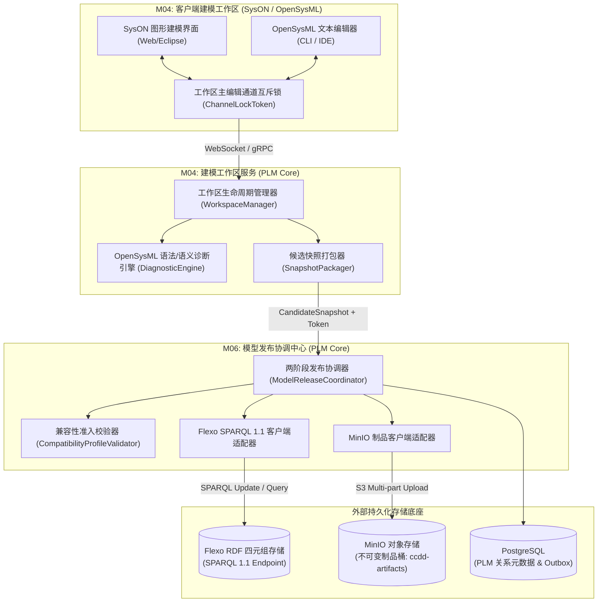
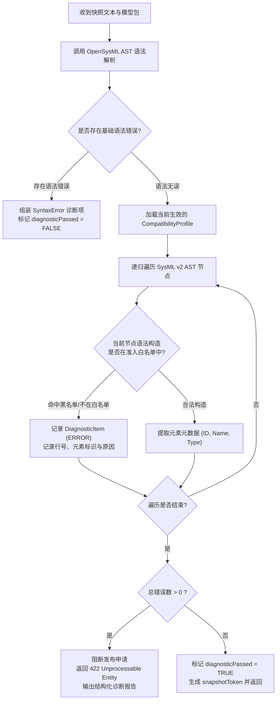
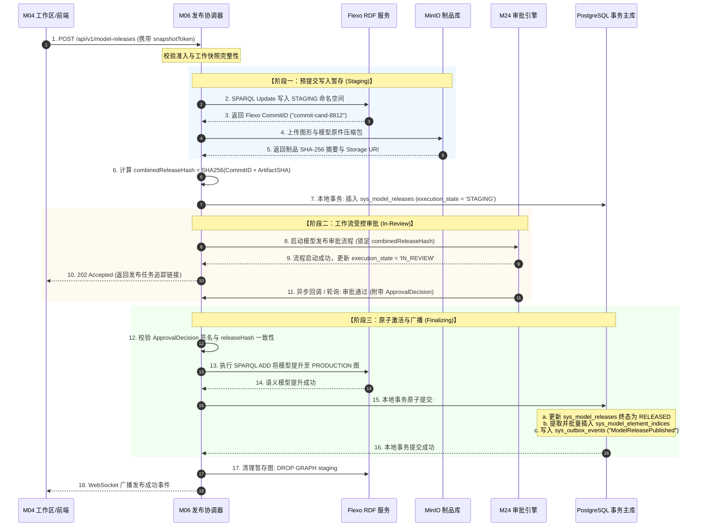

# CCDDesigner 2.0 专项开发规格包 (Detailed Specifications)

## D03: SysON / OpenSysML / Flexo 适配集成与转换规格

| **文档属性** | **内容** |
| :--- | :--- |
| **规格编号** | `CCD-DEV-SPEC-2.0-001-D03` |
| **文档版本** | V1.0 |
| **生效日期** | 2026年9月15日 |
| **上位依据** | 《CCDDesigner 2.0 产品开发说明书》（`CCD-DEV-SPEC-2.0-001`）<br>《CCDDesigner 2.0 产品功能架构与模块设计说明书》（`CCD-ARCH-FUNC-2.0-001`） |
| **相关决策** | ADR-0001 (工具链版本绑定)、ADR-0002 (模型转换准入控制)、ADR-0003 (Flexo暂存隔离) |
| **主责模块** | M04 (MBSE 建模工作区)、M06 (模型发布与兼容性管理) |
| **协同模块** | M19 (图文档与制品 - MinIO)、M20 (生命周期引擎)、M21 (基线状态)、M23 (数字主线)、M24 (工作流审批) |
| **适用范围** | MBSE 架构师、模型转换引擎工程师、后端中间件开发团队、集成测试团队 |

---

### 1. 规范设计原则与技术栈锁定

依据上位开发说明书与相关架构决策（ADR-0001、ADR-0002、ADR-0003），本规格包定义 SysML v2 建模环境、语义存储底座及 PLM 平台间的适配与受控转换通道，严格执行以下原则：

1. **版本镜像物理锁定（ADR-0001）**：严格锁定外部工具镜像与二进制版本，禁止在生产与测试环境中使用 `:latest` 标签。
   - **SysON 建模工作台**：`org.eclipse.syson:2026.2-RELEASE`
   - **OpenSysML 文本解析器**：`org.omg.sysml.v2:0.41.0-omg`
   - **Flexo 模型存储服务**：`flexo-server:2.4.1-sparql11`（基于 SPARQL 1.1 四元组 RDF 存储引擎，**严禁使用 Neo4j**）
   - **镜像 SHA-256 强校验**：启动时对外部容器摘要进行握手校验，不符者直接拒绝启动。

2. **模型语法准入硬阻断（ADR-0002）**：定义严格的平台支持语义白名单（`CompatibilityProfile`）。对不支持的 SysML v2 高级语法或降级构造实施显式拦截（Hard Fail），生成结构化诊断报告，**绝对禁止静默截断或隐式降级后强行发布**（对齐验收用例 AT-02）。

3. **Flexo 暂存物理隔离（ADR-0003）**：在 M24 流程审批未最终签署生效前，写入 Flexo 的候选模型 Commit 必须存放在独立的 `STAGING` 隔离命名空间，对全系统的生产查询、BOM 关联及数字主线图遍历完全不可见。

4. **稳定四元组全局唯一标识**：
   $$\text{ModelElementRef} = \langle \text{repositoryId}, \text{modelProjectId}, \text{commitId}, \text{elementId} \rangle$$
   禁止使用易变的树状显示路径（`displayPath`）作为历史引用键，确保重命名、层级重组后历史基线引用的不可变性（对齐验收用例 AT-03）。

5. **发布两阶段协调事务（2PC-like）**：统一协调 Flexo（语义 Commit）、MinIO（图形布局制品）与 PostgreSQL（发布主数据）。Flexo 写入成功但 MinIO 失败时，发布标记为 `FAILED`，禁止漏报业务成功，重试必须幂等（对齐验收用例 AT-04）。

---

### 2. 外部工具链接入拓扑与物理协议



---

### 3. 领域模型与物理数据契约

#### 3.1 M04 领域模型结构与 DDL 物理字典

```sql
-- =============================================================================
-- M04 建模工作区绑定表
-- =============================================================================
CREATE TABLE IF NOT EXISTS sys_workspace_bindings (
    binding_id           BIGINT PRIMARY KEY,
    tenant_id            VARCHAR(64) NOT NULL,
    project_id           VARCHAR(64) NOT NULL,
    model_project_id     VARCHAR(128) NOT NULL,
    model_project_name   VARCHAR(255) NOT NULL,
    primary_channel      VARCHAR(32) NOT NULL DEFAULT 'GRAPHICAL' 
                         CHECK (primary_channel IN ('GRAPHICAL', 'TEXTUAL')),
    channel_lock_token   VARCHAR(128),
    channel_lock_expires_at TIMESTAMP WITH TIME ZONE,
    current_workspace_state VARCHAR(32) NOT NULL DEFAULT 'ACTIVE'
                         CHECK (current_workspace_state IN ('ACTIVE', 'LOCKED', 'RELEASING', 'ARCHIVED')),
    bound_user_id        VARCHAR(64) NOT NULL,
    syson_project_uri    VARCHAR(512) NOT NULL,
    base_commit_id       VARCHAR(128),
    created_at           TIMESTAMP WITH TIME ZONE NOT NULL DEFAULT CURRENT_TIMESTAMP,
    updated_at           TIMESTAMP WITH TIME ZONE NOT NULL DEFAULT CURRENT_TIMESTAMP
);

CREATE UNIQUE INDEX uq_workspace_model_project ON sys_workspace_bindings(tenant_id, model_project_id) 
WHERE current_workspace_state != 'ARCHIVED';

-- =============================================================================
-- M04 候选快照捕获记录表
-- =============================================================================
CREATE TABLE IF NOT EXISTS sys_candidate_snapshots (
    snapshot_id          BIGINT PRIMARY KEY,
    tenant_id            VARCHAR(64) NOT NULL,
    binding_id           BIGINT NOT NULL REFERENCES sys_workspace_bindings(binding_id),
    snapshot_token       VARCHAR(128) NOT NULL UNIQUE,
    source_channel       VARCHAR(32) NOT NULL,
    raw_content_sha256   CHAR(64) NOT NULL,
    raw_content_uri      VARCHAR(512) NOT NULL,
    diagram_bundle_sha256 CHAR(64),
    diagram_bundle_uri   VARCHAR(512),
    diagnostic_passed    BOOLEAN NOT NULL DEFAULT FALSE,
    diagnostic_error_count INT NOT NULL DEFAULT 0,
    diagnostic_report_json JSONB,
    captured_by          VARCHAR(64) NOT NULL,
    created_at           TIMESTAMP WITH TIME ZONE NOT NULL DEFAULT CURRENT_TIMESTAMP,
    expires_at           TIMESTAMP WITH TIME ZONE NOT NULL
);

CREATE INDEX idx_snapshot_token ON sys_candidate_snapshots(tenant_id, snapshot_token);
```

#### 3.2 M06 领域模型结构与 DDL 物理字典

```sql
-- =============================================================================
-- M06 兼容性准入配置表 (ADR-0002)
-- =============================================================================
CREATE TABLE IF NOT EXISTS sys_compatibility_profiles (
    profile_id           BIGINT PRIMARY KEY,
    tenant_id            VARCHAR(64) NOT NULL,
    profile_name         VARCHAR(128) NOT NULL,
    profile_version      VARCHAR(32) NOT NULL,
    target_sysml_spec    VARCHAR(32) NOT NULL DEFAULT 'SysML-v2-2026.2',
    is_active            BOOLEAN NOT NULL DEFAULT TRUE,
    allowed_constructs   JSONB NOT NULL,    -- 允许的语法白名单数组
    forbidden_constructs JSONB NOT NULL,    -- 明确禁用的语法黑名单数组
    max_element_count    INT NOT NULL DEFAULT 50000,
    created_at           TIMESTAMP WITH TIME ZONE NOT NULL DEFAULT CURRENT_TIMESTAMP
);

-- =============================================================================
-- M06 模型受控发布记录表 (发布权威主表)
-- =============================================================================
CREATE TABLE IF NOT EXISTS sys_model_releases (
    release_id           BIGINT PRIMARY KEY,
    tenant_id            VARCHAR(64) NOT NULL,
    binding_id           BIGINT NOT NULL REFERENCES sys_workspace_bindings(binding_id),
    snapshot_id          BIGINT NOT NULL REFERENCES sys_candidate_snapshots(snapshot_id),
    profile_id           BIGINT NOT NULL REFERENCES sys_compatibility_profiles(profile_id),
    model_project_id     VARCHAR(128) NOT NULL,
    release_version      VARCHAR(64) NOT NULL, -- 如 REV-A, 1.0.0
    
    -- 核心状态机正交管理
    lifecycle_state      VARCHAR(32) NOT NULL DEFAULT 'DRAFT'
                         CHECK (lifecycle_state IN ('DRAFT', 'IN_REVIEW', 'RELEASED', 'OBSOLETE', 'WITHDRAWN')),
    execution_state      VARCHAR(32) NOT NULL DEFAULT 'CAPTURING'
                         CHECK (execution_state IN ('CAPTURING', 'VALIDATING', 'STAGING', 'IN_REVIEW', 'FINALIZING', 'RELEASED', 'FAILED')),
    failed_step          VARCHAR(64),
    failed_reason        TEXT,
    
    -- 不可变内容与哈希锚定
    flexo_repository_id  VARCHAR(128) NOT NULL,
    flexo_staging_graph  VARCHAR(255) NOT NULL,  -- urn:ccdd:staging:{releaseId}
    flexo_commit_id      VARCHAR(128),           -- Flexo 返回的不可变 Commit
    artifact_bundle_sha256 CHAR(64),             -- MinIO 制品 SHA-256
    artifact_bundle_uri  VARCHAR(512),
    combined_release_hash CHAR(64),              -- SHA256(commitId + artifactSha256)
    
    -- 工作流审批凭证绑定 (M24)
    workflow_instance_id VARCHAR(128),
    approval_decision_id VARCHAR(128),
    approved_by          VARCHAR(64),
    approved_at          TIMESTAMP WITH TIME ZONE,
    
    published_by         VARCHAR(64) NOT NULL,
    published_at         TIMESTAMP WITH TIME ZONE,
    working_version      BIGINT NOT NULL DEFAULT 1,
    created_at           TIMESTAMP WITH TIME ZONE NOT NULL DEFAULT CURRENT_TIMESTAMP,
    updated_at           TIMESTAMP WITH TIME ZONE NOT NULL DEFAULT CURRENT_TIMESTAMP
);

CREATE UNIQUE INDEX uq_model_release_ver ON sys_model_releases(tenant_id, model_project_id, release_version);
CREATE INDEX idx_model_release_commit ON sys_model_releases(tenant_id, flexo_commit_id);

-- =============================================================================
-- M06 发布模型元素索引表 (用于快速解析与跨域主线链接)
-- =============================================================================
CREATE TABLE IF NOT EXISTS sys_model_element_indices (
    element_index_id     BIGINT PRIMARY KEY,
    tenant_id            VARCHAR(64) NOT NULL,
    release_id           BIGINT NOT NULL REFERENCES sys_model_releases(release_id) ON DELETE CASCADE,
    repository_id        VARCHAR(128) NOT NULL,
    model_project_id     VARCHAR(128) NOT NULL,
    commit_id            VARCHAR(128) NOT NULL,
    element_id           VARCHAR(128) NOT NULL,
    element_name         VARCHAR(255) NOT NULL,
    element_type         VARCHAR(64) NOT NULL, -- PartUsage, PortUsage, ConstraintUsage等
    display_path         VARCHAR(1024) NOT NULL,
    element_uri          VARCHAR(512) NOT NULL,
    element_hash         CHAR(64) NOT NULL,
    attributes_json      JSONB,
    created_at           TIMESTAMP WITH TIME ZONE NOT NULL DEFAULT CURRENT_TIMESTAMP
);

CREATE UNIQUE INDEX uq_element_ref_quadruple ON sys_model_element_indices
    (tenant_id, repository_id, model_project_id, commit_id, element_id);
CREATE INDEX idx_element_search ON sys_model_element_indices(tenant_id, element_name, element_type);
```

---

### 4. 核心交互时序与业务算法规格

#### 4.1 工作区通道互斥锁协议（M04）
为避免图形（SysON）与文本（OpenSysML）并发编辑引发模型树冲突，M04 严格落地通道令牌排他锁：
1. **申请编辑锁**：
   - 客户端调用 `POST /api/v1/workspaces/{bindingId}/channel-lock`，指定 `primaryChannel`（`GRAPHICAL` 或 `TEXTUAL`）。
   - 服务端校验当前锁是否过期；若未过期且持有者非当前会话，返回 `409 Conflict`。
   - 加锁成功返回 `channelLockToken`，默认有效期 15 分钟，支持心跳自动续期。
2. **强制通道降级**：
   - 非主编辑通道的界面自动进入 `READ_ONLY` 模式，并显示“当前工作区正由用户 [X] 在 [图形/文本] 通道编辑”提示。

#### 4.2 语法准入与诊断报告生成算法（ADR-0002）



**诊断报告 JSON 结构定义（DiagnosticReport）**：
```json
{
  "snapshotToken": "snap-tok-20260915-8831",
  "diagnosticPassed": false,
  "summary": {
    "totalErrors": 2,
    "totalWarnings": 1,
    "scannedElements": 1420
  },
  "diagnostics": [
    {
      "severity": "ERROR",
      "code": "CCD-SYSML-0021",
      "message": "使用了平台未准入的元模型扩展特性: MetaPackageDeclaration",
      "location": {
        "filePath": "models/cnc_spindle.sysml",
        "line": 45,
        "column": 12
      },
      "elementName": "SpindleMetaExtension",
      "remediation": "请改用平台推荐的标准 <<subsystem>> 构造型定义子系统结构。"
    },
    {
      "severity": "WARNING",
      "code": "CCD-SYSML-0089",
      "message": "端口缺少流向声明 (direction omitted)，默认将按 inout 双向流处理",
      "location": {
        "filePath": "models/cnc_spindle.sysml",
        "line": 102,
        "column": 5
      },
      "elementName": "coolantPort"
    }
  ]
}
```

#### 4.3 Flexo 暂存分支隔离与写入协议（ADR-0003）

Flexo 后端采用符合 W3C SPARQL 1.1 的 RDF 四元组存储（Named Graph），严禁使用全局默认图。系统严格维护两个命名空间模式：
1. **STAGING 暂存命名空间**：
   $$\text{GraphURI}_{\text{staging}} = \text{urn:ccdd:staging:release:}\{\text{releaseId}\}$$
2. **PRODUCTION 生产命名空间**：
   $$\text{GraphURI}_{\text{production}} = \text{urn:ccdd:production:project:}\{\text{modelProjectId}\}$$

**阶段流转与隔离执行动作**：
* **步骤 1：暂存写入（Staging Insert）**
  - M06 解析 AST 生成标准 RDF 三元组集合，通过 SPARQL 1.1 Update 写入暂存具名图：
  ```sparql
  INSERT DATA {
    GRAPH <urn:ccdd:staging:release:109283746152> {
      <urn:ccdd:elem:elem-slot-spindle-401> a sysml:PartUsage ;
          sysml:name "SlotSpindle" ;
          sysml:elementId "elem-slot-spindle-401" ;
          ccdd:definedInCommit "commit-cand-99120" .
    }
  }
  ```
  - 外部只读接口执行 SPARQL 查询时，默认只能在 `urn:ccdd:production:*` 范围内匹配，对暂存图物理不可见。

* **步骤 2：正式激活（Production Promote）**
  - 审批流程通过（收到 `ApprovalDecision` 且校验通过）后，M06 在同一本地事务中执行原子合并命令：
  ```sparql
  ADD <urn:ccdd:staging:release:109283746152> TO <urn:ccdd:production:project:p-vmc1000-sys> ;
  DROP GRAPH <urn:ccdd:staging:release:109283746152> ;
  ```
* **步骤 3：失败/驳回清理（Rollback Cleanup）**
  - 若审批驳回或发布超时取消，执行：
  ```sparql
  DROP SILENT GRAPH <urn:ccdd:staging:release:109283746152> ;
  ```

---

### 5. 两阶段提交（2PC）协调器设计与故障恢复



#### 5.1 异常故障与失败安全（Fail-Safe）处理矩阵（对齐 AT-04）

| 故障发生点 | 故障现象 | 容错与恢复策略 | 最终一致性保障 |
| :--- | :--- | :--- | :--- |
| **步骤 2~3 中断** | Flexo 网络超时或写入拒绝 | 立即终止发布申请，`sys_model_releases` 记录 `FAILED`，向前端返回清晰错误日志。 | 无残留，业务状态处于安全初始态。 |
| **步骤 4~5 中断** (AT-04 核心用例) | **Flexo 暂存写入成功，但 MinIO 文件传输网络中断** | 1. 协调器捕获 S3 异常；<br>2. 异步向 Flexo 发送 `DROP GRAPH staging` 回滚命令；<br>3. 将发布记录标记为 `FAILED`（`failed_step='UPLOAD_ARTIFACTS'`）；<br>4. **严禁向外部报出发布成功**。 | 保证外部无法访问残缺模型；允许用户重试，重试时生成新批次，不产生脏数据。 |
| **步骤 8 中断** | Flowable 引擎无法连接 | 发布状态保持在 `STAGING`，后台 Outbox 守护线程重试发起流程；若重试超限则标记 `FAILED`。 | 审批未发起前，外部绝对不可见该候选版本。 |
| **步骤 11 驳回** | 工程师审核不通过，流程驳回 | 1. 接收到驳回事件，`sys_model_releases` 流转至 `FAILED`（`failed_reason='REJECTED'`）；<br>2. 清理 Flexo 暂存图；<br>3. MinIO 保留制品日志仅供复盘审计。 | 生产分支不产生任何污染。 |
| **步骤 13~15 中断** | Flexo 提升完成但 DB 提交崩溃 | 协调器通过事务幂等重试扫描（结合 `Idempotency-Key`），重新唤醒步骤 15 执行本地数据库更新。 | 保证语义图与 PLM 关系元数据最终一致。 |

---

### 6. 模型四元组全局唯一引用提取与稳定解析算法

针对数控机床模型在全生命周期中可能出现的元素重命名、包路径调整等情况，系统根据 ADR-0002 与 AT-03 用例要求，定义四元组物理提取规则：

$$\text{ModelElementRef} = \langle \text{repositoryId}, \text{modelProjectId}, \text{commitId}, \text{elementId} \rangle$$

#### 6.1 提取与入库算法实现（Java 伪代码规格）

```java
public class ModelElementExtractor {

    public List<ModelElementIndex> extractElements(
            String repositoryId, 
            String modelProjectId, 
            String commitId, 
            Long releaseId, 
            SysMLModelAST ast) {
        
        List<ModelElementIndex> indexList = new ArrayList<>();
        
        // 深度优先遍历 AST
        ast.traverse(node -> {
            if (isPublishableElement(node)) {
                // 1. 获取模型内部稳定唯一 UUID (elementId)
                String elementId = node.getDeclaredElementId();
                if (elementId == null || elementId.isBlank()) {
                    // 若无声明式UUID，基于当前 Commit 与全局 AST 结构派生哈希身份
                    elementId = HashUtil.sha256Hex(commitId + ":" + node.getQualifiedName());
                }
                
                // 2. 组装展示路径 (仅供 UI 导航，严禁作为业务外键)
                String displayPath = node.getDisplayPath(); 
                
                // 3. 计算本元素当前状态的局部哈希 (用于版本间差异比对)
                String elementHash = HashUtil.sha256Hex(node.serializeAttributes());
                
                ModelElementIndex index = ModelElementIndex.builder()
                        .elementIndexId(SnowflakeIdGenerator.nextId())
                        .releaseId(releaseId)
                        .repositoryId(repositoryId)
                        .modelProjectId(modelProjectId)
                        .commitId(commitId)
                        .elementId(elementId)
                        .elementName(node.getName())
                        .elementType(node.getMetaType())
                        .displayPath(displayPath)
                        .elementUri("ccdd://flexo/" + repositoryId + "/" + modelProjectId + "/" + commitId + "/" + elementId)
                        .elementHash(elementHash)
                        .attributesJson(node.getAttributesJson())
                        .build();
                        
                indexList.add(index);
            }
        });
        
        return indexList;
    }
}
```

#### 6.2 历史不可变解析保证（对齐 AT-03）
当机床主轴槽位在后续分支中发生路径迁移（例如从 `VMC1000::Architecture::Structural::SlotSpindle` 变更为 `VMC1000::Components::SpindleSlot`）：
- 上位需求（M03）或 150% BOM（M14）引用的是 `commit_id = 8f3b2a...` 时的 `elementId = elem-slot-spindle-401`；
- 解析引擎执行查询时，严格以 `(repository_id, model_project_id, commit_id, element_id)` 命中特定的快照行；
- 无论主干模型如何重命名或移动，历史引用的语义内容分毫不变，完全满足受控基线不可变性。

---

### 7. 验收测试矩阵与执行规范 (P0 核心准出验证)

开发与测试团队必须在 P0 阶段针对本规格包通过以下 4 项核心测试用例，任一用例不通过严禁准出：

| 测试用例编号 | 业务测试场景 | 预期通过判定条件 (Pass Criteria) | 验证覆盖的设计规格 |
| :--- | :--- | :--- | :--- |
| **AT-01** | **标准子集模型发布全通路**<br>提交一份标准 VMC1000 主轴系统的 SysML v2 模型发布申请。 | 1. 语法与兼容性准入校验 100% 通过；<br>2. Flexo 正确生成不可变 CommitID；<br>3. MinIO 配套制品 SHA-256 准确无缺入库；<br>4. 关键四元组元素可通过 REST API 准确解析并读取。 | 章节 3, 章节 4, 章节 5 |
| **AT-02** | **未准入高级语法阻断测试**<br>故意在模型中加入平台未支持的宏定义或降级语法构造。 | 1. 校验引擎显式硬阻断发布流程（HTTP 422）；<br>2. 准确返回错误行号、列号与清晰的错误修复建议；<br>3. **严禁静默截断未支持语义后强行写入发布**。 | 章节 4.2 (ADR-0002) |
| **AT-03** | **元素重命名与移动历史追溯**<br>在 V1 发布后，在建模工作区对“主轴槽位”重命名并移动层级后发布 V2。 | 1. 依据 V1 基线引用的历史四元组依然精准读取当时的旧快照；<br>2. V2 正确反映新名称；<br>3. 跨版本红线比对准确识别该元素的演变轨迹。 | 章节 6 (ADR-0002, AT-03) |
| **AT-04** | **两阶段提交故障回滚实测**<br>模拟 Flexo 写入成功但 MinIO 传输遭遇模拟网络切断（注入 SocketException）。 | 1. 发布协调器捕获异常，标记发布记录为 `FAILED`；<br>2. 向 Flexo 发送 `DROP GRAPH` 回滚清理命令；<br>3. **系统严禁向外部报出发布成功**；重试后只产生一次有效发布。 | 章节 5.1 (ADR-0003, AT-04) |

---

### 8. 总结与后续交付接口

本规格包确立了 CCDDesigner 2.0 在 P0 阶段的核心技术地基：
1. **接口暴露**：向 M01（工作台）暴露工作区快照与发布进度 API，向 M23（数字主线）暴露基于四元组的模型元素检索适配器。
2. **后续衔接**：下一交付规格为 **`D06: MinIO 文件分片上传、哈希防篡改与 CAD 属性映射字典`**，为本规格包中的制品存储提供底层哈希强校验与分片上传底座支撑。
