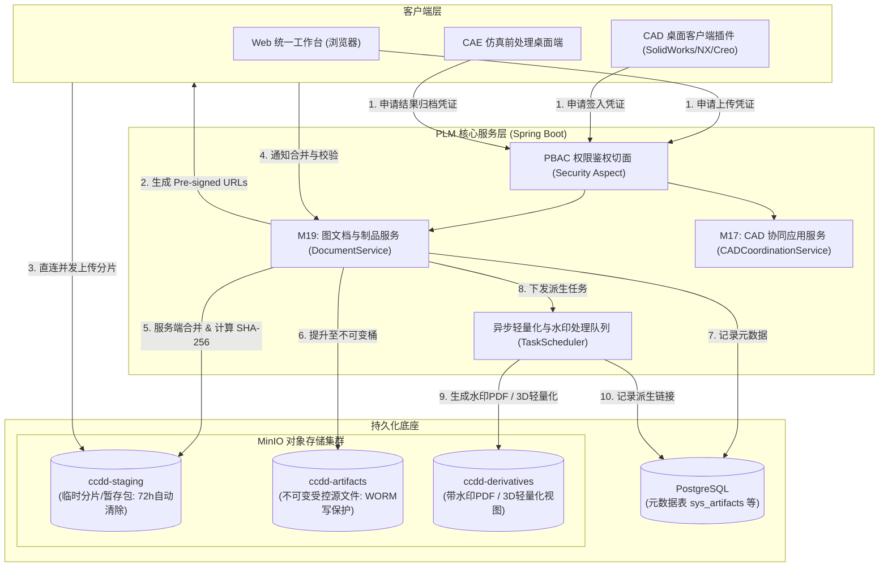
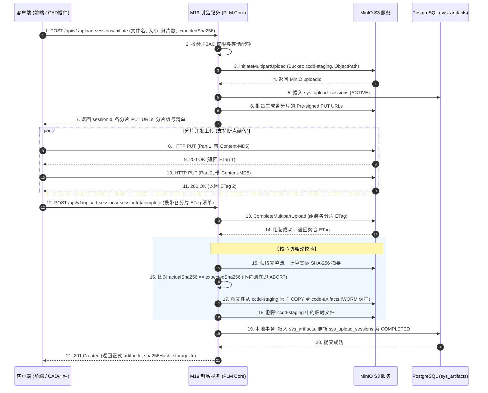
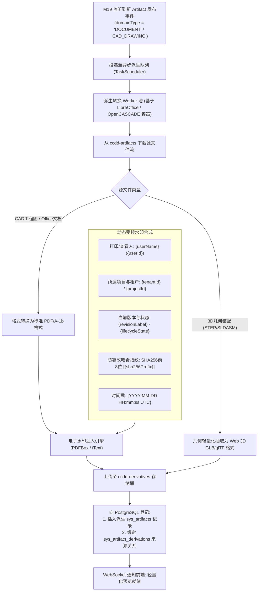

# CCDDesigner 2.0 专项开发规格包 (Detailed Specifications)

## D06: MinIO 文件分片上传、哈希防篡改与 CAD 属性映射字典

| **文档属性** | **内容** |
| :--- | :--- |
| **规格编号** | `CCD-DEV-SPEC-2.0-001-D06` |
| **文档版本** | V1.0 |
| **生效日期** | 2026年9月15日 |
| **上位依据** | 《CCDDesigner 2.0 产品开发说明书》（`CCD-DEV-SPEC-2.0-001`）<br>《CCDDesigner 2.0 产品功能架构与模块设计说明书》（`CCD-ARCH-FUNC-2.0-001`） |
| **相关决策** | ADR-0001 (工具链版本锁定)、ADR-0006 (连接器准入契约)、ADR-0007 (性能SLA基准) |
| **主责模块** | M19 (图文档与文件制品服务)、M17 (CAD/CAE 协同) |
| **协同模块** | M04/M06 (MBSE 模型快照与发布包)、M10 (仿真原始结果归档)、M16 (零部件EBOM挂载)、M20 (生命周期引擎)、M21 (基线状态)、M30 (凭证安全与租户隔离) |
| **适用范围** | 存储架构师、CAD 集成开发工程师、后端核心开发团队、安全合规与测试团队 |

---

### 1. 规范设计原则与存储约束

依据上位开发说明书与相关架构决策，本规格包为 CCDDesigner 2.0 定义全系统非结构化文件制品的持久化标准、防篡改机制及 CAD 属性双向映射契约：

1. **制品哈希不可变（Immutability）物理保证**：
   - 任何上传的文件在服务端完成合并后，必须立即计算其全局标准的 **SHA-256** 摘要并记录入库；
   - **严禁在同一 `artifact_id` 下原位覆写（In-place Overwrite）底层存储对象**；
   - 任何文档、模型、BOM 或仿真结果的修改必须生成新的 Revision，并挂载新生成的 Artifact 实例。

2. **多租户与隔离分桶策略（Bucket Strategy）**：
   - 系统严禁所有文件混杂存储于单一大桶，统一依据生命周期和安全性划分为三类核心桶：
     - `ccdd-staging`：上传中的临时分片、快照暂存包，生命周期策略（Lifecycle Rule）设置为 72 小时后自动过期清除；
     - `ccdd-artifacts`：受控发布的工程图纸、模型原件、代码固件、仿真可复现包，启用 WORM（Write Once Read Many）写保护机制；
     - `ccdd-derivatives`：异步生成的受控 PDF、带水印图纸、3D Web 轻量化视图（glb/gltf），作为派生制品独立受控。

3. **安全预签名凭证（Pre-signed URL）授权**：
   - MinIO 服务的原生 AccessKey 与 SecretKey 仅保留在 M19 内部并托管于 M30 安全配置中心，**严禁下发给工程师浏览器或外部 CAD 客户端**；
   - 所有上传与下载均由 M19 通过 PBAC 权限切面鉴权后，生成带有短期时间戳（默认有效期 15 分钟）的预签名 URL（Pre-signed URL）。

4. **CAD 属性主写权绝对冻结（ADR-0006）**：
   - 严格界定 PLM 与外部 MCAD（SolidWorks、NX、Creo、CATIA）的字段主写权：**业务主数据（物料编号、工程版本、发布状态、密级）由 PLM 主写并单向广播**；**几何物理特征（三维尺寸、材料密度、包络体积、装配矩阵）由 CAD 主写并受控签入**。

5. **派生物独立溯源原则**：
   - 异步派生的 PDF 图纸或 3D 网页预览模型必须作为独立的 `Artifact` 登记入库，并维护 `derived_from` 关系指向源文件，**严禁直接覆盖或替代原始设计图档**。

---

### 2. 存储拓扑与分层架构



---

### 3. 领域模型设计与 DDL 物理字典

#### 3.1 M19 图文档与制品表结构

```sql
-- =============================================================================
-- M19 图文档主对象表 (Document Master)
-- =============================================================================
CREATE TABLE IF NOT EXISTS sys_document_masters (
    document_master_id   BIGINT PRIMARY KEY,
    tenant_id            VARCHAR(64) NOT NULL,
    document_number      VARCHAR(128) NOT NULL, -- 如 DOC-SPINDLE-DRAWING-001
    document_title       VARCHAR(255) NOT NULL,
    document_category    VARCHAR(64) NOT NULL,  -- CAD_DRAWING, TECH_SPEC, TEST_REPORT, MANUAL等
    security_level       VARCHAR(32) NOT NULL DEFAULT 'INTERNAL' 
                         CHECK (security_level IN ('PUBLIC', 'INTERNAL', 'CONFIDENTIAL', 'SECRET')),
    created_by           VARCHAR(64) NOT NULL,
    created_at           TIMESTAMP WITH TIME ZONE NOT NULL DEFAULT CURRENT_TIMESTAMP,
    updated_at           TIMESTAMP WITH TIME ZONE NOT NULL DEFAULT CURRENT_TIMESTAMP
);

CREATE UNIQUE INDEX uq_doc_number ON sys_document_masters(tenant_id, document_number);
CREATE INDEX idx_doc_category ON sys_document_masters(tenant_id, document_category);

-- =============================================================================
-- M19 图文档工程版本表 (Document Revision)
-- =============================================================================
CREATE TABLE IF NOT EXISTS sys_document_revisions (
    document_revision_id BIGINT PRIMARY KEY,
    tenant_id            VARCHAR(64) NOT NULL,
    document_master_id   BIGINT NOT NULL REFERENCES sys_document_masters(document_master_id),
    revision_label       VARCHAR(32) NOT NULL,  -- A, B, 1.0, 1.1
    lifecycle_state      VARCHAR(32) NOT NULL DEFAULT 'DRAFT'
                         CHECK (lifecycle_state IN ('DRAFT', 'IN_REVIEW', 'RELEASED', 'OBSOLETE', 'WITHDRAWN')),
    is_locked            BOOLEAN NOT NULL DEFAULT FALSE,
    locked_by            VARCHAR(64),
    locked_at            TIMESTAMP WITH TIME ZONE,
    working_version      BIGINT NOT NULL DEFAULT 1,
    released_by          VARCHAR(64),
    released_at          TIMESTAMP WITH TIME ZONE,
    created_by           VARCHAR(64) NOT NULL,
    created_at           TIMESTAMP WITH TIME ZONE NOT NULL DEFAULT CURRENT_TIMESTAMP,
    updated_at           TIMESTAMP WITH TIME ZONE NOT NULL DEFAULT CURRENT_TIMESTAMP
);

CREATE UNIQUE INDEX uq_doc_revision ON sys_document_revisions(tenant_id, document_master_id, revision_label);

-- =============================================================================
-- M19 物理文件制品表 (Artifact - 物理存储权威字典)
-- =============================================================================
CREATE TABLE IF NOT EXISTS sys_artifacts (
    artifact_id          BIGINT PRIMARY KEY,
    tenant_id            VARCHAR(64) NOT NULL,
    file_name            VARCHAR(255) NOT NULL,
    file_extension       VARCHAR(32) NOT NULL,
    file_size_bytes      BIGINT NOT NULL,
    mime_type            VARCHAR(128) NOT NULL,
    
    -- 不可变哈希防篡改指纹 (核心约束)
    sha256_hash          CHAR(64) NOT NULL,
    md5_hash             CHAR(32) NOT NULL,
    
    -- MinIO 物理定位
    storage_bucket       VARCHAR(64) NOT NULL,
    storage_object_path  VARCHAR(512) NOT NULL,
    storage_etag         VARCHAR(128),
    
    -- 归属业务上下文绑定
    domain_type          VARCHAR(64) NOT NULL, -- DOCUMENT, CAD_MODEL, SYSML_BUNDLE, SIMULATION_RESULT等
    binding_revision_id  BIGINT,               -- 关联的 Revision ID (DocumentRevision, PartRevision等)
    is_primary           BOOLEAN NOT NULL DEFAULT FALSE, -- 是否为本版本的主设计文件
    
    is_frozen            BOOLEAN NOT NULL DEFAULT FALSE, -- 进入基线或发布态后置为 TRUE
    uploaded_by          VARCHAR(64) NOT NULL,
    uploaded_at          TIMESTAMP WITH TIME ZONE NOT NULL DEFAULT CURRENT_TIMESTAMP
);

CREATE INDEX idx_artifact_hash ON sys_artifacts(tenant_id, sha256_hash);
CREATE INDEX idx_artifact_binding ON sys_artifacts(tenant_id, domain_type, binding_revision_id);

-- =============================================================================
-- M19 派生制品追踪表 (Derivations - 水印PDF / 3D轻量化预览)
-- =============================================================================
CREATE TABLE IF NOT EXISTS sys_artifact_derivations (
    derivation_id        BIGINT PRIMARY KEY,
    tenant_id            VARCHAR(64) NOT NULL,
    source_artifact_id   BIGINT NOT NULL REFERENCES sys_artifacts(artifact_id) ON DELETE CASCADE,
    derived_artifact_id  BIGINT NOT NULL REFERENCES sys_artifacts(artifact_id) ON DELETE CASCADE,
    derivation_type      VARCHAR(64) NOT NULL 
                         CHECK (derivation_type IN ('WATERMARKED_PDF', 'WEB_3D_VIEW_GLB', 'THUMBNAIL_PNG', 'BOM_REPORT_XLSX')),
    conversion_status    VARCHAR(32) NOT NULL DEFAULT 'PENDING'
                         CHECK (conversion_status IN ('PENDING', 'PROCESSING', 'SUCCEEDED', 'FAILED')),
    conversion_error     TEXT,
    applied_watermark    VARCHAR(255),
    converted_at         TIMESTAMP WITH TIME ZONE,
    created_at           TIMESTAMP WITH TIME ZONE NOT NULL DEFAULT CURRENT_TIMESTAMP
);

CREATE UNIQUE INDEX uq_artifact_derivation ON sys_artifact_derivations(tenant_id, source_artifact_id, derivation_type);

-- =============================================================================
-- M19 大文件多部件分片上传会话表 (Multipart Upload Session)
-- =============================================================================
CREATE TABLE IF NOT EXISTS sys_upload_sessions (
    session_id           VARCHAR(128) PRIMARY KEY, -- uploadSessionToken
    tenant_id            VARCHAR(64) NOT NULL,
    file_name            VARCHAR(255) NOT NULL,
    file_size_bytes      BIGINT NOT NULL,
    total_chunks         INT NOT NULL,
    chunk_size_bytes     INT NOT NULL,
    expected_sha256      CHAR(64),
    minio_upload_id      VARCHAR(255) NOT NULL,
    target_bucket        VARCHAR(64) NOT NULL,
    target_object_path   VARCHAR(512) NOT NULL,
    uploaded_chunks_mask BIT VARYING(1024), -- 记录各分片上传到位状态
    session_status       VARCHAR(32) NOT NULL DEFAULT 'ACTIVE'
                         CHECK (session_status IN ('ACTIVE', 'COMPLETED', 'ABORTED', 'EXPIRED')),
    created_by           VARCHAR(64) NOT NULL,
    created_at           TIMESTAMP WITH TIME ZONE NOT NULL DEFAULT CURRENT_TIMESTAMP,
    expires_at           TIMESTAMP WITH TIME ZONE NOT NULL
);

CREATE INDEX idx_upload_session_lookup ON sys_upload_sessions(tenant_id, session_id, session_status);
```

#### 3.2 M17 CAD 属性映射字典与双向同步表结构

```sql
-- =============================================================================
-- M17 CAD 文档与零部件双向绑定表 (CAD Document Binding)
-- =============================================================================
CREATE TABLE IF NOT EXISTS sys_cad_document_bindings (
    binding_id           BIGINT PRIMARY KEY,
    tenant_id            VARCHAR(64) NOT NULL,
    cad_system           VARCHAR(32) NOT NULL -- SOLIDWORKS, NX, CREO, CATIA
                         CHECK (cad_system IN ('SOLIDWORKS', 'NX', 'CREO', 'CATIA')),
    cad_file_path        VARCHAR(512) NOT NULL,
    cad_file_type        VARCHAR(32) NOT NULL -- PART, ASSEMBLY, DRAWING
                         CHECK (cad_file_type IN ('PART', 'ASSEMBLY', 'DRAWING')),
    part_revision_id     BIGINT,              -- 关联的物理零部件版本 (M16)
    document_revision_id BIGINT,              -- 关联的受控图文档版本 (M19)
    raw_artifact_id      BIGINT REFERENCES sys_artifacts(artifact_id),
    assembly_hash        CHAR(64),            -- 装配树拓扑指纹
    last_sync_direction  VARCHAR(32)          -- CAD_TO_PLM, PLM_TO_CAD
                         CHECK (last_sync_direction IN ('CAD_TO_PLM', 'PLM_TO_CAD')),
    last_synced_at       TIMESTAMP WITH TIME ZONE,
    created_at           TIMESTAMP WITH TIME ZONE NOT NULL DEFAULT CURRENT_TIMESTAMP,
    updated_at           TIMESTAMP WITH TIME ZONE NOT NULL DEFAULT CURRENT_TIMESTAMP
);

CREATE UNIQUE INDEX uq_cad_binding ON sys_cad_document_bindings(tenant_id, cad_system, cad_file_path);

-- =============================================================================
-- M17 CAD 属性映射字典规则表 (Attribute Mapping Dictionary)
-- =============================================================================
CREATE TABLE IF NOT EXISTS sys_cad_attribute_mappings (
    mapping_id           BIGINT PRIMARY KEY,
    tenant_id            VARCHAR(64) NOT NULL,
    cad_system           VARCHAR(32) NOT NULL,
    cad_attribute_name   VARCHAR(128) NOT NULL, -- 如 "SW-Material", "Weight", "Revision"
    plm_target_entity    VARCHAR(64) NOT NULL   -- PART_MASTER, PART_REVISION, DOCUMENT_MASTER, DOCUMENT_REVISION
                         CHECK (plm_target_entity IN ('PART_MASTER', 'PART_REVISION', 'DOCUMENT_MASTER', 'DOCUMENT_REVISION')),
    plm_attribute_name   VARCHAR(128) NOT NULL, -- 如 "material", "mass_kg", "revision_label"
    master_authority     VARCHAR(32) NOT NULL   -- 权威所有方: PLM_WRITES, CAD_WRITES, BIDIRECTIONAL
                         CHECK (master_authority IN ('PLM_WRITES', 'CAD_WRITES', 'BIDIRECTIONAL')),
    transformation_rule  VARCHAR(255),          -- 单位换算表达式 (例如 "val * 0.001" 克转千克)
    is_mandatory         BOOLEAN NOT NULL DEFAULT FALSE,
    is_active            BOOLEAN NOT NULL DEFAULT TRUE,
    created_at           TIMESTAMP WITH TIME ZONE NOT NULL DEFAULT CURRENT_TIMESTAMP
);

CREATE UNIQUE INDEX uq_cad_attr_rule ON sys_cad_attribute_mappings
    (tenant_id, cad_system, cad_attribute_name, plm_target_entity, plm_attribute_name);
```

---

### 4. 关键接口、时序协议与防篡改机制

#### 4.1 大文件分片并发上传与哈希强校验协议

针对数控机床数十兆至数吉字节的大型 CAD 装配包（如主轴箱装配体）和求解器日志，系统采用基于 S3 兼容 API 的分片上传机制：



#### 4.2 物理路径结构化命名空间规范
MinIO 对象的 Key 严格遵循规范化的层级结构，杜绝路径冲突与越权目录遍历：

$$\text{ObjectKey} = \text{tenantId}/\text{domainType}/\text{YYYY}/\text{MM}/\text{masterId}/\text{revisionId}/\text{artifactId}\_\text{sha256Prefix}.\text{ext}$$

- **示例**：
  `ORG-SEMI-001/CAD_MODEL/2026/09/10928374/REV-A/9918237410_e3b0c442.step`
  通过在文件名后段嵌入 SHA-256 前缀，即使同名文件多次修改上传，底层对象键绝对唯一，无法发生原位覆写。

---

### 5. CAD 属性双向映射字典与主写权冻结矩阵

#### 5.1 字段主写权冻结矩阵（ADR-0006 落地）

| 属性名称 | 语义说明 | 权威主写者 (Master) | 同步机制与冲突处置策略 |
| :--- | :--- | :--- | :--- |
| **`part_number`** | 零部件图号/物料编号 | **PLM 主写** | CAD 签入时由 PLM 分配下发；CAD 本地自建临时编号必须在签入时自动被替换。 |
| **`revision_label`** | 工程版本代号 (A, B...) | **PLM 主写** | 严格由 PLM 生命周期状态机推进；CAD 内部严禁手动修改此字段，冲突时以 PLM 为准。 |
| **`lifecycle_state`**| 版本发布状态 (DRAFT, RELEASED) | **PLM 主写** | 只读反向写入 CAD 图框属性；CAD 内部不可更改状态。 |
| **`security_level`** | 密级与受控级别 | **PLM 主写** | PLM 决定并在水印中固化；CAD 仅作属性展示。 |
| **`material`** | 零件选定材料 | **双向协商** | CAD 客户端指定工程材料，签入时必须命中 PLM 受控材料字典；未在字典的材料阻断签入。 |
| **`mass_kg`** | 零件净重 / 理论计算质量 | **CAD 主写** | CAD 根据三维几何与材料密度物理计算得出，签入时单向更新 PLM `PartRevision.mass`。 |
| **`bounding_box`** | 外形包络尺寸 ($X \times Y \times Z$) | **CAD 主写** | CAD 几何拓扑解算得出，单向抽取并填充至 PLM 物理属性集，供槽位干涉初核。 |
| **`transform_matrix`**| 装配体中的空间变换矩阵 ($4 \times 4$)| **CAD 主写** | CAD 装配树解析得出，签入时更新至 `sys_bom_lines.transform_matrix`。 |

#### 5.2 属性双向同步校验与单位换算算法（Java 规格）

```java
@Service
public class CADAttributeSyncService {

    @Transactional
    public SyncResult syncAttributesFromCAD(
            String tenantId, 
            String cadSystem, 
            Map<String, Object> cadProperties, 
            PartRevision partRevision) {
        
        List<CADAttributeMapping> rules = mappingRepo.findAllActiveRules(tenantId, cadSystem);
        List<AttributeConflict> conflicts = new ArrayList<>();

        for (CADAttributeMapping rule : rules) {
            String cadAttrName = rule.getCadAttributeName();
            Object cadValue = cadProperties.get(cadAttrName);

            if (cadValue == null && rule.getIsMandatory()) {
                conflicts.add(new AttributeConflict(cadAttrName, "必填 CAD 属性在模型文件中缺失"));
                continue;
            }

            if (cadValue != null) {
                // 1. 权威主写者防越权校验 (ADR-0006)
                if (rule.getMasterAuthority() == MasterAuthority.PLM_WRITES) {
                    Object plmValue = partRevision.readAttribute(rule.getPlmAttributeName());
                    if (!Objects.equals(String.valueOf(cadValue), String.valueOf(plmValue))) {
                        // 强制覆盖回写 CAD，不允许篡改 PLM 核心字段
                        cadProperties.put(cadAttrName, plmValue);
                    }
                } 
                // 2. CAD 主写字段抽取与单位换算
                else if (rule.getMasterAuthority() == MasterAuthority.CAD_WRITES) {
                    Object transformedValue = applyTransformation(cadValue, rule.getTransformationRule());
                    partRevision.setAttribute(rule.getPlmAttributeName(), transformedValue);
                }
            }
        }

        if (!conflicts.isEmpty()) {
            throw new CADSyncException("CAD 属性同步前置校验未通过", conflicts);
        }

        partRevisionRepo.save(partRevision);
        return new SyncResult(true, cadProperties);
    }

    private Object applyTransformation(Object rawValue, String ruleExpr) {
        if (ruleExpr == null || ruleExpr.isBlank()) return rawValue;
        // 执行如 "val * 0.001" (g -> kg) 的安全轻量级数学求值
        return MathExpressionEvaluator.eval(ruleExpr, Map.of("val", rawValue));
    }
}
```

---

### 6. 异步派生与受控电子水印引擎（M19）

根据上位说明书 M19-F03 功能要求，上传发布的工程图档（DWG/DXF/CATDrawing）或文档必须异步生成防篡改的受控 PDF 与 3D Web 预览，并自动植入动态安全电子水印。



---

### 7. 验收测试矩阵与执行规范 (P0 核心准出验证)

开发与测试团队必须针对本规格包通过以下 4 项核心测试用例，任一用例不通过严禁发布：

| 测试用例编号 | 业务测试场景 | 预期通过判定条件 (Pass Criteria) | 验证覆盖的设计规格 |
| :--- | :--- | :--- | :--- |
| **AT-06-01** | **大文件多部件分片断点续传**<br>模拟上传一个 1.5 GB 的大型数控机床整机 STEP 装配体，切分为 30 个分片并在中间第 15 分片制造网络中断重连。 | 1. 续传成功，断开的分片无需重新上传；<br>2. 服务端正确合并全部 30 个分片；<br>3. 数据库准确记录物理文件信息，文件在 `ccdd-artifacts` 中不可变固化。 | 章节 4.1, 章节 3.1 |
| **AT-06-02** | **制品哈希防篡改与完整性拦截**<br>客户端声明文件的预期 SHA-256 值为 A，但在分片传输中故意注入 1 个字节的比特翻转（模拟传输损坏或恶意篡改）。 | 1. 服务端合并后重新解算 SHA-256 发现不匹配；<br>2. 事务立即阻断（HTTP 400 Checksum Mismatch）；<br>3. 彻底清除临时分片，`sys_artifacts` 表严禁插入任何记录。 | 章节 4.1 (步骤 16) |
| **AT-06-03** | **CAD 属性主写权防篡改反击**<br>在 SolidWorks 客户端中，工程师私自将图框中的版本号由 `A` 改写为 `B` 并尝试签入已发布的装配体。 | 1. 属性同步切面拦截该非法修改；<br>2. PLM 强制以数据库 `revision_label` 覆盖回写 CAD 图框属性；<br>3. 准确记录一次越权改写审计告警。 | 章节 5.1 (ADR-0006) |
| **AT-06-04** | **动态受控电子水印与派生追踪**<br>签入一份绝密级（SECRET）数控主轴轴承装配工程图纸并由质量部工程师调阅。 | 1. 系统在 5 秒内异步派生出高保真 PDF；<br>2. PDF 页面呈半透明网状铺满调阅人的工号、时间戳与 `SECRET` 标识；<br>3. 派生记录清晰关联源制品，源 STEP 文件哈希分毫不变。 | 章节 6 |

---

### 8. 总结与后续交付接口

本规格包构建了 CCDDesigner 2.0 在 P0 阶段的坚实物理制品底座：
1. **向下承接存储**：为 D03 中的 SysON/OpenSysML 模型打包快照与 Flexo 语义包提供不可变持久化和哈希校验通道；
2. **横向支撑协同**：为后续 P1 阶段（M10 仿真结果原始曲线归档）与 P2 阶段（M17 CAD 装配协同、M16 EBOM 挂接物料图纸）提供了标准的属性映射字典与分片上传接口。
