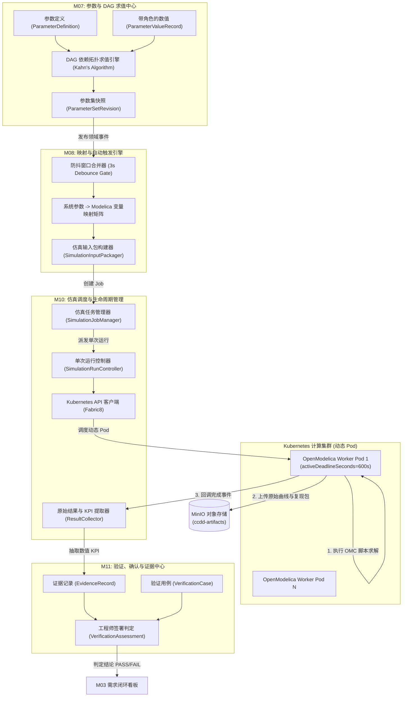
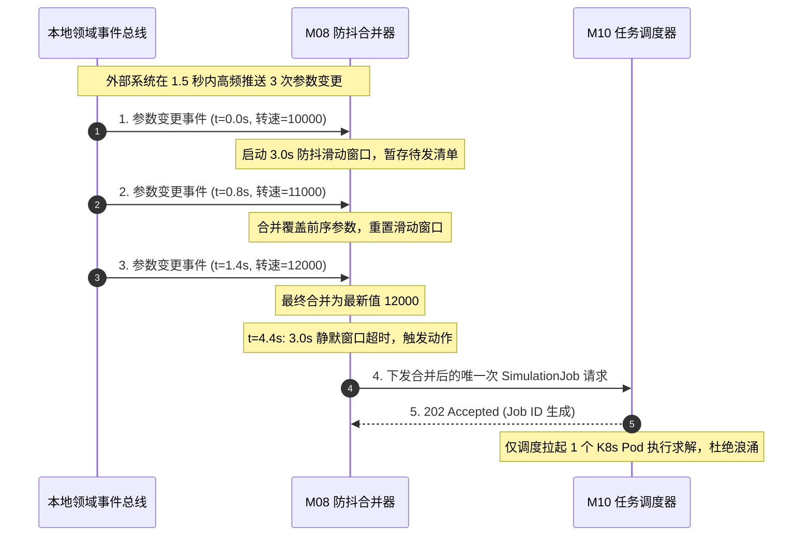

# CCDDesigner 2.0 专项开发规格包 (Detailed Specifications)

## D04: 参数 DAG 计算引擎与 OpenModelica 脚本容器调度规格

| **文档属性** | **内容** |
| :--- | :--- |
| **规格编号** | `CCD-DEV-SPEC-2.0-001-D04` |
| **文档版本** | V1.0 |
| **生效日期** | 2026年9月15日 |
| **上位依据** | 《CCDDesigner 2.0 产品开发说明书》（`CCD-DEV-SPEC-2.0-001`）<br>《CCDDesigner 2.0 产品功能架构与模块设计说明书》（`CCD-ARCH-FUNC-2.0-001`） |
| **相关决策** | ADR-0001 (工具链版本锁定)、ADR-0004 (仿真模板化策略)、ADR-0008 (证据复用与豁免)、ADR-0011 (K8s仿真动态调度) |
| **主责模块** | M07 (参数与参数集)、M08 (模型映射与自动触发)、M09 (仿真模型库)、M10 (仿真调度与结果)、M11 (验证、确认与证据) |
| **协同模块** | M03 (需求指标)、M19 (MinIO 曲线与复现包归档)、M20 (生命周期引擎)、M21 (基线状态)、M23 (数字主线推演) |
| **适用范围** | 仿真与控制算法架构师、OpenModelica 集成开发团队、Kubernetes 运维工程师、质量与系统验证团队 |

---

### 1. 规范设计原则与架构约束

依据上位开发说明书与相关架构决策（ADR-0001、ADR-0004、ADR-0008、ADR-0011），本规格包为系统工程仿真与验证闭环域确立以下核心技术准则：

1. **参数角色严格受控与不可覆写铁律（AT-05）**：
   - 全系统工程参数必须严格附带角色标签（`REQUIREMENT_LIMIT`、`DESIGN_VALUE`、`MODEL_INPUT`、`SIMULATION_OUTPUT`、`TEST_RESULT`）；
   - **绝对禁止下游计算结果或物理实测值直接覆盖上位需求阈值或已发布设计值**；仿真与实测值必须作为独立数值记录关联留存。

2. **参数 DAG 拓扑求值与循环熔断机制**：
   - 参数派生关系建模为有向无环图（DAG），采用拓扑排序确定计算序列；
   - 依赖解析必须包含强连通分量与环路检测算法，**遇到循环依赖立即硬阻断并抛出 `CircularDependencyException`**，严禁死循环。

3. **仿真模板化参数填报策略（ADR-0004）**：
   - P0/P1 首期严格执行“参数填报式模板仿真”，不实现在线全自动微分代数方程（DAE）拓扑生成；
   - 预制并固化机床主轴温升热力学模型、轴系伺服阶跃响应模型等标准 Modelica 模板，参数引擎负责向既有模板的参数槽位注入参数值。

4. **Kubernetes Job 动态容器化调度（ADR-0011）**：
   - 每次仿真执行尝试（`SimulationRun`）通过 Kubernetes API 动态拉起独立 Pod；
   - 容器镜像版本物理绑定 `openmodelica:1.22.0-omc@sha256:...`（ADR-0001 落地）；
   - 强制配置 CPU/内存限额（`limits`）与硬超时（`activeDeadlineSeconds`）；
   - **Job 与 Run 严格解耦**，过期或超时的迟到 Worker 回写被强制拦截丢弃，杜绝污染最新结果。

5. **求解成功绝不自动等价于需求验证通过（ADR-0008 / AT-07）**：
   - OpenModelica 求解成功（Run 状态 `SUCCEEDED`）仅代表数值数学解算完成；
   - 必须提取关键 KPI 存为不可变的 `EvidenceRecord`，由具备 `VerificationReviewer` 资质的专职工程师签署 `VerificationAssessment`，方可判定需求是否通过（PASS）。

6. **事件驱动触发防抖与防循环机制（AT-20）**：
   - M08 拦截参数变更事件，设置窗口合并防抖（Debounce Window，默认 3.0s）；
   - 仿真输出写回的值打上特定派生上下文标记，严禁再次触发自身形成无限雪崩调用。

---

### 2. 闭环物理拓扑与组件协同流向



---

### 3. 领域模型设计与 DDL 物理字典

#### 3.1 M07 参数与 DAG 依赖物理表结构

```sql
-- =============================================================================
-- M07 参数定义主表 (Parameter Definition)
-- =============================================================================
CREATE TABLE IF NOT EXISTS sys_parameter_definitions (
    parameter_id         BIGINT PRIMARY KEY,
    tenant_id            VARCHAR(64) NOT NULL,
    parameter_code       VARCHAR(128) NOT NULL, -- 如 "SPINDLE_RATED_SPEED"
    parameter_name       VARCHAR(255) NOT NULL,
    standard_unit        VARCHAR(64) NOT NULL,  -- 如 "rpm", "N", "m/s^2"
    dimension_type       VARCHAR(64) NOT NULL,  -- ROTATIONAL_SPEED, FORCE, TEMPERATURE等
    value_data_type      VARCHAR(32) NOT NULL DEFAULT 'FLOAT' 
                         CHECK (value_data_type IN ('FLOAT', 'INTEGER', 'STRING', 'BOOLEAN')),
    default_lower_limit  NUMERIC(18, 6),
    default_upper_limit  NUMERIC(18, 6),
    created_at           TIMESTAMP WITH TIME ZONE NOT NULL DEFAULT CURRENT_TIMESTAMP,
    updated_at           TIMESTAMP WITH TIME ZONE NOT NULL DEFAULT CURRENT_TIMESTAMP
);

CREATE UNIQUE INDEX uq_param_code ON sys_parameter_definitions(tenant_id, parameter_code);

-- =============================================================================
-- M07 参数角色数值记录表 (Parameter Value Record - 落实 AT-05 角色隔离)
-- =============================================================================
CREATE TABLE IF NOT EXISTS sys_parameter_value_records (
    value_record_id      BIGINT PRIMARY KEY,
    tenant_id            VARCHAR(64) NOT NULL,
    parameter_id         BIGINT NOT NULL REFERENCES sys_parameter_definitions(parameter_id),
    param_role           VARCHAR(32) NOT NULL 
                         CHECK (param_role IN ('REQUIREMENT_LIMIT', 'DESIGN_VALUE', 'MODEL_INPUT', 'SIMULATION_OUTPUT', 'TEST_RESULT')),
    numeric_value        NUMERIC(18, 6),
    string_value         TEXT,
    unit                 VARCHAR(64) NOT NULL,
    
    -- 权威上下文溯源 (严禁越权串改)
    source_entity_type   VARCHAR(64) NOT NULL, -- REQUIREMENT_REVISION, RUN_RESULT, SENSOR_LOG等
    source_entity_id     BIGINT NOT NULL,
    is_valid             BOOLEAN NOT NULL DEFAULT TRUE,
    recorded_by          VARCHAR(64) NOT NULL,
    recorded_at          TIMESTAMP WITH TIME ZONE NOT NULL DEFAULT CURRENT_TIMESTAMP
);

CREATE INDEX idx_param_value_lookup ON sys_parameter_value_records
    (tenant_id, parameter_id, param_role, is_valid);

-- =============================================================================
-- M07 参数集版本表 (Parameter Set Revision - 基线参数快照)
-- =============================================================================
CREATE TABLE IF NOT EXISTS sys_parameter_set_revisions (
    parameter_set_id     BIGINT PRIMARY KEY,
    tenant_id            VARCHAR(64) NOT NULL,
    set_code             VARCHAR(128) NOT NULL, -- 如 "PSET-VMC1000-SPINDLE-CDR"
    revision_label       VARCHAR(32) NOT NULL,  -- A, B, 1.0
    lifecycle_state      VARCHAR(32) NOT NULL DEFAULT 'DRAFT'
                         CHECK (lifecycle_state IN ('DRAFT', 'IN_REVIEW', 'RELEASED', 'OBSOLETE')),
    parameter_values_map JSONB NOT NULL,        -- 冻结的参数键值对快照: {"PARAM_CODE": {"val": 12000, "role": "DESIGN_VALUE"}}
    set_hash             CHAR(64) NOT NULL,     -- 键值对确定性 SHA-256 摘要
    working_version      BIGINT NOT NULL DEFAULT 1,
    published_at         TIMESTAMP WITH TIME ZONE,
    created_at           TIMESTAMP WITH TIME ZONE NOT NULL DEFAULT CURRENT_TIMESTAMP
);

CREATE UNIQUE INDEX uq_param_set_rev ON sys_parameter_set_revisions(tenant_id, set_code, revision_label);
```

#### 3.2 M08 & M09 模型映射与仿真用例表结构

```sql
-- =============================================================================
-- M08 参数到 Modelica 变量映射字典表 (Model Mapping)
-- =============================================================================
CREATE TABLE IF NOT EXISTS sys_model_mappings (
    mapping_id           BIGINT PRIMARY KEY,
    tenant_id            VARCHAR(64) NOT NULL,
    simulation_model_id  BIGINT NOT NULL,      -- 关联 M09 仿真模型
    parameter_id         BIGINT NOT NULL REFERENCES sys_parameter_definitions(parameter_id),
    modelica_variable    VARCHAR(255) NOT NULL, -- 如 "spindleMotor.ratedSpeed_rpm", "bearing.damping"
    conversion_expr      VARCHAR(255),          -- 转换公式，如 "val * 0.104719755" (rpm -> rad/s)
    is_active            BOOLEAN NOT NULL DEFAULT TRUE,
    created_at           TIMESTAMP WITH TIME ZONE NOT NULL DEFAULT CURRENT_TIMESTAMP
);

CREATE UNIQUE INDEX uq_model_mapping ON sys_model_mappings(tenant_id, simulation_model_id, modelica_variable);

-- =============================================================================
-- M09 仿真模型库版本表 (Simulation Model Revision - ADR-0004 模板化模型)
-- =============================================================================
CREATE TABLE IF NOT EXISTS sys_simulation_models (
    model_id             BIGINT PRIMARY KEY,
    tenant_id            VARCHAR(64) NOT NULL,
    model_identifier     VARCHAR(128) NOT NULL, -- 如 "VMC.Spindle.ThermalAnalysis"
    revision_label       VARCHAR(32) NOT NULL,
    model_type           VARCHAR(32) NOT NULL DEFAULT 'MODELICA_PACKAGE' 
                         CHECK (model_type IN ('MODELICA_PACKAGE', 'FMU_2_0', 'CAE_MESH_PACKAGE')),
    source_artifact_id   BIGINT NOT NULL,       -- 关联 MinIO 中的 .mo 或 zip 压缩包
    modelica_entry_class VARCHAR(255) NOT NULL, -- 顶层包入口: "VMC.Spindle.ThermalExperiment"
    solver_name          VARCHAR(64) NOT NULL DEFAULT 'dassl',
    default_tolerance    NUMERIC(12, 9) NOT NULL DEFAULT 0.00001,
    default_stop_time    NUMERIC(12, 4) NOT NULL DEFAULT 60.0,
    created_at           TIMESTAMP WITH TIME ZONE NOT NULL DEFAULT CURRENT_TIMESTAMP
);

CREATE UNIQUE INDEX uq_sim_model_rev ON sys_simulation_models(tenant_id, model_identifier, revision_label);
```

#### 3.3 M10 仿真任务、运行尝试与结果表结构（Job-Run 解耦）

```sql
-- =============================================================================
-- M10 仿真业务作业表 (Simulation Job - 代表一次仿真意图)
-- =============================================================================
CREATE TABLE IF NOT EXISTS sys_simulation_jobs (
    job_id               BIGINT PRIMARY KEY,
    tenant_id            VARCHAR(64) NOT NULL,
    project_id           VARCHAR(64) NOT NULL,
    job_name             VARCHAR(255) NOT NULL,
    model_id             BIGINT NOT NULL REFERENCES sys_simulation_models(model_id),
    parameter_set_id     BIGINT REFERENCES sys_parameter_set_revisions(parameter_set_id),
    frozen_input_json    JSONB NOT NULL,        -- 固化的完整变量输入集合
    overall_status       VARCHAR(32) NOT NULL DEFAULT 'PENDING'
                         CHECK (overall_status IN ('PENDING', 'RUNNING', 'COMPLETED', 'FAILED', 'CANCELLED')),
    latest_run_id        BIGINT,                -- 当前最新的一次运行尝试
    total_retry_count    INT NOT NULL DEFAULT 0,
    created_by           VARCHAR(64) NOT NULL,
    created_at           TIMESTAMP WITH TIME ZONE NOT NULL DEFAULT CURRENT_TIMESTAMP,
    updated_at           TIMESTAMP WITH TIME ZONE NOT NULL DEFAULT CURRENT_TIMESTAMP
);

-- =============================================================================
-- M10 仿真独立运行尝试表 (Simulation Run - 落实 ADR-0011 独立容器尝试)
-- =============================================================================
CREATE TABLE IF NOT EXISTS sys_simulation_runs (
    run_id               BIGINT PRIMARY KEY,
    tenant_id            VARCHAR(64) NOT NULL,
    job_id               BIGINT NOT NULL REFERENCES sys_simulation_jobs(job_id) ON DELETE CASCADE,
    attempt_number       INT NOT NULL DEFAULT 1,
    
    -- 状态机流转
    run_status           VARCHAR(32) NOT NULL DEFAULT 'QUEUED'
                         CHECK (run_status IN ('QUEUED', 'PREPARING', 'RUNNING', 'COLLECTING', 'SUCCEEDED', 'FAILED', 'CANCELLED', 'TIMEOUT_ABORTED')),
    
    -- Kubernetes Pod 跟踪元数据
    k8s_job_name         VARCHAR(128),
    k8s_pod_name         VARCHAR(128),
    worker_image_tag     VARCHAR(255) NOT NULL, -- 如 "openmodelica:1.22.0-omc@sha256:..."
    worker_host_ip       VARCHAR(64),
    
    -- 超时控制与迟到防污染令牌 (Late Arrival Protection)
    execution_token      VARCHAR(128) NOT NULL UNIQUE,
    started_at           TIMESTAMP WITH TIME ZONE,
    heartbeat_at         TIMESTAMP WITH TIME ZONE,
    ended_at             TIMESTAMP WITH TIME ZONE,
    exit_code            INT,
    error_message        TEXT,
    
    -- 结果与复现包固化
    result_artifact_id   BIGINT,                -- MinIO 中的仿真结果包 (.mat / .csv)
    reproduce_bundle_id  BIGINT,                -- 离线可复现环境包 (AT-06)
    created_at           TIMESTAMP WITH TIME ZONE NOT NULL DEFAULT CURRENT_TIMESTAMP
);

CREATE INDEX idx_sim_run_status ON sys_simulation_runs(tenant_id, run_status);

-- =============================================================================
-- M10 关键仿真 KPI 数值提取表 (KPI Evaluation)
-- =============================================================================
CREATE TABLE IF NOT EXISTS sys_simulation_kpis (
    kpi_id               BIGINT PRIMARY KEY,
    tenant_id            VARCHAR(64) NOT NULL,
    run_id               BIGINT NOT NULL REFERENCES sys_simulation_runs(run_id) ON DELETE CASCADE,
    kpi_code             VARCHAR(128) NOT NULL, -- 如 "MAX_TEMPERATURE_RISE", "FOLLOWING_ERROR"
    kpi_name             VARCHAR(255) NOT NULL,
    measured_value       NUMERIC(18, 6) NOT NULL,
    unit                 VARCHAR(64) NOT NULL,
    kpi_status           VARCHAR(32) NOT NULL DEFAULT 'PASS' 
                         CHECK (kpi_status IN ('PASS', 'FAIL', 'INVALID')),
    extracted_at         TIMESTAMP WITH TIME ZONE NOT NULL DEFAULT CURRENT_TIMESTAMP
);

CREATE INDEX idx_kpi_run ON sys_simulation_kpis(tenant_id, run_id);
```

#### 3.4 M11 验证用例、证据与适用性判定表结构

```sql
-- =============================================================================
-- M11 验证用例定义表 (Verification Case)
-- =============================================================================
CREATE TABLE IF NOT EXISTS sys_verification_cases (
    case_id              BIGINT PRIMARY KEY,
    tenant_id            VARCHAR(64) NOT NULL,
    case_code            VARCHAR(128) NOT NULL, -- 如 "TC-VMC1000-SPINDLE-TEMP"
    case_title           VARCHAR(255) NOT NULL,
    target_requirement_id BIGINT NOT NULL,      -- 关联 M03 需求修订
    verification_method  VARCHAR(32) NOT NULL DEFAULT 'SIMULATION'
                         CHECK (verification_method IN ('SIMULATION', 'TEST', 'ANALYSIS', 'DEMONSTRATION')),
    acceptance_criterion TEXT NOT NULL,         -- 判定标准，如 "主轴温升 <= 15 K 且 稳定转速 >= 12000 rpm"
    created_at           TIMESTAMP WITH TIME ZONE NOT NULL DEFAULT CURRENT_TIMESTAMP
);

-- =============================================================================
-- M11 证据与综合判定表 (Verification Assessment - 落实 ADR-0008)
-- =============================================================================
CREATE TABLE IF NOT EXISTS sys_verification_assessments (
    assessment_id        BIGINT PRIMARY KEY,
    tenant_id            VARCHAR(64) NOT NULL,
    case_id              BIGINT NOT NULL REFERENCES sys_verification_cases(case_id),
    target_context_ref   VARCHAR(255) NOT NULL, -- 目标产品或订单编号上下文
    
    -- 核心判定结论 (严禁算法自动转 PASS)
    verdict              VARCHAR(32) NOT NULL DEFAULT 'NOT_EXECUTED'
                         CHECK (verdict IN ('NOT_EXECUTED', 'PASS', 'FAIL', 'INCONCLUSIVE')),
    applicability_state  VARCHAR(32) NOT NULL DEFAULT 'PENDING_REVIEW'
                         CHECK (applicability_state IN ('PENDING_REVIEW', 'APPLICABLE', 'NOT_APPLICABLE')),
                         
    supporting_run_id    BIGINT REFERENCES sys_simulation_runs(run_id),
    justification_notes  TEXT,
    reviewer_user_id     VARCHAR(64) NOT NULL,  -- 必须具备 VerificationReviewer 资质
    signed_hash          CHAR(64) NOT NULL,     -- 电子签名防篡改摘要
    assessed_at          TIMESTAMP WITH TIME ZONE NOT NULL DEFAULT CURRENT_TIMESTAMP
);

CREATE INDEX idx_assessment_verdict ON sys_verification_assessments(tenant_id, case_id, verdict);
```

---

### 4. 算法实现与核心业务逻辑规格

#### 4.1 参数依赖 DAG 拓扑排序与环路熔断算法（Java 规格）

```java
public class ParameterDAGEngine {

    public List<ParameterDefinition> computeEvaluationOrder(
            Map<String, List<String>> dependencyGraph, 
            Map<String, ParameterDefinition> paramMap) {
        
        Map<String, Integer> inDegree = new HashMap<>();
        for (String param : dependencyGraph.keySet()) {
            inDegree.putIfAbsent(param, 0);
            for (String dep : dependencyGraph.get(param)) {
                inDegree.put(dep, inDegree.getOrDefault(dep, 0) + 1);
            }
        }

        Queue<String> queue = new ArrayDeque<>();
        for (Map.Entry<String, Integer> entry : inDegree.entrySet()) {
            if (entry.getValue() == 0) {
                queue.offer(entry.getKey());
            }
        }

        List<ParameterDefinition> sortedOrder = new ArrayList<>();
        while (!queue.isEmpty()) {
            String current = queue.poll();
            sortedOrder.add(paramMap.get(current));

            List<String> neighbors = dependencyGraph.getOrDefault(current, Collections.emptyList());
            for (String neighbor : neighbors) {
                int updated = inDegree.get(neighbor) - 1;
                inDegree.put(neighbor, updated);
                if (updated == 0) {
                    queue.offer(neighbor);
                }
            }
        }

        // 环路检测熔断 (Kahn's 算法核心)
        if (sortedOrder.size() != inDegree.size()) {
            List<String> cyclicNodes = inDegree.entrySet().stream()
                    .filter(e -> e.getValue() > 0)
                    .map(Map.Entry::getKey)
                    .collect(Collectors.toList());
            throw new CircularDependencyException(
                "检测到参数依赖死循环拓扑，计算已被系统安全阻断！涉及环路参数节点: " + cyclicNodes);
        }

        return sortedOrder;
    }
}
```

#### 4.2 M08 事件驱动防抖合并策略（对齐 AT-20）



#### 4.3 Kubernetes Job 资源清单动态生成与超时硬熔断（ADR-0011）

M10 调度器调用 Kubernetes API 动态下发包含严格资源控制与硬超时的 Job 清单：

```yaml
apiVersion: batch/v1
kind: Job
metadata:
  name: sim-job-run-99182374
  namespace: ccdd-simulation
  labels:
    app.kubernetes.io/managed-by: ccddesigner-plm
    ccdd.tenant-id: "ORG-SEMI-001"
    ccdd.job-id: "109283746152"
    ccdd.run-id: "99182374"
spec:
  # 硬超时安全熔断: 运行超过 600 秒强制杀死 Pod，防止 OMC 死循环耗尽节点算力
  activeDeadlineSeconds: 600
  backoffLimit: 0 # 单次 Run 失败后不自动在 K8s 内部重试，重试由 PLM 显式下发新 Run
  template:
    metadata:
      labels:
        ccdd.run-id: "99182374"
    spec:
      restartPolicy: Never
      containers:
      - name: openmodelica-solver
        # ADR-0001: 物理镜像版本与 SHA-256 绝对绑定
        image: openmodelica:1.22.0-omc@sha256:7f83b1a293c4e5f6a7b8c9d0e1f2a3b4c5d6e7f8a9b0c1d2e3f4a5b6c7d8e9f0
        imagePullPolicy: IfNotPresent
        command: ["/opt/ccdd/scripts/entrypoint.sh"]
        args: ["--execution-token", "tok-run-99182374-uuid", "--input-json", "/workspace/input.json"]
        resources:
          limits:
            cpu: "4000m"
            memory: "8Gi"
          requests:
            cpu: "1000m"
            memory: "2Gi"
        securityContext:
          allowPrivilegeEscalation: false
          readOnlyRootFilesystem: true
          runAsNonRoot: true
          runAsUser: 10001
        volumeMounts:
        - name: workspace-volume
          mountPath: /workspace
      volumes:
      - name: workspace-volume
        emptyDir:
          medium: Memory
          sizeLimit: 2Gi
```

#### 4.4 迟到回写防污染控制（Late Arrival Protection）
针对网络分区或超长执行场景，M10 严格落地令牌比对机制：
1. Pod 执行完毕回调 `POST /api/v1/simulation-runs/{runId}/completion` 时，必须携带 `executionToken`。
2. M10 校验当前 `sys_simulation_runs` 的状态：
   - 若状态已被标记为 `TIMEOUT_ABORTED` 或 `CANCELLED`，系统**坚决丢弃结果回写，并返回 HTTP 410 Gone**；
   - 严禁已超时的旧数据覆写当前可能已经发起的最新重试 Run（`attempt_number + 1`），保证运行记录的线性一致性。

---

### 5. 验收测试矩阵与执行规范 (P1 核心准出验证)

开发与测试团队必须针对本规格包通过以下 4 项核心测试用例，任一用例不通过严禁发布：

| 测试用例编号 | 业务测试场景 | 预期通过判定条件 (Pass Criteria) | 验证覆盖的设计规格 |
| :--- | :--- | :--- | :--- |
| **AT-05** | **参数角色不可篡改隔离测试**<br>通过 M10 导入仿真最高转速 12,000 rpm 与传感器台架实测 9,985 rpm 结果。 | 1. M07 需求限值（$\ge 15,000\text{ rpm}$）绝对不受修改；<br>2. 数据库独立记录 `SIMULATION_OUTPUT` 与 `TEST_RESULT` 角色记录；<br>3. 需求满足度正确计算为未达标，严禁发生原位数据覆盖。 | 章节 3.1 (sys_parameter_value_records) |
| **AT-06** | **离线复现包可重复解算验证**<br>提取 6 个月前归档的历史仿真 Run 离线复现包，部署至独立 Worker 节点重新求解。 | 1. 复现包包含完整的 .mo 模型快照、参数输入与求解器配置；<br>2. 在规定公差容差内（$\le 0.1\%$），重新解算输出的温升曲线与 KPI 数值与历史一致。 | 章节 3.3, 章节 4.3 (ADR-0001, ADR-0011) |
| **AT-07** | **仿真解算成功与需求验证解耦**<br>伺服动态响应仿真计算完成（Run `SUCCEEDED`），输出跟随误差 $6.7\ \mu\text{m}$。 | 1. 对应的高精度定位指标需求维持 `NOT_EXECUTED` 或 `INCONCLUSIVE`；<br>2. **系统严禁将求解成功自动作为需求验证通过（PASS）**；<br>3. 必须由具备资质的验证工程师签署评审记录后方可结题。 | 章节 3.4 (ADR-0008, AT-07) |
| **AT-20** | **高频参数连续推送防抖与防死锁**<br>外部接口在 2 秒内连续推送 5 次主轴额定功率数值调整通知。 | 1. M08 防抖引擎成功将 5 次事件合并为 1 次唯一下发；<br>2. 仅向 Kubernetes 下发 1 个计算 Job；<br>3. 求解结果写回后触发链安全终止，无级联回环死循环。 | 章节 4.2 |

---

### 6. 总结与后续交付接口

本规格包确立了 CCDDesigner 2.0 在 P1 阶段的物理仿真与验证闭环核心：
1. **输入与模型对齐**：承接 D03 中的 SysML 模型参数，通过 M08 映射为 Modelica 物理变量；
2. **证据闭环支撑**：计算产物通过 D06 规格沉淀为不可变制品，为 M11 需求验证矩阵提供实打实的物理数据凭证；
3. **后续衔接**：下一交付规格为 **`D07: 基于 PostgreSQL 递归遍历的数字主线图查询服务规格`**，实现从参数变更沿着 `allocatedTo` 和 `satisfies` 链条自动推演波及仿真用例与需求的拓扑算法。
