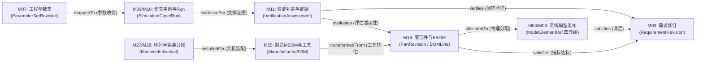
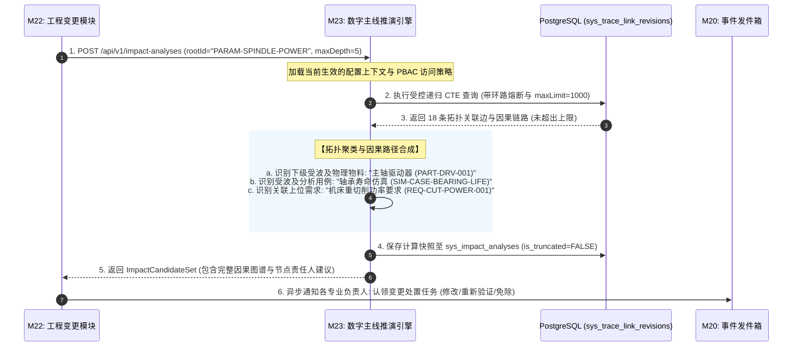

# CCDDesigner 2.0 专项开发规格包 (Detailed Specifications)

## D07: 基于 PostgreSQL 递归遍历的数字主线图查询服务规格

| **文档属性** | **内容** |
| :--- | :--- |
| **规格编号** | `CCD-DEV-SPEC-2.0-001-D07` |
| **文档版本** | V1.0 |
| **生效日期** | 2026年9月15日 |
| **上位依据** | 《CCDDesigner 2.0 产品开发说明书》（`CCD-DEV-SPEC-2.0-001`）<br>《CCDDesigner 2.0 产品功能架构与模块设计说明书》（`CCD-ARCH-FUNC-2.0-001`） |
| **相关决策** | ADR-0007 (性能SLA基准)、ADR-0010 (PostgreSQL承载数字主线，严禁Neo4j) |
| **主责模块** | M23 (数字主线与关系服务) |
| **协同模块** | M03 (需求指标)、M04/M06 (SysML模型四元组)、M07/M08 (工程参数与仿真用例)、M11 (验证证据)、M16 (零部件EBOM)、M21 (基线状态)、M22 (工程变更与影响处置)、M27/M28 (实装台账与时点服役配置) |
| **适用范围** | 数据主线架构师、图算法与SQL开发工程师、变更控制工程师、性能优化团队 |

---

### 1. 规范设计原则与架构约束

依据上位开发说明书与相关架构决策（ADR-0007、ADR-0010），本规格包为 CCDDesigner 2.0 跨域数字主线与图遍历引擎确立以下核心技术准则：

1. **统一 PostgreSQL 关系存储（严禁 Neo4j）**：
   - 全系统跨系统、跨领域工程关系统一由 PostgreSQL 承载，利用主库关系表与 ACID 事务保证主线关系与业务对象状态保持同一事务一致性；
   - 严禁引入图数据库（如 Neo4j），**严禁在 PLM 内部重复建立 SysML 模型内部的第二套私有拓扑关系**。

2. **高性能递归 CTE 与覆盖索引设计（SLA 达标保证）**：
   - 采用标准 PostgreSQL `WITH RECURSIVE` 树与有向无环图（DAG）遍历算法；
   - 建立正反向复合覆盖索引，确保在 10 万节点、100 万关系的典型数据规模下，深度 $\le 5$ 层、结果 $\le 1000$ 节点的路径遍历 P95 $\le 5.0\text{ s}$（满足说明书 8.2 节 SLA）。

3. **动态环路熔断与安全终止算法**：
   - 针对复杂的交叉映射关系，SQL 递归表达式内置路径遍历记录数组 `visited_path = array_append(visited_path, current_node_id)`；
   - 遇到重复访问的环路节点时自动跳过（`WHERE NOT (next_id = ANY(visited_path))`），坚决杜绝递归死循环引发数据库 CPU 跑满崩溃。

4. **显式截断告警与不完整结果标识（Fail-Transparent）**：
   - 系统设置最大递归深度硬上限（默认 $\text{maxDepth} = 5$）与返回节点数上限（默认 $\text{maxLimit} = 1000$）；
   - **若因达到深度上限、节点超限或 PBAC 权限过滤导致遍历结果被截断，响应体必须显式包含 `isTruncated: true` 与详细的截断原因告警**，严禁向前端或变更处置单返回假冒完整的局部结果。

5. **配置与基线敏感遍历（Context-Aware Traversal）**：
   - 遍历并非盲目的静态图搜索，必须支持携带 `EngineeringContext`（基线 ID、有效生效时间点、配置上下文）；
   - 自动过滤已被新版本废弃或在目标配置中不生效的关系边。

---

### 2. 跨域数字主线关系拓扑与语义字典

CCDDesigner 2.0 跨域主线贯穿“需求-模型-参数-仿真-EBOM-MBOM-实物”全生命周期：



#### 2.1 标准业务关系字典矩阵

| 关系类型标识 (`relation_type`) | 语义方向与业务含义 | 源端点类型 (`source_type`) | 目标端点类型 (`target_type`) |
| :--- | :--- | :--- | :--- |
| **`satisfies`** | 源对象在设计上满足目标需求 | `SYSML_ELEMENT`, `PART_REVISION` | `REQUIREMENT_REVISION` |
| **`verifies`** | 验证用例或判定报告闭环核实需求 | `VERIFICATION_ASSESSMENT`, `TEST_CASE` | `REQUIREMENT_REVISION` |
| **`allocatedTo`** | 逻辑架构/功能元素分配至物理组件 | `SYSML_ELEMENT` | `PART_REVISION`, `BOM_LINE` |
| **`derivedFrom`** | 对象派生自上位来源（需求分解/ETO派生）| `REQUIREMENT_REVISION`, `ORDER_DEFINITION` | 同类型母机或上位对象 |
| **`mappedTo`** | 工程参数绑定至仿真模型的输入槽位 | `PARAMETER_DEFINITION` | `SIMULATION_MODEL_VARIABLE` |
| **`evidenceFor`** | 仿真解算 Run 或台架试验记录作为证据 | `SIMULATION_RUN`, `TEST_DATASET` | `EVIDENCE_RECORD` |
| **`transformedFrom`**| MBOM 工艺拆解节点溯源至设计 EBOM | `MBOM_LINE`, `PROCESS_OPERATION` | `BOM_LINE`, `PART_REVISION` |
| **`installedOn`** | 具体出厂序列号的实装零部件装配到机床 | `SERIALIZED_PART` | `MACHINE_INDIVIDUAL` |
| **`replaces`** | 现场售后维修换件替代原故障件 | `REPLACEMENT_EVENT` | `SERIALIZED_PART` (拆卸件) |

---

### 3. 领域模型设计与 DDL 物理字典

```sql
-- =============================================================================
-- M23 关系类型定义元数据字典表 (Relation Type Definition)
-- =============================================================================
CREATE TABLE IF NOT EXISTS sys_relation_type_definitions (
    relation_type_id     BIGINT PRIMARY KEY,
    relation_type_code   VARCHAR(64) NOT NULL UNIQUE, -- 如 "satisfies", "verifies"
    relation_name        VARCHAR(128) NOT NULL,
    inverse_name         VARCHAR(128) NOT NULL,       -- 如 "satisfiedBy", "verifiedBy"
    is_directional       BOOLEAN NOT NULL DEFAULT TRUE,
    allowed_source_types JSONB NOT NULL,              -- 允许的源端点类型白名单
    allowed_target_types JSONB NOT NULL,              -- 允许的目标端点类型白名单
    description          TEXT,
    created_at           TIMESTAMP WITH TIME ZONE NOT NULL DEFAULT CURRENT_TIMESTAMP
);

-- =============================================================================
-- M23 跨域数字主线关系边表 (Trace Link Revisions - 核心图存储底表)
-- =============================================================================
CREATE TABLE IF NOT EXISTS sys_trace_link_revisions (
    link_id              BIGINT PRIMARY KEY,
    tenant_id            VARCHAR(64) NOT NULL,
    relation_type        VARCHAR(64) NOT NULL REFERENCES sys_relation_type_definitions(relation_type_code),
    
    -- 源端点定义 (Source Endpoint)
    source_type          VARCHAR(64) NOT NULL,        -- REQUIREMENT, SYSML_ELEMENT, PART等
    source_id            VARCHAR(128) NOT NULL,       -- 实体ID 或 稳定四元组字符串
    source_revision_ref  VARCHAR(64),                 -- 版本标识 (如 REV-A, CommitID)
    source_display_name  VARCHAR(255) NOT NULL,
    
    -- 目标端点定义 (Target Endpoint)
    target_type          VARCHAR(64) NOT NULL,
    target_id            VARCHAR(128) NOT NULL,
    target_revision_ref  VARCHAR(64),
    target_display_name  VARCHAR(255) NOT NULL,
    
    -- 配置生效上下文与基线过滤 (Context-aware)
    baseline_id          BIGINT,                      -- 属于特定基线时固化
    effective_from       TIMESTAMP WITH TIME ZONE,    -- 业务生效时段起
    effective_to         TIMESTAMP WITH TIME ZONE,    -- 业务生效时段止
    context_filters_json JSONB,                       -- 适用配置过滤字典 {"productLine": "VMC"}
    
    -- 关系生命周期
    lifecycle_state      VARCHAR(32) NOT NULL DEFAULT 'ACTIVE'
                         CHECK (lifecycle_state IN ('ACTIVE', 'SUSPENDED', 'OBSOLETE')),
    created_by           VARCHAR(64) NOT NULL,
    created_at           TIMESTAMP WITH TIME ZONE NOT NULL DEFAULT CURRENT_TIMESTAMP,
    updated_at           TIMESTAMP WITH TIME ZONE NOT NULL DEFAULT CURRENT_TIMESTAMP
);

-- 核心复合双向覆盖索引 (保障正反向单跳查询达到微秒/毫秒级)
CREATE INDEX idx_trace_forward_lookup ON sys_trace_link_revisions
    (tenant_id, source_type, source_id, relation_type) 
    INCLUDE (target_type, target_id, lifecycle_state);

CREATE INDEX idx_trace_backward_lookup ON sys_trace_link_revisions
    (tenant_id, target_type, target_id, relation_type) 
    INCLUDE (source_type, source_id, lifecycle_state);

CREATE INDEX idx_trace_baseline ON sys_trace_link_revisions(tenant_id, baseline_id)
WHERE baseline_id IS NOT NULL;

-- =============================================================================
-- M23 变更波及影响面分析快照表 (Impact Candidate Snapshot)
-- =============================================================================
CREATE TABLE IF NOT EXISTS sys_impact_analyses (
    analysis_id          BIGINT PRIMARY KEY,
    tenant_id            VARCHAR(64) NOT NULL,
    change_request_id    BIGINT,                      -- 关联 M22 ECR/ECO
    root_source_type     VARCHAR(64) NOT NULL,
    root_source_id       VARCHAR(128) NOT NULL,
    max_depth_traversed  INT NOT NULL,
    total_nodes_found    INT NOT NULL,
    is_truncated         BOOLEAN NOT NULL DEFAULT FALSE,
    truncation_reason    VARCHAR(255),
    candidate_graph_json JSONB NOT NULL,              -- 完整的树状/图状因果影响链
    analyzed_by          VARCHAR(64) NOT NULL,
    analyzed_at          TIMESTAMP WITH TIME ZONE NOT NULL DEFAULT CURRENT_TIMESTAMP
);
```

---

### 4. 递归图遍历与波及推演算法规格

#### 4.1 通用多跳拓扑递归查询算法（SQL 物理实现）

系统编写严格遵循标准 SQL 的递归查询模板，通过在公用表表达式（CTE）中维护深度计数器和路径轨迹实现环路熔断：

```sql
WITH RECURSIVE impact_graph AS (
    -- =========================================================================
    -- 1. 锚点阶段 (Anchor Member): 检索起始根节点的直连出边
    -- =========================================================================
    SELECT 
        t.link_id,
        t.source_id,
        t.source_type,
        t.source_display_name,
        t.relation_type,
        t.target_id,
        t.target_type,
        t.target_display_name,
        1 AS depth,
        ARRAY[t.source_id] AS visited_path,
        ARRAY[t.relation_type || ' -> ' || t.target_display_name] AS causal_chain
    FROM sys_trace_link_revisions t
    WHERE t.tenant_id = :tenantId
      AND t.source_type = :rootType
      AND t.source_id = :rootId
      AND t.lifecycle_state = 'ACTIVE'
      -- 配置上下文过滤: 若指定了基线，只查基线内关系
      AND (:baselineId IS NULL OR t.baseline_id = :baselineId)

    UNION ALL

    -- =========================================================================
    -- 2. 递归递推阶段 (Recursive Member): 沿 target -> source 扩展多跳
    -- =========================================================================
    SELECT 
        next_edge.link_id,
        next_edge.source_id,
        next_edge.source_type,
        next_edge.source_display_name,
        next_edge.relation_type,
        next_edge.target_id,
        next_edge.target_type,
        next_edge.target_display_name,
        g.depth + 1,
        array_append(g.visited_path, next_edge.source_id),
        array_append(g.causal_chain, next_edge.relation_type || ' -> ' || next_edge.target_display_name)
    FROM sys_trace_link_revisions next_edge
    JOIN impact_graph g 
      ON next_edge.source_type = g.target_type 
     AND next_edge.source_id = g.target_id
    WHERE next_edge.tenant_id = :tenantId
      AND next_edge.lifecycle_state = 'ACTIVE'
      -- 动态终止条件 1: 达到指定最大深度时硬熔断 (默认 <= 5)
      AND g.depth < :maxDepth
      -- 动态终止条件 2: 环路检测防死锁 (目标节点若已在历史路径中，直接剪枝跳过)
      AND NOT (next_edge.target_id = ANY(g.visited_path))
)
-- =============================================================================
-- 3. 结果集抽取与上限熔断截断
-- =============================================================================
SELECT * FROM impact_graph 
ORDER BY depth ASC 
LIMIT :maxLimit + 1; -- 故意多取 1 条用于精确判定是否触发超限截断
```

#### 4.2 变更影响面推演时序（对齐 AT-10 用例）

当数控机床主轴额定功率发生变更时，M23 引擎自动计算从参数到物理零部件、仿真分析与验收标准的因果网络：



#### 4.3 截断告警控制算法与响应协议规格

在后端应用服务（`ImpactAnalysisService`）中，必须对查询结果进行严格的安全截断审计：

```java
@Service
public class ImpactAnalysisAppService {

    private static final int DEFAULT_MAX_DEPTH = 5;
    private static final int DEFAULT_MAX_LIMIT = 1000;

    @Transactional(readOnly = true)
    public ImpactAnalysisResult computeImpact(ImpactAnalysisRequest request) {
        int maxLimit = request.getMaxLimit() != null ? request.getMaxLimit() : DEFAULT_MAX_LIMIT;
        int maxDepth = request.getMaxDepth() != null ? request.getMaxDepth() : DEFAULT_MAX_DEPTH;

        List<TracePathRow> rawRows = traceRepo.executeRecursiveCTE(
                request.getTenantId(), request.getRootType(), request.getRootId(), maxDepth, maxLimit);

        boolean isTruncated = false;
        String truncationReason = null;

        // 1. 结果数量超限判定
        if (rawRows.size() > maxLimit) {
            isTruncated = true;
            truncationReason = "受波及节点数量超出安全展示阈值 (" + maxLimit + " 条)，仅展示高优先级前序路径";
            rawRows = rawRows.subList(0, maxLimit); // 裁剪多取的那一条
        }

        // 2. 深度耗尽判定 (检查最深一行是否仍有未探索的出边)
        int maxReachedDepth = rawRows.stream().mapToInt(TracePathRow::getDepth).max().orElse(0);
        if (!isTruncated && maxReachedDepth >= maxDepth) {
            boolean hasFurtherEdges = traceRepo.hasOutgoingEdges(
                    request.getTenantId(), 
                    rawRows.stream().filter(r -> r.getDepth() == maxDepth).map(TracePathRow::getTargetId).collect(Collectors.toList()));
            if (hasFurtherEdges) {
                isTruncated = true;
                truncationReason = "推演已达到系统设定的最大探索深度 (" + maxDepth + " 层)，更深层次的潜在波及被截断";
            }
        }

        // 3. 构建可解释 DAG 图响应
        return ImpactAnalysisResult.builder()
                .rootNodeId(request.getRootId())
                .totalNodesFound(rawRows.size())
                .maxDepthReached(maxReachedDepth)
                .isTruncated(isTruncated)
                .truncationReason(truncationReason)
                .impactPaths(assembleGraph(rawRows))
                .build();
    }
}
```

**截断场景下返回的 HTTP 响应体格式（携带明确警告标志）**：
```json
{
  "rootNodeId": "PARAM-SPINDLE-POWER-001",
  "totalNodesFound": 1000,
  "maxDepthReached": 5,
  "isTruncated": true,
  "truncationReason": "推演已达到系统设定的最大探索深度 (5 层)，更深层次的潜在波及被截断",
  "warning": "【注意】当前返回的变更影响面不完整！严禁直接作为工程发布放行依据，请提高深度阈值或分区域窄化推演范围。",
  "candidates": [
    {
      "nodeId": "PART-REV-BEARING-7014C",
      "nodeType": "PART_REVISION",
      "displayName": "角接触球轴承 7014C",
      "depth": 2,
      "causalPath": ["SPINDLE_POWER", "allocatedTo -> SpindleSubsystem", "satisfies -> PART-REV-BEARING-7014C"],
      "suggestedAction": "RE_EVALUATE_FATIGUE_LIFE"
    }
  ]
}
```

---

### 5. 验收测试矩阵与执行规范 (P1 核心准出验证)

开发与测试团队必须针对本规格包通过以下 3 项核心测试用例，任一用例不通过严禁发布：

| 测试用例编号 | 业务测试场景 | 预期通过判定条件 (Pass Criteria) | 验证覆盖的设计规格 |
| :--- | :--- | :--- | :--- |
| **AT-10** | **主轴功率变更自动触发影响面推演**<br>在 VMC1000 项目中将主轴额定功率参数由 11 kW 变更为 15 kW，请求影响分析。 | 1. 毫秒级推演返回完整有向无环图；<br>2. 准确识别出主轴轴承寿命计算用例、主轴伺服驱动器物料、热平衡仿真用例三类候选节点；<br>3. 包含完整的因果溯源链路，无漏报。 | 章节 4.1, 章节 4.2 (AT-10) |
| **AT-07-01** | **复杂网状关系环路熔断防护**<br>在测试数据中故意构建 A $\rightarrow$ B $\rightarrow$ C $\rightarrow$ A 的循环引用关系，发起深度为 5 的遍历。 | 1. 递归引擎在访问到循环节点时自动跳过；<br>2. 查询耗时小于 50 ms，未发生死循环或 CPU 飙升；<br>3. 准确输出 A, B, C 各节点，节点不发生重复堆叠。 | 章节 4.1 (array_append 环路拦截) |
| **AT-07-02** | **超限截断与显式警告透传**<br>构建一个超过 1200 节点的树状依赖网络，请求最大限制为 1000 节点的推演。 | 1. 系统准确截取前 1000 个节点；<br>2. 响应体中 `isTruncated` 严格标记为 `TRUE`；<br>3. 附带显式告警提示，前端工作台弹出黄色风险告警。 | 章节 4.3 (Fail-Transparent 协议) |

---

### 6. 总结与后续交付接口

本规格包确立了 CCDDesigner 2.0 在 P1 阶段的“全局数字大脑”能力：
1. **统一关系底座**：彻底杜绝了引入 Neo4j 带来的分布式事务与运维碎片化问题；
2. **支撑变更与基线**：为 M22（变更处置审批）、M21（基线依赖闭包完整性校验）提供了高效可靠的拓扑图分析能力；
3. **后续衔接**：下一交付规格为 **`D09: OpenAPI 3.0 接口定义、事件 Schema 与发件箱架构规格`**，为全系统模块间的同步 API 与异步 Outbox 事件提供全局标准化通信契约。
