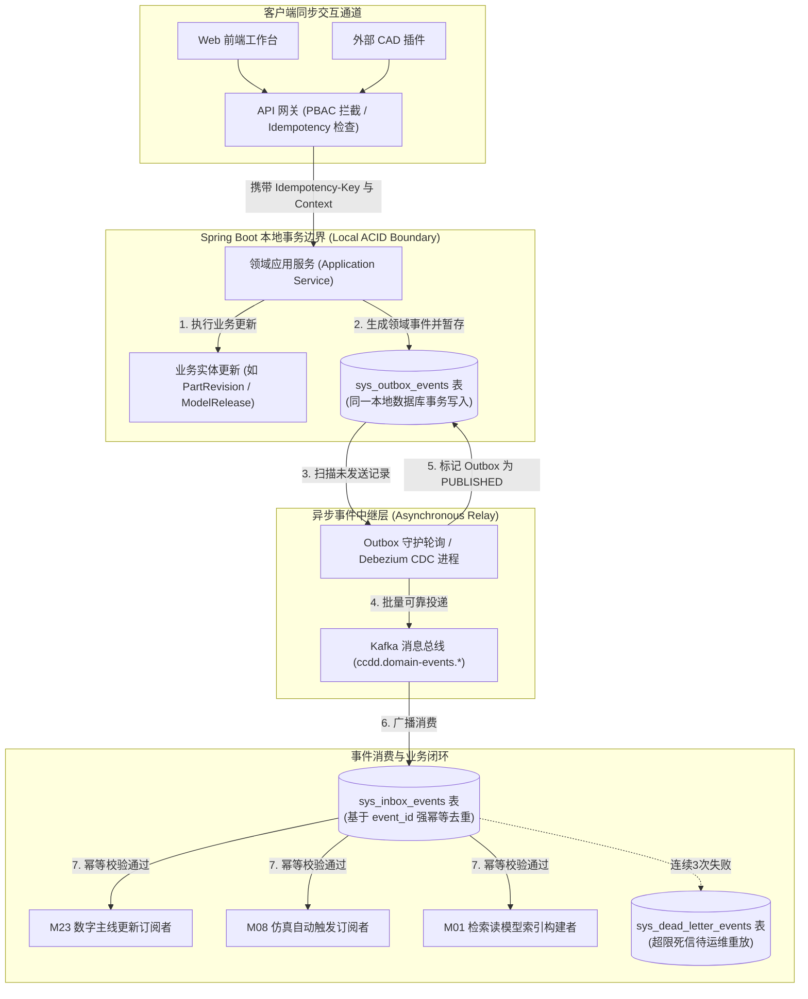

# CCDDesigner 2.0 专项开发规格包 (Detailed Specifications)

## D09: OpenAPI 3.0 接口定义、事件 Schema 与发件箱架构规格

| **文档属性** | **内容** |
| :--- | :--- |
| **规格编号** | `CCD-DEV-SPEC-2.0-001-D09` |
| **文档版本** | V1.0 |
| **生效日期** | 2026年9月15日 |
| **上位依据** | 《CCDDesigner 2.0 产品开发说明书》（`CCD-DEV-SPEC-2.0-001` 第 6 章）<br>《CCDDesigner 2.0 产品功能架构与模块设计说明书》（`CCD-ARCH-FUNC-2.0-001`） |
| **相关决策** | ADR-0006 (连接器契约与对账)、ADR-0009 (模块化单体架构)、ADR-0010 (PostgreSQL事务主线与Outbox) |
| **主责模块** | M20 (工程对象与生命周期)、M30 (平台管理与集成运维) |
| **协同模块** | M01~M29 全系统业务模块 (API 暴露与事件生产者/消费者) |
| **适用范围** | API 架构师、全栈开发团队、系统集成工程师、DevOps 与质量保障团队 |

---

### 1. 规范设计原则与通信架构

依据上位开发说明书第 6 章，本规格包为 CCDDesigner 2.0 核心服务（Spring Boot Modular Core）定义统一的对外 RESTful 交互标准、跨系统异步事件传输契约与事务性可靠消息发布机制：

1. **强类型与幂等性保障（Idempotency Guarantee）**：
   - 所有的非幂等写操作（`POST`、带有派生逻辑的操作）强制要求请求头携带唯一的 **`Idempotency-Key`**（UUIDv4）；
   - 并发更新受控对象必须通过 **`If-Match`** 请求头携带乐观锁版本令牌（`working_version`），发生并发覆盖时返回 `409 Conflict`。

2. **工程上下文全链路穿透（EngineeringContext Propagation）**：
   - 跨模块 API 调用及事件通知必须携带标准化的 `EngineeringContext`，统一显式固化租户、项目、基线及有效时间点，**绝对禁止留空或隐式动态替换为“最新版本”**。

3. **事务性发件箱模式（Transactional Outbox）**：
   - 服务内部**严禁直接在业务事务代码中同步调用消息队列（MQ）进行事件投递**；
   - 领域事件必须在同一个本地数据库 ACID 事务中与业务主数据原子写入 `sys_outbox_events` 表；
   - 通过后台守护轮询或 Debezium CDC 进程异步提取并投递至 Kafka，确保“业务写成功则事件必投递，业务回滚则事件必消失”。

4. **消费端幂等收件箱（Transactional Inbox）与死信隔离**：
   - 消费端通过 `sys_inbox_events` 表基于 `(consumer_group, event_id)` 联合唯一索引实现严格去重；
   - 消费失败执行指数退避重试，超限后进入死信表（`sys_dead_letter_events`），并在 M30 运维监控中心提供人工审计与一键重放工具。

---

### 2. 跨模块通信与事件拓扑架构



---

### 3. 数据契约与 DDL 物理字典

#### 3.1 事务性发件箱与收件箱 DDL 物理设计

```sql
-- =============================================================================
-- M20/M30 事务性发件箱事件表 (Transactional Outbox)
-- =============================================================================
CREATE TABLE IF NOT EXISTS sys_outbox_events (
    outbox_id            BIGINT PRIMARY KEY,
    event_id             VARCHAR(64) NOT NULL UNIQUE, -- UUIDv4
    event_type           VARCHAR(128) NOT NULL,       -- 如 "ModelReleasePublished"
    schema_version       VARCHAR(16) NOT NULL DEFAULT '1.0',
    tenant_id            VARCHAR(64) NOT NULL,
    aggregate_type       VARCHAR(64) NOT NULL,       -- MODEL_RELEASE, PART_REVISION等
    aggregate_id         VARCHAR(128) NOT NULL,
    aggregate_version    BIGINT NOT NULL DEFAULT 1,
    
    -- 链路因果追踪上下文
    correlation_id       VARCHAR(128) NOT NULL,
    causation_id         VARCHAR(128),
    
    -- 结构化事件负载
    payload_json         JSONB NOT NULL,
    
    -- 投递状态机
    publish_status       VARCHAR(32) NOT NULL DEFAULT 'PENDING'
                         CHECK (publish_status IN ('PENDING', 'PROCESSING', 'PUBLISHED', 'FAILED')),
    retry_count          INT NOT NULL DEFAULT 0,
    max_retries          INT NOT NULL DEFAULT 5,
    next_retry_at        TIMESTAMP WITH TIME ZONE,
    error_message        TEXT,
    
    occurred_at          TIMESTAMP WITH TIME ZONE NOT NULL,
    created_at           TIMESTAMP WITH TIME ZONE NOT NULL DEFAULT CURRENT_TIMESTAMP,
    published_at         TIMESTAMP WITH TIME ZONE
);

CREATE INDEX idx_outbox_pending ON sys_outbox_events(publish_status, next_retry_at) 
WHERE publish_status IN ('PENDING', 'FAILED');
CREATE INDEX idx_outbox_aggregate ON sys_outbox_events(tenant_id, aggregate_type, aggregate_id);

-- =============================================================================
-- M20/M30 事务性收件箱去重表 (Transactional Inbox - 强幂等消费保证)
-- =============================================================================
CREATE TABLE IF NOT EXISTS sys_inbox_events (
    inbox_id             BIGINT PRIMARY KEY,
    tenant_id            VARCHAR(64) NOT NULL,
    consumer_group       VARCHAR(128) NOT NULL,       -- 消费者组标识，如 "m23-thread-sync-group"
    event_id             VARCHAR(64) NOT NULL,        -- 关联 sys_outbox_events.event_id
    event_type           VARCHAR(128) NOT NULL,
    consumed_status      VARCHAR(32) NOT NULL DEFAULT 'SUCCESS'
                         CHECK (consumed_status IN ('SUCCESS', 'FAILED')),
    consumed_at          TIMESTAMP WITH TIME ZONE NOT NULL DEFAULT CURRENT_TIMESTAMP
);

CREATE UNIQUE INDEX uq_inbox_consumer_event ON sys_inbox_events(tenant_id, consumer_group, event_id);

-- =============================================================================
-- M30 死信事件沉淀表 (Dead Letter Events - 待人工干预与重放)
-- =============================================================================
CREATE TABLE IF NOT EXISTS sys_dead_letter_events (
    dead_letter_id       BIGINT PRIMARY KEY,
    tenant_id            VARCHAR(64) NOT NULL,
    event_id             VARCHAR(64) NOT NULL,
    consumer_group       VARCHAR(128) NOT NULL,
    event_payload_json   JSONB NOT NULL,
    stack_trace          TEXT NOT NULL,
    failed_at            TIMESTAMP WITH TIME ZONE NOT NULL DEFAULT CURRENT_TIMESTAMP,
    resolved_state       VARCHAR(32) NOT NULL DEFAULT 'UNRESOLVED'
                         CHECK (resolved_state IN ('UNRESOLVED', 'REPLAYED', 'DISCARDED')),
    resolved_by          VARCHAR(64),
    resolved_at          TIMESTAMP WITH TIME ZONE
);

CREATE INDEX idx_dead_letter_lookup ON sys_dead_letter_events(tenant_id, resolved_state);

-- =============================================================================
-- M20 幂等性控制缓存表 (Idempotency Key Registry)
-- =============================================================================
CREATE TABLE IF NOT EXISTS sys_idempotency_records (
    idempotency_key      VARCHAR(128) PRIMARY KEY,
    tenant_id            VARCHAR(64) NOT NULL,
    request_uri          VARCHAR(255) NOT NULL,
    request_hash         CHAR(64) NOT NULL,           -- SHA-256(request body)
    response_status      INT NOT NULL,                -- 200, 201, 202等
    response_body_json   JSONB,
    created_at           TIMESTAMP WITH TIME ZONE NOT NULL DEFAULT CURRENT_TIMESTAMP,
    expires_at           TIMESTAMP WITH TIME ZONE NOT NULL
);

CREATE INDEX idx_idempotency_tenant ON sys_idempotency_records(tenant_id, idempotency_key);
```

---

### 4. 核心数据传输对象 (DTOs) 与标准事件包络

#### 4.1 全局统一工程上下文模式定义 (EngineeringContext)

```json
{
  "$schema": "https://json-schema.org/draft/2020-12/schema",
  "title": "EngineeringContext",
  "type": "object",
  "required": ["tenantId", "projectId"],
  "properties": {
    "tenantId": {
      "type": "string",
      "description": "租户全局唯一标识",
      "example": "ORG-SEMI-001"
    },
    "projectId": {
      "type": "string",
      "description": "研制项目编号",
      "example": "PRJ-VMC1000-2026"
    },
    "targetRevisionRef": {
      "type": "string",
      "description": "当前操作的目标主对象或版本引用标识",
      "example": "PART-REV-SPINDLE-001-A"
    },
    "configurationContext": {
      "type": "object",
      "description": "配置与时态上下文",
      "properties": {
        "baselineId": {
          "type": "integer",
          "description": "锁定的基线ID (若在基线受控范围内)",
          "example": 202609158812
        },
        "globalConfigUri": {
          "type": "string",
          "description": "全局产品变体配置特征表达式URI",
          "example": "ccdd://configs/vmc1000-spindle-15k-bt40"
        },
        "effectiveAt": {
          "type": "string",
          "format": "date-time",
          "description": "工程生效基准时点",
          "example": "2026-09-15T00:00:00Z"
        }
      }
    }
  }
}
```

#### 4.2 统一领域事件包络模式定义 (Domain Event Envelope)

```json
{
  "$schema": "https://json-schema.org/draft/2020-12/schema",
  "title": "EventEnvelope",
  "type": "object",
  "required": [
    "eventId",
    "eventType",
    "schemaVersion",
    "tenantId",
    "aggregateType",
    "aggregateId",
    "occurredAt",
    "correlationId",
    "payload"
  ],
  "properties": {
    "eventId": { "type": "string", "example": "evt-77a89f21-8812-4012" },
    "eventType": { "type": "string", "example": "ModelReleasePublished" },
    "schemaVersion": { "type": "string", "example": "1.0" },
    "tenantId": { "type": "string", "example": "ORG-SEMI-001" },
    "aggregateType": { "type": "string", "example": "MODEL_RELEASE" },
    "aggregateId": { "type": "string", "example": "REL-SYSML-2026-001" },
    "aggregateVersion": { "type": "integer", "example": 1 },
    "occurredAt": { "type": "string", "format": "date-time", "example": "2026-09-15T08:30:00Z" },
    "correlationId": { "type": "string", "example": "tx-flow-88219" },
    "causationId": { "type": "string", "example": "cmd-pub-9921" },
    "payload": {
      "type": "object",
      "description": "事件业务明细负载"
    }
  }
}
```

#### 4.3 核心领域事件清单与负载定义

| 事件类型 (`eventType`) | 触发聚合与时机 | 关键 Payload 负载字段 | 订阅下游处理动作 |
| :--- | :--- | :--- | :--- |
| **`ModelReleasePublished`** | M06 模型发布原子激活成功 | `releaseId`, `commitId`, `releaseHash`, `modelProjectId`, `elementCount` | M23 更新数字主线图谱；M01 刷新全局检索索引；M21 提示相关基线更新候选。 |
| **`ParameterSetFrozen`** | M07 参数集版本冻结发布 | `parameterSetId`, `setCode`, `revisionLabel`, `setHash`, `parametersMap` | M23 推演波及的仿真用例；M08 触发防抖合并并下发仿真求解 Job。 |
| **`SimulationRunCompleted`** | M10 求解 Worker 完成计算 | `jobId`, `runId`, `runStatus`, `exitCode`, `kpisMap`, `resultArtifactId` | M11 自动匹配验证用例判据；向验证工程师发起 `VerificationAssessment` 签署待办。 |
| **`VerificationAssessmentSigned`** | M11 工程师签署验证判定 | `assessmentId`, `caseId`, `verdict`, `reviewerUserId`, `signedHash` | M03 更新系统需求满足度矩阵；M02 阶段门（Gate）准入条件核验。 |
| **`BaselineFrozen`** | M21 基线成功冻结锁定 | `baselineId`, `baselineName`, `baselineHash`, `memberCount` | M22 检查挂起的变更单依赖；M26 允许组装制造下发工程包（As-Planned）。 |
| **`ImpactAnalysisEvaluated`** | M23 变更影响面推演计算完毕 | `analysisId`, `changeRequestId`, `rootSourceId`, `isTruncated`, `nodeCount` | M22 自动为各专业责任人创建工程影响处置分支任务（ImpactItem）。 |

---

### 5. 核心 OpenAPI 3.0 RESTful 端点规范

#### 5.1 模型发布端点契约（M06）

##### `POST /api/v1/model-releases`
- **业务语义**：提交 SysML v2 候选模型发布申请，启动两阶段提交协调器。
- **请求头要求**：
  - `Idempotency-Key: <UUID>`（强制）
  - `X-Engineering-Context: <JSON>`（包含 tenantId 与 projectId）
- **请求体（JSON）**：
  ```json
  {
    "snapshotToken": "snap-tok-20260915-8831",
    "releaseVersion": "REV-A",
    "profileId": 1001,
    "description": "VMC1000 主轴系统结构与接口 CDR 基线发布"
  }
  ```
- **响应码**：
  - `202 Accepted`：候选快照校验与暂存成功，已启动 M24 审批流程。
    ```json
    {
      "releaseId": 9918237410,
      "executionState": "IN_REVIEW",
      "workflowInstanceId": "wf-release-88129",
      "combinedReleaseHash": "sha256:e3b0c44298fc1c149afbf4c8996fb92427ae41e4649b934ca495991b7852b855",
      "pollUri": "/api/v1/model-releases/9918237410"
    }
    ```
  - `409 Conflict`：同工程版本已存在或有未完成的在审发布单。
  - `422 Unprocessable Entity`：未通过 `CompatibilityProfile` 语法准入（返回 `DiagnosticReport`）。

##### `GET /api/v1/model-releases/{id}`
- **业务语义**：轮询模型发布进度与可用性状态。
- **响应体**：返回包含当前三层状态（`lifecycle_state`、`execution_state`、`content_availability`）与 Flexo Commit 信息。

---

#### 5.2 仿真任务调度端点契约（M10）

##### `POST /api/v1/simulation-jobs`
- **业务语义**：创建仿真计算作业并调度 Kubernetes Job 执行首次求解。
- **请求头要求**：`Idempotency-Key: <UUID>`
- **请求体（JSON）**：
  ```json
  {
    "jobName": "SIM-JOB-VMC1000-THERMAL-001",
    "modelId": 2011,
    "parameterSetId": 5012,
    "overrideParameters": {
      "ambientTemperature_degC": 25.0
    }
  }
  ```
- **响应码**：`202 Accepted`（返回 `jobId` 与首次执行的 `runId`）。

##### `POST /api/v1/simulation-jobs/{id}/retries`
- **业务语义**：依原输入发起全新的运行尝试（`SimulationRun`），**绝对禁止覆盖覆写旧失败记录**。
- **请求头要求**：`Idempotency-Key: <UUID>`
- **响应码**：`201 Created`（返回全新的 `runId`，`attemptNumber = previous + 1`）。

---

#### 5.3 变更波及影响面推演端点契约（M23）

##### `POST /api/v1/impact-analyses`
- **业务语义**：从根源变更节点出发，沿数字主线图执行递归拓扑推演，返回带因果链路的影响候选集。
- **请求体（JSON）**：
  ```json
  {
    "rootType": "PARAMETER_DEFINITION",
    "rootId": "PARAM-SPINDLE-POWER-001",
    "maxDepth": 5,
    "maxLimit": 1000,
    "filterBaselineId": 202609158812
  }
  ```
- **响应体（JSON，包含截断保护标志）**：
  ```json
  {
    "analysisId": 9918237410,
    "totalNodesFound": 18,
    "maxDepthReached": 3,
    "isTruncated": false,
    "candidates": [
      {
        "nodeId": "PART-REV-BEARING-7014C",
        "nodeType": "PART_REVISION",
        "displayName": "角接触球轴承 7014C",
        "depth": 2,
        "causalPath": [
          "PARAM-SPINDLE-POWER-001",
          "allocatedTo -> SpindleSubsystem",
          "satisfies -> PART-REV-BEARING-7014C"
        ]
      }
    ]
  }
  ```

---

#### 5.4 验证判定与签署端点契约（M11）

##### `POST /api/v1/verification-assessments`
- **业务语义**：验证工程师审查多源证据，对需求指标签署最终适用性判定报告。
- **请求头要求**：`Idempotency-Key: <UUID>`
- **请求体（JSON）**：
  ```json
  {
    "caseId": 8011,
    "targetContextRef": "PRJ-VMC1000-2026-ORDER-001",
    "verdict": "PASS",
    "applicabilityState": "APPLICABLE",
    "supportingRunId": 99182374,
    "justificationNotes": "经 OpenModelica 温升仿真解算，稳定温升为 11.2 K (<= 15 K)，完全满足技术规格判据。",
    "digitalSignatureToken": "sig-tok-reviewer-zhang-001"
  }
  ```
- **响应码**：`201 Created`（返回 `assessmentId` 与电子签署存证哈希）。

---

### 6. 发件箱投递引擎与消费幂等拦截器实现规格

#### 6.1 发件箱投递调度器（Java Spring 规格）

```java
@Component
@Slf4j
public class OutboxEventPublisherScheduler {

    @Autowired
    private OutboxEventRepository outboxRepo;
    @Autowired
    private KafkaTemplate<String, String> kafkaTemplate;

    // 每 500ms 批量扫描待发送事件
    @Scheduled(fixedDelay = 500)
    @Transactional
    public void publishPendingEvents() {
        // 使用 SKIP LOCKED 防止分布式多实例并发抢锁冲突
        List<OutboxEvent> pendingEvents = outboxRepo.findTop100PendingEventsWithLock();
        
        for (OutboxEvent event : pendingEvents) {
            try {
                String topic = "ccdd.domain-events." + event.getAggregateType().toLowerCase();
                String key = event.getAggregateId();
                String jsonMessage = event.getPayloadJson();

                // 同步等待投递确认 (或注册 Future 回调)
                kafkaTemplate.send(topic, key, jsonMessage).get(3, TimeUnit.SECONDS);

                event.setPublishStatus("PUBLISHED");
                event.setPublishedAt(Instant.now());
            } catch (Exception ex) {
                log.error("Outbox 事件投递异常, eventId: {}", event.getEventId(), ex);
                event.setRetryCount(event.getRetryCount() + 1);
                if (event.getRetryCount() >= event.getMaxRetries()) {
                    event.setPublishStatus("FAILED");
                }
                event.setNextRetryAt(Instant.now().plusSeconds((long) Math.pow(2, event.getRetryCount())));
                event.setErrorMessage(ex.getMessage());
            }
        }
        outboxRepo.saveAll(pendingEvents);
    }
}
```

#### 6.2 消费端收件箱（Inbox）防重拦截切面实现

```java
@Aspect
@Component
@Slf4j
public class IdempotentEventConsumerAspect {

    @Autowired
    private InboxEventRepository inboxRepo;

    @Around("@annotation(idempotentEvent) && args(eventEnvelope,..)")
    public Object enforceIdempotentConsume(
            ProceedingJoinPoint pjp, 
            IdempotentEvent idempotentEvent, 
            EventEnvelope eventEnvelope) throws Throwable {
        
        String consumerGroup = idempotentEvent.consumerGroup();
        String eventId = eventEnvelope.getEventId();
        String tenantId = eventEnvelope.getTenantId();

        // 1. 原子插入 Inbox 记录，利用唯一索引排他
        try {
            InboxEvent record = InboxEvent.builder()
                    .inboxId(SnowflakeIdGenerator.nextId())
                    .tenantId(tenantId)
                    .consumerGroup(consumerGroup)
                    .eventId(eventId)
                    .eventType(eventEnvelope.getEventType())
                    .consumedStatus("SUCCESS")
                    .consumedAt(Instant.now())
                    .build();
            inboxRepo.saveAndFlush(record);
        } catch (DataIntegrityViolationException ex) {
            log.warn("检测到重复投递的事件已消费过, 自动幂等跳过. Group: {}, EventId: {}", consumerGroup, eventId);
            return null; // 幂等跳过，不重复触发业务处理
        }

        // 2. 执行下游真实业务逻辑
        return pjp.proceed();
    }
}
```

---

### 7. 验收测试矩阵与执行规范 (P1 核心准出验证)

开发与测试团队必须针对本规格包通过以下 3 项核心测试用例，任一用例不通过严禁发布：

| 测试用例编号 | 业务测试场景 | 预期通过判定条件 (Pass Criteria) | 验证覆盖的设计规格 |
| :--- | :--- | :--- | :--- |
| **AT-04-IDEM** | **网络重试场景下 Idempotency-Key 强幂等**<br>客户端提交模型发布申请，因网络卡顿在 2 秒内连续重发 3 次完全相同的请求（携带相同的 `Idempotency-Key`）。 | 1. 服务端第一次执行并返回 202 Accepted；<br>2. 后两次请求直接命中 `sys_idempotency_records`，直接透传返回前次相同结果；<br>3. 数据库与 Flexo 内部**绝对只产生 1 次有效发布记录**，不报 500 异常。 | 章节 3.1, 章节 5.1 |
| **AT-OUTBOX-01**| **业务事务回滚发件箱原子一致性**<br>发布审批过程中，业务更新成功但后续插入数字主线链接时故意注入唯一键冲突异常导致事务回滚。 | 1. 本地数据库事务完整回滚；<br>2. `sys_outbox_events` 表中**绝对未产生任何待发送事件记录**；<br>3. Kafka 消息总线未收到任何事件广播。 | 章节 1, 章节 2 |
| **AT-INBOX-01** | **Kafka 重复投递事件收件箱防重拦截**<br>模拟消息中间件网络抖动，向消费者组重复推送两次完全相同的 `ParameterSetFrozen` 事件。 | 1. 第一次消费成功触发数字主线推演；<br>2. 第二次消费被 `sys_inbox_events` 唯一索引强行拦截；<br>3. 仿真调度任务仅下发 1 次，严禁产生重复计算。 | 章节 6.2 |

---

### 8. 总结与后续交付接口

本规格包正式确立了 CCDDesigner 2.0 在 P1 阶段的通信与数据传输最高准则：
1. **统一契约标准**：彻底规范了全系统 30 个模块的 HTTP RESTful 响应码、异常结构与全局 `EngineeringContext` 穿透机制；
2. **保障数据高可靠**：利用 Transactional Outbox + Inbox 闭环消除了分布式环境下的脏数据与丢消息隐患；
3. **P1 阶段圆满闭环**：配合已完成的 D01、D02、D03、D04、D06、D07，P0（集成验证）与 P1（系统设计闭环）的所有工程规格均已编制完毕，具备全面进入编码与测试验收的标准。
