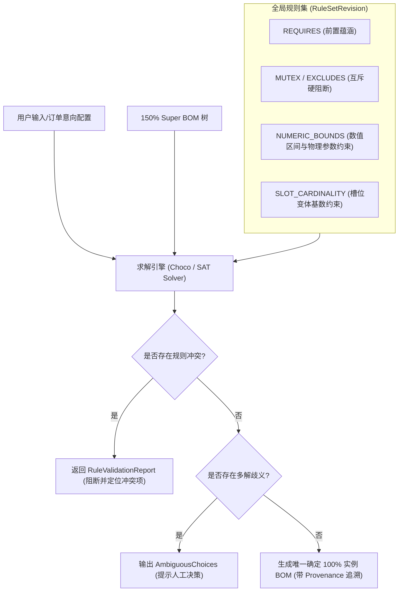

# CCDDesigner 2.0 专项开发规格包 (Detailed Specifications) - 8

## 文档标识
- **规格编号**：`CCD-DEV-SPEC-2.0-D05`
- **主题**：150% Super BOM 变量规则 DSL 语法与配置求解器规格说明书 (Detailed Specification for 150% BOM DSL & Configuration Solver)
- **对应模块**：M12 (平台槽位与变体)、M14 (150% BOM与配置规则)、M15 (订单产品定义与ETO)
- **所属阶段**：P2 (产品工程与配置协同)
- **核心规约**：确定性求解 (Deterministic Solving)、规则零歧义、禁止隐式默认采用首项、不可变快照固化

---

## 一、规格背景与核心设计目标

### 1.1 背景与业务痛点
高端数控机床（如五轴立式加工中心 VMC1000、卧式镗铣加工中心等）属于高度复杂机电一体化装备。在面向订单配置（Configure-To-Order, CTO）和按订单工程设计（Engineer-To-Order, ETO）过程中：
1. **超级结构爆炸**：同一机床平台存在数控系统（西门子、发那科、华中数控）、主轴单元（BT40/HSK63、12000/18000rpm、中心出水/环喷）、刀库容量（24T/30T/40T）、排屑装置、光栅尺闭环等海量变体组合，若通过人工维护单机 BOM 必然导致数据爆炸与错漏；
2. **规则隐式陷阱**：传统系统常隐式为未选槽位默认勾选首项，导致订单非预期排产；
3. **历史版本失效**：传统 PLM 依赖打开订单时“动态实时重算 150% BOM”，当平台母版 150% BOM 升级后，已交付机床的历史 BOM 发生突变，破坏备件与售后一致性。

### 1.2 核心设计原则（落实开发说明书强制约束）
1. **确定性求解（Deterministic Solving）**：
   - 相同输入参数、相同特征选项、相同有效日期与相同规则集版本，**必须解算出完全一致的 100% 实例结构与摘要哈希（Result Digest SHA-256）**。
2. **显式决策阻断（No Implicit Defaults）**：
   - 当特征约束或槽位规则解算出现多个合法解（Ambiguous Solutions）时，**严禁隐式默认采用首项**，求解引擎必须报错并返回多解冲突点，强制技术工程师介入显式决策。
3. **必选槽位完备性阻断（Mandatory Slot Completeness）**：
   - 必选槽位（Cardinality `1..1`）在未选定合法变体前，配置器禁止生成发布态 100% 结构，必须报出阻断性错误。
4. **历史快照绝对固化（Immutable Result Snapshots）**：
   - 解算完成的 `ConfigurationResult` 独立版本化存储，持久化输入快照、完整 100% BOM 结构树以及每一行的**选用规则溯源路径（Selection Provenance）**，历史查询严格读取该快照，永不重新触发母版求解。

---

## 二、特征与选项元模型定义 (Feature & Options Metamodel)

### 2.1 特征定义 (Feature Definition)
特征是引导机床选配的参数化变量维度，其取值驱动 150% BOM 行的选择与数量计算。

| 字段名 | 类型 | 说明 | 取值范例 |
| :--- | :--- | :--- | :--- |
| `feature_code` | VARCHAR(64) | 特征唯一代码 (大写字母+下划线) | `CNC_SYSTEM`, `SPINDLE_TYPE`, `TOOL_CAPACITY` |
| `feature_name` | VARCHAR(128) | 特征显示名称 | "数控系统类型", "主轴规格", "刀库容量" |
| `value_type` | VARCHAR(32) | 数据类型 | `SINGLE_SELECT`, `MULTI_SELECT`, `BOOLEAN`, `INTEGER`, `DECIMAL` |
| `is_mandatory` | BOOLEAN | 是否整机必选特征 | `true` (数控系统必选), `false` (油雾收集器可选) |
| `default_value`| VARCHAR(64) | 初始向导推荐值 (仅作 UI 提示，非求解器隐式选择) | `"SIEMENS_840D"` |
| `domain_category`| VARCHAR(32)| 所属子系统领域 | `ELECTRICAL`, `MECHANICAL`, `HYDRAULIC`, `COOLING` |

### 2.2 选项定义 (Option Definition)
对于离散型特征（`SINGLE_SELECT` / `MULTI_SELECT`），预定义合法选项集合。

```json
{
  "featureCode": "SPINDLE_TYPE",
  "options": [
    {
      "optionCode": "SP_BT40_12K_AIR",
      "optionName": "BT40 机械主轴 12,000rpm 环喷冷却",
      "numericAttributes": {
        "maxSpeedRpm": 12000,
        "ratedPowerKw": 15.0,
        "ratedTorqueNm": 95.5,
        "coolantType": "AIR_RING"
      }
    },
    {
      "optionCode": "SP_HSK63_18K_CTS",
      "optionName": "HSK-A63 直结/电主轴 18,000rpm 中心出水(CTS)",
      "numericAttributes": {
        "maxSpeedRpm": 18000,
        "ratedPowerKw": 22.0,
        "ratedTorqueNm": 70.0,
        "coolantType": "CTS_HIGH_PRESSURE"
      }
    }
  ]
}
```

---

## 三、150% BOM 选用条件 DSL 语法规约 (Selection Rule DSL EBNF)

150% BOM 中的每一行结构挂载一段确定性的 DSL 表达式，其计算结果为布尔值（`true` 表示该物料行在当前配置下入选 100% BOM，`false` 表示排除）。

### 3.1 语法扩展巴科斯范式 (EBNF)

```ebnf
Expression         ::= OrExpression ;
OrExpression       ::= AndExpression ( ('OR' | '||') AndExpression )* ;
AndExpression      ::= NotExpression ( ('AND' | '&&') NotExpression )* ;
NotExpression      ::= ('NOT' | '!')? ComparisonExpression ;
ComparisonExpression ::= PrimaryExpression ( ComparisonOperator PrimaryExpression )? ;
ComparisonOperator ::= '==' | '!=' | '>' | '>=' | '<' | '<=' | 'IN' | 'NOT_IN' | 'MATCHES' ;

PrimaryExpression  ::= FeatureIdentifier
                     | LiteralValue
                     | ArrayLiteral
                     | '(' Expression ')'
                     | FunctionCall ;

FeatureIdentifier  ::= '$' [A-Z_][A-Z0-9_]* ;
LiteralValue       ::= StringLiteral | NumberLiteral | BooleanLiteral ;
StringLiteral      ::= '"' [^"]* '"' | "'" [^']* "'" ;
NumberLiteral      ::= '-'? [0-9]+ ('.' [0-9]+)? ;
BooleanLiteral     ::= 'TRUE' | 'FALSE' | 'true' | 'false' ;
ArrayLiteral       ::= '[' (LiteralValue (',' LiteralValue)*)? ']' ;

FunctionCall       ::= FunctionName '(' (Expression (',' Expression)*)? ')' ;
FunctionName       ::= 'HAS_OPTION' | 'IS_EMPTY' | 'NUM_BETWEEN' | 'COMPATIBLE_WITH' ;
```

### 3.2 典型选用条件 DSL 示例 (机床工程真实场景)

1. **强关联基础选配**：
   ```text
   $CNC_SYSTEM == "SIEMENS_840D" AND $SPINDLE_TYPE IN ["SP_BT40_12K_AIR", "SP_BT40_15K_AIR"]
   ```
2. **中心出水高压泵联动选配**：
   - 仅当主轴具备中心出水（CTS）特性且要求高压过滤时入选 7.0MPa 高压泵组：
   ```text
   $SPINDLE_TYPE == "SP_HSK63_18K_CTS" AND $COOLANT_PRESSURE >= 5.0
   ```
3. **数量动态计算表达式 (Quantity Formula)**：
   - 刀具套数根据刀库容量与主轴类型计算：
   ```text
   IF($TOOL_CAPACITY == 40, 40, IF($TOOL_CAPACITY == 30, 30, 24))
   ```
   - 光栅尺安装数量根据配置轴数动态决定：
   ```text
   $AXIS_COUNT * 1
   ```

---

## 四、规则集与约束语义 (RuleSet & Constraint Semantics)

规则集（`RuleSet`）作用于全局特征选项之间，约束特征取值空间的合法性。



### 4.1 五类核心约束语义定义

1. **`REQUIRES`（前置依赖约束）**：
   - 规则形式：`Option_A REQUIRES Option_B`
   - 语义：若选中 `Option_A`，则特征求解器必须确保 `Option_B` 被选定；若 `Option_B` 无法被满足，则 `Option_A` 判定为非法。
   - 范例：选配中心出水主轴（`SP_HSK63_18K_CTS`）必须选配高压变频泵箱（`COOLANT_UNIT_CTS`）。
2. **`MUTEX` / `EXCLUDES`（互斥硬阻断约束）**：
   - 规则形式：`Option_A MUTEX Option_C`
   - 语义：`NOT (Option_A AND Option_C)`，两者绝对不能同时存在于同一机床配置中。
   - 范例：配置华中数控 `HNC_848D` 时，互斥西门子专有主轴驱动器 `SINAMICS_S120`。
3. **`CONDITION_REQUIRES`（条件级联约束）**：
   - 规则形式：`WHEN ConditionExpression THEN REQUIRE TargetOption`
   - 范例：`WHEN $WORKPIECE_MATERIAL == "TITANIUM_ALLOY" THEN REQUIRE $SPINDLE_TORQUE >= 120.0`
4. **`NUMERIC_COMPATIBILITY`（数值物理兼容性）**：
   - 规则形式：`$SPINDLE_POWER_KW <= $DRIVE_RATED_POWER_KW * 1.15`
5. **`SLOT_CARDINALITY`（槽位基数约束）**：
   - 平台定义标准槽位（Slot）：
     - `1..1`：必须且只能装载 1 个合法变体；
     - `0..1`：可选安装至多 1 个变体（如第 4/5 轴数控转台）；
     - `1..N`：多选槽位。

---

## 五、求解引擎算法与确定性保证机制 (Configuration Solver Architecture)

### 5.1 求解器内核选型
采用轻量级约束满足问题求解体系（Constraint Satisfaction Problem, CSP）：
- **Java 原生 CSP 求解引擎**：基于 `Choco-Solver`（或精简版 DPLL/AC-3 约束传播算法）；
- **执行过程分层**：
  1. **变量定义域缩减（Domain Pruning）**：根据已输入的选择，使用 AC-3（Arc Consistency 3）算法对未选特征的定义域进行快速剪枝；
  2. **冲突推导与不可满足性（UNSAT）检测**：构建冲突图（Conflict Graph），精准指出引发冲突的规则集编号与矛盾选项对；
  3. **150% BOM 拓扑遍历剪枝**：针对过滤后的有效特征赋值集合，自顶向下递归评估 BOM 节点的 `selection_rule`。

### 5.2 确定性与摘要签名算法 (Result Digest)
为了确保任何时刻的追溯与幂等审计，配置求解器在生成 `ConfigurationResult` 时执行确定性哈希计算：

$$\text{ResultDigest} = \text{SHA256}\left( \text{TenantId} \,\|\, \text{PlatformRevId} \,\|\, \text{RuleSetRevId} \,\|\, \text{InputFeaturesSorted} \,\|\, \text{OutputBomLineIdsSorted} \right)$$

---

## 六、PostgreSQL 物理表结构设计 (DDL 增量扩展)

在核心数据架构（`plm_core`）基础上，扩展 P2 阶段 6 张核心关系表：

```sql
-- =============================================================================
-- 1. 特征与选项字典表 (Features & Options)
-- =============================================================================

CREATE TABLE IF NOT EXISTS sys_feature_definitions (
    feature_id       BIGINT PRIMARY KEY,
    tenant_id        VARCHAR(64) NOT NULL,
    feature_code     VARCHAR(64) NOT NULL,
    feature_name     VARCHAR(128) NOT NULL,
    value_type       VARCHAR(32) NOT NULL, -- SINGLE_SELECT, MULTI_SELECT, BOOLEAN, INTEGER, DECIMAL
    is_mandatory     BOOLEAN NOT NULL DEFAULT TRUE,
    default_value    VARCHAR(128) NULL,
    domain_category  VARCHAR(32) NOT NULL DEFAULT 'MECHANICAL',
    description      TEXT NULL,
    created_at       TIMESTAMP WITH TIME ZONE NOT NULL DEFAULT CURRENT_TIMESTAMP,
    CONSTRAINT uk_tenant_feature_code UNIQUE (tenant_id, feature_code)
);

CREATE TABLE IF NOT EXISTS sys_feature_options (
    option_id        BIGINT PRIMARY KEY,
    tenant_id        VARCHAR(64) NOT NULL,
    feature_id       BIGINT NOT NULL REFERENCES sys_feature_definitions(feature_id) ON DELETE CASCADE,
    option_code      VARCHAR(64) NOT NULL,
    option_name      VARCHAR(128) NOT NULL,
    numeric_value    NUMERIC(18, 4) NULL,
    attributes_json  JSONB NOT NULL DEFAULT '{}'::jsonb,
    is_active        BOOLEAN NOT NULL DEFAULT TRUE,
    created_at       TIMESTAMP WITH TIME ZONE NOT NULL DEFAULT CURRENT_TIMESTAMP,
    CONSTRAINT uk_tenant_feature_option UNIQUE (tenant_id, feature_id, option_code)
);

-- =============================================================================
-- 2. 150% 可配置超级结构主表与修订版 (150% Super BOM)
-- =============================================================================

CREATE TABLE IF NOT EXISTS sys_configurable_structures (
    structure_id     BIGINT PRIMARY KEY,
    tenant_id        VARCHAR(64) NOT NULL,
    structure_code   VARCHAR(64) NOT NULL,
    structure_name   VARCHAR(128) NOT NULL,
    platform_id      VARCHAR(64) NOT NULL, -- 归属机床产品平台 (如 PLATFORM-VMC1000)
    created_at       TIMESTAMP WITH TIME ZONE NOT NULL DEFAULT CURRENT_TIMESTAMP,
    CONSTRAINT uk_tenant_structure_code UNIQUE (tenant_id, structure_code)
);

CREATE TABLE IF NOT EXISTS sys_configurable_structure_revisions (
    revision_id      BIGINT PRIMARY KEY,
    tenant_id        VARCHAR(64) NOT NULL,
    structure_id     BIGINT NOT NULL REFERENCES sys_configurable_structures(structure_id) ON DELETE CASCADE,
    revision_version VARCHAR(32) NOT NULL, -- 'A.1', 'B.0'
    lifecycle_state  VARCHAR(32) NOT NULL DEFAULT 'DRAFT', -- DRAFT, RELEASED, OBSOLETE
    rule_set_rev_id  BIGINT NULL,          -- 绑定的全局规则集版本
    published_by     VARCHAR(64) NULL,
    published_at     TIMESTAMP WITH TIME ZONE NULL,
    created_at       TIMESTAMP WITH TIME ZONE NOT NULL DEFAULT CURRENT_TIMESTAMP,
    updated_at       TIMESTAMP WITH TIME ZONE NOT NULL DEFAULT CURRENT_TIMESTAMP,
    CONSTRAINT uk_tenant_structure_rev UNIQUE (tenant_id, structure_id, revision_version)
);

-- 150% BOM 行明细 (包含槽位挂载与 DSL 表达式)
CREATE TABLE IF NOT EXISTS sys_configurable_bom_lines (
    line_id          BIGINT PRIMARY KEY,
    tenant_id        VARCHAR(64) NOT NULL,
    revision_id      BIGINT NOT NULL REFERENCES sys_configurable_structure_revisions(revision_id) ON DELETE CASCADE,
    parent_line_id   BIGINT NULL REFERENCES sys_configurable_bom_lines(line_id) ON DELETE CASCADE,
    line_number      INT NOT NULL,
    slot_id          VARCHAR(64) NOT NULL,        -- 槽位编号 (如 SLOT_MAIN_SPINDLE)
    slot_name        VARCHAR(128) NOT NULL,
    cardinality      VARCHAR(16) NOT NULL DEFAULT '1..1', -- '1..1', '0..1', '1..N'
    child_part_rev_id VARCHAR(128) NOT NULL,     -- 挂载的零部件/变体修订版标识
    child_part_number VARCHAR(64) NOT NULL,
    child_part_name  VARCHAR(128) NOT NULL,
    selection_rule   TEXT NOT NULL,               -- 选用条件 DSL (如 $SPINDLE_TYPE == "BT40")
    quantity_formula TEXT NOT NULL DEFAULT '1',   -- 数量公式表达式
    is_phantom       BOOLEAN NOT NULL DEFAULT FALSE,
    created_at       TIMESTAMP WITH TIME ZONE NOT NULL DEFAULT CURRENT_TIMESTAMP
);

CREATE INDEX IF NOT EXISTS idx_cfg_bom_lines_rev ON sys_configurable_bom_lines(tenant_id, revision_id, parent_line_id);

-- =============================================================================
-- 3. 全局配置规则集版本表 (RuleSet Revisions)
-- =============================================================================

CREATE TABLE IF NOT EXISTS sys_rule_set_revisions (
    rule_set_rev_id  BIGINT PRIMARY KEY,
    tenant_id        VARCHAR(64) NOT NULL,
    rule_set_code    VARCHAR(64) NOT NULL,
    rule_set_version VARCHAR(32) NOT NULL,
    lifecycle_state  VARCHAR(32) NOT NULL DEFAULT 'DRAFT',
    rules_dsl_json   JSONB NOT NULL,              -- 包含 REQUIRES, MUTEX, NUMERIC 数组
    validation_passed BOOLEAN NOT NULL DEFAULT FALSE,
    validation_error_count INT NOT NULL DEFAULT 0,
    created_at       TIMESTAMP WITH TIME ZONE NOT NULL DEFAULT CURRENT_TIMESTAMP,
    CONSTRAINT uk_tenant_ruleset_ver UNIQUE (tenant_id, rule_set_code, rule_set_version)
);

-- =============================================================================
-- 4. 确定性配置求解结果固化快照表 (Configuration Results)
-- =============================================================================

CREATE TABLE IF NOT EXISTS sys_configuration_results (
    result_id            BIGINT PRIMARY KEY,
    tenant_id            VARCHAR(64) NOT NULL,
    order_id             VARCHAR(64) NOT NULL,       -- 对应订单产品定义编号 (如 ORD-2026-VMC1000-001)
    structure_revision_id BIGINT NOT NULL REFERENCES sys_configurable_structure_revisions(revision_id),
    rule_set_rev_id      BIGINT NOT NULL REFERENCES sys_rule_set_revisions(rule_set_rev_id),
    input_selections_json JSONB NOT NULL,            -- 输入冻结的特征字典 {"CNC_SYSTEM":"SIEMENS_840D", ...}
    resolved_100_bom_json JSONB NOT NULL,            -- 解算生成的不可变 100% BOM 树快照
    provenance_trace_json JSONB NOT NULL,            -- 每行选用的规则溯源跟踪字典
    result_digest_sha256 VARCHAR(64) NOT NULL,       -- 结果确定性哈希
    solver_duration_ms   INT NOT NULL,
    evaluated_by         VARCHAR(64) NOT NULL,
    created_at           TIMESTAMP WITH TIME ZONE NOT NULL DEFAULT CURRENT_TIMESTAMP
);

CREATE INDEX IF NOT EXISTS idx_cfg_result_order ON sys_configuration_results(tenant_id, order_id);
```

---

## 七、OpenAPI 3.0 RESTful 接口契约

### 7.1 确定性配置求解评估 (`POST /api/v1/configuration-evaluations`)
- **请求体**：
  ```json
  {
    "orderId": "ORD-2026-VMC1000-089",
    "structureRevisionId": 901284719283712,
    "ruleSetRevisionId": 801928471923841,
    "selectedFeatures": {
      "CNC_SYSTEM": "SIEMENS_840D",
      "SPINDLE_TYPE": "SP_HSK63_18K_CTS",
      "TOOL_CAPACITY": 30,
      "COOLANT_PRESSURE": 5.5,
      "FOURTH_AXIS_ROTARY_TABLE": true
    }
  }
  ```
- **成功响应 (200 OK)**：
  ```json
  {
    "code": 200,
    "message": "配置求解成功，100% 实例 BOM 已固化",
    "data": {
      "resultId": 789123490182391,
      "resultDigestSha256": "4a7fbc8120d9e83204918230491aebcf91283019283a019283b019283c91823d",
      "solverDurationMs": 28,
      "totalLinesResolved": 382,
      "resolved100BomTree": [
        {
          "slotId": "SLOT_MAIN_SPINDLE",
          "childPartNumber": "PART-SP-HSK63-18K",
          "childPartName": "HSK-A63 直结主轴单元 18000rpm",
          "quantity": 1.0,
          "selectionProvenance": {
            "matchedRule": "$SPINDLE_TYPE == 'SP_HSK63_18K_CTS'",
            "triggerVariables": ["SPINDLE_TYPE"]
          }
        },
        {
          "slotId": "SLOT_COOLANT_PUMP",
          "childPartNumber": "PART-PUMP-CTS-70BAR",
          "childPartName": "7.0MPa 高压中心出水变频泵组",
          "quantity": 1.0,
          "selectionProvenance": {
            "matchedRule": "$SPINDLE_TYPE == 'SP_HSK63_18K_CTS' AND $COOLANT_PRESSURE >= 5.0",
            "triggerVariables": ["SPINDLE_TYPE", "COOLANT_PRESSURE"]
          }
        }
      ]
    }
  }
  ```
- **多解歧义响应 (422 Unprocessable Entity - AMBIGUOUS_SELECTIONS)**：
  ```json
  {
    "code": 422,
    "message": "配置存在歧义：在当前输入条件下检测到多个互斥合法候选变体，严禁隐式取默认项，请显式裁决",
    "errorDetails": {
      "ambiguousSlotId": "SLOT_CHIP_CONVEYOR",
      "slotName": "排屑机槽位",
      "candidateOptions": [
        {"partNumber": "CHIP-CHAIN-001", "name": "链板式排屑机 (适用于长铁屑)"},
        {"partNumber": "CHIP-SCRAPER-002", "name": "刮板式排屑机 (适用于铸铁碎屑)"}
      ],
      "resolutionGuidance": "请在特征中明确指定 CHIP_TYPE 的取值 (CHAIN 或 SCRAPER)。"
    }
  }
  ```

---

## 八、验收测试用例 (Acceptance Tests)

| 用例编号 | 场景分类 | 前置条件与输入 | 预期结果与断言 | 对应核心规约 |
| :--- | :--- | :--- | :--- | :--- |
| **AT-05-01** | 正常全通路求解 | 输入合法 VMC1000 CTO 选配组合，所有必选槽位均有唯一匹配变体 | 1. HTTP 200 返回；<br>2. 得到唯一 100% 实例结构树；<br>3. `provenance_trace` 包含每行 DSL 匹配记录；<br>4. 生成确定性 `result_digest_sha256`。 | 确定性求解 |
| **AT-05-02** | 规则冲突阻断 | 输入矛盾组合：选中高压主轴但将液压泵限制为低压基础型，触发 `RuleSet` 中定义的 `MUTEX` 约束 | 1. 求解器立即阻断，严禁生成 100% BOM；<br>2. HTTP 422 报错；<br>3. 错误体精准指出引发冲突的规则项与特征项。 | 规则冲突零容忍 |
| **AT-05-03** | 多解歧义人工介入 | 选用条件未收敛，某单选槽位匹配出 2 个不同变体（链板排屑机 vs 刮板排屑机） | 1. 求解器**严禁默认选择第一个**；<br>2. 抛出 `AMBIGUOUS_SELECTIONS`；<br>3. 输出待裁决槽位与候选列表。 | 禁止隐式默认采用首项 |
| **AT-05-04** | 历史版本不可变性 | 1. 在历史订单解算完成后，平台母版 150% BOM 升级为 `B.0`（删除部分旧物料）；<br>2. 重新读取原订单配置结果。 | 1. 直接返回原固化的 `ConfigurationResult` 树快照；<br>2. 原物料行、数量与哈希完全不变，不受平台母版升版影响。 | 历史快照绝对固化 |
