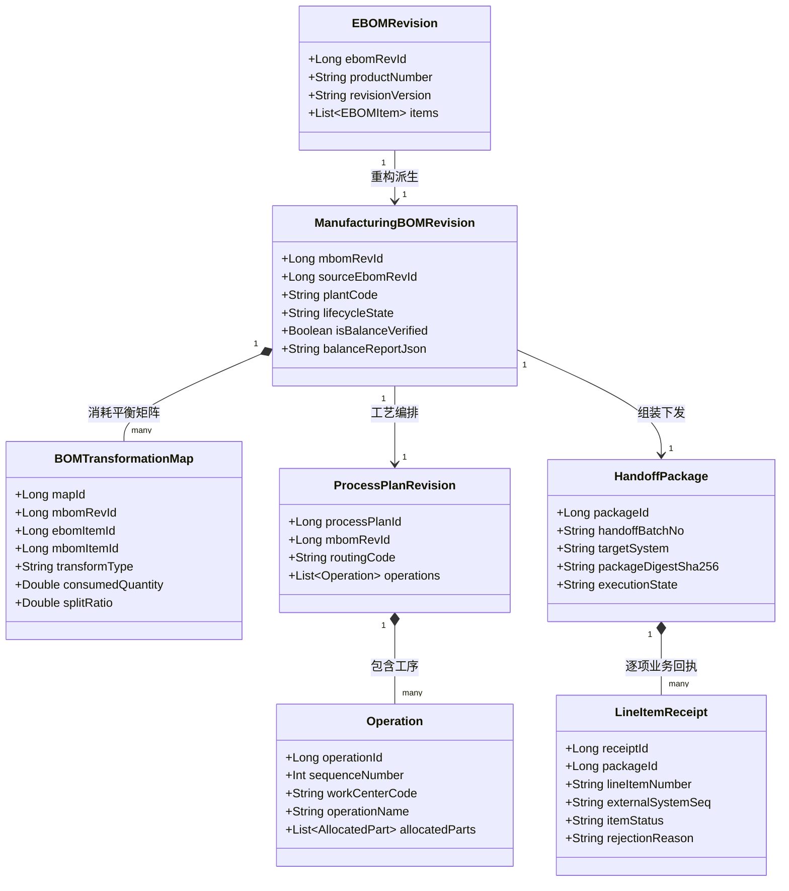
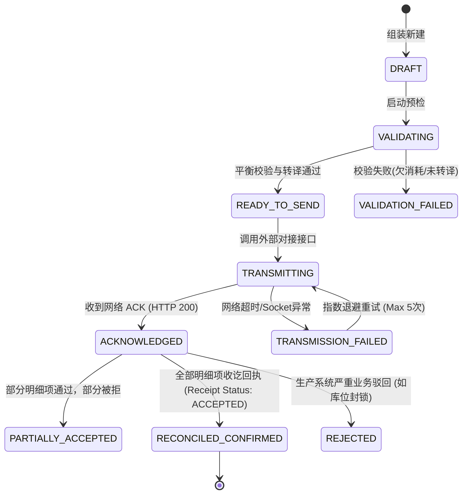

# CCDDesigner 2.0 专项开发规格包 (Detailed Specifications) - 9

## 文档标识
- **规格编号**：`CCD-DEV-SPEC-2.0-D08`
- **主题**：EBOM/MBOM 转换平衡算法与制造下发回执对账协议规格说明书 (Detailed Specification for EBOM/MBOM Transformation Balance & Manufacturing Handoff Receipt Protocol)
- **对应模块**：M25 (制造工程与工艺)、M26 (工程下发与制造回传)、M27 (实物台账与交付)
- **所属阶段**：P3 (制造交付与生产闭环)
- **核心规约**：物料消耗百分之百严格守恒 (100% Consumption Conservation)、严禁伪造设计来源 (No Fabricated EBOM Source)、HTTP 200 不等于业务消费成功、逐项业务流水对账 (Line-item Receipt Reconciliation)

---

## 一、规格背景与设计目标

### 1.1 业务背景
在高端数控机床从研发到车间生产的交付过程中，设计 BOM（EBOM，以功能和结构为中心）无法直接用于车间装配指导。制造工程团队必须将 EBOM 重构为面向装配工位与生产物流的制造 BOM（MBOM），并编排工艺路线（BOP: Bill of Process）。

### 1.2 核心痛点与解决思路
1. **物料遗漏或超量消耗**：
   - 传统 PLM 中工程师手动拆解结构，常发生紧固件、传感器、线缆在 MBOM 中少装或多排，造成装配停线。
   - **解决方案**：引入基于数学矩阵的**逐行可解释消耗平衡校验算法（EBOM/MBOM Consumption Balance）**，未达成 100% 消耗平衡前禁止签署制造就绪评审（MRR）。
2. **工艺辅料污染设计模型**：
   - 车间装配所需的螺纹紧固胶、润滑脂、导轨清洗油、封箱护套等非设计图纸物料，常被错误逆向写入 EBOM。
   - **解决方案**：明确划分物料来源类型，工艺辅料必须打上 `MANUFACTURING_ADDED` 标识，**严禁反向伪造 EBOM 设计来源**。
3. **“下发即成功”的通信假象**：
   - 传统接口调用 ERP/MES 只要收到 HTTP 200 即将发布单标记为“已下发”，但车间往往因为主数据编码冲突、库位无效而导致异步入库失败，设计端毫无感知。
   - **解决方案**：制定**双阶段确认与逐项业务回执对账协议（Line-item Receipt Protocol）**，仅当 MES 返回具有明确业务流水号（Receipt Tracking No）的确认回执，且所有行状态为 `ACCEPTED` 时，工程下发状态才闭环为 `CONFIRMED`。

---

## 二、领域实体模型与状态机 (Domain Metamodel & State Machine)



---

## 三、EBOM -> MBOM 转换平衡算法 (EBOM/MBOM Consumption Balance)

### 3.1 四类转换类型定义 (`TransformationType`)

1. **`DIRECT_1_TO_1`（直接映射）**：
   - 1 个 EBOM 物料项完全对应 1 个 MBOM 项，数量 $100\%$ 一对一承接；
2. **`SPLIT_1_TO_N`（工艺拆分）**：
   - 1 个 EBOM 项在制造中被拆分到不同工位或不同装配步骤进行消耗（例如 1 套集中润滑管路系统拆分为床身段、立柱段与主轴箱段）；
   - **守恒约束**：$\sum_{j=1}^{N} Q_{\text{MBOM}}^{(j)} = Q_{\text{EBOM}}$；
3. **`PHANTOM_RESTRUCTURE`（工艺虚拟件重组）**：
   - 为车间预分装引入虚拟总成（如“电主轴冷却管路预分装套件”），虚拟件自身标记 `is_phantom = true`，其子物料严格溯源自 EBOM；
4. **`MANUFACTURING_ADDED`（工艺制造新增物料）**：
   - 车间新增工艺消耗辅料（螺纹胶、扎带、防锈油、吊装堵头等）；
   - **来源归属**：`source_ebom_item_id = NULL`，类型标记为 `MANUFACTURING_ADDED`，严禁反写回 EBOM。

### 3.2 消耗平衡守恒检验算法 (Mathematical Verification)

设设计 EBOM 包含 $m$ 个物理物料项，每个项的需求数量为 $E_i$（$i \in [1, m]$）；
对应制造 MBOM 引用了该 EBOM 的消耗项集合，分配给 MBOM 的数量为 $M_{i, j}$（第 $j$ 次分配）。

定义物料项 $i$ 的消耗平衡残差 $\Delta Q_i$：

$$\Delta Q_i = E_i - \sum_{j=1}^{k_i} M_{i, j}$$

**平衡判定标准**：
- 若对于所有 $i \in [1, m]$，均满足 $|\Delta Q_i| < \epsilon$（$\epsilon = 10^{-6}$），则判定该 MBOM **达成 100% 消耗平衡（Balance Verified）**；
- 若存在任一 $\Delta Q_i > 0$，判定为 **欠消耗（Under-consumed）**，指出遗漏零件；
- 若存在任一 $\Delta Q_i < 0$，判定为 **过消耗（Over-consumed）**，指出超量挂载。

---

## 四、制造下发包（HandoffPackage）与可靠下发状态机

### 4.1 制造下发包组装规约
1. **下发范围冻结**：下发包必须基于已通过 MRR 评审且处于 `RELEASED` 状态的 `ManufacturingBOMRevision` 与 `ProcessPlanRevision`；
2. **下发签名**：对全包内容计算防篡改 SHA-256 签名，生成 `packageDigestSha256`；
3. **主数据编码转译**：若设计物料编码与制造工厂 ERP 物料号存在对照字典（Mapping Dict），在组装下发包时执行自动转译，并生成《转译对账报告》（`MappingReport`）。

### 4.2 状态流转状态机



---

## 五、逐项业务回执与异步对账协议规范 (Line-item Receipt Protocol)

### 5.1 核心约束
> [!IMPORTANT]
> 1. **网络通信成功（HTTP 200）不等于业务消费成功**。下发接口调用成功仅代表外围系统网关成功接单，不代表车间主数据和工位已经成功入账。
> 2. 下发批次只有在收到携带外部 MES 明确业务流水号（`externalReceiptNo`）的逐项回执，且所有行状态为 `ACCEPTED` 时，才允许在 PLM 中将下发标记为终态。

### 5.2 异步回执报文契约 (`POST /api/v1/manufacturing-handoffs/receipts`)

- **MES 回传请求报文示例**：
  ```json
  {
    "handoffBatchNo": "HDF-20260916-VMC1000-001",
    "targetSystem": "MES-PLANT-01",
    "externalReceiptNo": "MES-REC-90182390123",
    "receiptTimestamp": "2026-09-16T09:45:00Z",
    "lineItemReceipts": [
      {
        "lineItemNumber": "10",
        "materialNumber": "PART-SP-HSK63-18K",
        "status": "ACCEPTED",
        "assignedStorageBin": "BIN-A-04-12",
        "discrepancyMessage": null
      },
      {
        "lineItemNumber": "20",
        "materialNumber": "PART-PUMP-CTS-70BAR",
        "status": "REJECTED",
        "assignedStorageBin": null,
        "discrepancyMessage": "工位 WORKSTATION-HYD-02 不支持 7.0MPa 高压泵接口管路工装"
      }
    ]
  }
  ```

### 5.3 幂等去重保证
- 接收回传必须严格依靠联合主键 `(tenant_id, target_system, external_receipt_no, line_item_number)` 实现幂等入库，重复推送直接返回前次处理凭证，严禁重复产生账目偏差。

---

## 六、PostgreSQL 物理表结构设计 (DDL 增量扩展)

```sql
-- =============================================================================
-- CCDDesigner 2.0 数据库增量迁移脚本 (P3 阶段: 制造工程、工艺与下发回执)
-- 脚本版本: V1.2.0
-- 对应规约: CCD-DEV-SPEC-2.0-D08 (M25, M26, M27)
-- =============================================================================

-- 1. 制造 MBOM 主表与修订版
CREATE TABLE IF NOT EXISTS sys_manufacturing_boms (
    mbom_id          BIGINT PRIMARY KEY,
    tenant_id        VARCHAR(64) NOT NULL,
    mbom_code        VARCHAR(64) NOT NULL,
    plant_code       VARCHAR(32) NOT NULL, -- 制造工厂编号 (如 PLANT_01)
    product_number   VARCHAR(64) NOT NULL,
    created_at       TIMESTAMP WITH TIME ZONE NOT NULL DEFAULT CURRENT_TIMESTAMP,
    CONSTRAINT uk_tenant_mbom_code UNIQUE (tenant_id, mbom_code, plant_code)
);

CREATE TABLE IF NOT EXISTS sys_manufacturing_bom_revisions (
    revision_id      BIGINT PRIMARY KEY,
    tenant_id        VARCHAR(64) NOT NULL,
    mbom_id          BIGINT NOT NULL REFERENCES sys_manufacturing_boms(mbom_id) ON DELETE CASCADE,
    revision_version VARCHAR(32) NOT NULL,
    source_ebom_rev_id BIGINT NOT NULL,    -- 追溯绑定的设计来源 EBOM 版本
    lifecycle_state  VARCHAR(32) NOT NULL DEFAULT 'DRAFT', -- DRAFT, IN_REVIEW, RELEASED, OBSOLETE
    is_balance_verified BOOLEAN NOT NULL DEFAULT FALSE,    -- 100% 消耗平衡校验标志
    balance_report_json JSONB NULL,       -- 消耗平衡明细残差报告
    published_by     VARCHAR(64) NULL,
    published_at     TIMESTAMP WITH TIME ZONE NULL,
    created_at       TIMESTAMP WITH TIME ZONE NOT NULL DEFAULT CURRENT_TIMESTAMP,
    updated_at       TIMESTAMP WITH TIME ZONE NOT NULL DEFAULT CURRENT_TIMESTAMP,
    CONSTRAINT uk_tenant_mbom_rev UNIQUE (tenant_id, mbom_id, revision_version)
);

-- 2. EBOM/MBOM 转换映射与消耗平衡矩阵表
CREATE TABLE IF NOT EXISTS sys_bom_transformation_maps (
    map_id           BIGINT PRIMARY KEY,
    tenant_id        VARCHAR(64) NOT NULL,
    mbom_revision_id BIGINT NOT NULL REFERENCES sys_manufacturing_bom_revisions(revision_id) ON DELETE CASCADE,
    ebom_line_id     BIGINT NULL,          -- 来源 EBOM 行 ID (制造新增辅料时可为空)
    source_part_number VARCHAR(64) NULL,
    mbom_line_number VARCHAR(32) NOT NULL,
    target_part_number VARCHAR(64) NOT NULL,
    transform_type   VARCHAR(32) NOT NULL, -- DIRECT_1_TO_1, SPLIT_1_TO_N, PHANTOM_RESTRUCTURE, MANUFACTURING_ADDED
    consumed_quantity NUMERIC(18, 4) NOT NULL,
    unit_of_measure  VARCHAR(16) NOT NULL DEFAULT 'EA',
    operation_sequence INT NULL,           -- 指派消耗的工艺路线工序号 (如 0010)
    created_at       TIMESTAMP WITH TIME ZONE NOT NULL DEFAULT CURRENT_TIMESTAMP
);

CREATE INDEX IF NOT EXISTS idx_trans_map_mbom ON sys_bom_transformation_maps(tenant_id, mbom_revision_id);

-- 3. 制造下发批次包主表 (Handoff Packages)
CREATE TABLE IF NOT EXISTS sys_handoff_packages (
    package_id       BIGINT PRIMARY KEY,
    tenant_id        VARCHAR(64) NOT NULL,
    handoff_batch_no VARCHAR(64) NOT NULL,
    mbom_revision_id BIGINT NOT NULL REFERENCES sys_manufacturing_bom_revisions(revision_id),
    target_system    VARCHAR(32) NOT NULL, -- ERP, MES_PLANT_01, WMS
    package_digest_sha256 VARCHAR(64) NOT NULL,
    execution_state  VARCHAR(32) NOT NULL DEFAULT 'DRAFT', -- DRAFT, READY_TO_SEND, TRANSMITTING, ACKNOWLEDGED, RECONCILED_CONFIRMED, REJECTED
    total_line_count INT NOT NULL,
    accepted_line_count INT NOT NULL DEFAULT 0,
    rejected_line_count INT NOT NULL DEFAULT 0,
    created_by       VARCHAR(64) NOT NULL,
    created_at       TIMESTAMP WITH TIME ZONE NOT NULL DEFAULT CURRENT_TIMESTAMP,
    reconciled_at    TIMESTAMP WITH TIME ZONE NULL,
    CONSTRAINT uk_tenant_handoff_batch UNIQUE (tenant_id, handoff_batch_no)
);

-- 4. 逐项业务回执与对账明细表 (Line-item Receipts)
CREATE TABLE IF NOT EXISTS sys_line_item_receipts (
    receipt_id       BIGINT PRIMARY KEY,
    tenant_id        VARCHAR(64) NOT NULL,
    package_id       BIGINT NOT NULL REFERENCES sys_handoff_packages(package_id) ON DELETE CASCADE,
    line_item_number VARCHAR(32) NOT NULL,
    material_number  VARCHAR(64) NOT NULL,
    external_receipt_no VARCHAR(64) NOT NULL, -- 外部 MES 系统返回的唯一收讫流水凭证号
    item_status      VARCHAR(32) NOT NULL,    -- ACCEPTED, REJECTED, PENDING
    assigned_storage_bin VARCHAR(64) NULL,
    discrepancy_message TEXT NULL,
    received_at      TIMESTAMP WITH TIME ZONE NOT NULL DEFAULT CURRENT_TIMESTAMP,
    CONSTRAINT uk_receipt_item_unique UNIQUE (tenant_id, package_id, line_item_number, external_receipt_no)
);

CREATE INDEX IF NOT EXISTS idx_receipt_pkg ON sys_line_item_receipts(tenant_id, package_id);
```

---

## 七、OpenAPI 3.0 RESTful 接口契约

### 7.1 EBOM/MBOM 消耗平衡校验 (`POST /api/v1/manufacturing-boms/{id}/revisions/{rev}/verify-balance`)
- **功能**：自动扫描 EBOM 原始行与当前 MBOM 拆解项，执行矩阵平衡验证。
- **成功响应 (200 OK - 平衡守恒)**：
  ```json
  {
    "code": 200,
    "message": "EBOM/MBOM 100% 消耗平衡校验通过",
    "data": {
      "isBalanceVerified": true,
      "totalEbomItems": 420,
      "consumedEbomItems": 420,
      "manufacturingAddedItems": 15,
      "unconsumedItems": [],
      "overconsumedItems": []
    }
  }
  ```
- **异常响应 (422 Unprocessable Entity - 守恒破坏)**：
  ```json
  {
    "code": 422,
    "message": "消耗平衡校验失败：检测到 2 项设计物料未在 MBOM 中完全分配",
    "errorDetails": {
      "isBalanceVerified": false,
      "unconsumedItems": [
        {
          "ebomLineId": 801928301,
          "partNumber": "FASTENER-M12-45-12.9",
          "partName": "高强内六角螺栓 M12x45 (12.9级)",
          "designedQuantity": 24.0,
          "allocatedQuantity": 16.0,
          "missingResidual": 8.0,
          "guidance": "主轴箱连接法兰需要 24 颗螺栓，当前工艺路线工序仅分配 16 颗，尚欠 8 颗未指派装配工序。"
        }
      ]
    }
  }
  ```

### 7.2 组装并发起制造下发 (`POST /api/v1/manufacturing-handoffs`)
- **功能**：锁定已校验 MBOM，组装带哈希签名的下发包并向 MES 发起投递。

### 7.3 接收车间逐项回执 (`POST /api/v1/manufacturing-handoffs/receipts`)
- **功能**：接收外部 MES 异步回传的逐项收讫凭证，执行状态机推进与差异对账。

---

## 八、验收测试用例 (Acceptance Tests)

| 用例编号 | 场景分类 | 前置条件与输入 | 预期结果与断言 | 对应核心规约 |
| :--- | :--- | :--- | :--- | :--- |
| **AT-08-01** | EBOM/MBOM 正常拆解与平衡校验通过 | 导入包含 420 项的 VMC1000 EBOM，工艺工程师拆分为 35 个装配工序并引入 15 项工艺新增辅料（密封胶等） | 1. 触发校验接口，返回 200 OK；<br>2. `unconsumedItems` 为空；<br>3. 辅料正确被标注 `MANUFACTURING_ADDED` 且未污染 EBOM；<br>4. `is_balance_verified` 置为 `true`。 | 100% 消耗守恒与辅料隔离 |
| **AT-08-02** | 欠消耗硬阻断拦截 | 故意在工艺编排中漏配 8 颗 M12 关键法兰紧固螺栓，尝试发起制造就绪（MRR）下发 | 1. 拦截下发操作，抛出 422 错误；<br>2. 精准指明漏分配物料编号、欠消耗数量；<br>3. 下发包禁止生成。 | 守恒不达标禁止下发 |
| **AT-08-03** | 制造下发网络成功与业务回执解耦 | 下发包发起投递，网关返回 HTTP 200 ACK，但尚未收到 MES 业务回执 | 1. 下发包状态流转为 `ACKNOWLEDGED`，严禁直接置为 `RECONCILED_CONFIRMED`；<br>2. 业务状态保持为待对账。 | 通信成功不等于业务成功 |
| **AT-08-04** | 逐项回执幂等接收与整单对账闭环 | MES 异步推送包含全项确认的明细回执，中途模拟网络重复推送一次相同报文 | 1. 首次推送成功入库并更新回执状态；<br>2. 重复报文触发 `uk_receipt_item_unique` 幂等安全去重，不报异常；<br>3. 下发包终态更新为 `RECONCILED_CONFIRMED`。 | 逐项对账与幂等去重 |
