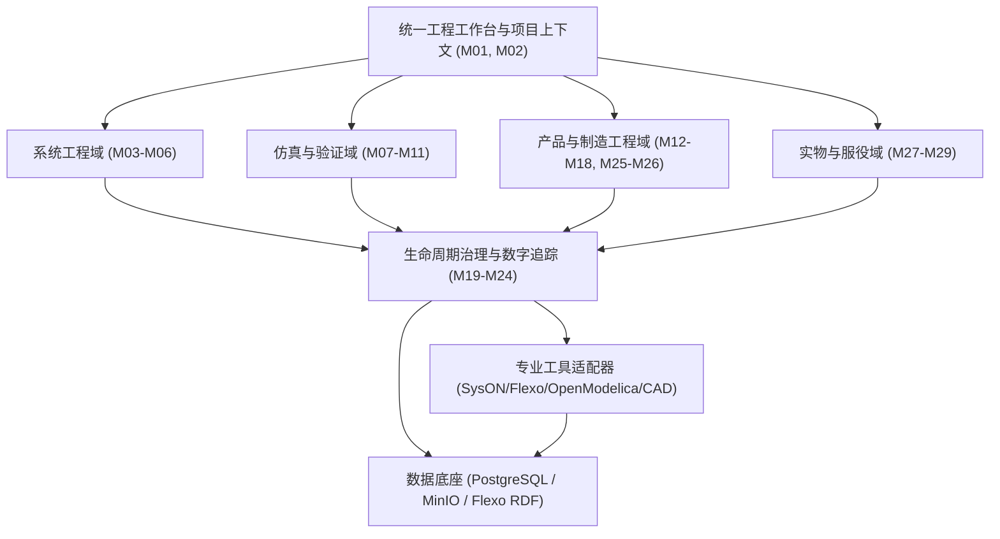

# CCDDesigner 2.0 产品开发说明书

| 文档属性 | 内容                                                         |
| -------- | ------------------------------------------------------------ |
| 文档编号 | CCD-DEV-SPEC-2.0-001                                         |
| 文档版本 | V1.0                                                         |
| 编制日期 | 2026年9月15日                                                |
| 上位依据 | 《CCDDesigner 2.0 产品功能架构与模块设计说明书》V1.0（CCD-ARCH-FUNC-2.0-001） |

 |
| 目标受众 | 架构师、后端/前端开发工程师、测试工程师、系统集成工程师、DevOps与实施团队

 |

---

## 1. 系统开发概述与设计约束

### 1.1 系统定位与核心设计目标

CCDDesigner 2.0 是面向复杂数控装备的、基于 SysML v2 系统模型驱动的 Model-Based PLM 平台。系统以“系统模型”和“受控产品定义”为两个工程核心，统一贯穿其全生命周期治理：

1. **全链路端到端追溯**：从任何已发布的需求、模型元素、BOM使用位置或序列号实物，均可双向精确追溯其版本、适用配置及验证证据。


2. **多业务路径隔离**：平台开发、CTO（按订单配置）、ETO（按订单设计）与全新研发具备独立执行入口，成熟资产允许复用，但历史证据适用性必须独立重新确认。


3. **治理与专业工具分离**：专业工具（CAD/CAE/SysON/OpenModelica）负责几何建模、物理求解与模型编辑；CCDDesigner 承担业务身份、生命周期、权限控制、基线固化、配置解析与工程变更管理。


4. **参数角色严格受控**：参数、仿真结果与实测记录保留角色与上下文，计算或实测结果禁止直接覆盖需求阈值或已发布的设计值。


5. **发布不可变与跨系统一致性**：已发布内容绝对禁止原位修改；跨系统发布必须具备幂等性、可重试性、可恢复性与审计能力。


6. **实物配置与设计配置解耦**：制造与服役反馈闭环驱动问题与设计改进，设计基线（As-Designed）与实装/服役配置（As-Built/As-Maintained）分别独立受控。


### 1.2 核心技术栈与架构约束

* **前端架构**：React ＋ TypeScript，统一采用组件化工程工作台。


* **PLM 核心服务**：采用 Spring Boot 模块化单体/服务化架构（Modular PLM Core），负责本地事务与核心业务逻辑。


* **业务数据存储**：PostgreSQL，用于承载 PLM 关系型主数据、跨域数字主线链接及事务性元数据。


* **非结构化制品存储**：MinIO，用于图文档、模型文本、轻量化文件及仿真结果文件的持久化。


* **系统模型底座**：基于 Flexo 架构构建的 SysML v2 模型服务，后端依赖符合 SPARQL 1.1 的四元组/RDF 存储。**系统严禁采用 Neo4j**。


* **工作区与仿真组件**：集成 SysON、OpenSysML 工具环境及 OpenModelica 脚本求解环境。


---

## 2. 总体架构与数据权威源设计

### 2.1 业务域架构

系统划分为六大核心业务域及两套公共支撑能力：

* **五大专业业务域**：系统工程域、仿真与验证域、产品工程域、制造工程域、实物与服役域。


* **贯穿治理域**：生命周期治理与数字追踪域（统一服务于上述五大业务域）。


* **公共支撑与入口**：统一工程工作台（UI）、专业工具连接器与集成适配层、分域数据与制品服务。




### 2.2 数据权威源与读写控制矩阵

开发过程中必须严格遵循数据权威源归属，严禁跨权限绕过主责模块直接修改底表：

| 数据类别             | 权威服务模块 | 物理存储介质 | 写入与并发控制规范                                     |
| -------------------- | ------------ | ------------ | ------------------------------------------------------ |
| 需求正文、阈值与指标 | M03 需求模块 | PostgreSQL   | 平台内部事务控制；模型侧仅能产生修改提案，不可直接覆盖 |

 |
| SysML 正在编辑的模型 | M04 建模工作区 | SysON仓库 / 受控文件系统 | 单一工作区绑定唯一主要编辑通道（图形或文本）

 |
| SysML 发布语义快照 | M06 绑定的 Flexo 服务 | Flexo RDF 存储 | 只读写入特定 Commit；通过 SPARQL/API 查询只读消费

 |
| 模型图形、布局与专有文件 | M19 制品服务 | MinIO | 与语义快照同步冻结，计算 SHA-256 摘要，不可原位覆盖

 |
| BOM、产品配置、变更、生命周期 | 各 PLM 领域服务 | PostgreSQL | 领域应用服务通过本地数据库事务统一提交

 |
| CAD 原始几何与装配模型 | 外部 CAD / M17 | 工具工作区 / MinIO | 签入后生成派生轻量化模型；结构属性与 PLM 协商主写者

 |
| 仿真输入、执行日志与原始结果 | M10 调度 / M19 制品 | PostgreSQL (元数据) + MinIO (文件) | Run 达到终态（SUCCEEDED/FAILED）后锁定为不可变证据

 |
| 跨域数字主线链接 | M23 数字主线服务 | PostgreSQL | 存储带类型、版本及适用上下文的关系，禁止在 PLM 重建第二套模型内部关系

 |
| 设备实装时序与维修事件 | M27 台账 / M28 服务 | PostgreSQL | 双时间戳控制：记录生效时间（validTime）与系统记录时间（recordedAt）

 |
| 检索与工作台聚合视图 | M01 读模型服务 | 检索索引 / 内存缓存 | 纯只读可重建视图；严禁将缓存作为审批和业务判定的依据

 |

---

## 3. 核心领域对象模型与版本身份规范

### 3.1 对象身份与版本标识定义

系统采用 `ObjectMaster`（主对象）与 `ObjectRevision`（版本修订）分离的模型架构：

* **稳定业务对象（需求、零件、文档、平台）**：采用 `masterId` ＋ `revisionId`（如 `REV-A`）唯一标识，禁止使用名称作为主键。


* **工作草稿并发控制**：基于 `revisionId` ＋ `workingVersion`（并发乐观锁令牌）机制，防止多端静默覆盖。


* **SysML v2 模型元素定位**：四元组全局稳定唯一标识：

$$\text{ModelElementRef} = \langle \text{repositoryId}, \text{modelProjectId}, \text{commitId}, \text{elementId} \rangle$$


禁止使用可变的树状显示路径（`displayPath`）作为历史引用键。


* **BOM 使用位置**：装配结构中的每一行均具备唯一的 `lineId`；跨版本演进通过 `lineageId` 关联，相同零件在不同安装位置严禁共用行身份。


* **实物设备身份**：分配唯一的 `individualId`，设备出厂序列号在命名空间内唯一，维修换件不得改变实物底层身份。


* **基线（Baseline）**：由 `baselineId` ＋ 不可变成员清单及其哈希摘要构成，禁止动态跟随“最新版本”。


```
┌─────────────────────────────────────────────────────────────┐
│                 核心领域对象关系与追踪模型                   │
└─────────────────────────────────────────────────────────────┘
  [M03 需求修订] <=== verifies / satisfies ===> [M04/M06 系统模型发布]
         ▲                                                │
         │ (Allocated)                                    │ (Mapped)
         ▼                                                ▼
  [M11 验证判定] <=== evidenceFor === [M10 仿真Run / 测试证据]
         ▲                                                │
         │ (Evaluates)                                    ▼
  [M16 零部件EBOM] <=== As-Designed === [M14/M15 订单产品定义]
                                                  │
                                                  ▼ (Derives)
  [M28 服役配置] <=== As-Maintained === [M27 序列号实物台账]

```

(说明：关系语义以 M23 关系字典为准，多对多映射严禁压扁为单亲子关系。)

---

## 4. 模块开发详细规格 (M01 ~ M30)

系统全量 30 个功能模块依据建设期划分为五期：P0（集成验证）、P1（系统设计闭环）、P2（产品工程）、P3（制造交付）、P4（服役增强）。

### 4.1 统一工作台与项目协同域

#### M01 统一工作台与检索 (Phase: P1, Type: N)

* **核心职责**：聚合个人待办、项目动态、收藏夹及全局检索，提供基于权限裁剪的统一入口。


* **主责对象**：`Favorite`、`AccessHistory`、`SavedQuery`、只读聚合看板。


* **功能清单**：
* `M01-F01`：聚合待办任务、订单、项目交付物、审批单与变更单。


* `M01-F02`：最近访问历史记录与快捷收藏。


* `M01-F03`：跨对象、跨版本、跨模型元素与文件的全局多维过滤搜索。


* `M01-F04`：工程风险卡片（需求缺口、失效证据、挂起发布统计）。


* **开发约束**：搜索索引为异步派生产物，详情展示与审批提交必须穿透查询权威数据库，不得直接信任检索缓存。


#### M02 项目、任务与阶段门 (Phase: P1, Type: N)

* **核心职责**：管理研发项目计划、WBS 分解、交付物审查及阶段门（Gate）成熟度控制。


* **主责对象**：`Program`、`Project`、`Stage`、`WBSNode`、`Task`、`Gate`、`GateDecision`。


* **功能清单**：
* `M02-F01`：建立 Program、Project 及研发模板（平台/CTO/ETO）。


* `M02-F02`：WBS 分解与任务前后置依赖编排。


* `M02-F03`：任务交付物绑定（`DeliverableRequirement`）与提交历史追踪。


* `M02-F04`：阶段门评审准入检查、决策记录（PASS、CONDITIONAL_PASS、REWORK、STOP）与行动项追踪。


* `M02-F05`：变更后的计划版本基线重置与逾期预警。


* **开发约束**：`Program` 不设 Gate；阶段门决策独立于任务进度，任务 100% 完成但核心验证证据不足时，系统必须阻止自动放行。


### 4.2 系统工程与模型驱动域

#### M03 需求与技术规格 (Phase: P1, Type: N)

* **核心职责**：维护结构化需求库与订单技术规格，实现形式化需求与验收指标管控。


* **主责对象**：`RequirementMaster`、`RequirementRevision`、`SpecificationMaster`、`SpecificationRevision`、`SpecificationItem`。


* **功能清单**：
* `M03-F01`：需求分解、派生、层级组织与工程版本管理。


* `M03-F02`：技术规格模板定义与订单适用性过滤。


* `M03-F03`：量化指标、验收判据、边界工况及验证方法定义。


* `M03-F04`：与 SysML v2 模型需求元素的一致性校验与差异比对。


* `M03-F05`：需求覆盖率分析矩阵与变更缺口提示。


* **开发约束**：规格条目若声明为“引用需求”，必须只读投影需求阈值，严禁在需求和规格中维护两套不同值的副本。


#### M04 MBSE 建模工作区 (Phase: P0/P1, Type: N＋I)

* **核心职责**：绑定外部 SysON 或 OpenSysML 建模环境，管理工作区上下文与快照捕获。


* **主责对象**：`WorkspaceBinding`、`CandidateSnapshot`、`DiagnosticReport`。


* **功能清单**：
* `M04-F01`：建立 SysML 模型工程与 PLM 项目的绑定关系。


* `M04-F02`：加载数控机床行业专用建模模板与标准库。


* `M04-F03`：支持结构、行为、接口、参数等视图的编辑上下文维护。


* `M04-F04`：集成 OpenSysML 语法与语义诊断，生成差异诊断报告。


* `M04-F05`：捕获一致性模型工作快照并向 M06 提交发布申请。


* **开发约束**：工作区必须声明主编辑通道（图形 GRAPHICAL 或文本 TEXTUAL），禁止多端无锁并发篡改；快照导出必须携带不可变令牌。


#### M05 系统接口与架构映射 (Phase: P1/P2, Type: N＋I)

* **核心职责**：定义系统跨专业接口契约，维护逻辑/物理架构对产品 BOM 的分配关系。


* **主责对象**：`InterfaceContractRevision`、`InterfaceBinding`、`ArchitectureAllocation`。


* **功能清单**：
* `M05-F01`：机械、电气、液压、控制、数据协议等接口契约定义。


* `M05-F02`：接口两端兼容性（量纲、流向、信号类型）校验。


* `M05-F03`：功能行为到逻辑架构组件的分配映射。


* `M05-F04`：模型元素到物理零部件（PartRevision）、软件及使用位置的映射配置。


* **开发约束**：同一逻辑伺服电机可映射至不同学科视图，但在最终物理装配中其实体位置必须唯一，禁止由于多视图映射导致 BOM 数量重复累加。


#### M06 模型发布与兼容性管理 (Phase: P0/P1, Type: N＋I)

* **核心职责**：协调 SysML 模型发布事务，写入 Flexo 模型库及 MinIO 制品库，保证发布幂等与完整性。


* **主责对象**：`ModelRelease`、`CompatibilityProfile`、`PublicationManifest`。


* **功能清单**：
* `M06-F01`：定义工具版本、依赖库及交换子集准入规则（CompatibilityProfile）。


* `M06-F02`：对快照进行语义转换、标识符完整性校验及差异预检。


* `M06-F03`：调用 Flexo 写入不可变候选 Commit，同步上传配套制品至 MinIO。


* `M06-F04`：绑定 M24 审批凭证，原子提交业务发布记录并激活模型。


* `M06-F05`：历史模型版本差异解析、健康度巡检与故障恢复。


* **开发约束**：**两阶段提交模式**——Flexo 写入成功但 MinIO 失败时，禁止标记业务发布成功；未受控审批前，外部直接连接不得访问候选快照。


### 4.3 仿真与验证闭环域

#### M07 参数与参数集 (Phase: P1, Type: N)

* **核心职责**：统一管理全系统工程参数定义，依据角色记录参数值，支撑参数派生计算。


* **主责对象**：`ParameterDefinitionRevision`、`ParameterValueRecord`、`ParameterSetRevision`、`EvaluationRecord`。


* **功能清单**：
* `M07-F01`：定义参数名称、量纲、标准单位、值类型及上下限。


* `M07-F02`：记录特定角色（`REQUIREMENT_LIMIT`、`DESIGN_VALUE`、`MODEL_INPUT`、`TEST_RESULT` 等）的数值上下文。


* `M07-F03`：创建并冻结特定基线下的参数集快照（ParameterSetRevision）。


* `M07-F04`：参数派生公式计算及有向无环图（DAG）依赖求值。


* **开发约束**：数值变更必须携带角色标签；DAG 计算遇到循环依赖必须报错并阻断，严禁隐式死循环；禁止仿真结果覆盖需求阈值。


#### M08 模型映射与自动触发 (Phase: P1, Type: N＋I)

* **核心职责**：将系统参数映射至仿真变量，依据受控策略自动创建仿真任务。


* **主责对象**：`ModelMappingRevision`、`TriggerPolicyRevision`、`TriggerExecution`。


* **功能清单**：
* `M08-F01`：系统参数到 Modelica 模型输入变量的映射矩阵与转换表达式维护。


* `M08-F02`：映射合法性检查（量纲对齐、未知变量探测）。


* `M08-F03`：定义基于事件（如参数集发布）的合并触发策略与并发限流规则。


* `M08-F04`：创建触发记录，下发仿真任务，并将计算产物组织为修改提案。


* **开发约束**：首期仅支持向已有 Modelica 模板传递参数，不实现全自动生成模型拓扑；禁止仿真结果写回再次触发自身形成死循环。


#### M09 仿真模型库与分析用例 (Phase: P1, Type: N＋I)

* **核心职责**：管理已验证的 Modelica/CAE 专业模型库、分析工况及求解配置。


* **主责对象**：`SimulationModelRevision`、`SimulationStudy`、`SimulationCaseRevision`、`SimulationConfigurationRevision`。


* **功能清单**：
* `M09-F01`：多专业（结构、传动、电机、热）仿真模型及外部依赖库准入归档。


* `M09-F02`：创建分析专题（Study）用于多方案对比。


* `M09-F03`：定义边界载荷、运行工况、时间步长与输出 KPI 判据（Case）。


* `M09-F04`：配置求解算法、积分容差及后处理脚本参数。


* **开发约束**：模型库发布必须附带最小可执行测试包及有效物理边界说明；用例引用的模型版本永久冻结。


#### M10 仿真调度与结果管理 (Phase: P1, Type: N＋I)

* **核心职责**：调度 OpenModelica 及 CAE 求解容器，管理执行生命周期，归档可复现凭据。


* **主责对象**：`SimulationJob`、`SimulationRun`、`SimulationResult`、`KPIEvaluation`。


* **功能清单**：
* `M10-F01`：组装输入包清单（模型、参数、求解器版本），创建并排队 SimulationJob。


* `M10-F02`：派发独立运行尝试（SimulationRun），跟踪 Worker 心跳、超时与重试。


* `M10-F03`：提取并校验原始日志、曲线文件与关键 KPI 数值。


* `M10-F04`：多方案结果对比与包含全部上下文的离线复现包打包导出。


* **开发约束**：**Job 与 Run 严格解耦**——重试执行必须生成新 Run 实体，保留失败 Run 历史日志；过期 Worker 的迟到回写禁止覆盖最新 Run 的数据。


#### M11 验证、确认与证据 (Phase: P1, Type: N)

* **核心职责**：建立需求验证用例，审查仿真与实测证据，做出有据可查的验证判定。


* **主责对象**：`VerificationPlan`、`VerificationCaseRevision`、`EvidenceRecord`、`VerificationAssessment`、`ApplicabilityAssessment`。


* **功能清单**：
* `M11-F01`：编制系统级验证与确认计划。


* `M11-F02`：维护验证用例、通过阈值判据与指定验证方法（仿真/分析/演示/测试）。


* `M11-F03`：收集 M10 仿真 Run、M17 试验或 M27 实机检验的原始数据作为 EvidenceRecord。


* `M11-F04`：结合目标产品上下文执行证据适用性判定（VerificationAssessment）。


* `M11-F05`：计算基线需求验证覆盖率矩阵，识别失效与证据缺口。


* **开发约束**：求解成功（Run SUCCEEDED）仅代表数学解算完成，绝不能自动等价于需求验证通过（PASS）；需求升版后，旧 PASS 记录保留历史，新版本必须重新评估适用性。


### 4.4 产品工程与配置管理域

#### M12 产品族与平台 (Phase: P2, Type: N)

* **核心职责**：定义机床产品族谱系，管理公共架构平台的演进、生效及停用。


* **主责对象**：`ProductFamily`、`PlatformMaster`、`PlatformRevision`。


* **功能清单**：
* `M12-F01`：定义产品族范围、机型矩阵及跨代复用策略。


* `M12-F02`：发布平台版本（PlatformRevision），绑定系统模型发布、槽位集合与 150% BOM。


* `M12-F03`：平台版本间的差异对比与配置规则继承。


* `M12-F04`：平台生命周期维护（生效、停用、退役）。


* **开发约束**：全新研发项目允许直接建立产品定义，待成熟后再沉淀为平台，禁止强行要求先有平台才能设计；新平台发布不自动篡改在制订单引用的旧平台。


#### M13 模块槽位与变体 (Phase: P2, Type: N)

* **核心职责**：在平台架构中定义物理/逻辑装配槽位，控制允许挂载的模块变体集合。


* **主责对象**：`SlotDefinition`、`VariantMaster`、`VariantRevision`、`AllowedVariant`。


* **功能清单**：
* `M13-F01`：定义槽位职责、接口契约要求、数量约束（min/max）及必选性。


* `M13-F02`：维护变体对象的受控版本，绑定物理结构或子装配体。


* `M13-F03`：配置槽位与变体的适用性白名单（AllowedVariant）。


* `M13-F04`：跨槽位与跨平台变体接口兼容性审查。


* **开发约束**：变体主对象直接承载变体身份，不建立多余的“同名 Module 容器”；必选槽位未配置合法变体时，配置器必须报错阻断。


#### M14 150%BOM与配置规则 (Phase: P2, Type: N)

* **核心职责**：维护超级结构（150% BOM）与配置逻辑规则，执行确定性的订单配置求解。


* **主责对象**：`ConfigurableStructureRevision`、`RuleSetRevision`、`RuleValidationReport`、`ConfigurationResult`。


* **功能清单**：
* `M14-F01`：在 BOM 行挂载选择条件、特征变量与数量计算公式。


* `M14-F02`：编写特征依赖、互斥、范围限制及接口配对规则（RuleSet）。


* `M14-F03`：规则冲突静态检查与求解空间试算。


* `M14-F04`：冻结特征输入，调用配置引擎解析并生成不可变的 ConfigurationResult。


* `M14-F05`：解算生成 100% 结构，并记录每行的选取规则溯源路径（SelectionProvenance）。


* **开发约束**：求解引擎必须具备确定性（相同输入必得相同摘要）；存在多个合法解时必须提示人工介入决策，禁止隐式默认采用首项。


#### M15 订单产品定义与ETO (Phase: P2, Type: N)

* **核心职责**：接收订单技术范围，驱动 CTO 配置实例化或派生 ETO 差异设计分支。


* **主责对象**：`OrderProductDefinition`、`EngineeringRouteDecision`、`DerivationPlan`。


* **功能清单**：
* `M15-F01`：建立订单工程档案，绑定外部 CRM/ERP 商业合同编号。


* `M15-F02`：接收 M14 解析结果，生成订单专有 100% EBOM 引用与基线。


* `M15-F03`：评估配置缺口，决策走 CTO 路线或触发转 ETO（按订单设计）流程。


* `M15-F04`：生成对象级派生计划（DerivationPlan），指定各零部件的引用/升版/新建策略。


* `M15-F05`：固化订单设计基线，绑定下游序列号实物设备台账。


* **开发约束**：**一个订单产品定义可对应多台设备实物**；转 ETO 严禁直接改写源母机数据，克隆母机时不自动复制历史验证 PASS 结论。


#### M16 零部件与EBOM (Phase: P1/P2, Type: N)

* **核心职责**：管理工程零件主数据与多级装配结构（EBOM），提供精确的使用位置追踪。


* **主责对象**：`PartMaster`、`PartRevision`、`BOMViewRevision`、`BOMLine`。


* **功能清单**：
* `M16-F01`：物料编号、分类属性、单位规范、工程版本与替代料维护。


* `M16-F02`：多级装配关系定义、数量、位号（FindNumber）及有效性管理。


* `M16-F03`：多版本 BOM 结构红线比对与反查使用处（Where-used）分析。


* `M16-F04`：与 CAD 装配树的双向绑定与拓扑映射。


* `M16-F05`：发布前结构完整性校验（悬空件、版本未发布、装配环路检测）。


* **开发约束**：位置级精确管理——同一物料在装配结构中出现两次必须生成两个独立 `lineId`，单位置变更严禁自动串改另一位置。


#### M17 CAD/CAE协同 (Phase: P2, Type: N＋I)

* **核心职责**：管理 MCAD 协同签入/签出，解析几何结构与 EBOM 差异，组织 CAE 分析包。


* **主责对象**：`CADDocumentBinding`、`StructureDiff`、`CAEPreparationPackage`、`DesignConsistencyReport`。


* **功能清单**：
* `M17-F01`：CAD 客户端插件与 PLM 统一工程上下文会话连接。


* `M17-F02`：CAD 装配树与 PLM EBOM 的结构比对与受控合并提案生成。


* `M17-F03`：几何模型、材料属性、网格划分、约束载荷打包为 CAEPreparationPackage。


* `M17-F04`：调用 M10 求解并关联分析报告。


* `M17-F05`：生成轻量化预览文件（如 3D Web 视图）并进行一致性校验。


* **开发约束**：字段主写权严格冻结——物料编号与发布状态归 PLM，几何坐标归 CAD；轻量化预览仅供查看，严禁替代原生几何源文件作为发布凭证。


#### M18 电气、软件与设备参数 (Phase: P2, Type: N＋I)

* **核心职责**：将数控系统 PLC 程序、伺服驱动固件及电气图纸纳入产品受控版本体系。


* **主责对象**：`ElectricalPackageRevision`、`SoftwareReleasePackage`、`CommissioningParameterSetRef`。


* **功能清单**：
* `M18-F01`：电气原理图、接线图、I/O 清单与硬件物料关联。


* `M18-F02`：数控系统控制软件、固件二进制包、源码 Git Commit 摘要固化。


* `M18-F03`：出厂调试参数集（机床出厂补偿表、增益参数）版本管理。


* `M18-F04`：发布软件配置与现场实装配置的差异核对。


* **开发约束**：软件版本号相同但构建二进制 SHA-256 摘要不同时，严禁视为同一发布制品；PLM 审批通过仅代表允许发布，不代表底层设备已完成物理刷机。


### 4.5 生命周期治理与基础服务域

#### M19 图文档与文件制品 (Phase: P1, Type: N)

* **核心职责**：统一管理非结构化物理文件的安全存储、哈希校验、版本绑定及格式转换。


* **主责对象**：`DocumentMaster`、`DocumentRevision`、`Dataset`、`Artifact`。


* **功能清单**：
* `M19-F01`：工程文档分类、模板套用、修订与签入/签出锁控。


* `M19-F02`：文件分片上传、SHA-256 摘要强校验与对象元数据登记。


* `M19-F03`：异步生成 PDF 派生物、添加受控电子水印及在线协同批注。


* `M19-F04`：提供向零件、模型、项目及证据的安全引用绑定。


* `M19-F05`：受控打包导出与文件访问日志审计。


* **开发约束**：**制品哈希不可变**——文件上传发布后，严禁在相同 `artifactId` 下原位替换底层字节；转换生成的 PDF 必须注册为新的派生制品并保留来源关系。


#### M20 工程对象与生命周期 (Phase: P1, Type: N)

* **核心职责**：提供跨所有业务模块通用的对象标识、元数据扩展、状态机执行引擎与审计追踪。


* **主责对象**：`ObjectMaster`、`ObjectRevision`、`TypeDefinition`、`TransitionResult`、`AuditRecord`。


* **功能清单**：
* `M20-F01`：统一的 Snowflake ID 派生、编码规则与版本管理底座。


* `M20-F02`：动态分类属性配置与受控字典表管理。


* `M20-F03`：状态迁移规则校验、工作流凭证复核与并发版本检查。


* `M20-F04`：更正记录追踪与全局防篡改审计日志记录。


* **开发约束**：已发布对象只读，严禁在数据库执行物理 DELETE；工作流审批完成仅作为凭证传入，状态机迁移必须再次强校验当前领域前置条件。


#### M21 基线与配置状态 (Phase: P1, Type: N)

* **核心职责**：冻结跨学科工程配置集合（需求、模型、BOM、文档、证据），构建不可变历史快照。


* **主责对象**：`Baseline`、`BaselineMember`、`ConfigurationStateReference`。


* **功能清单**：
* `M21-F01`：按特定业务阶段（如 CDR 评审）创建基线草稿并圈定候选成员。


* `M21-F02`：基线依赖闭包完整性校验（确保无草稿引用、无断链）。


* `M21-F03`：审批后基线锁定冻结，支持基线间红线比对与后继变更追溯。


* `M21-F04`：组织 As-Designed、As-Planned、As-Built、As-Delivered、As-Maintained 多形态配置引用。


* **开发约束**：基线冻结必须包含节点本身及节点间的关键关系；基线建立后任何成员的修改都不允许漂移历史快照。


#### M22 工程变更与影响处置 (Phase: P1/P2, Type: N)

* **核心职责**：管理工程问题、变更请求（ECR）、变更实施单（ECO）与跨系统受控生效闭环。


* **主责对象**：`ChangeRequest`、`ChangeOrder`、`ImpactItem`、`ImpactDecision`、`EffectivityDisposition`。


* **功能清单**：
* `M22-F01`：登记变更原因，划定变更初始范围并签发 ChangeRequest。


* `M22-F02`：调用 M23 获取候选拓扑路径，由各专业负责人做出实际影响处置决定（修改/复核/重新验证/不受影响）。


* `M22-F03`：签发 ChangeOrder，授权新版本工程工作空间与实施任务。


* `M22-F04`：跟踪新版本发布与设计闭环验证报告。


* `M22-F05`：定义针对在制订单、库存件及现场服役设备的处置方案（报废/返工/自然过渡）。


* **开发约束**：变更发布（PLM 已批准）与现场实施完成（MES/现场已执行）是两个独立状态，严禁在回执未确认前直接关闭变更单。


#### M23 数字主线与关系服务 (Phase: P1, Type: N)

* **核心职责**：统一持久化并高效遍历跨系统工程关系，计算变更影响候选集与可解释追溯图谱。


* **主责对象**：`RelationTypeDefinition`、`TraceLinkRevision`、`TraceView`、`ImpactCandidateSet`。


* **功能清单**：
* `M23-F01`：定义标准业务关系类型（`satisfies`、`verifies`、`allocatedTo`、`derivedFrom` 等）及端点类型约束。


* `M23-F02`：建立、版本化与冻结跨系统端点的关联记录。


* `M23-F03`：提供有向图上下游追溯导航、追溯矩阵展示与关系断链预警。


* `M23-F04`：基于配置上下文与遍历规则，计算受变更波及的候选影响集。


* **开发约束**：所有关系数据持久化于 PostgreSQL；遍历查询必须施加深度限制（如 $\le 5$ 层）及环路熔断机制，若因权限或限制导致截断，必须显式返回“结果不完整”警告标志。


#### M24 工作流与审批 (Phase: P1, Type: N＋I)

* **核心职责**：集成 Flowable 流程引擎，编排多专业会签、工程审批流，下发不可伪造的审批凭证。


* **主责对象**：`WorkflowDefinitionBinding`、`WorkflowInstance`、`ApprovalDecision`、`WorkflowActionRecord`。


* **功能清单**：
* `M24-F01`：业务对象与流程定义（BPMN）的版本化绑定配置。


* `M24-F02`：启动流程、任务委派、加签、会签流转及撤回控制。


* `M24-F03`：记录审批意见，对候选包摘要进行数字签名并生成 ApprovalDecision。


* `M24-F04`：执行异步业务状态机回调协调，保证幂等性。


* **开发约束**：**严格职责分离**——审批服务只负责产生签署凭证，无权直接修改任何业务对象的业务字段；同一事件回调多次执行必须幂等。


### 4.6 制造工程、实物交付与服役域

#### M25 制造工程与工艺 (Phase: P3, Type: N＋I)

* **核心职责**：将设计 EBOM 重构为制造 MBOM，编排工艺过程计划（BOP）并指派生产资源。


* **主责对象**：`ManufacturingBOMRevision`、`BOMTransformationMap`、`ProcessPlanRevision`、`Operation`、`ResourceAssignment`。


* **功能清单**：
* `M25-F01`：创建 MBOM 视图，承接设计来源并支持工艺虚拟件与分装重组。


* `M25-F02`：维护 EBOM 到 MBOM 的拆分、合并与数量折算映射字典。


* `M25-F03`：编制工艺路线、工序前后置关系与工步作业指导书。


* `M25-F04`：工序级工作中心、工装夹具及工艺辅料（制造新增物料）分配。


* `M25-F05`：制造就绪评审（MRR）与工艺完整性检查。


* **开发约束**：工艺辅料（如切削液、密封胶）必须标记为“制造新增”，严禁反向伪造 EBOM 设计来源；EBOM 与 MBOM 的消耗必须建立逐行可解释平衡校验。


#### M26 工程下发与制造回传 (Phase: P3, Type: N＋I)

* **核心职责**：组装制造下发包，与外部 ERP/MES 对接，幂等接收实装与检验反馈。


* **主责对象**：`HandoffPackage`、`MappingReport`、`DeliveryAttempt`、`Receipt`、`ManufacturingFeedback`。


* **功能清单**：
* `M26-F01`：根据目标制造工厂或系统抽取 As-Planned 基线组装下发包。


* `M26-F02`：执行编码与单位转译，生成映射对账报告。


* `M26-F03`：可靠传输下发，记录逐项（Line-item）业务接收回执与重试机制。


* `M26-F04`：幂等接收 MES 回传的实际装配序列号、生产偏离与实测数据。


* `M26-F05`：工程版本与生产实物状态的双向对账与异常关闭。


* **开发约束**：网络通信成功（HTTP 200）不等于业务消费成功，必须以带有业务流水号的逐项 Receipt 为准；重复回传记录依靠 `sourceSystem` ＋ `externalEventId` 严格去重。


#### M27 实物台账与交付 (Phase: P3, Type: N＋I)

* **核心职责**：管理具体机床序列号设备档案，动态构建 As-Built（实装）与 As-Delivered（交付）配置。


* **主责对象**：`MachineIndividual`、`InstallationEvent`、`AsBuiltSnapshot`、`DeliveryRecord`。


* **功能清单**：
* `M27-F01`：建立序列号机床实物主档案，绑定所属订单产品定义。


* `M27-F02`：记录关键部件（主轴、转台、丝杠、驱动器）实装与拆卸事件。


* `M27-F03`：记录装配调试偏离报告并生成当前实装快照（AsBuiltSnapshot）。


* `M27-F04`：整机实物出厂终检数据归档，冻结 As-Delivered 交付基线。


* **开发约束**：**双时间维度存储**——事件发生时间（`validTime`）与数据入库时间（`recordedAt`）严格区分，迟到的历史装配数据不能直接覆盖当前已发生的更新状态。


#### M28 服务、维修与服役配置 (Phase: P4, Type: N＋I)

* **核心职责**：记录售后现场维保与软硬件升级，动态重建任意历史时点的 As-Maintained 服役配置。


* **主责对象**：`ServiceCase`、`MaintenanceEvent`、`AsMaintainedSnapshot`、`FeedbackLink`。


* **功能清单**：
* `M28-F01`：关联外部 CRM/售后工单，记录现场故障现象与维修请求。


* `M28-F02`：登记备件更换事件、固件升级及参数变更，验证备件工程兼容性。


* `M28-F03`：支持按指定日期时间点（Point-in-Time）回溯重建该设备当时的实际物理配置。


* `M28-F04`：将现场共性失效问题转化为 M22 工程变更请求或 M03 需求缺陷。


* **开发约束**：拆卸下的序列化部件严禁出现安装区间的非法重叠；错误录入必须通过冲正事件修复，严禁篡改已有的历史维修事实。


#### M29 孪生关联与运行反馈 (Phase: P4, Type: I＋E)

* **核心职责**：建立物理设备与仿真模型的测点映射，提取关键运行工况用于模型校准与健康评估。


* **主责对象**：`TwinBindingRevision`、`ObservationDataset`、`DeviationAnalysis`、`CalibrationProposal`。


* **功能清单**：
* `M29-F01`：维护物理传感器测点与系统/仿真模型变量之间的映射拓扑。


* `M29-F02`：从外部 IoT 平台提取指定时间窗口的高保真工程运行数据切片并冻结哈希。


* `M29-F03`：比对实测物理表现与仿真预测曲线的偏差矩阵。


* `M29-F04`：生成模型参数修正提案（CalibrationProposal），提交验证评估。


* `M29-F05`：【增强规划】设备寿命与状态预测算法辅助集成。


* **开发约束**：IoT 海量时序数据保留在外部大数据底座，PLM 仅引用固定时间区间的只读数据集摘要；校准参数必须走受控审批，禁止直接在线篡改物理控制器底数。


### 4.7 平台管理与集成运维域

#### M30 平台管理与集成运维 (Phase: P0起逐步, Type: N＋I)

* **核心职责**：提供多组织权限策略管理、主数据字典配置、外部连接器运维与安全审计能力。


* **主责对象**：`AuthorizationPolicy`、`ConfigurationRevision`、`ConnectorProfile`、`OperationJob`、`AuditTrail`。


* **功能清单**：
* `M30-F01`：企业组织、项目工作组、PBAC 授权策略与外部统一身份（SSO/OAuth2）映射。


* `M30-F02`：物料编码规则、工程单位库、受控枚举字典与对象生命周期模板管理。


* `M30-F03`：CAD/Flexo/OpenModelica/MES 等集成端点心跳巡检与访问凭据安全托管。


* `M30-F04`：异步作业监控中心、失败重试调度与死信事件重放工具。


* `M30-F05`：全平台不可篡改的系统审计日志检索与灾难恢复演练支持。


* **开发约束**：敏感系统凭据必须保存在专用配置中心；重放失败消息必须重新校验当前用户权限与目标对象版本，严禁利用运维通道越权改写业务数据。


---

## 5. 核心跨模块业务流程与状态机实现

### 5.1 系统模型受控发布流程 (M04 $\rightarrow$ M06 $\rightarrow$ M19 $\rightarrow$ M24)

系统模型的工程发布必须经历严格的“本地快照捕获 $\rightarrow$ 语义与依赖预检 $\rightarrow$ 预提交暂存 $\rightarrow$ 审批 $\rightarrow$ 业务原子激活”五步闭环：

```
[M04 建模工作区]       [M06 发布协调服务]        [Flexo / MinIO]      [M24 流程审批]      [M20/PostgreSQL]
       │                       │                       │                    │                   │
       │── 1.提交候选快照 ────▶│                       │                    │                   │
       │   (snapshotToken)     │                       │                    │                   │
       │                       │── 2.校验语义与依赖 ───│                    │                   │
       │                       │                       │                    │                   │
       │                       │── 3.幂等写入暂存 ────▶│                    │                   │
       │                       │   (Commit & Artifact) │                    │                   │
       │                       │◀─ 4.返回存储摘要 ─────│                    │                   │
       │                       │                       │                    │                   │
       │                       │── 5.发起固定内容审批 ─────────────────────▶│                   │
       │                       │   (携带 releaseHash)  │                    │                   │
       │                       │◀─ 6.返回审批凭证 ──────────────────────────│                   │
       │                       │                       │                    │                   │
       │                       │── 7.复核可达性并原子激活 ─────────────────────────────────────▶│
       │                       │   (释放正式发布记录，写入 Outbox 事件)                         │

```

* **实现技术要点**：
* **候选隔离**：未审批前，Flexo 内部写入的 Commit 处于 STAGING 隔离分支或受控状态，普通用户在生产查询接口不可见。


* **哈希锚定**：审批单绑定的必须是包含语义 CommitID、制品 SHA-256 及依赖清单在内的组合 `releaseHash`。审批期间模型若有微小改动，必须作废当前审批流并新建候选包。


### 5.2 参数变更到仿真证据闭环 (M07 $\rightarrow$ M23 $\rightarrow$ M08 $\rightarrow$ M10 $\rightarrow$ M11)

当系统关键设计参数（如主轴额定转速）发生受控变更时，系统通过数字主线自动推演波及范围并生成证据：

1. **参数集升版**：M07 发布新版本 `ParameterSetRevision`（角色为 DESIGN_VALUE）。


2. **影响面计算**：M23 沿 `allocatedTo` 和 `satisfies` 遍历图谱，计算受波及的仿真用例与需求集合。


3. **策略防抖触发**：M08 拦截参数发布事件，根据 `TriggerPolicy` 校验执行限额并消除高频抖动，组装 `SimulationInput` 清单。


4. **异步求解执行**：M10 建立 `SimulationJob`，调度独立容器运行 OpenModelica 脚本并生成 `SimulationRun` 实体；求解完成后归档曲线文件，提取 KPI 数值并生成不可变结果。


5. **验证闭环判定**：M11 接收 KPI 记录，对照 `VerificationCase` 中定义的判据自动匹配；由验证工程师签署最终 `VerificationAssessment`，判定该参数是否真正满足上位系统需求。


### 5.3 核心业务状态机矩阵

#### 1. 工程修订通用生命周期 (ObjectRevision)

* `DRAFT`（工作草稿）$\xrightarrow{\text{提交流程}}$ `IN_REVIEW`（审核中）。


* `IN_REVIEW` $\xrightarrow{\text{批准通过}}$ `RELEASED`（已发布，数据只读）。


* `IN_REVIEW` $\xrightarrow{\text{驳回/撤回}}$ `DRAFT`（解锁并保留历史）。


* `RELEASED` $\xrightarrow{\text{受控变更}}$ 派生生成新修订的 `DRAFT`，原修订永久不可变。


* `RELEASED` $\xrightarrow{\text{停止新使用}}$ `OBSOLETE`（历史订单仍可读取，禁止新工程引用）。


* `RELEASED / OBSOLETE` $\xrightarrow{\text{紧急作废}}$ `WITHDRAWN`（重大缺陷强行作废，需安全授权）。


#### 2. 模型发布协调作业状态 (ModelRelease Execution)

`CAPTURING`（捕获快照）$\rightarrow$ `VALIDATING`（校验中）$\rightarrow$ `STAGING`（写入暂存）$\rightarrow$ `IN_REVIEW`（待审）$\rightarrow$ `FINALIZING`（最终确认）$\rightarrow$ `RELEASED`（已激活终态）。
(任意步骤发生非预期异常均流转至 `FAILED` 状态，并记录 `failedStep` 与失败原因。)

#### 3. 仿真与验证判定状态

* **仿真 Run 状态**：`QUEUED` $\rightarrow$ `PREPARING` $\rightarrow$ `RUNNING` $\rightarrow$ `COLLECTING` $\rightarrow$ `SUCCEEDED` / `FAILED` / `CANCELLED`。


* **KPI 判据状态**：`PASS`、`FAIL`、`INVALID`（缺失数据或异常点）。


* **需求验证结论**：`NOT_EXECUTED`（待验）、`PASS`（通过）、`FAIL`（失败）、`INCONCLUSIVE`（证据不足以判定）。


* **证据适用性**：`PENDING_REVIEW`（待核实）、`APPLICABLE`（当前上下文适用）、`NOT_APPLICABLE`（不可用于当前配置）。


---

## 6. 数据契约、接口与事件驱动架构

### 6.1 核心数据传输契约规范 (DTOs)

#### 1. 工程上下文契约 (EngineeringContext)

所有跨模块服务调用必须携带 `EngineeringContext`，禁止将上下文留空或动态替换为“最新版”：

```json
{
  "tenantId": "ORG-SEMI-001",
  "projectId": "PRJ-VMC1000-2026",
  "targetRevisionRef": "PART-REV-SPINDLE-001-A",
  "configurationContext": {
    "baselineId": "BL-CDR-202609",
    "globalConfigUri": "https://plm.company.com/configs/gc-vmc1000-v1",
    "effectiveAt": "2026-09-15T00:00:00Z"
  }
}

```

#### 2. 稳定模型元素引用契约 (ModelElementRef)

用于跨系统链接 SysML v2 元素：

```json
{
  "repositoryId": "flexo-repo-main",
  "modelProjectId": "p-vmc1000-sys",
  "commitId": "8f3b2a19c7d44e82b99210e74f6e12aa34567890",
  "elementId": "elem-slot-spindle-401",
  "displayPath": "VMC1000::Architecture::Structural::SlotSpindle"
}

```

### 6.2 关键 RESTful API 端点设计

开发须严格遵循 HTTP 语义，所有写操作强制要求携带 `Idempotency-Key` 标头以保证幂等；并发写操作通过 `If-Match` 携带版本令牌进行控制：

| 方法   | 请求端点路径             | 主责模块 | 业务语义与处理规范                                     |
| ------ | ------------------------ | -------- | ------------------------------------------------------ |
| `POST` | `/api/v1/model-releases` | M06      | 提交候选发布申请；返回 202 Accepted 及异步轮询任务链接 |

 |
| `GET` | `/api/v1/model-releases/{id}` | M06 | 查询发布状态、Flexo 写入进度及可用性标志

 |
| `POST` | `/api/v1/configuration-evaluations` | M14 | 按冻结特征集解析 150% BOM，返回 100% 结构并固化配置结果

 |
| `POST` | `/api/v1/order-definitions/{id}/eto-transitions` | M15 | 记录 CTO 转 ETO 决策，生成差异设计派生计划（DerivationPlan）

 |
| `POST` | `/api/v1/simulation-jobs` | M10 | 冻结模型/参数/环境清单，创建并排队仿真计算任务

 |
| `POST` | `/api/v1/simulation-jobs/{id}/retries` | M10 | 依据原输入生成全新的 Run 实体，严禁覆写旧执行记录

 |
| `POST` | `/api/v1/verification-assessments` | M11 | 提交多证据综合判定报告，由验证工程师进行电子签名审核

 |
| `POST` | `/api/v1/baselines/{id}/freeze` | M21 | 强校验基线依赖闭包完整性，无误后锁定基线为不可变

 |
| `POST` | `/api/v1/impact-analyses` | M23 | 传入变更源，图遍历返回波及候选树与截断标志，不直接修改业务单据

 |
| `POST` | `/api/v1/handoff-packages` | M26 | 组装 As-Planned 制造基线与工艺包，下发至 MES/ERP

 |
| `POST` | `/api/v1/manufacturing-feedback` | M26 | 接收 MES 回传的实装序列号或偏离记录，执行幂等去重入库

 |
| `GET` | `/api/v1/individuals/{id}/configuration` | M27/M28 | 提供按生效时间（`validAt`）与系统快照时点（`recordedAsOf`）查询配置

 |

### 6.3 事务性发件箱（Transactional Outbox）与事件广播

为保证 PLM 核心数据库写入与消息中间件之间的最终一致性，服务内部严禁直接在业务事务代码中调用 MQ 投递；必须采用 **Transactional Outbox 模式**：

```
[业务事务边界 - PostgreSQL]
  ├── 1. INSERT / UPDATE 领域实体表 (例如: PartRevision 发布)
  └── 2. INSERT INTO sys_outbox_events 表 (同一本地事务原子提交)
                                │
[后台扫描 / Debezium CDC 进程]   ▼
  └── 读取未投递事件 ──▶ 投递至消息总线 (Kafka) ──▶ 消费端 (Inbox 表去重消费)

```

**标准事件包络（Event Envelope）结构**：

```json
{
  "eventId": "evt-77a89f21-001",
  "eventType": "ModelReleasePublished",
  "schemaVersion": "1.0",
  "tenantId": "ORG-SEMI-001",
  "aggregateId": "REL-SYSML-2026-001",
  "aggregateVersion": 1,
  "occurredAt": "2026-09-15T08:30:00Z",
  "correlationId": "tx-flow-88219",
  "causationId": "cmd-pub-9921",
  "payloadRef": {
    "releaseId": "REL-SYSML-2026-001",
    "commitId": "8f3b2a19c7d44e82b99210e74f6e12aa34567890",
    "releaseHash": "sha256:e3b0c44298fc1c149afbf4c8996fb92427ae41e4649b934ca495991b7852b855"
  }
}

```

---

## 7. 安全、权限与职责分离控制

### 7.1 基于项目的属性化访问控制 (PBAC & RBAC)

系统采用多维授权判定模型，计算公式如下：


$$\text{AccessGranted} = f(\text{SubjectRole}, \text{ProjectMembership}, \text{ObjectSecurityLevel}, \text{ObjectState}, \text{EnvironmentContext})$$

* **未受控候选隔离**：未正式批准的模型发布候选包及仿真内部临时结果，对普通浏览/检索角色绝对不可见。


* **历史基线只读强制性**：任何角色（包括平台管理员）均不得对已标记为 FROZEN 的基线及其关联成员执行写操作。


* **多租户安全边界**：数据库层所有业务表、关系表、索引和消息队列强制包含 `tenantId` 隔离键，防范跨租户数据渗透。


### 7.2 核心工程职责分离策略 (Separation of Duties)

开发中必须在后端切面与 API 网关强制落地以下防死锁与防越权规则：

1. **创建者不得审批自身提交的发布申请**：模型、图文档、BOM及基线的提交人（`creatorId`）与审批流的最终批准人（`approverId`）必须不同。


2. **仿真成功不可等同于需求验证**：仿真执行人员无权直接签署需求验证判定（PASS），必须由拥有 `VerificationReviewer` 资质的专职工程师签署。


3. **现场人员无权回写设计定义**：制造车间与服务维保人员登记现场替代料或偏差时，只能写入现场事件与偏离单，无权直接修改处于 RELEASED 状态的设计 EBOM。


4. **管理员无权越权审批**：系统管理员（Admin）拥有用户分配、集成配置与系统运维权限，但默认禁止代行任何工程技术文件的签署与放行。


---

## 8. 非功能性指标、部署拓扑与交付路线

### 8.1 部署单元与容器拓扑划分

为保证系统的高可用与物理资源隔离，生产环境建议拆分为以下独立部署单元：

```
 ┌─────────────────────────────────────────────────────────────┐
 │               前端接入层 (Nginx Ingress / CDN)               │
 └──────────────────────────────┬──────────────────────────────┘
                                │
        ┌───────────────────────┴───────────────────────┐
        ▼                                               ▼
 ┌─────────────────────────────┐                 ┌─────────────────────────────┐
 │     Web应用 (React / TS)    │                 │   核心服务 (Modular Core)   │
 │   工程工作台 / 统一门户容器   │                 │ Spring Boot (事务/业务逻辑) │
 └─────────────────────────────┘                 └──────────────┬──────────────┘
                                                                │
   ┌──────────────────────┬──────────────────────┬──────────────┴──────────────┐
   ▼                      ▼                      ▼                             ▼
┌───────────────────┐  ┌───────────────────┐  ┌─────────────────────────┐   ┌─────────────────────────┐
│ 模型编辑与语言适配│  │  发布模型服务底座 │  │    仿真调度 Worker 池   │   │    数据持久化底座       │
│ SysON / OpenSysML │  │  Flexo ＋ RDF存储 │  │ OpenModelica / 脚本引擎 │   │ PostgreSQL / MinIO      │
└───────────────────┘  └───────────────────┘  └─────────────────────────┘   └─────────────────────────┘

```

### 8.2 试点性能与容量基准 (SLAs)

开发团队应在开发与测试环境中基于下述典型工况完成性能压测，以 P95 为准：

* **常规对象并发操作**：100 在线用户、30 并发活跃事务下，核心对象详情加载与列表分页查询 P95 $\le 2.0\text{ s}$。


* **超大规模 BOM 展开**：单产品结构 10,000 个使用位置行时，200 行首屏渲染 P95 $\le 3.0\text{ s}$；全量展开计算采用异步导出队列。


* **复杂配置规则解算**：面对 30 个槽位、200 个候选变体、500 条约束规则时，单次配置结果求解 P95 $\le 5.0\text{ s}$。


* **数字主线影响面推演**：10 万节点、100 万条关系的图数据中，深度 $\le 5$ 层、返回 $\le 1000$ 节点的路径遍历 P95 $\le 5.0\text{ s}$。


* **灾难恢复指标**：试点环境要求 RPO $\le 24\text{ h}$，RTO $\le 8\text{ h}$；恢复演练必须验证历史模型可解析、BOM 结构可恢复与制品哈希一致。


### 8.3 项目演进阶段门与交付约束 (P0 ~ P4)

| 阶段             | 交付周期重点           | 关键准入/准出放行条件 (Exit Criteria)                     |
| ---------------- | ---------------------- | --------------------------------------------------------- |
| **P0：集成验证** | 锁定工具与核心链路打通 | • 固化 SysON、OpenSysML、Flexo、OpenModelica 的指定版本； |

<br>

<br>• 完成“快照捕获 $\rightarrow$ 语义校验 $\rightarrow$ Flexo 暂存 $\rightarrow$ 准确读取”全通路实测；

<br>

<br>• 验证候选隔离与模型元素身份映射的无损性。

 |
| **P1：系统设计闭环** | 需求-模型-仿真-证据全贯通 | • 交付 M01~M11、M16 基础、M19~M24、M30 核心功能；

<br>

<br>• 实现从需求定义、模型发布、参数映射、Modelica 仿真运行到验证判定的端到端用例；

<br>

<br>• 通过全部核心失败安全用例（如 AT-04、AT-05）。

 |
| **P2：产品工程** | 平台配置化与 ETO 落地 | • 交付 M12~M18 模块，扩展 M05 与 M22；

<br>

<br>• 平台槽位变体发布、150% BOM 试算、CTO 实例化及转 ETO 差异设计流程跑通；

<br>

<br>• 贯通 CAD/CAE 协同与电气软件受控发布。

 |
| **P3：制造交付** | MBOM 与实装台账 | • 交付 M25~M27 模块，打通下发与反馈机制；

<br>

<br>• 跑通 EBOM 到 MBOM 的工艺转化、ERP/MES 发布包下发及逐项回执处理；

<br>

<br>• 实现按序列号追踪机床出厂实装与检验交付基线（As-Delivered）。

 |
| **P4：服役增强** | 维修时序与运行闭环 | • 交付 M28、M29 模块；

<br>

<br>• 实现设备现场换件闭环、历史时点（Point-in-Time）配置精确回溯；

<br>

<br>• 验证基于真实工况切片的模型偏差分析与参数校准流程。

 |

### 8.4 架构决策准则 (ADRs - 实施必须冻结项)

开发与集成测试必须受以下 8 项核心架构决策约束：

1. **ADR-01 工具链版本绑定**：系统必须锁定外部工具、建模标准库的精确版本号，严禁在生产中使用动态拉取 `latest` 镜像的策略。


2. **ADR-02 模型转换准入控制**：SysML v2 不支持的语法或降级构造必须显式阻断，严禁静默丢弃未支持语义后强行发布。


3. **ADR-03 Flexo 隔离策略**：Flexo RDF 后端必须支持独立命名空间或多分支隔离，确保未批准的模型候选对生产查询完全不可见。


4. **ADR-04 仿真模板化策略**：首期仅支持参数填报式模板仿真，不研发自由拓扑图的在线全自动方程生成。


5. **ADR-05 零部件互换性规则**：严格执行“形状、配合、功能（FFF）改变必须新建零件号”的工程准则，禁止通过盲目升版替代新件创建。


6. **ADR-06 连接器准入契约**：外部 CAD/MES 连接器接入必须按能力清单（支持的操作、最大载荷、超时）逐项认证准入。


7. **ADR-07 性能指标量化环境**：第 8.2 节指标必须在特定硬件拓扑与明确数据基准下测量，禁止将页面端到端响应等同于求解器解算耗时。


8. **ADR-08 证据复用与豁免政策**：设计修改后历史验证证据默认标记为“待评估”，豁免与偏离必须单独立项审批，严禁自动继承旧 PASS。


---

## 9. 验收测试矩阵与典型工程场景实现

### 9.1 核心验收测试用例 (AT-01 ~ AT-30 精选开发对照表)

测试团队必须依据下述用例进行全链路回归验证，任一用例失败均不得发布系统版本：

| 用例编号  | 验证场景与操作步骤                       | 预期通过条件 (Pass Criteria) | 主责模块 |
| --------- | ---------------------------------------- | ---------------------------- | -------- |
| **AT-01** | 正常提交符合子集的 SysML v2 模型发布申请 |                              |          |

 | 生成不可变 Commit，关键元素 URI 可解析，配套文件无缺失入库

 | M04, M06, M19

 |
| **AT-02** | 导入包含未准入的高级语法/不支持特性的模型

 | 校验引擎显式阻断，生成诊断报告，严禁静默截断后发布

 | M04, M06

 |
| **AT-03** | 模型内部元素发生重命名、移动，后续分支持续演进进阶

 | 依据历史基线引用的旧元素 URI 依然精准读取当时的内容快照

 | M06, M21, M23

 |
| **AT-04** | Flexo 模型写入成功，但 MinIO 文件传输网络中断

 | 发布作业标记 FAILED，禁止报出业务发布成功；重试后只产生一次有效发布

 | M06, M19, M24

 |
| **AT-05** | 导入仿真转速 12,000 rpm 及台架实测 9,985 rpm 结果

 | M07 需求阈值（$\ge 15,000\text{ rpm}$）绝对不受篡改，数值以不同角色独立留存

 | M07, M08, M10

 |
| **AT-06** | 提取历史仿真 Run 的离线复现包重新在独立 Worker 求解

 | 在规定数值公差容差内，重新解算输出的关键 KPI 与原记录一致

 | M09, M10

 |
| **AT-07** | 伺服仿真解算成功（Run SUCCEEDED），但缺少整机物理实测

 | 对应的高精度定位指标需求维持 NOT_EXECUTED 或 INCONCLUSIVE，严禁自动转 PASS

 | M11

 |
| **AT-08** | 在配置器中尝试选配 HSK63 主轴与不兼容的 BT40 刀库变体

 | 规则引擎精确报错，指出冲突槽位、不兼容接口规则及详细冲突原因

 | M13, M14

 |
| **AT-09** | 从母机派生 ETO 订单工程定义并修改局部进给结构

 | 原母机数据分毫不变；新订单派生计划清晰记录复用与新建件；历史 PASS 不被复制

 | M15, M16, M11

 |
| **AT-10** | 修改主轴额定功率，系统自动触发影响面推演

 | 准确识别出轴承寿命分析、主轴驱动器物料、热平衡仿真等候选节点及完整关系路径

 | M22, M23

 |
| **AT-11** | 下发 MBOM 制造工艺包至 MES，部分子件因编码冲突被外部拒绝

 | 详细记录逐项 Receipt；下发包状态标记部分失败；后续只允许重试失败项

 | M25, M26

 |
| **AT-12** | 现场售后对某台机床执行主轴更换维护作业

 | 核心设备 `individualId` 不变，记录新主轴序列号与拆装时间；另一台同批设备配置不受串改

 | M27, M28

 |
| **AT-13** | 撤销某工程师的项目查看权限，其随后尝试访问历史链接

 | 全局检索、API 接口、图谱遍历及 MinIO 预签名链接全量返回 403 拒绝

 | M01, M30

 |
| **AT-14** | 在生产系统选择并恢复三年前归档的历史设计基线

 | 准确重建当时的模型版本、依赖库、BOM 层级、关联图纸及验证证据闭包

 | M21, M30

 |
| **AT-15** | WBS 计划的所有子任务均标记完成，但 Gate 要求的证据覆盖不足

 | 阶段门评审准入拦截，系统禁止自动生成 Gate PASS 决策

 | M02, M11, M24

 |
| **AT-18** | 相同型号的轴承在同一装配体的两个不同轴系位置使用

 | 系统分配不同 `lineId`；修改位置 A 的配合公差不影响位置 B 的装配属性

 | M16, M17

 |
| **AT-20** | 外部连续快速推送同一参数的多次数值变更通知

 | 触发引擎执行窗口合并防抖；结果写回后终止触发链，不产生死循环

 | M07, M08, M10

 |
| **AT-23** | 迟到的历史初始装配数据回传到达，但在其有效时间后设备已有换件记录

 | 依据事件有效时间（`validTime`）重建时序链，禁止将已拆卸件覆盖到当前实装状态

 | M26, M27, M28

 |

### 9.2 VMC1000 立式加工中心贯通实现案例

以标准数控机床 VMC1000 为例，验证研发与交付各环节的核心调用链与数据产生要求：

1. **订单规格输入**：M03 创建技术规格，明确主轴转速 $\ge 15,000\text{ rpm}$，定位精度 $\le 8\ \mu\text{m}$，绑定需求 `REQ-ORD-SP-001 Rev A`。


2. **配置解析与转 ETO**：M14 基于平台 `PLT-VMC1000 Rev A` 匹配主轴槽位变体 `MV-SP-HSK63-15K` 与刀库变体 `MV-MAG-HSK63-30T`；因客户提出定制大进给推力要求，M15 做出转 ETO 决策，生成差异设计派生计划。


3. **协同迭代与仿真**：
* M04/M05 更新进给轴逻辑架构与物理分配；


* M07/M08 映射电机推力与导轨阻尼参数；


* M10 调用 OpenModelica 运行轴系阶跃响应模板，输出伺服跟随误差为 $6.7\ \mu\text{m}$（该结果作为对应仿真判据支撑，但不代表实机 $8\ \mu\text{m}$ 定位精度验收完成）。


4. **受控发布与基线冻结**：M06 校验无误后写入 Flexo 发布 Commit；M11 签署设计验证报告；M21 冻结生成包含模型、100% EBOM 与制品的订单设计基线。


5. **制造与现场服役分流**：
* M25 重构生成 MBOM 并经 M26 下发车间；


* M27 分别为两台实物生成 `MACHINE-1001` 与 `MACHINE-1002` 独立台账，分别记录不同的主轴硬件出厂序列号与激光干涉仪实测曲线；


* 现场服役中，若 `MACHINE-1001` 发生主轴抱死故障，M28 记录维护换件事件，更新其 As-Maintained 时点配置，而 `MACHINE-1002` 的配置与历史记录保持独立不受污染。


---

## 10. 后续规格交付包映射

开发团队在进入实际编码阶段时，应依据本说明书进一步落实以下 10 份专项开发规格包（Detailed Specifications），并建立双向追踪矩阵：

```
[本开发说明书 CCD-DEV-SPEC-2.0-001]
   ├── D01: 领域实体逻辑模型与 ER 物理字典 (PostgreSQL DDL 规范)
   ├── D02: 生命周期状态机与 PBAC 切面拦截详细规格
   ├── D03: SysON / OpenSysML / Flexo 适配集成与转换规格
   ├── D04: 参数 DAG 计算引擎与 OpenModelica 脚本容器调度规格
   ├── D05: 150% BOM 规则 DSL 语法与配置求解器算法实现规格
   ├── D06: MinIO 文件分片上传、哈希防篡改与 CAD 属性映射字典
   ├── D07: 基于 PostgreSQL 递归遍历的数字主线图查询服务规格
   ├── D08: EBOM/MBOM 转换平衡算法与制造下发回执对账协议
   ├── D09: OpenAPI 3.0 接口定义、事件 Schema 与发件箱架构规格
   └── D10: 前端 React 原型交互规范、压测脚本与自动化验收用例库

```

在系统实现阶段，任何因外部专业工具版本变更、网络环境限制而导致的数据权威源迁移或约束放宽，均必须由系统架构团队签发架构决策记录（ADR），禁止开发人员私自进行逻辑隐式降级。