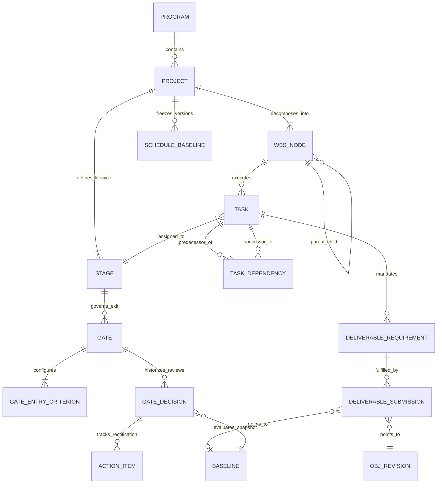
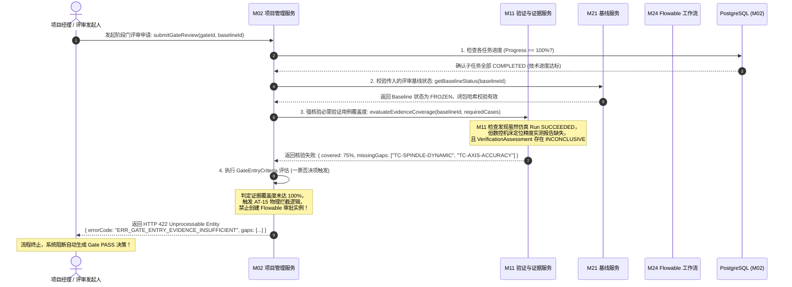

# CCDDesigner 2.0 模块开发详细规格说明书

## M02: 项目、任务与阶段门 (Project, Task and Gate Management)

| 文档属性     | 内容                       |
| ------------ | -------------------------- |
| **模块编号** | `M02` (Phase: P1, Type: N) |

 |
| **文档编号** | `CCD-DEV-SPEC-2.0-M02`<br> |
| **版本 / 状态** | V1.0 / 评审发布稿

 |
| **主责模块** | M02 项目、任务与阶段门

 |
| **协同模块** | M01 (统一工作台)、M11 (验证与证据)、M20 (工程对象与生命周期)、M21 (基线服务)、M24 (工作流与审批)

 |
| **上位依据** | 《CCDDesigner 2.0 产品开发说明书》(`CCD-DEV-SPEC-2.0-001`) §4.1, §9.1

<br>

<br>《CCDDesigner 2.0 产品功能架构与模块设计说明书》(`CCD-ARCH-FUNC-2.0-001`) §10, §40.4

 |
| **适用受众** | 研发项目经理、系统架构师、后端核心开发、质量评审团队

 |

---

### 1. 模块定位与核心设计原则

依据上位规范要求，M02 承担数控机床及复杂装备研发过程中计划编排、执行落地与工程成熟度控制的法定管理职责：

1. **三态彻底独立原则**：
* **任务进度状态（Task Progress）**：衡量具体技术活动的工时消耗与完成百分比（$0\% \sim 100\%$）。


* **交付物审批状态（Deliverable Approval State）**：反映提交成果物本身的工程有效性（`DRAFT`、`IN_REVIEW`、`RELEASED` 等）。


* **阶段门决策状态（Gate Decision State）**：衡量工程体系在该研发阶段的综合工程成熟度（`PASS`、`CONDITIONAL_PASS`、`REWORK`、`STOP`）。


* *核心铁律*：任务 100% 完成绝不自动等价于交付物达标，更绝不自动触发阶段门放行。


2. **计划结构与阶段正交原则**：
* 项目群（Program）仅作为跨项目的业务组合容器，用于跨机型资源协调与里程碑对齐，**严禁设立阶段门（Gate）**。


* 项目（Project）同时下辖阶段集合（Stages）与工作分解结构（WBS）。WBS 表达技术工作的分级拆解树，允许跨阶段编排；任务（Task）通过外键显式指派其归属的 Stage，严禁强行将 WBS 压平为 Stage 的同构子树。


3. **交付要求与提交实体分离**：
* 任务定义“交付要求（DeliverableRequirement）”，指定成果物类型、密级及最低成熟度门槛；


* 工程师提交“提交记录（DeliverableSubmission）”，挂接具体版本的工程对象修订版（`ObjectRevision`）或工程基线（`Baseline`），系统完整保留多版本替代提交历史。


4. **硬性准入拦截与防假闭环（AT-15 守护）**：
* 阶段门准入检查引擎必须自动化核验对应 Stage 下所有关联任务的交付物完备性、M21 阶段基线锁定状态以及 M11 的验证证据覆盖率。


* 核心验证证据不足或存在未闭环缺陷时，后端拦截切面一票否决生成 `PASS` 决策，杜绝依靠任务进度“假达标”蒙混过关。


---

### 2. 领域对象模型与 ER 逻辑关系

#### 2.1 实体关系图 (Mermaid ERD)



#### 2.2 核心主责实体语义说明

| 实体名称 (`Entity`) | 对应数据表 | 业务定义与核心作用 | 唯一性约束与生命周期

 |
| --- | --- | --- | --- |
| **Program** | `plm_project.program` | 项目群容器，聚合机床产品族或重大研制工程

 | `tenant_id + program_code` 唯一；无 Gate

 |
| **Project** | `plm_project.project` | 单一机型研制实体工程（平台/CTO/ETO）

 | `tenant_id + project_code` 唯一；承载基线与 WBS

 |
| **Stage** | `plm_project.stage` | 研发所处的物理业务阶段（如方案、详细设计、验证）

 | `project_id + stage_code` 唯一；内嵌排序序号

 |
| **WBSNode** | `plm_project.wbs_node` | 工作分解树节点，支持多级层级结构展开

 | `project_id + wbs_code` 唯一；父子树层级遍历

 |
| **Task** | `plm_project.task` | 具体执行活动，分配责任人、工期与指派 Stage

 | `wbs_node_id + task_code` 唯一；有独立执行状态

 |
| **TaskDependency** | `plm_project.task_dep` | 任务前后置强依赖编排（FS, SS, FF, SF）

 | 复合主键，禁止闭环依赖（DAG 检测）

 |
| **DeliverableRequirement** | `plm_project.deliv_req` | 任务必须提交的成果物规约（类型、描述、必选性）

 | `task_id + requirement_code` 唯一

 |
| **DeliverableSubmission** | `plm_project.deliv_sub` | 交付成果提交历史记录，关联具体版本与证据

 | `submission_id` 自增，记录提交人、版本与有效性

 |
| **Gate** | `plm_project.gate` | 阶段出口成熟度评审门卡（Stage Gate）

 | `stage_id + gate_code` 唯一；Program 严禁设立

 |
| **GateEntryCriterion** | `plm_project.gate_crit` | 阶段门自动化准入检查规则项（指标阈值、证据规则）

 | `gate_id + criterion_code` 唯一

 |
| **GateDecision** | `plm_project.gate_decision` | 评审委员会做出的不可变决策快照及签署凭证

 | 历史记录不可篡改；关联 M24 签署与 M21 基线

 |
| **ActionItem** | `plm_project.action_item` | 阶段门评审遗留问题整改跟踪单（带限期闭环机制）

 | 关联 GateDecision，未闭环阻断后续基线冻结

 |
| **ScheduleBaseline** | `plm_project.sched_base` | 计划基线快照，冻结工期、里程碑与依赖关系

 | `project_id + baseline_version` 唯一不可变

 |

---

### 3. 功能特性详细技术规格 (M02-F01 ~ M02-F05)

#### M02-F01：Program、Project 建档与研发模板体系 (Platform / CTO / ETO)

1. **项目群管理规范**：
* 仅用于产品族级研发协调，负责卷计（Roll-up）下属各子项目的进度指标与工时健康度。


* 物理级严禁为其绑定 `Gate` 实体；若调用 `CreateGateAPI` 指向 Program，系统直接拦截并返回 `422 Unprocessable Entity`（业务错误码：`ERR_PROGRAM_GATE_PROHIBITED`）。


2. **三类工程模板定义**：
* **平台研发模板（Platform Template）**：适用于全新产品族及共性架构平台开发，内设 TR1（需求与概念）、TR2（系统架构与仿真）、TR3（详细工程）、TR4（平台冻结）四道重载阶段门，强制要求 M06 系统模型发布和 M14 规则集交付。


* **按订单配置模板（CTO Template）**：面向成熟机床模块化衍生，轻量化编排 WBS，仅设 CR1（合同技术对账）与 CR2（制造下发就绪）两道阶段门，核心审查 M14 求解结果与 As-Planned 基线。


* **按订单设计模板（ETO Template）**：面向非标高定制机床，支持从母机项目（Parent Project）克隆计划骨架；必须建立定制模块差异设计与专用工况分析（M15+M17）子任务，设立 CDR（关键设计评审）与 FAT（出厂验收）阶段门。


3. **模板实例化引擎**：
* 实例化时执行深复制（Deep Copy）：克隆 Stage、WBS 树、预设任务、前后置依赖关系及交付物规则，重置所有计划时间为当前项目日历工作日。


#### M02-F02：WBS 分解与任务依赖 DAG 编排引擎

1. **层级分解约束**：
* WBS 支持树状无限级拆解（建议工程实践深度 $\le 6$ 层），叶子节点挂载 Task。


* 任务属性包括：责任人（Assignee）、计划开始时间、计划完成时间、工期（Working Days）、权重（Weight, 用于父节点加权百分比计算）。


2. **四类依赖关系编排**：
* `FS` (Finish-to-Start)：前置完成，后置方可开始；
* `SS` (Start-to-Start)：前置开始，后置方可开始；
* `FF` (Finish-to-Finish)：前置完成，后置方可完成；
* `SF` (Start-to-Finish)：前置开始，后置方可完成；
* 支持附加超前/滞后量（Lag Days, 允许正负整数）。


3. **DAG 有向无环图循环检测算法**：
* 每次建立或更新依赖关系时，系统在内存中加载该项目全量任务拓扑并执行基于深度优先搜索（DFS）与三色标记法的闭环探测：


* `WHITE`（未访问）、`GRAY`（当前递归栈中）、`BLACK`（已访问完成）。


* 若在遍历中探查到指向 `GRAY` 节点的边，立即抛出 `CyclicTaskDependencyException`，打印成环调用链路（如 `T01 -> T03 -> T05 -> T01`），完全阻断事务提交。


4. **关键路径（CPM）与浮动工时动态计算**：
* 系统通过前向计算（最早开始/完成时间 ES/EF）与后向计算（最晚开始/完成时间 LS/LF），推导总时差（Total Float, $TF = LS - ES$）与自由时差（Free Float）。


* 判定 $TF = 0$ 的任务链路为**关键路径（Critical Path）**，在甘特图与工作台进行高亮标记，作为延期风险预警的第一输入。


#### M02-F03：任务交付物绑定（DeliverableRequirement）与多版本提交追踪

1. **规约定义与强绑定**：
* `DeliverableRequirement` 支持的交付物类型包括：`SYSML_MODEL`（系统模型）、`REQUIREMENT_BASELINE`（需求基线）、`EBOM_STRUCTURE`（设计BOM）、`SIMULATION_REPORT`（仿真报告）、`VERIFICATION_ASSESSMENT`（验证判定）、`CAD_DRAWING`（工程图纸）。


* 声明 `is_mandatory`（必选性）与 `target_security_level`（密级要求）。


2. **多版本提交历史留存**：
* 任务责任人通过 `DeliverableSubmission` 提交成果时，仅允许挂接已经产生受控标识（Snowflake ID）的工程修订版或基线快照；


* 提交动作记录：提交人 ID、提交时间、关联修订对象 ID（`revision_id`）、附件制品摘要（`artifact_hash`）及说明备注。


* 当设计发生变更重新提交时，历史提交记录自动转为 `SUPERSEDED`（被替代）历史，**严禁物理删除**，形成不可篡改的交付演进时间轴。


#### M02-F04：阶段门评审准入检查、决策记录与行动项闭环（防假闭环拦截核心）

1. **自动化准入规则校验器（Entry Criteria Engine）**：
* 阶段门发起评审前，评审委员会秘书触发准入检查，系统顺序求值预设的核验规则：


$$\text{GateReady} = \bigwedge_{i} \text{Criterion}_i(\text{ProjectState}, \text{Deliverables}, \text{Evidence})$$


* **规则一：交付物 100% 齐套校验**：该 Stage 下所有标记为 `is_mandatory = TRUE` 的交付物要求必须存在状态为 `RELEASED` 或 `FROZEN` 的有效提交记录。


* **规则二：前置阶段门终态校验**：前一序位 Stage 的阶段门决策必须为 `PASS` 或已批准闭环的 `CONDITIONAL_PASS`。


* **规则三：核心验证证据覆盖度强核验（AT-15 守护）**：通过 RPC 调用 M11 接口，核算当前 Stage 规划的必验指标（如数控机床定位精度、主轴温升、动刚度等）：


$$\text{EvidencePassRate} = \frac{\sum \text{Assessment}(\text{conclusion} == \text{'PASS'} \land \text{applicability} == \text{'APPLICABLE'})}{\sum \text{RequiredVerificationCases}}$$


若该比率 $< 100\%$，系统直接返回准入未达标，列出缺失证据缺口清单（Gap List），**阻断进入评审审批流**。


2. **阶段门评审四类决策语义**：
* **`PASS`（通过）**：所有准入条件与现场评审指标 100% 满足，允许下一阶段任务正式解锁开始。


* **`CONDITIONAL_PASS`（有条件通过）**：存在非致命缺陷或次要证据缺口，必须由评审委员会共同签署明确的**允许受控推进范围（Allowed Scope）**、**阻塞事项清单（Blocking Issues）**，并强制派发至少一项带截止日期的 `ActionItem`。


* **`REWORK`（返工）**：关键交付物不达标或核心证据失败，驳回当前阶段，锁定后续任务，生成返工工作包（Rework Task）。


* **`STOP`（终止）**：项目技术指标严重失真或商业价值丧失，冻结项目所有写权限，项目状态置为 `TERMINATED`。


3. **行动项（ActionItem）全周期跟踪**：
* 每个行动项包含：责任人、整改要求、计划完成日期、验收人、闭环状态（`OPEN`、`RESOLVED`、`CLOSED`）。


* 凡处于 `CONDITIONAL_PASS` 状态的阶段门，其所属项目在进入下一个阶段的基线冻结（M21）或下一道阶段门评审时，系统自动核查该阶段门所有 ActionItem 是否全部为 `CLOSED`；若仍有 `OPEN` 项，一票否决后续流转。


#### M02-F05：计划版本基线重置、进度重算与逾期预警机制

1. **计划基线版本化冻结**：
* 类似工程基线，项目计划通过 `ScheduleBaseline` 进行快照固化（如 `BL-V1.0`，包含发布时的全部 Task 计划日期、CPM 关键路径和里程碑）。


* 正式立项或重大工程变更（ECO）批准后，系统经 M24 审批授权生成新的计划基线，永久保留历史计划版本用于偏差比对与对账分析。


2. **三级风险预警规则**：
* **黄灯预警（Warning）**：任务距计划截止时间剩余 $\le 3$ 个工作日，且当前进度 $< 80\%$；或关键路径任务出现非阻塞性延误（$\le 2$ 天）。


* **橙灯预警（Critical Delay）**：任务已超过计划完成时间但未完成，或非关键路径延误已耗尽自由时差（Free Float）。


* **红灯熔断预警（Gate Blocking Risk）**：Stage 计划截止日期临近，但关键交付物仍处于缺失或验证证据 `INCONCLUSIVE` 状态，系统向项目总师及项目经理工作台强推风险卡片（M01-F04）。


---

### 4. 物理数据字典与 PostgreSQL DDL 规范

以下为落入 `plm_project` 独立业务 Schema 的完整物理 DDL 规范，内建防穿透外键、乐观并发锁与审计字段。

```sql
-- =============================================================================
-- CCDDesigner 2.0 模块数据定义: M02 项目、任务与阶段门
-- 适用环境: PostgreSQL 15+
-- =============================================================================

CREATE SCHEMA IF NOT EXISTS plm_project;

-- 阶段门决策枚举 (Section 10 & 40.4)
CREATE TYPE plm_project.gate_decision_type AS ENUM (
    'PASS',              -- 审查完全通过
    'CONDITIONAL_PASS', -- 有条件通过 (强制带行动项)
    'REWORK',            -- 返工重做
    'STOP'               -- 项目终止/熔断
);

-- 任务执行状态枚举
CREATE TYPE plm_project.task_status AS ENUM (
    'NOT_STARTED',       -- 未启动
    'IN_PROGRESS',       -- 进行中
    'SUBMITTED',         -- 成果已提交 (待核验)
    'COMPLETED',         -- 任务已完成 (技术口径)
    'BLOCKED',           -- 遇阻挂起
    'CANCELLED'          -- 已取消
);

-- 任务依赖类型枚举
CREATE TYPE plm_project.dependency_type AS ENUM (
    'FS', -- Finish-to-Start
    'SS', -- Start-to-Start
    'FF', -- Finish-to-Finish
    'SF'  -- Start-to-Finish
);

-- 1. 项目群主表 (Program)
CREATE TABLE plm_project.program (
    program_id          BIGINT PRIMARY KEY,
    tenant_id           VARCHAR(64) NOT NULL,
    program_code        VARCHAR(64) NOT NULL,
    name                VARCHAR(255) NOT NULL,
    description         TEXT,
    manager_id          VARCHAR(64) NOT NULL,
    status              VARCHAR(32) NOT NULL DEFAULT 'ACTIVE',
    created_by          VARCHAR(64) NOT NULL,
    created_at          TIMESTAMPTZ NOT NULL DEFAULT CURRENT_TIMESTAMP,
    updated_at          TIMESTAMPTZ NOT NULL DEFAULT CURRENT_TIMESTAMP,
    CONSTRAINT uq_program_code UNIQUE (tenant_id, program_code)
);
COMMENT ON TABLE plm_project.program IS 'M02: 项目群主表，跨机型研发组合容器，严禁挂接阶段门 Gate';

-- 2. 项目主表 (Project)
CREATE TABLE plm_project.project (
    project_id          BIGINT PRIMARY KEY,
    program_id          BIGINT NULL REFERENCES plm_project.program(program_id),
    tenant_id           VARCHAR(64) NOT NULL,
    project_code        VARCHAR(64) NOT NULL,
    name                VARCHAR(255) NOT NULL,
    project_type        VARCHAR(32) NOT NULL CHECK (project_type IN ('PLATFORM', 'CTO', 'ETO', 'PRE_RESEARCH')),
    manager_id          VARCHAR(64) NOT NULL,
    chief_engineer_id   VARCHAR(64) NOT NULL,
    current_stage_id    BIGINT NULL,
    status              VARCHAR(32) NOT NULL DEFAULT 'PLANNING', -- PLANNING, ACTIVE, SUSPENDED, COMPLETED, TERMINATED
    working_version     BIGINT NOT NULL DEFAULT 1,
    created_by          VARCHAR(64) NOT NULL,
    created_at          TIMESTAMPTZ NOT NULL DEFAULT CURRENT_TIMESTAMP,
    updated_at          TIMESTAMPTZ NOT NULL DEFAULT CURRENT_TIMESTAMP,
    CONSTRAINT uq_project_code UNIQUE (tenant_id, project_code)
);
CREATE INDEX idx_project_tenant ON plm_project.project(tenant_id, status);

-- 3. 研发阶段定义表 (Stage)
CREATE TABLE plm_project.stage (
    stage_id            BIGINT PRIMARY KEY,
    project_id          BIGINT NOT NULL REFERENCES plm_project.project(project_id) ON DELETE CASCADE,
    stage_code          VARCHAR(64) NOT NULL,
    name                VARCHAR(128) NOT NULL,
    sequence_no         INT NOT NULL,
    status              VARCHAR(32) NOT NULL DEFAULT 'PENDING', -- PENDING, IN_PROGRESS, IN_GATE_REVIEW, CLOSED
    planned_start_date  DATE NOT NULL,
    planned_end_date    DATE NOT NULL,
    actual_start_date   DATE NULL,
    actual_end_date     DATE NULL,
    created_at          TIMESTAMPTZ NOT NULL DEFAULT CURRENT_TIMESTAMP,
    CONSTRAINT uq_stage_code UNIQUE (project_id, stage_code),
    CONSTRAINT chk_stage_dates CHECK (planned_end_date >= planned_start_date)
);
CREATE INDEX idx_stage_project_seq ON plm_project.stage(project_id, sequence_no);

-- 4. 阶段门定义表 (Gate)
CREATE TABLE plm_project.gate (
    gate_id             BIGINT PRIMARY KEY,
    stage_id            BIGINT NOT NULL REFERENCES plm_project.stage(stage_id) ON DELETE CASCADE,
    gate_code           VARCHAR(64) NOT NULL,
    name                VARCHAR(128) NOT NULL,
    description         TEXT,
    review_workflow_def VARCHAR(128) NOT NULL, -- 绑定的 Flowable BPMN Key
    status              VARCHAR(32) NOT NULL DEFAULT 'INIT', -- INIT, READY, IN_REVIEW, DECIDED
    created_at          TIMESTAMPTZ NOT NULL DEFAULT CURRENT_TIMESTAMP,
    CONSTRAINT uq_gate_code UNIQUE (stage_id, gate_code)
);

-- 5. 阶段门准入核验规则表 (GateEntryCriterion)
CREATE TABLE plm_project.gate_entry_criterion (
    criterion_id        BIGINT PRIMARY KEY,
    gate_id             BIGINT NOT NULL REFERENCES plm_project.gate(gate_id) ON DELETE CASCADE,
    criterion_code      VARCHAR(64) NOT NULL,
    name                VARCHAR(255) NOT NULL,
    rule_type           VARCHAR(64) NOT NULL, -- DELIVERABLE_CHECK, EVIDENCE_COVERAGE, BASELINE_LOCKED
    threshold_value     NUMERIC(12,4) NULL,   -- 如证据覆盖率 100.00
    is_blocking         BOOLEAN NOT NULL DEFAULT TRUE, -- 是否为一票否决项
    created_at          TIMESTAMPTZ NOT NULL DEFAULT CURRENT_TIMESTAMP,
    CONSTRAINT uq_gate_crit_code UNIQUE (gate_id, criterion_code)
);

-- 6. 阶段门决策记录表 (GateDecision - 不可变凭证)
CREATE TABLE plm_project.gate_decision (
    decision_id         BIGINT PRIMARY KEY,
    gate_id             BIGINT NOT NULL REFERENCES plm_project.gate(gate_id),
    decision_type       plm_project.gate_decision_type NOT NULL,
    decision_notes      TEXT NOT NULL,
    evaluated_baseline_id BIGINT NOT NULL REFERENCES plm_govern.baseline(baseline_id),
    approval_ticket_id  BIGINT NOT NULL,      -- M24 Flowable 审批实例 ID
    allowed_scope       TEXT NULL,            -- CONDITIONAL_PASS 时明确允许放行的范围
    decision_maker_id   VARCHAR(64) NOT NULL, -- 委员会代表工号
    decided_at          TIMESTAMPTZ NOT NULL DEFAULT CURRENT_TIMESTAMP,
    CONSTRAINT chk_scope_for_conditional CHECK (
        (decision_type = 'CONDITIONAL_PASS' AND allowed_scope IS NOT NULL) OR
        (decision_type != 'CONDITIONAL_PASS')
    )
);
COMMENT ON TABLE plm_project.gate_decision IS 'M02: 阶段门决策凭证，已发布不可修改，历史记录永久保留';
CREATE INDEX idx_gate_decision_gate ON plm_project.gate_decision(gate_id, decided_at DESC);

-- 7. 阶段门遗留行动项表 (ActionItem)
CREATE TABLE plm_project.action_item (
    action_item_id      BIGINT PRIMARY KEY,
    decision_id         BIGINT NOT NULL REFERENCES plm_project.gate_decision(decision_id),
    title               VARCHAR(255) NOT NULL,
    description         TEXT NOT NULL,
    owner_id            VARCHAR(64) NOT NULL,
    approver_id         VARCHAR(64) NOT NULL,
    due_date            DATE NOT NULL,
    status              VARCHAR(32) NOT NULL DEFAULT 'OPEN', -- OPEN, RESOLVED, CLOSED, OVERDUE
    resolution_summary  TEXT NULL,
    closed_at           TIMESTAMPTZ NULL,
    created_at          TIMESTAMPTZ NOT NULL DEFAULT CURRENT_TIMESTAMP
);
CREATE INDEX idx_action_item_owner ON plm_project.action_item(owner_id, status);

-- 8. WBS 树形分解节点表 (WBSNode)
CREATE TABLE plm_project.wbs_node (
    wbs_node_id         BIGINT PRIMARY KEY,
    project_id          BIGINT NOT NULL REFERENCES plm_project.project(project_id) ON DELETE CASCADE,
    parent_node_id      BIGINT NULL REFERENCES plm_project.wbs_node(wbs_node_id),
    wbs_code            VARCHAR(64) NOT NULL,
    name                VARCHAR(128) NOT NULL,
    node_level          INT NOT NULL DEFAULT 1,
    weight              NUMERIC(5,2) NOT NULL DEFAULT 1.00,
    created_at          TIMESTAMPTZ NOT NULL DEFAULT CURRENT_TIMESTAMP,
    CONSTRAINT uq_wbs_code UNIQUE (project_id, wbs_code)
);
CREATE INDEX idx_wbs_hierarchy ON plm_project.wbs_node(project_id, parent_node_id);

-- 9. 任务执行表 (Task)
CREATE TABLE plm_project.task (
    task_id             BIGINT PRIMARY KEY,
    wbs_node_id         BIGINT NOT NULL REFERENCES plm_project.wbs_node(wbs_node_id) ON DELETE CASCADE,
    stage_id            BIGINT NOT NULL REFERENCES plm_project.stage(stage_id), -- 正交指派 Stage
    task_code           VARCHAR(64) NOT NULL,
    name                VARCHAR(255) NOT NULL,
    assignee_id         VARCHAR(64) NOT NULL,
    planned_start_date  DATE NOT NULL,
    planned_end_date    DATE NOT NULL,
    actual_start_date   DATE NULL,
    actual_end_date     DATE NULL,
    duration_days       INT NOT NULL DEFAULT 1,
    progress_percent    INT NOT NULL DEFAULT 0 CHECK (progress_percent BETWEEN 0 AND 100),
    status              plm_project.task_status NOT NULL DEFAULT 'NOT_STARTED',
    working_version     BIGINT NOT NULL DEFAULT 1,
    created_at          TIMESTAMPTZ NOT NULL DEFAULT CURRENT_TIMESTAMP,
    updated_at          TIMESTAMPTZ NOT NULL DEFAULT CURRENT_TIMESTAMP,
    CONSTRAINT uq_task_code UNIQUE (wbs_node_id, task_code),
    CONSTRAINT chk_task_dates CHECK (planned_end_date >= planned_start_date)
);
CREATE INDEX idx_task_stage ON plm_project.task(stage_id, status);
CREATE INDEX idx_task_assignee ON plm_project.task(assignee_id, status);

-- 10. 任务前后置依赖表 (TaskDependency - DAG 物理存储)
CREATE TABLE plm_project.task_dependency (
    predecessor_task_id BIGINT NOT NULL REFERENCES plm_project.task(task_id) ON DELETE RESTRICT,
    successor_task_id   BIGINT NOT NULL REFERENCES plm_project.task(task_id) ON DELETE RESTRICT,
    dep_type            plm_project.dependency_type NOT NULL DEFAULT 'FS',
    lag_days            INT NOT NULL DEFAULT 0,
    PRIMARY KEY (predecessor_task_id, successor_task_id),
    CONSTRAINT chk_no_self_dependency CHECK (predecessor_task_id != successor_task_id)
);

-- 11. 任务交付物规约要求表 (DeliverableRequirement)
CREATE TABLE plm_project.deliverable_requirement (
    deliv_req_id        BIGINT PRIMARY KEY,
    task_id             BIGINT NOT NULL REFERENCES plm_project.task(task_id) ON DELETE CASCADE,
    requirement_code    VARCHAR(64) NOT NULL,
    name                VARCHAR(255) NOT NULL,
    deliverable_type    VARCHAR(64) NOT NULL, -- SYSML_MODEL, REQ_BASELINE, EBOM_STRUCT, SIM_REPORT 等
    is_mandatory        BOOLEAN NOT NULL DEFAULT TRUE,
    target_security_level VARCHAR(32) NOT NULL DEFAULT 'INTERNAL',
    created_at          TIMESTAMPTZ NOT NULL DEFAULT CURRENT_TIMESTAMP,
    CONSTRAINT uq_deliv_req UNIQUE (task_id, requirement_code)
);

-- 12. 任务交付物提交记录表 (DeliverableSubmission)
CREATE TABLE plm_project.deliverable_submission (
    submission_id       BIGINT PRIMARY KEY,
    deliv_req_id        BIGINT NOT NULL REFERENCES plm_project.deliverable_requirement(deliv_req_id),
    revision_id         BIGINT NOT NULL REFERENCES plm_govern.obj_revision(revision_id), -- 挂接核心工程对象
    baseline_id         BIGINT NULL REFERENCES plm_govern.baseline(baseline_id),       -- 或直接挂接基线
    artifact_hash       VARCHAR(64) NOT NULL,
    submission_notes    TEXT,
    is_latest           BOOLEAN NOT NULL DEFAULT TRUE,
    submitted_by        VARCHAR(64) NOT NULL,
    submitted_at        TIMESTAMPTZ NOT NULL DEFAULT CURRENT_TIMESTAMP
);
CREATE INDEX idx_deliv_sub_req ON plm_project.deliverable_submission(deliv_req_id, is_latest);

-- 13. 计划进度基线表 (ScheduleBaseline)
CREATE TABLE plm_project.schedule_baseline (
    sched_baseline_id   BIGINT PRIMARY KEY,
    project_id          BIGINT NOT NULL REFERENCES plm_project.project(project_id),
    baseline_version    VARCHAR(32) NOT NULL, -- 如 "BL-V1.0"
    frozen_snapshot     JSONB NOT NULL,       -- 任务、依赖与关键路径拓扑快照
    snapshot_hash       CHAR(64) NOT NULL,
    frozen_by           VARCHAR(64) NOT NULL,
    frozen_at           TIMESTAMPTZ NOT NULL DEFAULT CURRENT_TIMESTAMP,
    CONSTRAINT uq_sched_baseline UNIQUE (project_id, baseline_version)
);

```

---

### 5. 核心数据库约束与业务拦截触发器

#### 5.1 Program 严禁设立 Gate 拦截触发器

为落实“Program 不设 Gate”的架构刚性约束，在数据库内核植入防御触发器：

```sql
CREATE OR REPLACE FUNCTION plm_project.fn_prevent_program_gate()
RETURNS TRIGGER AS $$
DECLARE
    v_project_type VARCHAR(32);
BEGIN
    -- 依据 stage_id 穿透追溯所属项目的类型
    SELECT p.project_type INTO v_project_type
    FROM plm_project.stage s
    JOIN plm_project.project p ON s.project_id = p.project_id
    WHERE s.stage_id = NEW.stage_id;

    -- 再次校验该 Stage 绝不归属于 Program (防伪造架构渗透)
    IF EXISTS (
        SELECT 1 FROM plm_project.stage s
        JOIN plm_project.program pr ON s.project_id = pr.program_id
        WHERE s.stage_id = NEW.stage_id
    ) THEN
        RAISE EXCEPTION 'Architecture Rule Violation: Programs are prohibited from possessing Stage Gates. Only Projects can define Gate entities.'
            USING ERRCODE = '23000';
    END IF;

    RETURN NEW;
END;
$$ LANGUAGE plpgsql;

CREATE TRIGGER trg_prevent_program_gate
BEFORE INSERT OR UPDATE ON plm_project.gate
FOR EACH ROW
EXECUTE FUNCTION plm_project.fn_prevent_program_gate();

```

#### 5.2 阶段门决策与未闭环 ActionItem 强校验触发器

若当前 Stage 存在未关闭的行动项，严禁该 Gate 发布 `PASS` 决策：

```sql
CREATE OR REPLACE FUNCTION plm_project.fn_check_gate_decision_integrity()
RETURNS TRIGGER AS $$
DECLARE
    v_open_actions_count INT;
BEGIN
    -- 若尝试签署 PASS 决策
    IF NEW.decision_type = 'PASS' THEN
        -- 检查该 Gate 历史决策产生的所有 ActionItem 是否已完全处于 CLOSED 状态
        SELECT COUNT(1) INTO v_open_actions_count
        FROM plm_project.action_item ai
        JOIN plm_project.gate_decision gd ON ai.decision_id = gd.decision_id
        WHERE gd.gate_id = NEW.gate_id
          AND ai.status != 'CLOSED';

        IF v_open_actions_count > 0 THEN
            RAISE EXCEPTION 'Gate Decision Blocked: Cannot issue PASS decision on Gate [%]. There are [%] open Action Items that must be verified and CLOSED first.',
                NEW.gate_id, v_open_actions_count
                USING ERRCODE = '23000';
        END IF;
    END IF;

    RETURN NEW;
END;
$$ LANGUAGE plpgsql;

CREATE TRIGGER trg_gate_decision_integrity
BEFORE INSERT ON plm_project.gate_decision
FOR EACH ROW
EXECUTE FUNCTION plm_project.fn_check_gate_decision_integrity();

```

---

### 6. 核心业务流程与跨模块协同序列 (AT-15 闭环实现)

#### 6.1 AT-15 场景：任务 100% 完成但证据不足时的准入拦截流程

针对核心验收用例 `AT-15`（WBS 计划的所有子任务均标记完成，但 Gate 要求的证据覆盖不足），模块协同与拦截时序如下：



---

### 7. OpenAPI 3.0 接口契约定义

#### 7.1 发起阶段门评审准入检查

* **HTTP 请求**：`POST /api/v1/gates/{gateId}/pre-check`

* **操作描述**：在发起正式会签前，自动化调用 M11/M21 执行准入求值。


* **请求载荷 (Request Body)**：

```json
{
  "gateId": 809221004123512,
  "evaluatedBaselineId": 718290114920192,
  "overrideTolerances": false
}

```

* **响应报文 (Response 200 OK - 发现缺口拦截)**：

```json
{
  "gateId": 809221004123512,
  "overallPassed": false,
  "blockerCount": 1,
  "evaluatedAt": "2026-09-15T14:30:00Z",
  "criterionResults": [
    {
      "criterionCode": "CRIT-MANDATORY-DELIVERABLES",
      "name": "必选交付物 100% 齐套校验",
      "passed": true,
      "actualValue": "100.00%",
      "message": "All 8 mandatory deliverables are released and validated."
    },
    {
      "criterionCode": "CRIT-EVIDENCE-COVERAGE",
      "name": "关键验证指标证据覆盖率 (AT-15)",
      "passed": false,
      "actualValue": "75.00%",
      "message": "Required 100.00% coverage, but only 75.00% achieved. 2 critical verification cases missing approved PASS evidence.",
      "missingEvidenceGaps": [
        {
          "reqRevisionId": 601290123001,
          "reqCode": "REQ-VMC1000-ACCURACY-001",
          "caseCode": "TC-AXIS-ACCURACY",
          "currentStatus": "INCONCLUSIVE",
          "reason": "Machine tool actual cutting test report is not attached."
        }
      ]
    }
  ]
}

```

#### 7.2 签署阶段门评审决策

* **HTTP 请求**：`POST /api/v1/gates/{gateId}/decisions`

* **请求头**：`Idempotency-Key: 7b83f0-410a-4281-9b51-decision`

* **请求载荷 (Request Body)**：

```json
{
  "decisionType": "CONDITIONAL_PASS",
  "decisionNotes": "系统仿真参数吻合，但现场试切因刀具偏摆延迟，允许受控开展工装夹具设计，禁止直接下发正式加工工单。",
  "evaluatedBaselineId": 718290114920192,
  "approvalTicketId": 99201488102,
  "allowedScope": "仅允许长周期备料件采购与机加夹具设计，严禁下发铸件批量加工。",
  "actionItems": [
    {
      "title": "完成主轴试切精度报告复核",
      "description": "取得激光干涉仪现场实测数据并经验证工程师签署 PASS 评估",
      "ownerId": "ENG-2041",
      "approverId": "LEAD-1002",
      "dueDate": "2026-10-15"
    }
  ]
}

```

* **响应报文 (Response 201 Created)**：

```json
{
  "decisionId": 9012847192031,
  "gateId": 809221004123512,
  "decisionType": "CONDITIONAL_PASS",
  "status": "RECORDED",
  "actionItemIds": [550192841029],
  "recordedAt": "2026-09-15T14:45:12.189Z"
}

```

---

### 8. 领域事件与发件箱架构契约 (Outbox Schema)

M02 业务事务提交时，必须在同一本地事务中写入 `plm_infra.sys_outbox_event` 表，保证事件向 Kafka 投递的原子性与可靠性。

#### 事件一：`ProjectScheduleBaselineFrozenEvent`

* **触发时机**：项目计划基线重置并冻结。


* **Payload 契约**：

```json
{
  "eventId": 9182740192831,
  "eventType": "ProjectScheduleBaselineFrozen",
  "aggregateType": "Project",
  "aggregateId": "100293810293",
  "tenantId": "VMC_ENTERPRISE",
  "payload": {
    "projectId": 100293810293,
    "baselineVersion": "BL-V1.0",
    "snapshotHash": "e3b0c44298fc1c149afbf4c8996fb92427ae41e4649b934ca495991b7852b855",
    "totalTasks": 48,
    "criticalPathTaskIds": [101, 104, 109, 115],
    "plannedFinishDate": "2027-06-30",
    "frozenBy": "PM-1008"
  }
}

```

#### 事件二：`GateDecisionRecordedEvent`

* **触发时机**：阶段门决策签署生效。


* **Payload 契约**：

```json
{
  "eventId": 9182740192832,
  "eventType": "GateDecisionRecorded",
  "aggregateType": "Gate",
  "aggregateId": "809221004123512",
  "tenantId": "VMC_ENTERPRISE",
  "payload": {
    "gateId": 809221004123512,
    "stageId": 4019283102,
    "projectId": 100293810293,
    "decisionType": "CONDITIONAL_PASS",
    "hasActionItems": true,
    "openActionCount": 1,
    "evaluatedBaselineId": 718290114920192,
    "decidedBy": "LEAD-1002"
  }
}

```

---

### 9. 验收测试与对账矩阵

| 用例编号 | 对应上位验收 | 测试步骤简述 | 预期判定结果 (Pass Criteria) | 验证日志与断言依据

 |
| --- | --- | --- | --- | --- |
| **TC-M02-01** | §4.1 (M02) | 尝试对 `Program` 实体调用 `CreateGateAPI` 建立阶段门

 | 系统彻底拒绝创建，触发 `fn_prevent_program_gate` 异常抛出 | 拦截抛出 HTTP 422 / SQL Error 23000，确认 Program 无 Gate

 |
| **TC-M02-02** | M02-F02 | 在任务 A、B、C 间构造循环依赖（$A \rightarrow B \rightarrow C \rightarrow A$）

 | DAG 引擎探查出成环边，拒绝事务入库 | 抛出 `CyclicTaskDependencyException`，打印成环节点路径

 |
| **TC-M02-03** | **AT-15** | WBS 子任务进度全部置为 100%，但故意令某关键验证用例结论为 `INCONCLUSIVE`，提交阶段门评审申请

 | 准入引擎自动化拦截，禁止进入审批流，**绝不允许自动生成 PASS 决策**<br> | 接口返回 `overallPassed: false`，明确指出缺失的证据缺口

 |
| **TC-M02-04** | M02-F04 | 评审委员会选择 `CONDITIONAL_PASS`，但不填报 `allowedScope` 或未派发 ActionItem

 | 系统后端强校验拦截，拒绝持久化该决策 | 触发 `chk_scope_for_conditional` 数据库约束报错

 |
| **TC-M02-05** | M02-F04 | 阶段门下存在处于 `OPEN` 状态的 ActionItem，尝试录入下一阶段的 `PASS` 决策

 | 触发 `fn_check_gate_decision_integrity` 触发器，操作被硬性阻断 | 阻断并提示必须先验收闭环所有遗留行动项

 |
| **TC-M02-06** | M02-F05 | 变更实施后重置计划基线，核对旧基线工期快照与新计划工期 | 历史基线内容完全不变，新基线版本 `BL-V2.0` 正确生成 | 历史版本可完整回溯，CPM 关键路径差异被高亮呈现

 |