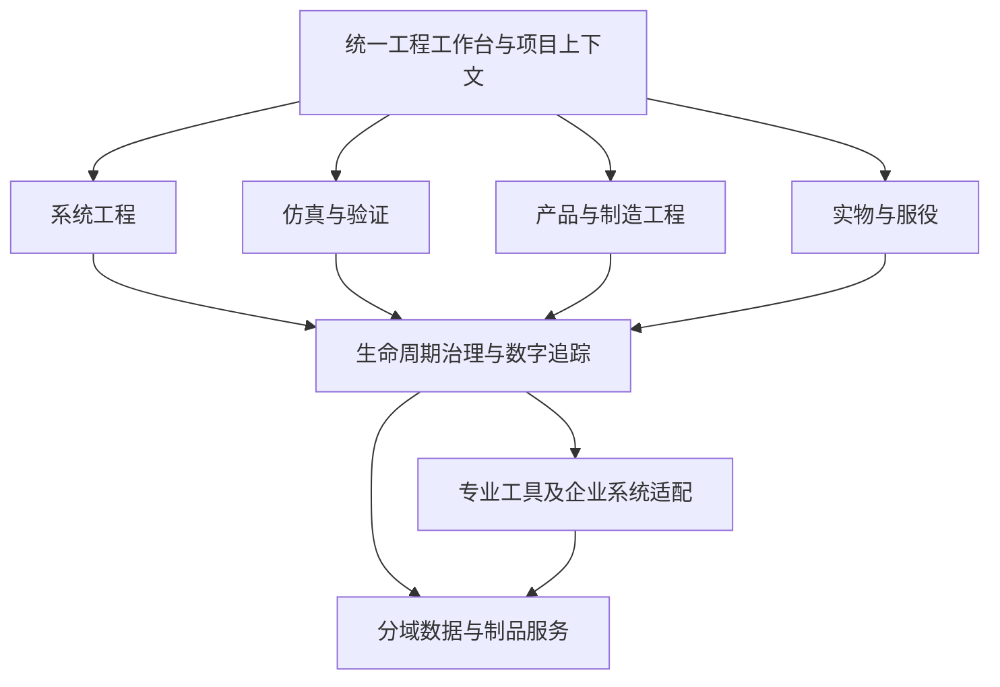
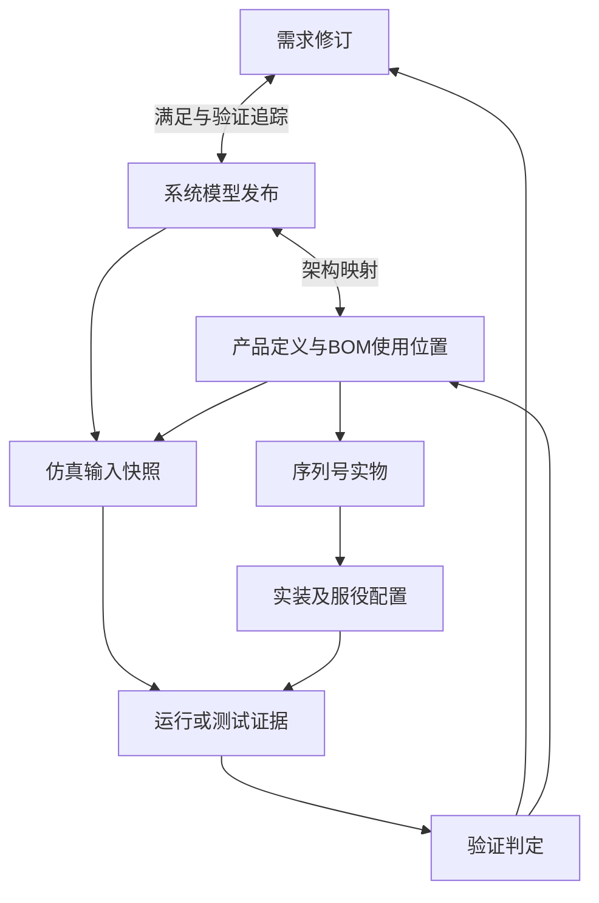
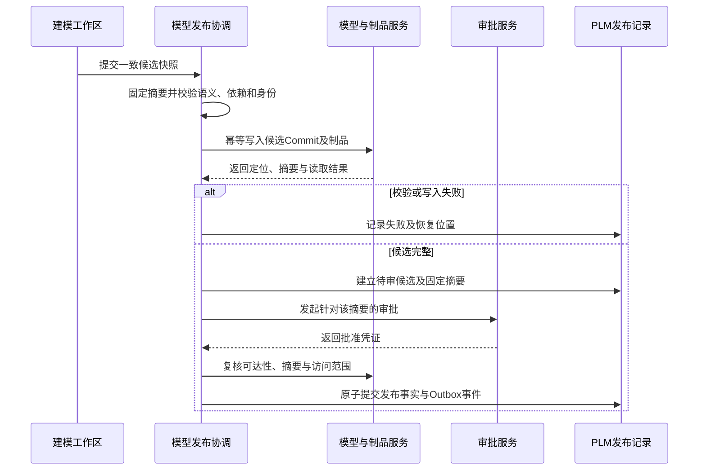
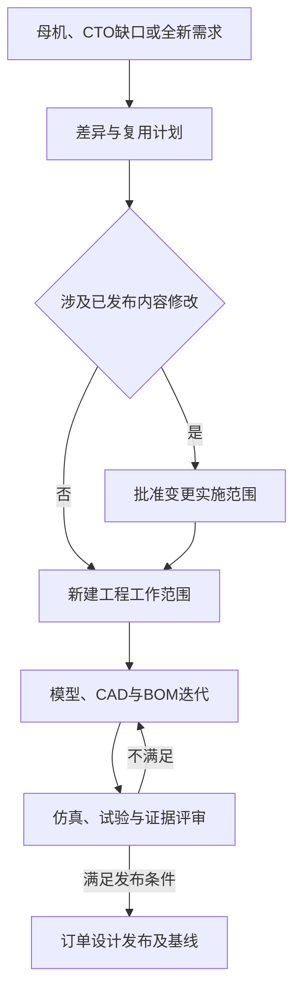

# CCDDesigner 2.0 产品功能架构与模块设计说明书

> 面向复杂数控装备的、基于SysML v2系统模型驱动的Model-Based PLM平台

| 文档属性 | 内容 |
|---|---|
| 文档编号 | CCD-ARCH-FUNC-2.0-001 |
| 文档版本 | V1.0 |
| 编制日期 | 2026年9月15日 |
| 上位依据 | 《CCDDesigner 2.0 产品说明书》修订版V1.1，CCD-PROD-2.0-001 |
| 文档状态 | 功能架构与模块设计评审稿 |
| 技术约束 | SysON＋OpenSysML＋Flexo＋OpenModelica；不采用Neo4j |
| 核心实现方向 | React＋TypeScript；Spring Boot模块化PLM核心；PostgreSQL；MinIO；Flexo及所需RDF存储 |
| 适用人员 | 产品、系统工程、架构、开发、测试、实施与业务评审人员 |

本文将产品定义分解为模块职责、核心对象、功能项、业务约束、协同契约及验收场景。文中“应”“必须”为拟建设要求，不代表已有实现。本稿可用于模块拆分及详细规格编制，不能替代数据库物理设计、OpenAPI、第三方兼容性验证和实施合同。示例机型、编号、参数及性能测试规模均为设计示例或建议值。

## 阅读导航

| 章节 | 阅读目的 |
|---|---|
| 1—8 | 理解范围、功能架构、模块边界、数据责任与用户入口 |
| 9—38 | 逐项评审30个模块的功能、对象和业务约束 |
| 39—43 | 评审跨模块流程、状态、接口与权限 |
| 44—47 | 明确质量要求、验收、分期和数控机床贯通案例 |
| 48及附录 | 核对集成依据、上位文档覆盖及后续规格交付 |

## 1. 设计目标与约束

本产品以系统模型和受控产品定义为两个工程核心，统一其生命周期治理。系统模型回答需求、功能、行为、架构、接口与验证之间的关系；产品定义组织零部件、结构、模块变体、图文档、软件和制造数据。

设计须达成以下结果：

1. 从任何已发布需求、模型元素、BOM使用位置或序列号设备，能追踪其准确版本、适用配置和相关证据。
2. 平台开发、CTO、ETO与全新研发均有独立可执行入口；成熟资产可以复用，历史证据适用性必须重新确认。
3. 专业工具承担建模与求解，CCDDesigner承担业务身份、权限、发布、配置、基线和变更管理。
4. 参数、仿真结果和测试记录保留角色与上下文，结果不能直接覆盖需求阈值或已发布设计值。
5. 已发布内容不可原位覆盖；跨系统发布必须完整、可重试、可恢复和可审计。
6. 制造与服役反馈能够回到问题、需求、设计和验证，且设计配置与实物配置分别受控。

本稿沿用V1.1的架构方向，不开展Teamcenter内部实现复刻，也不将其他PLM产品的术语直接当作本产品的数据表设计。

## 2. 能力责任与范围标记

| 标记 | 定义 | 本产品承担责任 |
|---|---|---|
| N：原生管理 | CCDDesigner创建和维护业务对象 | 业务规则、权限、生命周期、界面及接口 |
| I：专业集成 | 外部工具或系统执行专业能力 | 适配、上下文、输入输出、异常、证据和追踪 |
| E：增强规划 | 需后续独立立项与验证 | 定义扩展点与准入条件，不列入首期默认交付 |

同一模块可包含N和I功能。模块属于规划并不意味着其全部功能同一期交付。交付阶段为P0集成验证、P1系统设计闭环、P2产品工程、P3制造交付、P4服役增强。

当前范围不包括完整ERP、MES、CAD建模内核、通用CAE求解器研发或在线设备自动控制。平台保留与这些能力交互的受控接口。

## 3. 总体功能架构

五个专业业务域为系统工程、仿真验证、产品工程、制造工程、实物服役；生命周期治理是贯穿各域的第六业务域。统一工作台、管理配置与连接器为公共入口和支撑。这是对V1.1六域架构的展开。



图中箭头表示功能依赖，不表示研发执行顺序。系统架构、物理方案、CAD、CAE、EBOM通过迭代协同推进，阶段门审查其成熟度。

| 功能层 | 主要能力 | 边界 |
|---|---|---|
| 用户入口 | 工作台、项目、搜索、对象详情、专业工具入口 | 展示领域服务提供的数据 |
| 专业业务 | 需求、MBSE、仿真、产品配置、制造、实物履历 | 各模块拥有明确对象及规则 |
| 治理能力 | 身份、修订、状态、发布、基线、变更、工作流、追踪 | 服务全部业务域，不替代专业语义 |
| 集成能力 | SysON/OpenSysML/Flexo/OpenModelica、CAD/CAE、ERP/MES/IoT | 适配协议，执行可靠协调 |
| 数据能力 | 业务事务、模型仓库、制品、索引、外部时序 | 明确权威源和可重建副本 |

## 4. 一级模块目录

“主责对象”表示领域归属；通用元数据和状态设施由M20提供，不构成重复归属。

| 编号 | 模块 | 主责对象或能力 | 类型 | 首次建设 |
|---|---|---|---|---|
| M01 | 统一工作台与检索 | 收藏、访问历史、授权聚合视图 | N | P1 |
| M02 | 项目、任务与阶段门 | Program、Project、Stage、WBS、Task、Gate | N | P1 |
| M03 | 需求与技术规格 | Requirement、TechnicalSpecification | N | P1 |
| M04 | MBSE建模工作区 | WorkspaceBinding、模型视图与编辑上下文 | N＋I | P0/P1 |
| M05 | 系统接口与架构映射 | 接口契约及模型—产品分配映射 | N＋I | P1，P2扩展 |
| M06 | 模型发布与兼容性 | ModelRelease、CompatibilityProfile | N＋I | P0/P1 |
| M07 | 参数与参数集 | ParameterDefinition、ParameterSet | N | P1 |
| M08 | 模型映射与自动触发 | ModelMapping、TriggerPolicy | N＋I | P1 |
| M09 | 仿真模型库与分析用例 | SimulationModel、Study、Case | N＋I | P1 |
| M10 | 仿真调度与结果管理 | Job、Run、Result、复现包 | N＋I | P1 |
| M11 | 验证、确认与证据 | VerificationCase、Evidence、Assessment | N | P1 |
| M12 | 产品族与平台 | ProductFamily、PlatformRevision | N | P2 |
| M13 | 模块槽位与变体 | Slot、VariantRevision、AllowedVariant | N | P2 |
| M14 | 150%BOM与配置规则 | 可配置结构、RuleSet、ConfigurationResult | N | P2 |
| M15 | 订单产品定义与ETO | OrderProductDefinition、DerivationPlan | N | P2 |
| M16 | 零部件与EBOM | Part、PartRevision、BOMViewRevision | N | P1基础/P2完整 |
| M17 | CAD/CAE协同 | CAD绑定、结构比较、CAE准备包 | N＋I | P2 |
| M18 | 电气、软件与设备参数 | 软件发布包、电气制品、调试参数集关联 | N＋I | P2 |
| M19 | 图文档与文件制品 | Document、Dataset、Artifact | N | P1 |
| M20 | 工程对象与生命周期 | 身份、修订、类型、状态策略 | N | P1 |
| M21 | 基线与配置状态 | Baseline、BaselineMember、配置状态引用 | N | P1 |
| M22 | 工程变更与影响处置 | ChangeRequest、ChangeOrder、ImpactDecision | N | P1基础/P2完整 |
| M23 | 数字主线与关系服务 | 跨域链接、追踪查询、候选影响计算 | N | P1 |
| M24 | 工作流与审批 | 流程绑定、审批任务、决策凭证 | N＋I | P1 |
| M25 | 制造工程与工艺 | MBOM、ProcessPlan、Operation、资源分配 | N＋I | P3 |
| M26 | 工程下发与制造回传 | HandoffPackage、Receipt、Reconciliation | N＋I | P3 |
| M27 | 实物台账与交付 | MachineIndividual、装配事件、交付包 | N＋I | P3 |
| M28 | 服务、维修与服役配置 | ServiceCase、维修事件、服役配置 | N＋I | P4 |
| M29 | 孪生关联与运行反馈 | TwinBinding、观测证据、校准提案 | I＋E | P4 |
| M30 | 平台管理与集成运维 | 身份授权、字典、连接器、作业与审计配置 | N＋I | P0起逐步 |

## 5. 模块边界与依赖规则

采用模块化PLM核心承载紧密协同的业务事务。模块划分不等于为每一模块创建微服务。仿真Worker、模型服务、专业工具适配器按独立运行与扩容需求部署。

| 容易重复建设的能力 | 唯一主责 | 其他模块如何使用 |
|---|---|---|
| 状态转换与业务修订 | M20框架＋对象所属模块的规则 | M24返回审批凭证，不能直接改业务状态 |
| 模型工程发布 | M06 | M04捕获工作快照，M21引用发布记录 |
| 制品上传和内容摘要 | M19 | 各域登记制品用途，不自行实现文件身份体系 |
| 参数值与单位 | M07 | 需求、映射、仿真仅按角色引用或请求创建 |
| 仿真执行与Run | M10 | M09定义用例，M17提供CAE模型输入 |
| 验证结论 | M11 | M10提供结果，M02消费成熟度指标 |
| 跨域关系存储与遍历 | M23 | M22负责影响处理结论，领域模块校验关系语义 |
| BOM结构基础机制 | M16 | M14增加选择语义；M25增加制造视图与转换语义 |
| 冻结成员集合 | M21 | 各模块提交成员和校验规则，不复制基线实现 |
| 身份认证与集成配置 | M30 | 各域提供对象级授权条件 |

模块间通过应用服务契约交互；只有对象所属模块可以写入其领域数据。需要原子提交的核心操作由应用协调层组织本地事务；外部模型与文件操作采用协调作业。禁止为方便报表或集成直接改其他模块表。

## 6. 核心对象关系与版本身份



此图仅显示工程追踪概念；具体关系方向以M23关系字典为准。一个设计定义可对应多台实物；一个逻辑职责可映射多个物理实现；不能将多对多关系压成唯一父子链。

| 对象类别 | 身份和版本要求 | 不允许的替代 |
|---|---|---|
| 需求、零部件、文档、平台 | 稳定主对象ID＋工程修订ID | 用对象名称替代身份 |
| 工程草稿 | 工程修订ID＋workingVersion并发令牌 | 将每次保存都当新工程修订 |
| 模型工作区 | 工具仓库ID＋工作区ID＋快照令牌 | 用分支名指代已发布内容 |
| 模型发布 | 发布ID＋业务修订＋确定Commit＋发布包摘要 | 仅记录Commit就视为审批完成 |
| 模型元素 | repositoryId＋modelProjectId＋commitId＋elementId | 用显示路径作为历史定位键 |
| BOM使用位置 | 结构修订内lineId；必要时有跨修订lineageId | 同一零件的两个装配位置共用行身份 |
| 配置解析 | resultId＋冻结输入摘要＋解析器版本 | 查询时按当前规则重算历史配置 |
| 仿真Job/Run | 一个Job关联一或多个独立Run | 重试覆盖原始日志及结果 |
| 机床实物 | 稳定individualId；序列号按组织命名空间唯一 | 换件后改变实物身份 |
| 基线 | baselineId＋固定成员清单及摘要 | 自动跟随成员“最新版本” |

PLM内部ID可采用Snowflake，外部仓库ID保持原样并建立映射；跨边界引用须包含来源系统及命名空间。通用ObjectRefRegistry只登记身份和定位信息，类型专属表保存完整业务字段，不以无限扩展的属性表替代核心领域模型。

## 7. 数据权威源与写入控制

| 数据或字段 | 权威服务 | 物理位置 | 写入规则 |
|---|---|---|---|
| 需求编号、正文、验收阈值 | M03；数值角色由M07承载 | PostgreSQL | 模型侧修改产生提案，不直接覆盖 |
| 正在编辑的SysML模型 | M04指定工作区 | SysON仓库或受控文本工作区 | 单个工作区只有一个主要编辑通道 |
| 发布语义快照 | M06绑定的Flexo模型服务 | Flexo要求的RDF存储 | 准确Commit只读消费 |
| 图形布局、原始文本、专有元数据 | M19发布制品 | MinIO或批准的受控制品仓库 | 与语义快照一起冻结 |
| 发布审批、修订、BOM、配置、基线 | 各PLM领域服务 | PostgreSQL | 领域命令及本地事务 |
| CAD编辑工作副本 | CAD工具及M17绑定 | 工具工作区 | 发布几何制品由M19固化 |
| 仿真输入、日志、结果文件 | M10＋M19 | 元数据在PostgreSQL，文件在MinIO | Run终态后按不可变证据管理 |
| 跨域追踪 | M23 | PostgreSQL | 有类型、版本及配置范围的关系 |
| 模型内部语义关系 | 建模/发布模型仓库 | 相应模型存储 | 不在PLM维护第二套可写内部关系 |
| 工单、库存及生产执行原始记录 | ERP/MES | 外部系统 | PLM保存受控回执或证据快照 |
| 高频运行原始数据 | IoT/时序平台 | 外部平台 | 工程证据按时间窗提取并冻结 |
| 搜索与工作台索引 | M01派生读模型 | 检索索引/缓存 | 可重建；审批不以缓存状态为准 |

统一数据源在这里指“每项数据有确定权威源及可追踪版本”，不指所有工具共享一套数据库。平台不采用Neo4j，Flexo所需RDF存储仍为明确依赖。

## 8. 用户入口与公共交互设计

一级导航建议为工作台、项目协同、系统工程、仿真验证、产品工程、制造工程、实物服务、工程治理、系统管理。导航按角色授权裁剪，模块编号不直接作为最终用户菜单名称。

所有工程对象详情页使用一致布局：对象身份及状态、当前修订与配置、专业内容、关联与追踪、验证证据、变更与历史、文件、审批记录。模型Commit等技术标识放在追踪详情中；页面标题优先展示工程编号和业务修订。

跨模块操作须携带EngineeringContext：组织或租户、项目、目标对象、准确修订、订单配置/基线及适用时间。不存在的上下文可以为空，不得以“最新”补齐必须冻结的上下文。长任务展示进度、输入摘要、失败原因和安全重试入口。

工作态页面允许选择“跟随工作版本”；正式发布、验证和基线页面只能选择确定版本。用户切换上下文时刷新相关数据并提示未保存编辑，禁止把另一个订单的结果附到当前对象。

## 9. M01 统一工作台与检索

**职责与用户：**为各角色提供工程入口和授权范围内的聚合，不复制订单、项目或审批主数据。

| 功能编号 | 功能 | 业务输出 |
|---|---|---|
| M01-F01 | 我的订单、项目、任务、交付物、审批和变更 | 带对象上下文的待办列表 |
| M01-F02 | 最近访问、收藏及快速返回 | 用户偏好与访问记录 |
| M01-F03 | 全局检索与分类筛选 | 对象、修订、模型元素、文件结果 |
| M01-F04 | 风险与成熟度卡片 | 需求缺口、过期证据、失败发布等指标 |

主责对象为Favorite、AccessHistory、SavedQuery；聚合列表为可重建读模型。角色主页分别提供需求覆盖、仿真队列、配置异常、BOM差异、交付缺件等视图。

**约束：**搜索结果、摘要、计数和附件预览全部受对象权限控制；索引滞后要显示更新时间。打开审批对象时读取权威状态，不从工作台缓存直接批准。

**验收：**同一任务在主页与项目页指向同一taskId；撤销权限后不能从搜索、旧链接或导出访问内容。

## 10. M02 项目、任务与阶段门

**职责与用户：**项目经理规划研发工作，工程人员交付成果，评审人员决定阶段成熟度。

| 功能编号 | 功能 | 业务输出 |
|---|---|---|
| M02-F01 | Program、Project及平台/CTO/ETO项目模板 | 项目结构和责任人 |
| M02-F02 | Stage、WBS、Task分解及依赖 | 计划、进度及前置关系 |
| M02-F03 | 交付要求和实际成果提交 | DeliverableRequirement及版本引用 |
| M02-F04 | Gate条件、评审、决策和行动项 | GateDecision与ActionItem |
| M02-F05 | 变更后的计划调整与逾期预警 | 可审计的计划版本 |

对象关系为Program包含Project；Project分别组织Stage和WBS；WBS可逐级分解并关联Task；Task指派Stage并提交Deliverable；Stage组织Gate。WBS可以跨阶段，不要求复制为阶段子树。Program不设置本产品定义中的Gate。

交付要求与提交记录分开；一次提交可以引用多个工程修订或基线，并保留替代提交历史。任务进度、交付物审批和Gate决策是三个独立状态。

Gate包含EntryCriteria、ReviewItem、WorkflowBinding、Decision、ActionItem、BaselineRef。决策为通过、有条件通过、退回、终止；有条件通过须明确允许推进范围、阻塞事项和行动项期限。

**依赖与验收：**调用M24组织审批、M21读取基线、M11汇总证据。任务全部完成但必需验收证据不足时，不能自动放行Gate；WBS循环和任务依赖循环须阻止。

## 11. M03 需求与技术规格

**职责与用户：**需求工程师维护业务需求；系统工程师补充形式化表达；客户规格由批准的需求和指标组成。

| 功能编号 | 功能 | 业务输出 |
|---|---|---|
| M03-F01 | 需求登记、分解、派生、分类及修订 | RequirementRevision |
| M03-F02 | 技术规格模板、条目及订单适用性 | SpecificationRevision及成员关系 |
| M03-F03 | 量化指标、工况、判据与验证方法 | 受控阈值与验收定义 |
| M03-F04 | 与SysML表达绑定和内容一致性检查 | RequirementModelBinding及差异清单 |
| M03-F05 | 覆盖矩阵与变更建议 | 满足关系、验证覆盖和缺口 |

核心字段包括code、title、statement、source、owner、priority、criticality、verificationMethod、acceptanceCriteria、applicability。SpecificationItem含specCode、name、unit、范围或值、来源及需求修订引用。

每个规格条目须声明是引用需求、展示派生值，还是独立规格值；引用型条目只读投影，不能与需求各自维护一份可写阈值。规格发布须固定成员修订。模型侧新需求先进入候选池，由责任人确认正式业务编号。

**异常与验收：**单位缺失、量纲不匹配、需求正文与形式化约束冲突进入问题清单；发布被阻止。存在satisfies链接仅表示设计满足声明，不等于已有验证PASS。

## 12. M04 MBSE建模工作区

**职责与用户：**系统工程师通过SysON图形环境或OpenSysML支持的文本环境建模，CCDDesigner提供上下文和治理入口。

| 功能编号 | 功能 | 业务输出 |
|---|---|---|
| M04-F01 | 建立模型项目与PLM项目绑定 | WorkspaceBinding |
| M04-F02 | 应用数控机床建模模板和标准库 | 工作模型及依赖清单 |
| M04-F03 | 需求、动作、结构、接口、状态、约束视图 | 经过准入的模型内容 |
| M04-F04 | 文本诊断、元素定位及图文差异 | DiagnosticReport |
| M04-F05 | 捕获一致快照并提交发布 | CandidateSnapshot |

每个工作区固定editingMode、toolProjectId、toolVersion、languageVersion、libraryVersions、compatibilityProfileId及权限映射。主要编辑通道为GRAPHICAL或TEXTUAL；修改通道需受控导入并审查差异。

模型组织模板可采用需求、功能行为、逻辑架构、物理架构、接口、参数、分析验证等包或视图。逻辑/物理是工程组织约定，不能据此声称它们是SysML v2独立语言元类型；不套用SysML v1“九类图”作为v2完整功能清单。

OpenSysML诊断作用于确定导出快照；不能把它表述为天然替换SysON内部语义服务。编辑并发控制由工作环境结合适配层实现；捕获时须用快照令牌、锁定或工具支持的一致导出，不能拼接不同时刻的内容。

**验收：**模型改名、移动、多人修改及外部依赖变化可被识别；不支持构造有明确错误，不能静默导出后发布。

## 13. M05 系统接口与架构映射

**职责与用户：**系统工程师和专业工程师管理系统边界、专业接口及模型到产品实现的映射。

| 功能编号 | 功能 | 业务输出 |
|---|---|---|
| M05-F01 | 机械、电气、控制、流体及信息接口契约 | InterfaceContractRevision |
| M05-F02 | 接口两端、方向、量纲、信号及连接约束 | InterfaceBinding及兼容性报告 |
| M05-F03 | 功能到逻辑/物理职责分配 | 架构分配关系 |
| M05-F04 | 模型元素到变体、零件、软件和使用位置映射 | ArchitectureAllocation |

接口契约管理业务编号、责任人、批准边界和验收要求；SysML端口和连接语义由模型工作区维护。共享字段指定主写位置，发布时对齐。映射记录准确模型引用、产品修订、BOM使用位置、配置上下文及映射类型。

同一伺服电机可以参与进给、电气与控制视图，但物理装配位置唯一确定；跨专业视图不得累加为重复BOM数量。已发布接口变更进入M22并通知双方责任人。

**验收：**更换总线协议或刀柄接口时，能识别受影响端点和配置；一个逻辑功能由多个物理部件承担时不强制一对一转换。

## 14. M06 模型发布与兼容性管理

**职责与用户：**模型负责人准备发布，评审人员审批；集成管理员维护允许使用的交换子集。

| 功能编号 | 功能 | 业务输出 |
|---|---|---|
| M06-F01 | 工具、库、交换路径和子集准入 | CompatibilityProfile |
| M06-F02 | 捕获、转换、语义及身份完整性校验 | CandidatePackage与校验报告 |
| M06-F03 | 写入Flexo候选Commit及配套制品 | 确定模型定位和制品清单 |
| M06-F04 | 审批、最终校验及发布激活 | ModelRelease |
| M06-F05 | 历史解析、差异比较、可用性巡检和恢复 | 解析报告、恢复作业 |

ModelRelease至少包含sourceWorkspaceId、snapshotToken、sourceHash、targetRepositoryId、commitId、compatibilityProfileId、toolManifest、dependencyManifest、artifactManifest、elementMapRef、approvalRef和releaseHash。

身份映射必须区分原工具元素ID、PLM稳定登记ID与目标仓库元素ID。若工具只提供名称派生ID，重命名不能自动判断为同一元素；需适配映射或人工确认。无法保持身份的交换路径不得用于依赖历史元素追踪的正式发布。

发布审批绑定候选包摘要。审批后改变模型、依赖、图形或映射均须建立新候选并重审。Commit存在不等于工程发布成功；配套制品、权限、语义和外部引用全部可读取后才能进入待审。

**验收：**Flexo写入成功而文件写入失败时，业务状态不能为已发布；相同幂等键重试不产生第二条业务发布。模型语义通过而图形资料缺失时按发布配置阻止交付，不能声称已完整保留。

## 15. M07 参数与参数集

**职责与用户：**各专业定义与消费参数，参数责任人控制设计值和派生规则。

| 功能编号 | 功能 | 业务输出 |
|---|---|---|
| M07-F01 | 参数定义、量纲、单位和分类 | ParameterDefinitionRevision |
| M07-F02 | 按角色和上下文记录数值 | ParameterValueRecord |
| M07-F03 | 创建、比较及冻结参数集 | ParameterSetRevision |
| M07-F04 | 派生计算、依赖检查和范围校验 | EvaluationRecord |

参数值必须包含definitionRevisionId、role、value、unit、sourceRef、configurationRef、caseRef或timeContext、quality。角色至少为REQUIREMENT_LIMIT、DESIGN_VALUE、MODEL_INPUT、OPERATING_CONDITION、CALCULATED_RESULT、TEST_RESULT、OBSERVATION。

参数集固定每个成员的值记录及定义修订，不按参数名动态取最新值。单位显示变换与原始值保存分开；数值换算应检查量纲，角速度、频率及工程约定不能仅靠字符串相似转换。

设计派生参数采用有向无环依赖求值；检测循环后拒绝普通传播或交给指定求解器。Modelica物理方程允许耦合，并不受此DAG约束。计算记录保留公式修订、输入摘要及输出角色。

**验收：**某主轴需求能力15000rpm、仿真工况12000rpm、实测9985rpm可以同时存在；结果导入不能覆盖需求阈值。

## 16. M08 模型映射与自动触发

**职责与用户：**集成与仿真工程师定义源目标映射；工程负责人批准自动执行范围。

| 功能编号 | 功能 | 业务输出 |
|---|---|---|
| M08-F01 | 参数、变量、枚举、单位和表达式映射 | ModelMappingRevision |
| M08-F02 | 映射试算、缺项与类型检查 | MappingValidationReport |
| M08-F03 | 配置触发事件、合并窗口与资源上限 | TriggerPolicyRevision |
| M08-F04 | 记录触发原因、创建作业及写回提案 | TriggerExecution |

映射输入为准确源对象和参数集；目标为模型模板修订及变量路径。首期只赋值已有可执行模板，不承诺生成组件、连接与方程。变量重命名或模型升版后映射须重新校验。

自动触发策略固定授权主体、事件类型、适用对象/状态、输入冻结规则、去重键和重试上限。仅允许在授权上下文内运行；重复参数通知可合并，禁止结果写回再次无限触发自身。

写回分为结果登记与设计修改提案：前者创建结果角色记录，后者由M22或草稿审查决定实施。公式执行使用受限表达式环境，不允许任意服务器命令。

**验收：**同一输入摘要与策略版本重复投递只产生一次有效触发；未知变量、量纲冲突、失效映射在排队前被阻止。

## 17. M09 仿真模型库与分析用例

**职责与用户：**仿真工程师维护经过验证的专业模型、工况和分析目的。

| 功能编号 | 功能 | 业务输出 |
|---|---|---|
| M09-F01 | 模型、依赖库及适用范围管理 | SimulationModelRevision |
| M09-F02 | 分析专题与设计方案比较 | SimulationStudy |
| M09-F03 | 工况、边界、初值、输入及输出定义 | SimulationCaseRevision |
| M09-F04 | 求解与后处理配置 | SimulationConfigurationRevision |

Model记录Modelica类名或求解入口、工具版本、库及摘要、输入输出契约、物理假设、校准依据与有效范围。Case包含载荷、控制指令、时间范围、初值、输出KPI及目标配置。Configuration固定容差、算法、采样和后处理版本。

模型库按主轴驱动、进给传动、液压、热、结构静动态等专业分类；能被某工具加载不等于具备工程可信度。发布模型模板须有最小运行案例和适用范围说明。

**依赖与验收：**M19保存模型制品，M07提供参数，M10执行。模型缺少依赖库或运行环境不能生成可执行输入包；更新模型修订不改变历史Case所固定的旧版本。

## 18. M10 仿真调度与结果管理

**职责与用户：**统一管理OpenModelica及其他已接入求解器的调度、执行证据和结果检索。

| 功能编号 | 功能 | 业务输出 |
|---|---|---|
| M10-F01 | 冻结输入、资源校验及排队 | SimulationJob和InputManifest |
| M10-F02 | 执行、心跳、超时、取消及重试 | 独立SimulationRun |
| M10-F03 | 归档日志、结果、质量标志及KPI | SimulationResult和KPIEvaluation |
| M10-F04 | 比较方案、下载复现包及再运行 | ComparisonView、新Job/Run |

Job表达一次请求；Run表达一次执行尝试。重试创建新的Run，输入变化创建新Job。Job汇总状态不能隐藏失败尝试。Worker采用租约及执行令牌，防止过期Worker覆盖新Run结果；取消与完成并发时按终态确认规则保存实际结果并标记采用与否。

输入包包括模型、参数、映射、求解设置、依赖、工具与容器标识、目标配置及需求上下文。结果文件先归档校验，KPI再按后处理配置提取。求解成功、制品归档完整和KPI有效分别记录；零字节、NaN或缺失通道不得作为有效零值。

Run成功表示按输入契约执行并获得必需输出，不表示需求通过。后处理重做建立新的派生结果记录，保留其算法版本及来源Run，不改写原始结果。

**验收：**资源不足可排队，超时有日志；重试可追踪两个Run；固定环境和输入后关键KPI在约定数值容差内重现。

## 19. M11 验证、确认与证据

**职责与用户：**验证工程师定义验证方法，评审人员审核证据是否足以支持工程结论。

| 功能编号 | 功能 | 业务输出 |
|---|---|---|
| M11-F01 | 验证与使用场景确认计划 | VerificationPlan/ValidationPlan |
| M11-F02 | 用例、判据、方法及目标上下文 | VerificationCaseRevision |
| M11-F03 | 仿真、检查、演示及试验证据汇集 | EvidenceRecord |
| M11-F04 | 证据适用性检查、判定与审核 | VerificationAssessment |
| M11-F05 | 覆盖矩阵、失效标记及证据复用评估 | ApplicabilityAssessment |

判定须绑定需求修订、验证用例修订、产品配置或序列号、证据集合、判据版本、执行条件和审核身份。区分运行执行状态、KPI判据结果、需求验证判定和实物验收结论。

验证判定为PASS、FAIL、INCONCLUSIVE、NOT_EXECUTED；审核状态另设DRAFT、IN_REVIEW、APPROVED等。NOT_EXECUTED表示尚未执行，无证据时不能创建已批准PASS。证据适用性另设APPLICABLE、PENDING_REVIEW、NOT_APPLICABLE，不覆盖历史判定。

需求验证覆盖以当前基线的必需需求为分母；“有用例”“已执行”“审核通过且适用”分别统计。N/A必须有批准的适用性依据；豁免或偏离是独立批准对象，不伪装成PASS。

复用旧证据须比较需求、配置、模型假设、工况和判据，生成新上下文的适用性决定。整机定位误差需要实测时，伺服跟随误差仿真不能代替实物验收。

**验收：**仅Run成功不得提升需求状态；需求升版后旧PASS保持历史事实，新修订显示待评估；证据不足输出无法判定及缺口原因。

## 20. M12 产品族与平台

**职责与用户：**产品经理维护产品族，平台工程师发布可复用的架构与配置能力。

| 功能编号 | 功能 | 业务输出 |
|---|---|---|
| M12-F01 | 产品族、机型范围和复用策略 | ProductFamily |
| M12-F02 | 平台主对象与修订 | PlatformRevision |
| M12-F03 | 关联架构、槽位、规则及验证范围 | 平台发布清单 |
| M12-F04 | 平台比较、生效及停用策略 | 修订差异和适用范围 |

PlatformRevision固定系统模型发布、槽位集合、接口契约、150%BOM修订、规则集修订和验证覆盖。平台是配置能力载体，不是每个订单必须新建的对象。

发布须检查必需槽位可满足、候选变体均有确定修订、规则测试通过和关键组合验证覆盖。暂停接受新订单不删除历史订单引用；新平台版本不自动升级在制订单。

**验收：**平台A、B可以并存；订单仍能按A重现配置；全新研发可以先建立产品定义，待成熟后单独沉淀平台。

## 21. M13 模块槽位与变体

**职责与用户：**配置工程师组织平台配置位置与可选模块实现。

| 功能编号 | 功能 | 业务输出 |
|---|---|---|
| M13-F01 | 槽位职责、必选性、数量及接口 | SlotDefinition |
| M13-F02 | 变体主对象、修订及产品结构绑定 | VariantRevision |
| M13-F03 | 槽位允许变体集合及有效性 | AllowedVariant |
| M13-F04 | 接口兼容、替换及跨平台复用检查 | CompatibilityDecision |

槽位从属于确定PlatformRevision；变体具有独立受控身份，可通过AllowedVariant被多个平台槽位引用。采用业务类型ModuleVariant时，其主对象就是变体身份，不再创建一个同名Module容器。变体可以关联确定装配件修订并复用其BOM。

槽位字段包括slotCode、purpose、minCount、maxCount、interfaceContractRef、selectionMode；允许集合固定variantRevisionRef和适用性。必选且可选多个变体是合法情形，例如主轴槽位必选一个，但可选择不同批准主轴变体。

**验收：**必选槽位未选阻止配置；不兼容变体不能进入允许集合；变体升版不替换历史平台中的旧修订。

## 22. M14 150%BOM与配置规则

**职责与用户：**配置工程师维护产品配置空间，订单工程师执行并解释配置结果。

| 功能编号 | 功能 | 业务输出 |
|---|---|---|
| M14-F01 | 150%BOM行的选择条件及数量表达式 | ConfigurableStructureRevision |
| M14-F02 | 特征、选项、依赖、互斥、范围和接口规则 | RuleSetRevision |
| M14-F03 | 规则试算、场景测试及冲突解释 | RuleValidationReport |
| M14-F04 | 冻结输入并解析配置 | ConfigurationResult |
| M14-F05 | 生成100%结构及来源映射 | ResolvedBOM、SelectionProvenance |

输入固定平台、150%BOM、规则、需求及参数修订，选项集合、有效日期/批次以及配置引擎版本。输出固定每个来源结构行、选中变体修订、数量计算和触发规则，不只保存选项名称。

规则执行采用受限、确定性表达式；外部价格、库存等实时数据如参与选择，先形成输入快照。无解、缺少输入和多解分别返回状态；关键选项存在多个合法解时由用户选择，不能隐含采用第一个结果。

静态检查覆盖引用缺失、类型/单位和显式矛盾；运行检查覆盖本次配置一致性。组合空间过大时以声明的测试覆盖与运行约束保障，不声称有限测试已证明所有组合合法。

配置状态需区分“规则有效”“证据覆盖充分”“产品定义已发布”。合法结构但证据缺口时，保留缺口并转ETO评估，不直接交付。

**验收：**相同冻结输入得到相同结果摘要；HSK63与不匹配刀库被阻止；旧订单可直接读取已保存结构，不依赖现行规则。

## 23. M15 订单产品定义与ETO

**职责与用户：**订单工程师组织交付设计范围，配置或定制得到订单工程定义。

| 功能编号 | 功能 | 业务输出 |
|---|---|---|
| M15-F01 | 订单技术范围与产品定义建档 | OrderProductDefinition |
| M15-F02 | CTO配置结果接收及设计基线申请 | 订单100%EBOM引用 |
| M15-F03 | CTO转ETO、母机复用及全新工程入口 | EngineeringRouteDecision |
| M15-F04 | 复用/派生计划和差异设计工作区 | DerivationPlan、来源映射 |
| M15-F05 | 订单发布、分批适用性和实物关联 | 订单设计基线与适用范围 |

商业订单原始数据可由ERP/CRM管理；本模块保存externalOrderRef和工程范围。一个订单可以包含多个订单产品定义，每个定义可对应多台实物。订单定义的修订不自动改变已制造实物。

CTO转ETO保留原配置结果和转接原因，在新的工程工作范围开展设计。标准件引用原修订；定制件根据身份及互换性规则选择新主对象或新修订。母机名称不是自动判定“升版还是新件”的依据。

Clone必须先给出对象级操作计划：引用、派生、新建或不复制；历史Run默认仅保留来源引用，历史PASS不复制。已发布数据变更必须先获实施授权；新草稿迭代按项目规则执行。

**验收：**ETO不修改源母机；一个订单定义生成两台设备时具有不同individualId；新订单缺少验证覆盖不能沿用母机结论自动发布。

## 24. M16 零部件与EBOM

**职责与用户：**产品工程师维护设计主数据及准确的装配使用关系。

| 功能编号 | 功能 | 业务输出 |
|---|---|---|
| M16-F01 | 零件、装配件、分类、单位及修订 | PartRevision |
| M16-F02 | 多级EBOM、使用位置、数量和替代 | BOMViewRevision、BOMLine |
| M16-F03 | 结构比较、展开、汇总及使用处查询 | 差异和Where-used报告 |
| M16-F04 | CAD映射及配置来源保留 | UsageBinding |
| M16-F05 | 发布前结构完整性检查 | BOMValidationReport |

BOMViewRevision归属于产品/装配件修订，明确视图类型和配置上下文。BOMLine包含lineId、parentRef、childRevisionRef、quantity、unit、findNumber、effectivity和sourceLineRef。同一零件出现两次须为不同使用位置；汇总表可合计，不能替代原始结构。

工作结构可以存在显式未解析项；发布结构要求准确修订、合法数量、无循环、无悬空引用。使用处查询同时支持全部历史与当前适用范围，不能只查询最新BOM。

100%表示选项已解析，不表示发布状态已批准。更换一处同型号轴承时按lineId处理，不能修改所有相同partId出现位置。

**验收：**两个相同零件的位置级变更互不串改；非法装配循环不能发布；CAD与EBOM差异具备定位和处理记录。

## 25. M17 CAD/CAE协同

**职责与用户：**机械和分析工程师在专业工具设计，PLM同步管理结构关联、版本和证据。

| 功能编号 | 功能 | 业务输出 |
|---|---|---|
| M17-F01 | CAD打开、签入及工程上下文绑定 | CADDocumentBinding |
| M17-F02 | CAD结构与EBOM比较及受控更新 | StructureDiff、UpdateProposal |
| M17-F03 | 几何、材料、网格、载荷与边界条件封装 | CAEPreparationPackage |
| M17-F04 | 调用分析并关联结果 | M10 Job引用及分析证据 |
| M17-F05 | 发布一致性与可视化派生物 | DesignConsistencyReport |

字段责任矩阵在连接器级冻结：编号和发布状态归PLM，几何及CAD内部约束归CAD，材料/质量等字段按数据契约指定主写者。结构同步先预览差异，再由有权限工程师确认；自动同步范围须有批准策略。

CAD、EBOM和CAE可以同时迭代；阶段发布固定对应的几何摘要、结构修订、网格与工况。CAE结果回写不能直接改动已发布几何。轻量化模型只用于查看，必须能追溯原生文件修订。

**验收：**分析后增加加强筋或拆分零件，能发现CAD、BOM及分析包不一致并阻止误发布；源文件缺失时不以预览文件冒充完整设计。

## 26. M18 电气、软件与设备参数

**职责与用户：**电气、控制和软件工程师将专业制品纳入产品配置与交付治理。

| 功能编号 | 功能 | 业务输出 |
|---|---|---|
| M18-F01 | 电气图、I/O清单及硬件关联 | ElectricalPackageRevision |
| M18-F02 | 控制程序、固件、构建包和兼容矩阵 | SoftwareReleasePackage |
| M18-F03 | 调试参数集、批准范围及设备适用性 | CommissioningParameterSetRef |
| M18-F04 | 发布版本与实装版本比较 | SoftwareConfigurationDiff |

专业代码仓库负责代码分支和构建；PLM固定源码Commit、构建制品摘要、依赖、硬件适用范围及发布审批。软件“版本号相同”但摘要不同不能视为同一制品。

模型输入、设备设计参数和实际下装参数角色不同。允许由外部系统执行下装，CCDDesigner记录目标序列号、执行授权、前后值和回执；PLM批准不表示设备已实际升级。

**验收：**交付基线可以识别数控/PLC/驱动软件与硬件组合；设备更换驱动后，历史软件和参数记录保持可查。

## 27. M19 图文档与文件制品

**职责与用户：**统一保存工程资料的业务身份和准确字节内容，支持跨模块使用。

| 功能编号 | 功能 | 业务输出 |
|---|---|---|
| M19-F01 | 文档分类、编号、修订、模板及签入签出 | DocumentRevision |
| M19-F02 | 文件上传、摘要校验及制品登记 | Artifact |
| M19-F03 | 预览、批注、格式转换和水印 | 带来源的派生制品 |
| M19-F04 | 与零件、模型、项目和证据关联 | DatasetBinding |
| M19-F05 | 归档、权限导出及保留期管理 | 导出包与访问记录 |

Document是业务资料主对象；Dataset组织一组文件；Artifact固定内容摘要、大小、格式和存储定位。一份文档修订可以含原生文件、PDF和缩略图，各自标注用途和派生来源。

上传采用暂存—校验—登记—绑定流程；未成功完成校验的文件不可用于发布。发布后不能在相同artifactId下替换字节；重生成PDF须新建派生制品并记录来源。去重不改变授权边界，不能因摘要相同让其他项目获得文件权限。

**验收：**中断上传可以恢复且不会出现已发布空文件；文档A修订的历史链接仍下载A的内容；批注不原位改写已发布原件。

## 28. M20 工程对象与生命周期

**职责与用户：**提供通用治理框架，领域模块定义对象专属字段和合法行为。

| 功能编号 | 功能 | 业务输出 |
|---|---|---|
| M20-F01 | 类型、编号、主对象及修订基础 | ObjectMaster、ObjectRevision |
| M20-F02 | 分类属性与受控字典扩展 | TypeDefinitionRevision |
| M20-F03 | 状态策略、权限与并发校验 | TransitionResult |
| M20-F04 | 更正、来源、审计及使用限制 | CorrectionRecord、AuditRecord |

对象以“身份＋修订＋关系＋制品＋状态”组合管理；Run、实物和基线采用各自生命周期，不强套工程修订。类型配置可扩展附加属性，但BOM行、参数上下文、模型引用等核心结构采用明确领域模型。

任何状态转换均校验当前状态、expectedVersion、动作权限、审批凭证和领域前置条件。Workflow回调不能绕过这些检查。草稿并发冲突返回差异提示，禁止最后写入静默覆盖。

发布后内容只读；停用、作废或使用限制作为受控状态/事件保留历史，不删除发布事实。对象有引用时禁止物理删除；无引用草稿是否允许删除由策略控制并审计。

**验收：**过期并发令牌写入被拒绝；审批通过后业务条件已变化时不执行旧状态转换。

## 29. M21 基线与配置状态

**职责与用户：**配置管理员冻结准确工程集合，支持回溯、对比和交付。

| 功能编号 | 功能 | 业务输出 |
|---|---|---|
| M21-F01 | 按目的创建基线并选择成员 | BaselineDraft |
| M21-F02 | 解析依赖、检查闭包与有效性 | BaselineValidationReport |
| M21-F03 | 审批冻结、比较及后继替代 | Baseline、SuccessorLink |
| M21-F04 | 组织设计、计划、实装、交付和服役配置 | ConfigurationStateReference |

BaselineMember包含baselineId、memberRef、memberRole、版本/Commit、配置适用性、依赖及内容摘要。一个对象可属于多个基线，一个基线可被多个项目或Gate引用。成员关系和必要跨域追踪也须冻结，不能仅冻结节点后继续查询当前关系。

冻结校验保证所有必需成员已发布，或在同一受控发布协调中确认发布；原始证据类成员为已归档终态，不能要求Run获得“工程修订发布”。基线依赖固定标准库、映射、规则、参数、外部模型与制品。

As-Designed、As-Planned、As-Built、As-Delivered、As-Maintained描述不同配置目的，不应建成一条所有基线强制迁移的线性状态机。每类可有多次快照及差异。

**验收：**修改当前模型或追踪链接不改变旧基线；恢复基线可解析模型、BOM、文件、参数和证据全部依赖。

## 30. M22 工程变更与影响处置

**职责与用户：**变更协调人组织请求、评估、实施授权和生效；责任工程师判定实际影响。

| 功能编号 | 功能 | 业务输出 |
|---|---|---|
| M22-F01 | 问题、变更请求与受控范围登记 | ChangeRequest |
| M22-F02 | 候选影响计算及专业评估 | ImpactItem、ImpactDecision |
| M22-F03 | 实施授权、任务与目标修订 | ChangeOrder |
| M22-F04 | 实施验证、发布与生效 | ImplementationRecord |
| M22-F05 | 已下发订单、在制和服役处置 | EffectivityDisposition |

M23计算候选关系路径，M22维护“修改、复核、重新验证、不受影响”的决定、依据和负责人。候选被跳过、受权限限制或查询截断时，报告必须标记不完整，不能显示影响分析完成。

正式受控变更先批准实施范围，再修改、验证和发布。需要紧急偏离时建立有范围及期限的批准记录，后续完成闭环；不能通过草稿对象替换绕过变更。

变更已发布与外部实施已完成是不同状态。生效范围须能限定日期、订单、批次或序列号，不自动更新所有实物。关闭时检查必需行动项及回执。

**验收：**提高主轴转速能定位轴承、驱动、热分析等候选，并给出处置理由；变更发布但MES尚未执行时不能误报现场完成。

## 31. M23 数字主线与关系服务

**职责与用户：**提供可解释的跨域追踪，供工程人员查找来源与影响。

| 功能编号 | 功能 | 业务输出 |
|---|---|---|
| M23-F01 | 关系类型、方向与端点约束 | RelationTypeDefinition |
| M23-F02 | 建立、修订及冻结跨域关联 | TraceLinkRevision |
| M23-F03 | 上下游导航、矩阵和路径说明 | TraceView |
| M23-F04 | 按传播规则计算候选影响 | ImpactCandidateSet |

| 业务关系 | 方向 | 使用约束 |
|---|---|---|
| derivedFrom | 派生需求→来源需求 | 固定双方修订 |
| satisfies | 设计元素→需求 | 满足声明，不自动生成验证结论 |
| verifies | 验证用例→需求 | 用例适用性与执行结果分离 |
| allocatedTo | 功能/职责→承接架构元素 | 可以多对多 |
| representedBy | 产品对象或使用位置→模型表达 | CCDDesigner业务关系 |
| evidenceFor | 证据→验证判定 | 绑定确定判定与证据版本 |
| refersToIndividual | 模型个体表达→实物身份 | 不将普通Part Usage视为实物 |

业务词汇须在适配文档中映射标准构造或标明自定义。内部模型关系从模型服务读取，跨域链接由PostgreSQL存储；如果生成查询缓存，必须标记源Commit并可重建。

TraceLink须包含准确端点引用、关系类型、适用配置、有效范围、来源及状态。查询从冻结上下文开始，限制方向、关系类型、深度、数量和权限；循环用访问集合控制，结果保存路径与截断标志。

**验收：**改名不破坏历史链接；关系可达对象不自动标为需改；无权对象不暴露名称，受限分析明确提示覆盖不足并交授权人员处理。

## 32. M24 工作流与审批

**职责与用户：**流程管理员编排审批，业务责任人作出对确定内容的决定。

| 功能编号 | 功能 | 业务输出 |
|---|---|---|
| M24-F01 | 流程模板、角色分配和版本 | WorkflowDefinitionBinding |
| M24-F02 | 发起、会签、退回、撤回及授权转办 | WorkflowInstance |
| M24-F03 | 审批凭证、意见与附件 | ApprovalDecision |
| M24-F04 | 超时、异常重试和业务回调协调 | WorkflowActionRecord |

Flowable作为流程引擎集成；流程绑定对象修订、候选包摘要及模板版本。业务服务收到决定后重新校验权限和对象状态。流程“结束”不必然代表业务“发布成功”。

审批期间内容变化须使原候选失效并重新提交；流程实例保留历史。回调按actionId幂等处理，延迟或重复通知不能再次升版、冻结或发布。

**验收：**重复审批回调只触发一次状态转换；已失效候选的审批无法发布新内容；职责分离策略可禁止提交者审批自己的正式发布。

## 33. M25 制造工程与工艺

**职责与用户：**工艺工程师将设计定义组织为可制造的结构、工序和资源需求。

| 功能编号 | 功能 | 业务输出 |
|---|---|---|
| M25-F01 | MBOM创建、调整和设计来源追踪 | ManufacturingBOMRevision |
| M25-F02 | EBOM—MBOM拆分、合并、虚拟件及数量映射 | BOMTransformationMap |
| M25-F03 | 工艺计划、工序前后置和输入输出 | ProcessPlanRevision、Operation |
| M25-F04 | 工作中心、工装、能力和指导书关联 | ResourceAssignment |
| M25-F05 | 制造准备完整性评审 | ManufacturingReadinessReport |

BOP表示工艺结构与顺序，ProcessPlan是业务组织对象；工序分配工作中心和资源，工作中心不是工序的下一流程节点。BOM变换记录每个制造行的设计来源及数量规则，工艺新增辅料标记为制造新增，不伪造EBOM来源。

数量校核考虑单位、损耗、毛坯和拆合规则，不能要求所有EBOM/MBOM数量机械相等。原生范围管理结构和关联，专业加工程序及复杂工艺编制由CAPP/CAM接入。

**验收：**一个设计装配拆为多制造工序仍可追溯；某设计零件漏分配、重复消耗或适用图纸过期时显示缺口并阻止指定制造发布。

## 34. M26 工程下发与制造回传

**职责与用户：**制造协调人控制发布包下发，集成运维处理回执和对账。

| 功能编号 | 功能 | 业务输出 |
|---|---|---|
| M26-F01 | 按目标系统组装发布包 | HandoffPackage |
| M26-F02 | 编码、单位、版本和有效性转换 | MappingReport |
| M26-F03 | 下发、逐项回执、重试和撤销通知 | DeliveryAttempt、Receipt |
| M26-F04 | 实装、检验、替代与偏离回传 | ManufacturingFeedback |
| M26-F05 | 差异对账和异常关闭 | ReconciliationRecord |

发布包固定工程基线、MBOM、工艺、文件摘要、适用范围和目标系统。传输成功、业务接收成功、业务实施完成分别记录。外部不支持事务批量接收时，逐项登记成功项和失败项，不能以HTTP成功显示整包业务完成。

回传按sourceSystem＋externalEventId去重，并校验设备、零件、时间和版本映射。未经批准的替代进入偏离待审区，不自动更新设计BOM或合格实装配置。

**验收：**重复回传不产生两次装配；部分接收失败可重发缺项；发送旧工程版本时按生效策略拒绝或明确允许例外。

## 35. M27 实物台账与交付

**职责与用户：**制造、质量和交付人员跟踪具体设备及其实际配置。

| 功能编号 | 功能 | 业务输出 |
|---|---|---|
| M27-F01 | 计划实例、序列号分配和订单定义绑定 | MachineIndividual |
| M27-F02 | 部件装入/拆除、软件和参数记录 | InstallationEvent |
| M27-F03 | 调试、检验、偏离和配置核对 | AsBuiltSnapshot |
| M27-F04 | 实物验收、资料包和交付冻结 | DeliveryRecord、AsDeliveredBaseline |

设备可在制造开始前建档，内部individualId从创建即稳定；序列号可以稍后分配，错误更正须保留旧号和依据。一个台账关联当前实装配置和全部历史事件；关键序列化部件记录身份，非序列化件按批次/数量及位置管理。

实际装配发生时间validTime与平台登记时间recordedAt分别保存；延迟回传不能覆盖后续真实状态。纠错通过附加更正事件和重建快照，不删除已交付配置。

交付需核对订单要求、批准偏离、实装BOM、软件参数、验收证据和资料完整性。允许分批交付时须确定每台设备的范围。

**验收：**同一订单两台设备的主轴序列号及测试证据不混用；一次换件保留设备身份及前后配置；未通过实物验收不得自动产生已验收交付结论。

## 36. M28 服务、维修与服役配置

**职责与用户：**服务人员处理故障、更换和升级，质量人员判断是否反馈共性设计问题。

| 功能编号 | 功能 | 业务输出 |
|---|---|---|
| M28-F01 | 故障、症状、诊断与服务工单关联 | ServiceCase |
| M28-F02 | 维修、更换、软件升级和再验收记录 | MaintenanceEvent |
| M28-F03 | 服役配置重建及时间点查询 | AsMaintainedSnapshot |
| M28-F04 | 服务问题到工程变更或需求反馈 | FeedbackLink |

事件固定设备、发生时间、前后部件/软件参数、操作人、授权和证据。换件须核对兼容性、适用性及必要再检验；更换件曾属于其他设备时，序列化部件的有效安装区间不能非法重叠。

服务系统可负责派工和结算，CCDDesigner管理影响工程定义的记录及证据。服务经验进入M22评估，不自动改变平台版本。

**验收：**按交付日与维修日分别查询可得到对应配置；误录维修事件可受控更正且历史可追查。

## 37. M29 孪生关联与运行反馈

**职责与用户：**分析和服务工程师将实物状态与模型关联，逐步开展校准与诊断。

| 功能编号 | 功能 | 业务输出 |
|---|---|---|
| M29-F01 | 实物、配置、模型及测点绑定 | TwinBindingRevision |
| M29-F02 | 状态监测及工程证据时间窗提取 | ObservationDataset |
| M29-F03 | 模型与实测偏差分析 | DeviationAnalysis |
| M29-F04 | 校准提案、审查和再验证 | CalibrationProposal |
| M29-F05 | 预测维护与AI辅助解释 | 限定适用范围的建议，E类 |

绑定包含individualId、配置生效区间、模型修订、测点、单位和时钟规则。数据质量、采样频率、延迟和缺测状态必须显式表达。设备换件或软件升级后先重评绑定，不能继续按旧配置解释所有数据。

原始高频数据保留IoT/时序平台；被用于决策的窗口以摘要和来源冻结。模型校准形成新模型/参数候选并重新验证，不直接改写已发布设计或设备控制参数。

**验收：**观测与模型不同时间/配置时不能直接比较并得出有效性结论；单纯三维展示和数据关联不标称完成预测孪生能力。

## 38. M30 平台管理与集成运维

**职责与用户：**管理员管理组织、权限、业务配置和连接器；运维人员监控跨系统作业及恢复。

| 功能编号 | 功能 | 业务输出 |
|---|---|---|
| M30-F01 | 组织、租户、角色、项目成员及SSO映射 | AuthorizationPolicy |
| M30-F02 | 编码、分类、单位、字典和模板配置 | ConfigurationRevision |
| M30-F03 | 连接器端点、能力清单和凭据引用 | ConnectorProfile |
| M30-F04 | 任务监控、事件重放和可用性巡检 | OperationJob、Alert |
| M30-F05 | 审计、备份恢复和兼容性升级控制 | AuditTrail、RecoveryReport |

运行凭据保存在专用凭据设施，业务对象只记录引用；工具登录成功不等于获业务对象授权。连接器声明可支持操作、版本、超时、最大输入及错误分类；未准入能力不得出现在可执行菜单。

管理配置也须版本化；影响规则、编号或授权的变更可追踪。重放操作限定对象和事件范围，重新检查授权及幂等性，不能以运维身份绕过工程发布。

**验收：**PLM、模型仓库与文件接口权限一致；恢复后能按发布清单读取完整工程包；普通运维不可直接修改已发布工程内容。

## 39. 跨模块业务流程

### 39.1 系统模型受控发布



专业存储不是一个物理事务，图中“模型与制品服务”汇总表示Flexo和M19调用。协调记录必须分别保存它们的处理进度。

| 步骤 | 主责 | 前置条件 | 成功结果 | 失败处理 |
|---|---|---|---|---|
| 一致捕获 | M04 | 用户有导出权，编辑状态可捕获 | snapshotToken和sourceHash | 重捕获，旧候选保留原因 |
| 交换校验 | M06 | 兼容性基线有效 | 校验报告、完整依赖清单 | 不支持构造阻断；不得静默降级 |
| 候选持久化 | M06/M19 | 幂等键及摘要固定 | Commit与制品可读取 | 记录部分成功；重试缺失项 |
| 审批 | M24 | 候选完整且内容冻结 | 审批凭证绑定releaseHash | 退回后新候选重审 |
| 发布激活 | M06/M20 | 凭证有效、最终校验通过 | 本地发布记录和事件原子提交 | 外部临时故障保留待恢复 |
| 纳入基线 | M21 | 成员集合及依赖闭包完整 | 已冻结基线 | 不回滚已发布历史；修复后重试基线 |

外部候选提交早于PLM审批完成，必须有访问隔离。若选用的仓库不能隔离候选，须使用候选仓库、访问代理或独立发布视图解决并通过P0；在该约束解决前不得上线正式发布流程。

孤立候选清理须满足无发布/基线引用、无进行中协调作业且已过保留期。不可盲目删除已创建Commit来模拟数据库回滚。

### 39.2 参数变更到仿真证据

1. M07保存新设计草稿参数集或受控变更批准后的新修订，不覆盖旧值。
2. M23生成候选影响；M22或当前草稿评审确定需重算范围。
3. M08根据触发策略校验权限、映射、去重及配额，冻结输入。
4. M09提供模型、Case及Configuration，M10创建Job和Run。
5. Worker执行；M19归档日志结果；M10记录KPI及数据质量。
6. M11依据验证用例和当前配置评估证据，必要时人工审核。
7. M02更新交付成熟度；需要改设计时生成修改提案，返回设计迭代。

自动化到“生成并登记结果”可以独立授权；自动批准需求验证必须有单独、可审计的判定策略，不作为默认行为。

### 39.3 平台开发与订单CTO

平台团队在M12—M14建立平台修订、槽位、变体、规则和150%BOM；M05维护接口，M11确认验证范围。各专业设计和验证可并行迭代，平台发布时冻结一致集合。

订单在M15接收M03技术规格，选择已发布平台，由M14生成ConfigurationResult及M16的订单100%EBOM。M11检查适用证据，M24组织审批，M21形成配置及设计基线。

规则无解或需要改模块时进入ETO评估；规则合法但超出验证覆盖同样不能直接作为成熟CTO交付。是否补充验证后继续CTO或转ETO，由明确业务路径决定并记录原因。

### 39.4 ETO差异设计



派生计划固定来源基线；对象映射同时更新模型引用、BOM位置和追踪关系。旧母机未变化部分可引用原版本；新订单证据复用须经适用性评估。平台资产沉淀另行评审，不能在订单发布时自动修改公共平台。

### 39.5 设计到制造、交付及服役

| 阶段 | 输入 | 主要动作 | 受控输出 |
|---|---|---|---|
| 制造准备 | As-Designed基线 | M25转换MBOM、组织工艺并核对来源 | As-Planned及制造准备报告 |
| 工程下发 | 制造基线及适用范围 | M26转换、下发、接收和对账 | 包级/项级回执 |
| 制造装配 | 计划实物及生产反馈 | M27登记实装、调试及偏离 | As-Built配置 |
| 交付验收 | 实装配置及订单要求 | M11审核验收证据，M27冻结资料 | As-Delivered基线 |
| 服务维护 | 当前配置及故障信息 | M28记录授权更换、升级及再验收 | As-Maintained配置 |
| 工程反馈 | 故障、观测或偏差证据 | M22组织影响评估和改进 | 受控变更与新设计版本 |

每一步可形成独立历史快照。制造实际替代不自动更新设计BOM；服役更新不改写交付配置。

## 40. 统一状态与状态转换矩阵

状态分三层管理：业务生命周期、异步作业状态、内容可用性。发布事实已经成立后文件暂时不可读，应标记可用性异常并启动恢复，不能把历史发布事实改成“从未发布”。

### 40.1 工程修订状态

| 当前状态 | 动作 | 目标状态 | 必需条件 | 内容处理 |
|---|---|---|---|---|
| DRAFT | 提交 | IN_REVIEW | 必填项、引用及领域检查通过 | 锁定候选内容和摘要 |
| IN_REVIEW | 退回/撤回 | DRAFT | 合法审批决定或允许撤回 | 解锁，保留原候选和意见 |
| IN_REVIEW | 批准并发布 | RELEASED | 当前候选批准＋发布完整性校验 | 内容不可变 |
| RELEASED | 派生修订 | 原修订不变；新DRAFT | 权限及必要变更授权 | 保存来源映射 |
| RELEASED | 限制新使用 | OBSOLETE | 批准的生效范围与使用策略 | 历史引用仍可解析 |
| RELEASED/OBSOLETE | 作废使用 | WITHDRAWN | 严重问题处置授权及影响评估 | 保留历史及禁止使用原因 |

OBSOLETE不必然禁止旧订单制造，是否可继续使用由明确生效范围决定；WITHDRAWN的例外使用须另行批准。发布对象不能直接转回可编辑草稿。

### 40.2 模型发布协调状态

| 状态 | 含义 | 可执行动作 |
|---|---|---|
| CAPTURING | 捕获确定源快照 | 取消或等待 |
| VALIDATING | 校验交换、身份、依赖与语义 | 查看诊断 |
| STAGING | 写入候选Commit和制品 | 查询进度 |
| IN_REVIEW | 候选完整且等待审核 | 批准、退回、撤回 |
| FINALIZING | 审批已通过，复核并提交业务发布 | 等待或恢复 |
| RELEASED | 业务发布事实已提交 | 查询、派生新发布 |
| FAILED | 作业失败，保留failedStep和原因 | 修复后按原输入恢复或新建候选 |
| REJECTED/CANCELLED | 候选被拒绝或终止 | 新候选另行提交 |

重试必须校验原snapshotHash；输入变化视为新候选。任一作业状态另有availability为AVAILABLE、DEGRADED、UNAVAILABLE，并不与业务生命周期互相替代。

### 40.3 仿真与验证状态

| 对象 | 状态 | 关键规则 |
|---|---|---|
| Job | QUEUED、ACTIVE、COMPLETED、FAILED、CANCELLED | 汇总其Run与重试策略 |
| Run | QUEUED、PREPARING、RUNNING、COLLECTING、SUCCEEDED、FAILED、CANCELLED | 终态后不重新执行同一Run |
| KPI结果 | PASS、FAIL、INVALID | INVALID不能参加正常阈值统计 |
| 验证判定 | NOT_EXECUTED、PASS、FAIL、INCONCLUSIVE | 与审核状态独立 |
| 证据适用性 | PENDING_REVIEW、APPLICABLE、NOT_APPLICABLE | 面向特定目标上下文 |
| 实物验收 | NOT_STARTED、IN_PROGRESS、ACCEPTED、REJECTED | ACCEPTED须有规定的实物证据和批准 |

### 40.4 其他业务状态

| 对象 | 状态/决定 | 说明 |
|---|---|---|
| 配置结果 | INPUT_INCOMPLETE、INVALID、VALID | 证据覆盖和发布状态另列 |
| 基线 | DRAFT、IN_REVIEW、FROZEN | 后继替代以关系表达，冻结成员不改写 |
| 变更单 | DRAFT、ASSESSING、AUTHORIZED、IMPLEMENTING、REVIEWING、RELEASED、CLOSED、CANCELLED | CLOSED要求生效处置及必需回执完成 |
| 设备阶段 | PLANNED、IN_BUILD、IN_TEST、DELIVERED、IN_SERVICE、RETIRED | 维修状态作为独立事件/工单，不改写身份 |
| Gate决定 | PASS、CONDITIONAL_PASS、REWORK、STOP | 允许推进范围由条件及行动项决定 |

上述为产品默认状态，不要求把一个业务状态保存成单一通用枚举字段。企业裁剪不得去掉不可变发布、准确引用和证据判定等强制约束。

## 41. 关键数据契约与接口分组

本章定义CCDDesigner拟建接口，不声称是SysON、Flexo或OpenModelica原生API。详细OpenAPI及工具适配路径在P0和模块开发规格中冻结。

### 41.1 关键契约

| 契约 | 必须包含的信息 | 校验要点 |
|---|---|---|
| EngineeringContext | tenant/organization、project、objectRevision、configuration/baseline、effectiveAt | 必需上下文不得为空或动态“最新” |
| ModelElementRef | repositoryId、modelProjectId、commitId、elementId | 可解析且权限满足 |
| ArtifactRef | artifactId、contentHash、size、mediaType、storageVersionRef | 内容摘要及大小匹配；不以临时下载URL作为身份 |
| PublicationManifest | 源快照、目标Commit、工具库、依赖、映射、制品、批准摘要 | 依赖闭包与候选内容一致 |
| ConfigurationInput | 平台、结构、规则、引擎版本、参数、需求、选项及适用性 | 确定性且完整 |
| SimulationInput | 模型、Case、设置、参数、映射、环境、目标配置 | 缺项禁止执行 |
| VerificationTarget | 需求修订、用例修订、配置/实物、判据、方法 | 不能仅以需求编号绑定历史结果 |
| BaselineMember | 类型、准确版本、成员角色、关系/依赖、摘要 | 不得动态解析为当前值 |
| ExternalReceipt | sourceSystem、eventId、包及项ID、业务状态、发生时间、内容摘要 | 幂等、来源可信、范围一致 |

稳定模型引用示意如下，值仅为说明结构的占位值，不对应真实仓库：

```json
{
  "repositoryId": "repo-example",
  "modelProjectId": "model-project-example",
  "commitId": "immutable-commit-id",
  "elementId": "stable-element-id",
  "displayPath": "VMC1000::FeedSystem::XAxis"
}
```

前三个定位字段及elementId构成历史引用；displayPath仅用于显示。工具内部路径变化须通过身份映射解释，不能替换历史引用。

### 41.2 应用接口分组

| 拟建接口 | 主责 | 语义 |
|---|---|---|
| POST /api/v1/model-releases | M06 | 提交候选发布，返回异步operationId |
| GET /api/v1/model-releases/{id} | M06 | 查询业务状态、作业状态及可用性 |
| POST /api/v1/model-releases/{id}/submit-review | M06/M24 | 针对固定摘要发起审批 |
| POST /api/v1/configuration-evaluations | M14 | 按冻结输入解析并保存结果 |
| POST /api/v1/order-definitions/{id}/eto-transitions | M15 | 记录转ETO原因及差异范围 |
| POST /api/v1/simulation-jobs | M10 | 冻结输入并创建Job |
| POST /api/v1/simulation-jobs/{id}/retries | M10 | 原输入新建Run，不覆盖旧尝试 |
| POST /api/v1/verification-assessments | M11 | 基于明确目标与证据形成判定草稿 |
| POST /api/v1/baselines | M21 | 创建候选成员集合 |
| POST /api/v1/baselines/{id}/freeze | M21 | 校验审批及闭包后冻结 |
| POST /api/v1/impact-analyses | M23 | 返回候选及路径，不直接创建变更结论 |
| POST /api/v1/handoff-packages | M26 | 生成固定版本下发包 |
| POST /api/v1/manufacturing-feedback | M26 | 幂等接收制造记录 |
| GET /api/v1/individuals/{id}/configuration | M27/M28 | 按validAt和可选recordedAsOf查询配置 |

写接口使用Idempotency-Key；同键同输入返回原结果，同键不同输入返回冲突。编辑命令使用If-Match或expectedVersion；异步创建返回202及可查询作业地址。删除仅限符合策略的草稿，不能提供通用“删除所有历史”接口。

### 41.3 事件与一致性

| 事件 | 发布者 | 主要消费者 | 处理约束 |
|---|---|---|---|
| ModelReleasePublished | M06 | M23、M01、M21订阅流程 | 不自动升版基线 |
| ParameterSetPublished | M07 | M08 | 仅按授权策略触发 |
| ConfigurationEvaluated | M14 | M15、M11 | VALID不等于可发布 |
| SimulationRunCompleted | M10 | M11、M01 | 不能自动生成PASS |
| EvidenceApplicabilityChanged | M11 | M02、M22 | 更新当前成熟度，不改旧结论 |
| ChangeReleased | M22 | M26、M28 | 按生效范围处理 |
| ManufacturingFeedbackAccepted | M26 | M27 | 去重并处理事件时间 |
| MaintenanceEventRecorded | M28 | M29、M22 | 重评绑定及工程影响 |

事件封装包含eventId、eventType、schemaVersion、tenantId、aggregateId、aggregateVersion、occurredAt、correlationId、causationId及payloadRef。事件中避免放置大文件和无授权必要的敏感内容。

业务写入与Outbox在本地事务中提交；消息消费采用Inbox去重。按至少一次交付设计，不承诺整个系统严格一次。乱序事件使用对象版本及事件发生时间判断；依赖缺失进入等待或对账流程，不能直接覆盖新状态。

错误分类至少为输入校验错误、版本冲突、权限不足、不支持能力、外部暂时故障、永久业务拒绝和完整性失败。只有明确可恢复错误自动重试，语义错误须修复输入。

## 42. 权限、角色与职责分离

授权模型组合角色权限、项目成员、对象范围、准确版本、密级、供应商范围和动作条件。多租户时所有身份引用、缓存键、作业和消息均携带tenantId；单企业部署仍保留组织边界。

| 角色 | 主要编辑范围 | 审批或受控动作 | 默认限制 |
|---|---|---|---|
| 需求工程师 | 需求、规格草稿 | 提交需求基线 | 不改仿真结果及历史证据 |
| 系统工程师 | 工作模型、接口、架构映射 | 提交模型发布 | 不直接写Flexo已发布内容 |
| 仿真工程师 | 模型、用例、工况、映射 | 执行授权仿真 | 不能将Run成功直接判为验收通过 |
| 配置工程师 | 槽位、规则和配置结果 | 提交平台/配置发布 | 不修改已发布订单配置 |
| 专业设计工程师 | CAD、BOM、电气软件草稿 | 提交设计发布 | 已发布修改需新修订及必要授权 |
| 验证评审人 | 判定与适用性评审 | 批准证据结论 | 不更改原始测试数据 |
| 变更/配置管理员 | 变更范围、基线候选 | 冻结及生效控制 | 不替代专业工程判断 |
| 项目经理 | 计划、任务和Gate组织 | 按授权作阶段决策 | 不能以进度强制证据PASS |
| 制造/服务人员 | 实装、检验、维护记录 | 提交现场证据及交付申请 | 不回写设计BOM |
| 平台管理员 | 系统配置和运行维护 | 管理授权、重试恢复 | 默认不具有工程审批权 |
| 外部协作者 | 明确分享的对象及版本 | 限定提交或查看 | 不得枚举其他项目内容 |

审批职责分离、代理与紧急授权可按企业策略配置，所有例外记录授权来源、范围与期限。检索、导出、关系遍历、模型SPARQL/API、原生工具直连和文件地址均须验证权限；不能只在React界面隐藏操作。

## 43. 页面设计与关键交互清单

| 页面 | 主要区域 | 关键操作 | 必须显式显示 |
|---|---|---|---|
| 项目总览 | 阶段、WBS、交付和风险 | 建任务、提交成果、进入Gate | 计划与工程成熟度分别统计 |
| 需求详情 | 正文、量化条目、形式化绑定、覆盖矩阵 | 分解、派生、提交、查看验证 | 需求修订、适用范围及证据状态 |
| 系统工程工作区 | 模型浏览、专业编辑器、诊断、追踪 | 建模、导入、提交发布 | 编辑通道、工作快照、兼容性范围 |
| 模型发布中心 | 候选包、差异、报告、审批、恢复 | 预检、提交、重试 | 业务状态、作业状态和可用性 |
| 参数工作台 | 参数定义、角色列、单位、上下文 | 试算、冻结、创建修改提案 | 阈值/设计/工况/结果不同列 |
| 仿真中心 | 模型/Case选择、输入预览、队列、曲线 | 排队、取消、重试、比较 | 每次Run、环境及目标配置 |
| 验证中心 | 用例、判据、证据、适用性和结论 | 判定、审核、标记缺口 | 运行状态与需求结论独立 |
| 平台与配置器 | 槽位选项、参数、冲突、结构预览 | 试算、保存、转ETO | 平台/规则版本和证据覆盖 |
| 订单工程页 | 规格、配置、ETO差异、BOM、基线 | 派生、发布、关联设备 | 订单定义与序列号实物分区 |
| BOM/CAD比较 | 双侧结构、属性差异和处理意见 | 按位置接受或拒绝变更 | 使用位置、修订及来源 |
| 变更工作台 | 候选路径、专业评估、任务和生效 | 评估、授权、发布、关闭 | 候选与确认影响分别显示 |
| 实物履历页 | 身份、时间轴、配置、检验和服务 | 登记装配、换件、交付 | 当前配置与历史时点可切换 |

错误消息采用“对象＋原因＋下一步”表达，例如：“主轴槽位S-SPINDLE所选变体与刀库接口不兼容，请选择批准的HSK63刀库变体或提交ETO评估。”不能只显示规则引擎内部错误码。

批量处理先展示范围、变更前后摘要和失败项。历史数据页面默认为只读，可通过“创建后继修订/新运行/新基线”继续工作；不提供会覆盖历史的快捷保存。

## 44. 非功能要求与可运行架构

### 44.1 部署单元建议

| 部署单元 | 组成 | 独立原因 |
|---|---|---|
| 工程Web应用 | React、TypeScript及专业工作区入口 | 统一用户体验 |
| PLM核心 | Spring Boot模块化业务与应用协调 | 保持核心本地事务和清晰写入边界 |
| 模型编辑与语言服务 | SysON、OpenSysML适配 | 工具依赖、编辑并发和执行隔离 |
| 发布模型服务 | Flexo、相关服务及RDF后端 | 遵循其存储与版本机制 |
| 仿真执行池 | 调度适配及OpenModelica/CAE Worker | 长任务、资源配额、失败隔离 |
| 连接器执行单元 | CAD插件、ERP/MES/IoT适配 | 网络位置、授权和协议差异 |
| 公共设施 | PostgreSQL、MinIO、Flowable、索引及消息传输 | 分别管理事务、文件、流程与派生视图 |

Flowable的业务决定由M24适配，具体嵌入式或独立部署可按运行规模决定。Kafka可用于事件传输，Outbox用于提交一致性，两者职责不同。MongoDB只有在明确CAD辅助数据场景中才引入，不是必选PLM数据库。

### 44.2 完整性、隔离与恢复

强制规则包括：发布不可变、历史引用不漂移、跨项目/租户不越权、重复请求不重复执行业务动作、完整性错误不报成功、证据不可覆盖。

模型或脚本执行使用隔离进程/容器、资源上限和许可的网络访问；求解器失败不得影响PLM核心事务。用户取消等待不意味着后台作业已经取消，必须显示服务器确认状态。

恢复集合覆盖业务数据库、模型仓库、制品、工具/库清单和发布清单。采用协调恢复点或能够逐项校验的发布清单进行恢复；缓存和索引从权威数据重建。恢复演练必须打开基线、读取模型元素、下载制品、查询BOM和实物履历。

### 44.3 性能与容量验收建议

以下为试点建议，需在实施启动时结合硬件、网络和数据形态确认，不作为已测性能承诺。

| 场景 | 建议试点数据范围 | 指标建议或测量口径 |
|---|---|---|
| PLM常规业务 | 100在线、30并发活跃用户；明确读写比例 | 对象详情/列表p95≤2秒，统计错误率 |
| BOM展开 | 单产品总使用位置10000行，分页200行 | 首屏p95≤3秒；完整展开异步处理 |
| 配置解析 | 30槽位、200候选变体、500条规则 | 典型单次配置p95≤5秒；记录规则结构 |
| 候选影响 | 10万对象、100万跨域关系；深度≤5、返回≤1000项 | p95≤5秒；截断明确；不把截断当完整结果 |
| 模型发布 | 1万元素，固定库与制品体积 | 测量捕获/校验/入库各阶段耗时后建立阈值 |
| 仿真 | 10个并发排队任务、2个执行槽 | API接收与队列可查询；求解时长独立测量 |
| 文件传输 | 单制品1GB，明确带宽和校验成本 | 测吞吐、断点恢复及摘要校验，不套用页面响应指标 |
| 备份恢复 | 明确历史版本及制品容量 | 试点建议RPO≤24小时、RTO≤8小时，生产按业务重定 |

不得将既有项目“数据交换≤1秒”直接解释为CAD重建、仿真求解、全量发布和文件传输均≤1秒；如保留该指标，应限定为指定事件元数据在给定网络负载下的传递时延。

### 44.4 工程价值指标

指标定义包括：当前基线需求追踪完整率、合法配置解析率、审核通过且适用的证据覆盖率、发布完整率、变更关闭周期、仿真KPI复现率、序列号配置可追溯率。

统计均固定分母、时间范围及适用对象。仿真复现率须注明数值容差；证据覆盖率不能仅按有链接数量计算。设计周期下降等经营改善目标沿用项目另行确定的基准及观测期，不由本架构直接保证。

## 45. 验收场景与模块追踪矩阵

验收采用确定的工具版本、案例模型、输入文件及预期结果；每个用例归档执行环境和证据。下表细化并覆盖V1.1的AC-01—AC-15，同时增加实现边界测试。

| 用例 | 对应上位验收 | 场景与操作 | 通过条件 | 主责模块 |
|---|---|---|---|---|
| AT-01 | AC-01 | 支持子集模型完成发布 | 固定Commit、关键元素和全部必需制品可读取 | M04/M06/M19 |
| AT-02 | AC-02 | 导入未支持构造 | 明确阻断或隔离，正式模型不静默丢内容 | M04/M06 |
| AT-03 | AC-03 | 元素改名、移动和分支前进 | 旧基线仍解析旧元素及内容 | M06/M21/M23 |
| AT-04 | AC-04 | 模型成功、制品写入中断并重试 | 不误报发布；恢复后只有一次业务发布 | M06/M19/M24 |
| AT-05 | AC-05 | 导入仿真12000rpm及实测9985rpm | 需求15000rpm阈值不被覆盖 | M07/M08/M10 |
| AT-06 | AC-06 | 用复现包重新执行 | 环境、输入一致；KPI在容差内 | M09/M10 |
| AT-07 | AC-07 | Run成功但缺失规定实机测试 | 需求不自动PASS，显示证据缺口 | M11 |
| AT-08 | AC-08 | 配置HSK63与不匹配刀库 | 给出位置、规则和冲突原因 | M13/M14 |
| AT-09 | AC-09 | 从母机派生ETO订单 | 源数据不改；来源清楚；历史PASS不复制 | M15/M16/M11 |
| AT-10 | AC-10 | 变更主轴能力并运行影响分析 | 候选与处置区别，路径与配置明确 | M22/M23 |
| AT-11 | AC-11 | MBOM拆合后下发并收到部分拒绝 | 来源可追溯；逐项回执；只重试失败项 | M25/M26 |
| AT-12 | AC-12 | 序列化主轴更换 | 设备身份不变，前后配置及时间可查 | M27/M28 |
| AT-13 | AC-13 | 撤销用户权后访问旧搜索、API和文件链接 | 不能获取未授权内容 | M01/M30及全部接口 |
| AT-14 | AC-14 | 恢复历史设计基线 | 模型、依赖、BOM、关系、制品和证据一致 | M21/M30 |
| AT-15 | AC-15 | 全部任务完成但Gate证据不足 | 不自动通过Gate | M02/M11/M24 |
| AT-16 | 新增 | 审批期间模型内容变化 | 旧批准不能发布新摘要 | M06/M24 |
| AT-17 | 新增 | 规则合法但组合无证据覆盖 | 不直接发布CTO，产生验证或ETO评估任务 | M14/M15/M11 |
| AT-18 | 新增 | 同一个Part在两个装配位置使用 | 单位置变更不修改另一位置 | M16/M17 |
| AT-19 | 新增 | 仿真超时重试及旧Worker迟到回写 | 新Run独立；旧Worker不能覆盖新尝试 | M10 |
| AT-20 | 新增 | 重复参数事件与结果回写事件 | 幂等且无无限触发循环 | M07/M08/M10 |
| AT-21 | 新增 | 需求升版后查看验证覆盖 | 旧PASS不变，新范围待评估 | M03/M11 |
| AT-22 | 新增 | 已发布变更下发但MES未实施 | 不显示现场变更已完成 | M22/M26 |
| AT-23 | 新增 | 延迟装配记录到达且随后已有换件 | 按有效时间重建，不覆盖最新真实配置 | M26/M27/M28 |
| AT-24 | 新增 | 150%BOM和规则升版后打开旧订单 | 读取原配置结构和输入 | M14/M15/M21 |
| AT-25 | 新增 | 基线后修改当前追踪关系 | 旧基线关系不漂移 | M21/M23 |
| AT-26 | 新增 | 工作参数产生循环依赖 | DAG求值阻止并说明环；可转指定求解机制 | M07 |
| AT-27 | 新增 | CAD几何改变后沿用旧CAE证据 | 标记适用性待评估并拦截不一致发布 | M17/M11 |
| AT-28 | 新增 | 一台设备的软件版本标签相同但摘要不同 | 区分两个实际制品及安装记录 | M18/M27 |
| AT-29 | 新增 | 候选模型尚未批准时普通用户直连模型仓库 | 不能访问未授权候选 | M06/M30 |
| AT-30 | 新增 | 同幂等键携带不同输入再次请求 | 返回冲突，不复用错误结果 | M06/M10/M14 |

所有强制完整性与权限测试通过后才允许正式发布能力准入。性能阈值按第44章冻结的具体测试配置评审，不以平均响应代替p95，也不将求解任务的排队时间隐去。

## 46. 分期建设与依赖门槛

| 阶段 | 交付重点 | 涉及模块 | 放行证据 |
|---|---|---|---|
| P0：集成验证 | 锁定工具/库；工作快照→语义检查→Flexo候选→准确读取；权限隔离和身份保留 | M04/M06/M19/M30验证切片 | 支持子集、映射样例、失败恢复、依赖部署及许可证清单 |
| P1：系统设计闭环 | 需求、模型发布、参数、模板仿真、验证、项目及治理基础 | M01—M11、M16基础、M19—M24、M30 | 需求到仿真证据再到基线的完整案例；核心失败用例通过 |
| P2：产品工程 | 平台槽位变体、150%BOM、CTO/ETO、CAD/CAE与电气软件 | M05扩展、M12—M18、M22扩展 | 平台发布、订单配置、ETO隔离及一致性发布案例 |
| P3：制造交付 | MBOM/工艺、ERP/MES交接、实物装配和交付 | M25—M27及治理扩展 | 下发回执、实装对账、序列号验收和交付包 |
| P4：服役增强 | 维修、时点配置、IoT绑定、模型校准 | M28/M29及专业扩展 | 换件闭环、配置时间一致性和校准再验证案例 |

P0允许使用最小适配器和验证脚本，不表示M19/M30全量产品已交付。P1可用简单产品定义固定验证对象，无需提前交付完整平台配置器。

P0必须明确SysON图形和文本交换、OpenSysML诊断与RDF导出、Flexo SysML v2服务与底层模型服务之间的实际转换路径。不能仅因各组件出现“SysML v2”名称就放行互操作。

下列能力单独立项，不属于首期隐含承诺：完整无损双向图文编辑、任意SysML到Modelica自动生成、任意模型联邦、全功能CAD/CAE浏览与编辑、在线联合仿真自动调参、预测性数字孪生、AI自主工程发布。

工具兼容性或候选权限隔离不通过时，阻止相关功能准入；可以继续开发不依赖该路径的PLM基础能力，但不得把附件上传包装成完整语义集成。

## 47. VMC1000贯通案例与模块协作

本例指标均为假定，目的是验证对象、配置和证据的治理逻辑。

### 47.1 平台与订单数据

| 对象 | 示例 | 关联关系 |
|---|---|---|
| 产品族 | PF-VMC，立式加工中心产品族 | 包含PLT-VMC1000平台 |
| 平台修订 | PLT-VMC1000 Rev A | 固定槽位、规则RS-A及配置结构CBOM-A |
| 主轴槽位 | SLOT-SPINDLE，必选1个 | 允许MV-SP-HSK63-15K Rev A |
| 刀库槽位 | SLOT-MAGAZINE，必选1个 | 允许MV-MAG-HSK63-30T Rev A |
| 订单需求 | REQ-ORD-SP-001 Rev A | 主轴能力至少15000rpm，条件另行明确 |
| 配置结果 | CFG-ORD-1001 | 固定平台、规则、选项及解析结构 |
| 订单产品定义 | OPD-1001 Rev A | 引用100%EBOM与设计基线 |
| 实物 | MACHINE-1001、MACHINE-1002 | 同一订单定义对应两台设备 |

### 47.2 执行及检查点

| 步骤 | 模块动作 | 必须保留的证据 |
|---|---|---|
| 1 | M03建立订单规格和需求 | 需求修订、来源、方法与工况 |
| 2 | M14选择平台和兼容变体 | 冻结输入、规则解释与来源结构行 |
| 3 | M11核对组合验证范围 | 证据适用性结论，不复制历史PASS |
| 4 | 新增进给性能超范围，M15转ETO | 原配置、差异需求、复用与派生计划 |
| 5 | M04/M05修改进给模型及接口，M17/M16迭代设计 | 模型工作快照、CAD/BOM差异 |
| 6 | M07/M08映射工况，M10执行Modelica模板 | Run、输入清单、日志、KPI和工具版本 |
| 7 | 伺服跟随误差计算为6.7μm | 该结果只支持对应仿真判据，不证明8μm定位精度需求 |
| 8 | M06发布模型，M11审查设计验证，M21冻结设计 | 准确Commit、结构、几何、软件及证据 |
| 9 | M25编制制造定义，M26下发 | 设计制造映射和逐项回执 |
| 10 | M27建立两台设备并登记实装 | 各自部件序列号、软件及参数 |
| 11 | 按要求对两台设备分别测试 | 各自验收记录和As-Delivered配置 |
| 12 | MACHINE-1001更换主轴，M28记录维护 | 前后实装、有效时间和再检验证据；1002不受误改 |

### 47.3 应支持的查询

- 从REQ-ORD-SP-001 Rev A查到对应配置、设计满足声明、验证用例及当前适用证据。
- 从MACHINE-1001查到交付时和当前的主轴、软件及参数差异。
- 从某个Run查到当时需求、模型Commit、参数、模板、库、求解配置与结果处理版本。
- 从主轴变更单查到受影响平台、订单、在制设备、已交付设备及每类生效处置。
- 从历史基线恢复原模型、原BOM、原关系及全部制品，不读取当前版本替代历史内容。

## 48. 技术依据、核对结论与开放决策

### 48.1 已核对的公开依据

下列工具信息于本稿编制时核对，实际采用版本仍需P0锁定；官网或latest文档的变化不自动改变本产品准入范围。

| 来源 | 本稿采用的事实 | 对设计的影响 |
|---|---|---|
| [SysON v2026.9.0功能表](https://docs.obeosoft.com/syson/v2026.9.0/user-manual/key-features.html) | 文本交换及标准API为部分支持，标准SysML v2 JSON导入导出标为不支持 | M04/M06必须实测交换子集，不能直接假定标准JSON无损流通 |
| [OpenSysML官方说明](https://opensysml.org/) | 提供解析、校验、语言服务及执行；页面将RDF转换说明为实验性 | RDF输出不是进入Flexo后必然保持语义和身份的证明 |
| [Flexo Layer 1部署说明](https://flexo-mms-deployment-guide.readthedocs.io/en/latest/flexo-mms-layer1-service/index.html) | 需要符合SPARQL 1.1的四元组存储后端 | 依赖清单保留RDF后端，不以普通PLM关系表替代 |
| [OpenMBEE Flexo介绍](https://www.openmbee.org/flexo.html) | Flexo SysMLv2服务基于Flexo架构实现SysMLv2 API服务；Flexo存储RDF模型 | 区分领域API服务、底层模型服务与CCDDesigner适配职责 |
| [OpenModelica Scripting API](https://openmodelica.org/doc/OpenModelicaUsersGuide/latest/scripting_api.html) | 提供模型加载、检查、仿真及结果处理相关脚本接口 | Worker可按版本适配具体调用，仍需模板和环境验证 |
| [OMG SysML 2.0规范入口](https://www.omg.org/spec/SysML/2.0/About-SysML) | 提供语言规范依据 | 具体建模子集和关系映射以选定规范及工具支持为准 |

除上表明确列出的工具事实外，本文对象、模块编号、状态、接口和业务规则均为CCDDesigner目标设计，不是第三方软件已有功能声明。

### 48.2 发布前必须完成的决策

| 决策编号 | 需冻结的内容 | 当前产品约定 | 完成时点及责任 |
|---|---|---|---|
| ADR-01 | 工具、库及语言版本组合 | 固定版本和支持子集，不跟随latest | P0，MBSE架构负责人 |
| ADR-02 | 图形/文本到Flexo的转换与身份映射 | 单工作区主写通道；不支持内容阻断 | P0，模型集成负责人 |
| ADR-03 | Flexo RDF后端及候选隔离方式 | 必须满足部署与权限需求 | P0，平台架构与安全负责人 |
| ADR-04 | OpenModelica模板、物理假设及KPI | 首期模板参数化；不自动生成完整模型 | P1前，仿真负责人 |
| ADR-05 | 部件编号、互换性及升版/新件规则 | 按工程身份决定，不按Clone操作自动决定 | P2前，配置管理员 |
| ADR-06 | 首批CAD/CAE、ERP/MES接入产品及接口 | 按连接器能力契约逐项准入 | 对应阶段前，集成负责人 |
| ADR-07 | 典型规模、硬件与性能/恢复指标 | 第44章为试点建议 | 实施启动，项目及运维负责人 |
| ADR-08 | 验证方法、证据复用及豁免审批政策 | 方法与目标绑定；历史证据不得自动继承 | P1前，质量/验证负责人 |

这些决策项是后续工程实施的准入条件，不妨碍本稿作为功能架构评审材料使用。

## 附录A：上位产品说明书覆盖关系

| V1.1章节 | 本稿落实位置 |
|---|---|
| 1—6 定位、范围、架构和原则 | 1—8章 |
| 7—9 平台、CTO和ETO | M12—M15；39章；47章 |
| 10—14 MBSE、需求、工具、权威源和发布 | M03—M06；6—7章；39—41章 |
| 15—18 参数、映射、仿真和验证 | M07—M11；39—40章 |
| 19—21 平台槽位、配置BOM和详细设计 | M12—M18 |
| 22—25 生命周期、基线、变更和追踪 | M20—M24；40—42章 |
| 26 制造工程 | M25—M26 |
| 27—28 实物服役及孪生 | M27—M29 |
| 29—30 项目及工作台 | M01—M02；43章 |
| 31—32 技术、安全及运维 | 5—7章；M30；41—44章 |
| 33—36 分期、验收、案例和决策 | 45—48章 |
| 37 技术依据 | 48章 |

## 附录B：后续详细开发规格交付清单

| 交付包 | 内容 | 主要依赖 |
|---|---|---|
| D01 领域模型与逻辑数据模型 | 核心实体、字段字典、基数、唯一性、版本及约束；ER图 | 第6—7章及各模块对象 |
| D02 生命周期与权限规格 | 完整状态动作矩阵、职责分离及对象ACL策略 | 第40、42章 |
| D03 MBSE集成规格 | 工具锁定、支持子集、身份映射、发布清单与恢复 | M04—M06、P0实测 |
| D04 参数仿真验证规格 | 单位、角色、映射、Job/Run、证据及判定 | M07—M11 |
| D05 产品配置规格 | 平台修订、槽位变体、规则DSL、100%BOM及ETO派生 | M12—M16 |
| D06 图文档与专业设计规格 | 制品、CAD/CAE字段责任、电气软件和一致性 | M17—M19 |
| D07 治理与协同规格 | 基线闭包、关系版本、变更传播、项目Gate及工作流 | M02、M20—M24 |
| D08 制造服务规格 | EBOM/MBOM映射、下发回执、实物时序和维护事件 | M25—M29 |
| D09 API与事件规格 | OpenAPI、事件Schema、幂等、并发与错误码 | 第41章 |
| D10 交互和验收包 | 页面原型、固定样本数据、测试脚本及性能环境 | 第43—47章 |

详细规格应引用本稿功能编号，例如M14-F04、M06-F03及验收AT-04，建立“产品功能—模块规格—接口/对象—测试用例”的追踪。开发发现必须改变权威源、版本语义或业务范围时，应记录架构决策并修订对应产品基线。

## 附录C：本稿一致性检查清单

| 检查项 | 本稿处理 |
|---|---|
| 对象链与研发流程混淆 | 第3/6章为关系图；第39章单独定义活动流程 |
| 平台、CTO、ETO强行串行 | 独立入口，CTO不足可转ETO；新研发不强制先建150%BOM |
| 模型权威源模糊 | 工作区、Flexo发布快照、PLM审批和制品明确分责 |
| 不用Neo4j误写为无图存储 | 明确保留Flexo RDF后端 |
| 参数同步覆盖需求 | M07角色分离，M08结果写回与设计提案分开 |
| 仿真成功等同验证通过 | M10执行、M11判据/证据/验收分层 |
| 审批结束等同发布成功 | M06最终复核及发布事务；M24只提供决定凭证 |
| 历史基线关系漂移 | M21冻结成员、依赖及必要追踪关系 |
| 配置合法等同可交付 | M14规则有效、M11证据充分及发布状态分离 |
| ETO复制历史PASS | M15派生计划，M11证据适用性评估 |
| CAD/CAE固定在EBOM后 | M17定义协同迭代和发布一致性 |
| Program与Gate混用 | M02规定Program无Gate，Stage组织Gate |
| 订单定义等同序列号实物 | M15/M27分离，一定义可对应多实物 |
| 变更发布等同现场完成 | M22/M26分开工程发布、业务接收及实施状态 |
| 当前服役覆盖交付历史 | M27/M28保留事件时间和各时点配置 |
| 目标架构写成实现结论 | 第2、46、48章标明能力类别、准入及待冻结决策 |
