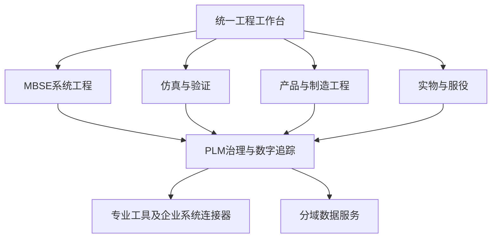
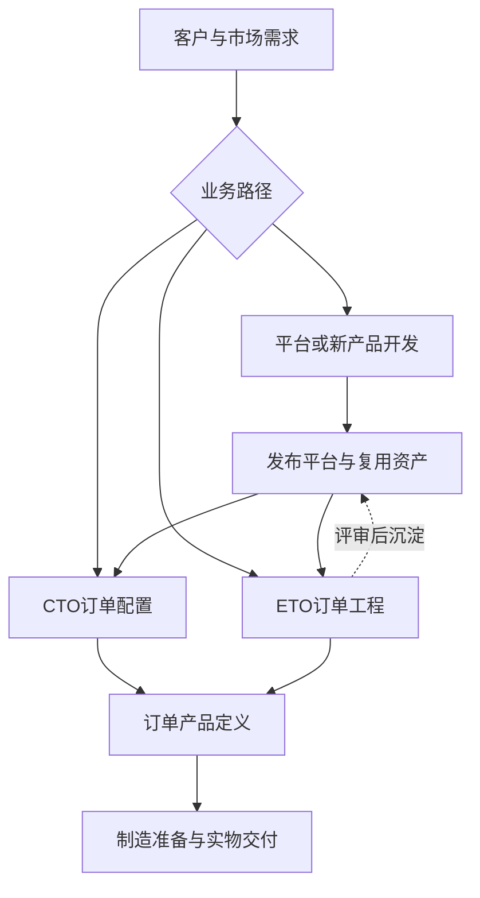
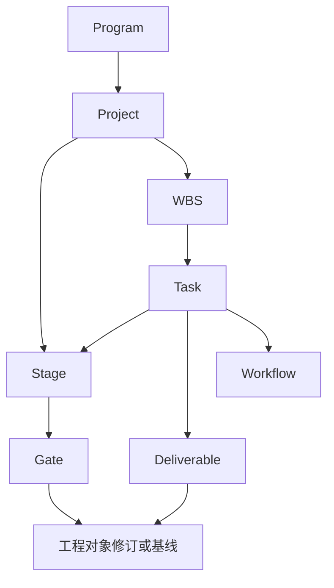

# CCDDesigner 2.0 产品说明书

## 面向复杂数控装备的、基于SysML v2系统模型驱动的Model-Based PLM平台

| 文档属性 | 内容 |
|---|---|
| 文档编号 | CCD-PROD-2.0-001 |
| 文档修订 | V1.1，评审意见修订版 |
| 编制日期 | 2026年9月15日 |
| 产品版本 | CCDDesigner 2.0 |
| 文档状态 | 产品定义稿，供产品、业务与架构评审 |
| 技术路线 | SysON＋OpenSysML＋Flexo＋OpenModelica＋CCDDesigner PLM |
| 数据约束 | 不采用Neo4j；PLM数据与跨域追踪采用PostgreSQL；保留Flexo所需的RDF存储 |
| 适用对象 | 产品负责人、系统架构师、系统工程师、研发与制造负责人、实施和测试团队 |

本文定义产品目标、功能范围、业务规则和验收方向。文中“应”“须”表示拟建设要求，不表示现有软件已经实现。第三方工具的现有能力、CCDDesigner拟开发能力和后续规划分别说明。示例编号、配置和技术指标均为说明业务逻辑而假定，不作为机床性能承诺。

---

## 1. 产品定位

CCDDesigner 2.0是面向数控机床、工业母机及复杂机电装备的模型驱动型产品全生命周期管理平台。平台以SysML v2系统模型和受控产品定义为双核心，将需求、系统架构、机电耦合仿真、详细设计、配置、制造准备、实物交付与服役记录连接为可追踪的工程数据体系。

系统模型表达需求、功能、行为、结构、接口、参数及验证语义；受控产品定义组织模块、零部件、BOM、软件、电气资料、CAD和工程文档。CCDDesigner统一管理其业务身份、修订、发布、基线、配置、变更、审批和访问权限。

平台借鉴企业级PLM的工程对象治理方式，通过版本化关联连接专业模型，支持工程数据在各专业工具中创建，并在受控状态下协同使用。

产品的核心原则是：**系统模型支撑设计决策，专业模型形成分析证据，PLM管理工程状态，数字主线保证对象、版本、配置和证据可追溯。**

## 2. 目标客户、用户与业务价值

### 2.1 目标客户

面向具有机械、电气、控制、液压等多专业协同需求，存在平台化产品、模块配置及订单定制业务，并需要贯通研发、制造和服务数据的装备企业。

### 2.2 主要用户

| 用户角色 | 主要工作 | 平台提供的结果 |
|---|---|---|
| 产品经理、需求工程师 | 定义市场和客户需求，管理技术规格 | 受控需求、适用范围、验收条件 |
| 系统工程师 | 分解需求，建立架构、接口与分配关系 | 可追踪的系统模型及设计依据 |
| 仿真工程师 | 建模、运行、校准和结果解释 | 与输入快照绑定的分析证据 |
| 机械、电气、控制工程师 | 实施详细设计并处理接口 | 一致的产品结构、模型、图纸与软件配置 |
| 配置工程师 | 维护平台、槽位、变体及规则 | 合法且可复现的订单配置 |
| 工艺工程师 | 建立制造结构、工艺和作业指导 | 关联设计版本的制造定义 |
| 项目经理、评审人员 | 管理任务、交付物、阶段门 | 进度、成熟度和决策证据 |
| 质量与服务人员 | 实物检验、故障处理和配置更新 | 序列号履历、验证记录和服役配置 |
| 管理员、配置管理员 | 权限、发布、基线及集成治理 | 可审计的受控工程环境 |

### 2.3 价值衡量

产品价值通过需求追踪完整率、配置准确率、工程发布一致性、变更评估时间、仿真复现率和实物配置可追溯率衡量。设计周期、返工率等经营指标需在试点前确定统计口径与基准期，通过上线后的对照数据评估，不由工具集成本身保证。

## 3. 产品范围与交付边界

“原生管理”表示CCDDesigner承担业务对象及规则；“集成”表示专业能力由外部工具执行、平台管理调用与结果；“后续规划”表示不属于首期默认交付。

| 能力域 | 责任类型 | 产品边界 |
|---|---|---|
| 需求、技术规格、生命周期、基线、变更 | 原生管理 | 管理身份、修订、审批及适用性 |
| SysML v2建模 | 集成SysON及OpenSysML | 提供统一工作入口、上下文和受控发布流程 |
| SysML发布模型服务 | 集成Flexo | 管理确定的语义快照与引用，遵循兼容性准入 |
| 参数、映射、仿真任务与证据 | 原生管理＋专业工具执行 | 控制输入、调度、结果归档和追踪 |
| 机电耦合仿真 | 集成OpenModelica | 首先基于经验证的模型模板开展参数化仿真 |
| 平台、配置、CTO/ETO、EBOM | 原生管理 | 维护平台版本、配置规则及订单产品定义 |
| CAD、CAE、软件开发 | 专业工具集成 | 管理制品、版本关联与执行接口；工具负责专业编辑和求解 |
| MBOM、工艺计划、作业指导 | 原生管理及CAPP集成 | 组织制造准备数据，保留专业编制能力的接入边界 |
| 生产排程、工单执行、采购与库存 | 外部ERP/MES集成 | 接收与下发约定数据，不重复建立完整ERP/MES |
| 实物台账、交付与维修履历 | 原生管理及业务系统集成 | 维护序列号身份、配置记录和证据引用 |
| 高频IoT、在线孪生、预测维护 | 分期集成与后续规划 | 高频时序数据由专用平台管理 |
| AI工程助手 | 后续增强 | 提供检索、解释和建议，工程发布仍受权限及审批控制 |

## 4. 产品架构

平台按业务责任划分为六个业务域，共用PLM治理能力。

| 业务域 | 主要能力 | 主要产出 |
|---|---|---|
| MBSE系统工程 | 需求、架构、行为、接口、模型发布 | 系统模型发布版本、架构基线 |
| 仿真与验证 | 模型、参数集、任务、证据及验证判定 | 仿真运行记录、验证结果 |
| 产品工程 | 平台、模块变体、CTO/ETO、EBOM、CAD | 产品定义、订单设计基线 |
| 制造工程 | MBOM、工艺、资源关联、制造资料发布 | 制造基线及下发记录 |
| 生命周期治理 | 对象、修订、变更、工作流、项目及权限 | 审批、基线、审计记录 |
| 实物与服役 | 序列号、实装配置、检验、维修、孪生关联 | 实物履历、服役配置和反馈 |

本图表示业务依赖，不表示工程活动必须按节点顺序执行。

## 5. 核心概念与统一术语

| 概念 | 产品定义 |
|---|---|
| 系统模型 | 表达工程语义及关系的SysML模型，不等同于EBOM |
| 产品定义 | 说明某产品如何设计和制造的一组受控对象与关联 |
| 产品族 | 具有共同业务定位、架构特征和复用策略的产品集合 |
| 平台修订 | 某一确定版本的平台架构、模块槽位及配置能力 |
| 模块槽位 | 平台中承担特定职责的配置位置，规定接口、数量及选择条件 |
| 模块变体 | 可以被槽位选择的受控产品定义及其修订 |
| 150%BOM | 带选择条件和适用性信息的可配置结构，不表示数量增加50% |
| 配置结果 | 基于确定的平台、规则、需求和参数形成的选项与结构解析结果 |
| 100%EBOM | 针对确定配置形成的设计结构；“100%”不等于已经批准发布 |
| 订单机床定义 | 面向某订单的配置与工程定义，不等同于序列号实物 |
| 机床实物 | 具有稳定身份与序列号的具体设备 |
| Commit | 模型仓库中的技术内容提交标识 |
| 工程修订 | 企业管理的工程对象版本，如零部件Rev B |
| 模型发布 | 将确定模型快照及其证据纳入PLM受控管理的行为与记录 |
| 基线 | 针对业务目的冻结的一组准确版本、关系及适用性信息 |
| 数字主线 | 连接工程对象、准确版本、配置、证据与实物的可解释关联体系 |

同一词汇用于不同工具时，应通过映射说明其对应关系。不得将工具项目与PLM研发项目、模型Commit与工程修订直接视为同一对象。

## 6. 业务组织原则

### 6.1 区分对象关系与执行流程

需求、功能、架构、参数、BOM之间使用有类型的关系连接；研发活动通过输入、输出、前置条件、负责人和阶段门组织。软件工具负责处理对象，不作为工程对象链中的替代节点。

### 6.2 支持迭代与并行

功能、行为、逻辑架构、物理方案和接口在设计中逐步细化。仿真可以在抽象架构阶段开展，也可以使用详细物理设计的参数。CAD、CAE和EBOM协同演进，阶段发布时检查其一致性。

### 6.3 分开平台建设与订单交付

平台开发形成可复用能力；CTO使用成熟能力配置订单；ETO对订单开展差异工程；全新产品研发可以独立建立产品定义，并在成熟后形成平台资产。

## 7. 平台及新产品开发

平台开发以市场需求和产品族策略为输入，识别共性与差异，形成系统架构、接口契约、模块槽位、模块变体、配置规则和验证范围。

主要活动包括需求分解、功能与架构设计、候选物理方案、机电耦合分析、详细设计、模块验证、配置组合验证及发布。这些活动允许迭代，不强制串行。

平台发布须满足：关键需求可追踪，必需接口已确认，可选变体存在可用修订，配置规则能够判定合法性，适用的验证证据已审核，相关工程制品已发布或作为同一发布包受控。

全新研发项目没有成熟平台时，可以建立独立产品定义。是否沉淀为平台及150%BOM，由复用价值和产品规划决定。

## 8. CTO订单配置

CTO适用于订单需求落在已发布平台和已验证变体组合范围内的场景。

1. 接收订单技术规格，识别客户约束与交付条件。
2. 选择适用的平台修订、规则版本及有效期上下文。
3. 选择配置特征与选项，解析参数、模块变体和BOM。
4. 检查必选项、互斥项、数量、接口、性能和工程有效性。
5. 形成订单产品定义、100%EBOM和适用的CAD装配引用。
6. 检查已有验证证据是否覆盖当前组合；必要时补充验证。
7. 审批后形成配置基线和订单设计基线，进入制造准备。

CTO不能仅以“BOM可生成”作为成功条件。若订单超过平台能力、选择无验证覆盖的组合或需要修改模块，应转入ETO评估，不能通过放宽配置规则掩盖工程差异。

## 9. ETO订单工程

ETO适用于成熟配置能力不能完全覆盖订单需求，需要开展新增或变更设计的场景。支持从母机定义复用、从CTO配置扩展，以及从需求开始新建。

ETO活动包括差异需求确认、参考基线选择、复用方案、变更或新建范围确定、模型与详细设计、仿真和试验验证、评审及订单发布。已发布数据的修改进入工程变更；新建草稿范围按研发流程迭代。

### 9.1 产品定义复用策略

| 对象 | 默认处理原则 |
|---|---|
| 标准件、未变化模块 | 引用已批准的确定修订 |
| 待定制零件、模块 | 根据企业编号规则建立新对象或新修订，保留来源 |
| 系统模型 | 创建隔离工作副本或分支，保留来源Commit及元素映射 |
| 需求 | 重新确认适用性；客户差异形成新需求或修订 |
| CAD和工程文档 | 复用或派生，并检查对源产品的修改隔离 |
| 仿真模型、参数模板、用例 | 可以复用，但要重新解析当前输入与配置 |
| 历史仿真运行和测试结果 | 保留为历史证据；复用适用性须单独评估 |
| 追踪关系 | 根据新对象身份重新绑定，避免仍指向源产品上下文 |

不得将母机的PASS结果直接复制成订单机床的PASS结果。未变化部分的证据复用须有适用性依据。

## 10. MBSE系统工程

MBSE工作区提供需求、功能、行为、逻辑架构、物理架构、接口、参数、分析和验证的建模入口。RFLP作为组织工程视图的方法，不将R、F、L、P视为只能一次性依次完成的四个步骤。

SysML v2是语义表达基础；功能可以通过动作及其分解表达，逻辑与物理架构通过约定的模型组织规则区分。平台须提供数控机床建模指南和模板，避免业务术语与语言构造之间一一对应的错误假设。

### 10.1 数控机床参考架构

参考视图可覆盖机械结构、主轴、进给、数控、伺服、电气、液压、气动、润滑、冷却、刀库、测量和安全。

这些视图存在跨专业交叉，不能直接相加成为无重复的组成BOM。例如伺服电机可以承担进给系统的执行功能，同时参与电气与控制分析。物理组成树应唯一确定装配归属；功能、安全和供能关系以分配、接口或依赖关系表达。

### 10.2 架构与产品结构映射

逻辑职责可分配到多个物理部件，一个部件也可承担多个职责。物理模型元素与PLM零部件、模块、软件制品及BOM使用位置建立多对多映射。

映射应记录模型快照、元素ID、PLM对象修订、结构使用位置、配置上下文和关系类型。不自动把所有SysML Part Usage转换为独立零部件主数据。

## 11. 需求与技术规格管理

平台管理客户需求、系统需求、分系统需求及工程约束。技术规格组织面向客户和产品的指标条目，并与需求关联，避免同一指标多处维护且缺少来源。

每条受控需求应具有编号、来源、责任人、修订、适用对象、需求正文、优先级、验收判据、验证方法及状态。量化需求还应记录指标定义、单位、阈值或区间、工况与测量/计算口径。

### 11.1 双层对象与字段责任

| 内容 | 主编辑位置 | 同步与治理规则 |
|---|---|---|
| 需求编号、受控正文、来源、业务属性 | CCDDesigner需求管理 | 建模环境引用或显示受控内容 |
| SysML上下文、关系和形式化约束 | 指定MBSE工作区 | 发布时与需求修订绑定 |
| 已发布形式化表达 | Flexo确定Commit | 不直接覆盖，变更须形成新提交与发布 |
| 阈值及单位等共享信息 | 指定的受控需求/参数对象 | 同步到模型；模型端修改形成变更提议 |
| 审批、需求基线和发布状态 | CCDDesigner | 由工作流与权限控制 |

模型优先录入的新需求可作为候选需求导入PLM；建立正式编号后按上述字段责任管理。需求正文与形式化约束不一致时，禁止发布，交由责任人处理。

## 12. SysON、OpenSysML与Flexo集成定位

| 组件 | 目标职责 | CCDDesigner需要实现的衔接 |
|---|---|---|
| SysON | 图形建模与协同工作环境 | 项目绑定、权限衔接、交换适配、元素身份及发布捕获 |
| OpenSysML | 文本语言服务、解析、语义检查及适用范围内的执行 | 服务封装、诊断回传、版本锁定和执行隔离 |
| Flexo | 已发布模型快照的模型服务、版本引用及后续联邦接入基础 | 发布适配、Commit绑定、访问控制和查询适配 |
| CCDDesigner | 业务身份、发布审批、基线及跨域追踪 | 统一工程上下文和发布完整性治理 |

上述为目标职责划分，不意味着替换SysON内部实现，也不意味着三个组件原生共享同一份可写模型。OpenSysML的约束或行为执行不替代OpenModelica的机电耦合求解。

### 12.1 首期编辑策略

每个模型工作区指定一个主要编辑通道。图形工作区由SysON维护工作模型，OpenSysML可对导出快照进行语义检查；文本工作区由受控文本资产及OpenSysML语言服务支持。两类工作区均通过适配器发布到模型服务。

在无损往返验证完成前，不允许两个编辑通道对同一工作模型并行双向覆盖。跨通道修改作为受控导入或变更提议处理，必须显示差异和不支持的内容。

### 12.2 能力准入

组件版本、标准库版本、交换方式和支持子集纳入“集成兼容性基线”。项目启动时锁定具体发行版本或Commit，不以“最新版本”作为验收条件。

准入测试至少覆盖结构、需求、动作、状态、接口、约束、单位、多重性、跨项目引用、元素身份、图形资料及错误诊断。未支持的构造必须阻止不完整发布或保留为明确标识的只读原始制品，不得静默丢弃。

## 13. 模型权威源与数据归属

| 数据类别 | 权威位置 | 主要规则 |
|---|---|---|
| 工作模型 | 指定SysON工作区或受控文本工作区 | 每个工作区只有一个主要写入通道 |
| 已发布语义模型 | Flexo中的确定Commit | 发布引用不可漂移到分支最新版本 |
| 图形布局、原始文本、工具专有资料 | 发布包中的对应制品；工作期由编辑环境维护 | 与模型快照共同冻结，不能仅保存语义丢失图形 |
| PLM对象、需求正文、BOM、配置与治理关系 | PostgreSQL | 通过PLM业务服务修改 |
| CAD/CAE、文档及仿真结果文件 | MinIO | 元数据和业务身份由PLM管理，文件制品按版本固化 |
| Flexo模型数据 | 支持其部署要求的RDF四元组存储 | 由Flexo服务控制访问及版本 |
| 检索索引 | OpenSearch或Elasticsearch | 可重建，不作为工程权威源 |
| 可选CAD几何辅助数据 | MongoDB或CAD系统自身存储 | 按具体CAD集成选用，不承担PLM发布状态 |
| 高频运行数据 | 外部IoT/时序数据平台 | PLM保留资产关联、时间范围及关键证据快照 |

同一语义在工作模型与发布模型中存在副本是允许的，必须通过状态和内容标识区分。PLM只包装需要生命周期管理的关键元素，不复制全部内部模型元素。跨域追踪使用PostgreSQL，MBSE内部关系保留在模型仓库。

## 14. 模型发布与稳定引用

### 14.1 发布包

模型发布包包含模型项目ID、源工作区标识、内容摘要、目标Commit、工具及标准库版本、外部依赖清单、交换报告、语义检查报告、图形及原始制品、关键元素映射和审批记录。

稳定元素引用由“仓库ID＋项目ID＋Commit ID＋元素ID”组成。名称和路径用于显示及搜索，不作为历史引用的唯一依据。发布适配器负责保存跨次导入的身份映射，处理改名、移动、新建和删除。

### 14.2 发布过程

1. 从工作区捕获一致的候选快照，并固定其内容摘要。
2. 解析依赖，执行交换完整性、语义及权限检查。
3. 写入Flexo候选Commit并保存配套制品，验证内容与引用可读取。
4. 在PLM中建立待审批发布记录，绑定候选Commit和全部证据。
5. 审批通过后，PLM将发布记录置为已发布，并按需要纳入基线。

审批后工作模型仍可继续迭代，但不会改变已经发布的Commit。审批期间内容变化须形成新的候选包并重新提交。

### 14.3 跨系统一致性

PLM与Flexo、MinIO不共享一个本地事务。发布采用幂等请求、内容校验、Outbox事件和可重试的协调过程。重复请求不得产生重复业务发布。

若模型或文件保存失败，发布保持失败或待恢复，不能显示为已发布。先写入而未被批准引用的候选制品可以存在，须隔离其可见性并按保留规则清理。发布完成后定期检查内容可达性；发现异常应告警并标记可用性，不能改写历史审批事实。

## 15. 参数管理

参数管理分为参数定义、参数值记录、参数集及映射四类对象。

| 要素 | 必须表达的信息 |
|---|---|
| 参数定义 | 名称、数据类型、量纲、语义、允许范围及适用对象 |
| 参数值 | 数值、单位、角色、来源、配置、工况、时间或执行上下文 |
| 参数集 | 一组冻结的参数值及其版本，用于配置或分析 |
| 参数映射 | 源与目标身份、转换规则、方向、读写权限及版本 |

同一主轴可同时具有需求最低能力15000rpm、设计最高允许转速15000rpm、仿真工况12000rpm和实测值9985rpm。这些记录语义不同，不应相互覆盖。

参数角色至少区分需求阈值、设计值、模型输入、工况设定、计算结果、测试结果和运行观测。派生参数记录计算公式、来源及求值版本。计算依赖存在循环时，应交由明确的求解机制处理，不按普通无环参数传播执行。

参数变更首先形成影响评估；只有获授权、映射有效且满足触发条件的任务才自动运行。计算和测量结果回写到结果角色，由工程师决定是否提出设计值修改。

## 16. OpenModelica集成与模型映射

系统仿真优先覆盖主轴与进给驱动、电机与伺服、机械传动、液压及其他经模型库验证的机电耦合场景。具体物理域、控制功能及求解精度由模型库和验收案例确定。

### 16.1 首期能力：模板参数化

由仿真工程师维护可执行的Modelica模板。平台选择模型及库版本，映射参数和工况，执行OpenModelica任务，保存结果并计算KPI。

参数映射本身不生成完整物理模型。模板应已经定义组件、连接、方程、边界条件和必要初值。

### 16.2 后续能力：受限模型转换

对经过约定的SysML建模子集，逐步支持组件类型、连接拓扑、接口及参数向Modelica的映射。自动转换必须有显式规则及覆盖清单，遇到未支持元素应报错，不生成表面可执行但语义不完整的模型。

### 16.3 映射治理

ModelMapping记录源模型快照与元素、目标模型修订与变量、映射方向、量纲、单位变换、枚举对应、变换表达式、适用配置和状态。映射版本在运行前冻结。

采用FMI开展联合仿真时，须指定FMU版本、FMI接口类型、主控程序、步长和数据交换规则。FMI是接口标准，不独立承担联合仿真调度。

## 17. 仿真数据与过程管理

| 对象 | 含义 | 关系与版本规则 |
|---|---|---|
| Simulation Study | 分析专题 | 组织多个模型、用例和结果 |
| Simulation Model | 可执行模型定义 | 修订管理，并固定依赖库 |
| Simulation Case | 工况、载荷、初值及输出要求 | 修订管理，引用模型和参数集 |
| Simulation Configuration | 求解器及执行设置 | 固定工具、容差、时间范围等 |
| Simulation Job | 调度请求 | 记录队列、资源、状态及重试策略 |
| Simulation Run | 一次执行尝试 | 唯一身份；重试生成新Run并关联原Job |
| Simulation Result | 某次Run产生的结果 | 按制品版本保存，保留摘要与来源 |
| Verification Result | 针对需求与证据的判定 | 独立管理，不能从“运行成功”直接赋值 |

运行状态至少包含排队、运行、成功、失败、取消。输入快照、求解器版本、库版本、映射版本、日志、结果和后处理版本共同构成复现包。

“可复现”要求能够还原输入和执行环境，并在约定数值容差内重现关键结果；不承诺跨硬件和求解器版本获得逐字节相同输出。失败运行保留诊断信息，不能以零值结果参与需求判定。

## 18. 验证、确认与证据管理

需求验证回答设计或产品是否符合规定要求；使用场景确认回答产品是否满足预期用途。平台分别管理对应计划、对象和证据。

验证方法支持分析、检查、演示和试验。验证用例应绑定需求修订、被验证对象或配置、判据、方法、工况、所需证据及责任人。

### 18.1 判定层级

| 层级 | 判定内容 |
|---|---|
| 执行结果 | 任务是否成功完成并产生可用数据 |
| 工况判据 | 指定模型和工况下的KPI是否达到阈值 |
| 需求验证 | 规定方法下，证据是否足以证明指定需求满足 |
| 实物验收 | 指定序列号设备是否通过约定的实际验收 |

验证结果至少支持通过、不通过、无法判定和未执行。历史结论不被新设计覆盖；当需求、设计、模型或配置变化时，记录证据适用性待评估或需重新验证。

### 18.2 定位精度示例

假设需求为“在约定行程、负载、温度及补偿状态下，X轴定位误差不超过8μm”。若模型只输出伺服跟随误差6.7μm，则仅能判定相应仿真指标是否通过，不能据此宣布整机定位需求已满足。

若批准的验证方法为实机测试，应取得针对该序列号的测试记录，并确认测量口径、条件和证据完整性，再形成需求及验收结论。模型的校准范围、不确定性和适用范围应随仿真证据保存。

## 19. 产品平台、模块槽位与变体

产品组织采用“产品族—平台修订—模块槽位—可选模块变体修订”。模块是业务分类和职责，不强制为每个变体另建重复的模块容器对象。

平台修订包含适用机型、结构框架、接口契约、参数范围、槽位及配置规则引用。槽位规定必选性、数量、多重性、接口和允许的变体集合。变体通过具体修订进入槽位，保留变体复用关系。

以VMC平台为例，可设置基础结构、立柱、主轴、进给、数控和刀库槽位。必选槽位也可以具有多个可选变体；“必选”与“可配置”不是互斥属性。

平台能力调整通过新修订发布，不自动改变历史订单配置。

## 20. 150%BOM与配置规则

150%BOM在结构使用位置上表达选配条件。结构行应包含使用位置ID、零部件或变体引用、数量、选用表达式、有效性及替代关系。

配置规则包括必选、互斥、依赖、数量、参数范围、接口兼容、性能边界及日期/批次等有效性规则。规则既可以选择模块，也可以确定数量和参数值。

示例：选择HSK63主轴时，刀库刀柄接口必须兼容HSK63；选择某数控系统时，伺服和总线接口须符合平台批准的组合。品牌名称不能替代具体变体编号和修订。

### 20.1 配置输出

配置结果须记录输入需求修订、平台修订、规则版本、参数集、选项、变体修订、结构解析结果及验证覆盖状态。相同冻结输入须得到相同解析结果。

不能满足规则时，返回冲突原因和关联选项；不允许静默采用默认值解决关键冲突。规则之间的冲突须在规则发布或运行时被识别。

### 20.2 100%EBOM管理

配置结果形成可追溯的订单EBOM快照或版本化结构，并保存来源，不能在历史查询时仅依靠当前150%BOM重新计算。发布前检查未解析选项、悬空引用、数量异常和证据适用性。

BOM结构行必须区分同一零件的不同使用位置，以支持位置级变更、配置和实物追踪。结构循环应在发布前阻止。

## 21. CAD、CAE及详细设计

CAD装配与EBOM通过对象修订和使用位置建立关联。平台支持结构比较、属性同步、缺件检查及版本一致性检查，并显式定义哪些字段由CAD负责、哪些由PLM负责。

CAD、CAE和EBOM在设计工作期可以不同步，但必须显示差异及责任人。设计发布前应确认作为交付依据的结构、几何、图纸和分析证据相互一致。

CAE除系统仿真外可管理结构静刚度、动态刚度、模态、频响、热分析等任务。求解器通过独立连接器集成，模型、网格、载荷、边界条件和结果按制品归档。

电气设计、控制软件和设备参数应作为受控工程制品关联产品定义；其专有编辑与构建在专业工具完成。交付配置应能识别软件版本和适用硬件。

## 22. PLM核心、修订与生命周期

PLM核心提供对象身份、分类、修订、关系、结构、制品、生命周期、权限、审计、基线和变更能力。各业务类型采用适合其语义的状态机，不强制所有对象使用相同修订机制。

| 对象类型 | 管理方式 |
|---|---|
| 零部件、需求、图文档、模型定义 | 草稿、审核、发布等状态及工程修订 |
| 模型Commit | 仓库技术内容标识，关联PLM发布记录 |
| 仿真Run、检验记录 | 一次事件或执行记录，保留原始证据 |
| 机床实物 | 稳定身份、序列号及随时间变化的配置履历 |
| 基线 | 冻结成员集合；需要修改时建立后继基线 |
| 配置解析结果 | 固定输入与结果，批准后纳入基线 |

已发布工程内容不可原位改写。记录更正采用附加更正记录或新版本并保留来源。身份权限和审计能力统一，但业务生命周期按类型定义。

## 23. 基线与配置状态

基线可以按需求、架构、仿真、设计、配置、制造、实装和交付等业务目的建立。一个基线对象可以被多个业务过程引用，不为每个名称重复复制全部数据。

基线成员须固定准确的工程修订、模型Commit、参数集、映射版本、制品摘要及必要依赖。共享成员通过基线成员关系连接，不把单一baseline_id写入对象作为唯一归属。

| 配置状态 | 内容 |
|---|---|
| As-Designed | 批准的设计定义及选项 |
| As-Planned | 面向生产的制造结构和工艺定义 |
| As-Built | 实际装配的部件、序列号、软件及批准偏离 |
| As-Delivered | 实际交付状态和验收资料 |
| As-Maintained | 维修、更换和升级后的服役配置 |

不同状态之间保留差异及批准依据。制造实际替代不自动回写设计BOM；维修换件不改变实物设备身份。

## 24. 工程变更与影响分析

正式变更过程包括提出请求、界定范围、候选影响分析、责任人评估、实施授权、设计修改、重新验证、评审发布及生效控制。具体审批层级按企业规则配置。

影响分析从准确版本和配置出发，按关系类型、方向、有效期和传播规则生成候选对象；由规则与责任人区分需要修改、需要复核、需要重新验证和无需处理的对象。

提高主轴转速可能影响轴承寿命、热特性和驱动配置，但不会因为某文档在关系网络中可达就要求其修改。系统必须显示传播路径和判断依据，并限制遍历深度、处理循环及权限边界。

变更批准后仍须检查适用订单、在制设备、库存与服役设备的处理方式；涉及ERP/MES的执行结果通过接口回传，不能以PLM发布成功替代现场实施完成。

## 25. 数字主线与关系服务

数字主线包括系统追踪、分析证据、产品配置和实物履历四类交叉视图。所有视图使用有类型的关联，不以单一线性链表达全部关系。

| 业务关系 | 方向与含义 |
|---|---|
| derivedFrom | 派生需求指向来源需求 |
| satisfies | 设计元素指向其满足的需求 |
| verifies | 验证用例指向被验证需求 |
| allocatedTo | 职责或功能指向承接它的架构元素 |
| representedBy | 产品对象关联其模型表达，明确这是平台关系 |
| usesRevision | 结构使用位置引用确定对象修订 |
| evidenceFor | 运行或测试证据关联对应判定 |
| refersToIndividual | 模型中的个体表达关联具体实物身份 |

以上为CCDDesigner业务关系词汇，须分别映射到SysML标准构造或平台自定义关系，不声称全部都是语言关键字。

PostgreSQL关系服务保存跨域链接、版本引用、适用性和依赖传播规则。一般网络采用关系表及递归查询；层级结构可采用适合的层级索引。缓存、闭包表和检索索引是加速手段，必须与权威关系数据保持可验证的一致性。

## 26. 制造工程与企业系统协同

制造工程将设计结构转换为适合采购、加工和装配的制造结构，保留EBOM到MBOM的多对多映射、数量与拆合规则。

工艺计划包含工序，工序消费或产出制造对象，并分配设备、工作中心、工装和人员能力，关联作业指导书及质量检查点。BOP用于表达工艺结构与顺序，Process Plan是其业务组织对象；二者不作为互不相关的连续阶段。

| 系统 | 主要责任 | 交换信息 |
|---|---|---|
| CCDDesigner | 发布工程及制造定义 | 零件、MBOM、工艺、图文档、版本和有效性 |
| ERP | 采购、库存、成本及生产计划相关业务 | 编码映射、订单、物料可用性及处理状态 |
| MES | 生产执行、装配和现场质量记录 | 工单执行、实装件、序列号、检验和偏离记录 |
| CAPP/CAM | 专业工艺和加工编制 | 工艺制品、程序及其适用版本 |

接口应具有发送批次、接收确认、业务错误和重试记录。工程版本变更后，应识别已下发范围并进行受控增量下发。

## 27. 产品实例与服役履历

订单机床定义描述“计划交付什么配置”；机床实物描述“具体是哪台设备”。一个订单定义可以对应多台实物。

实物台账可在制造启动前建立计划实例，按企业规则分配或绑定序列号。装配、调试、验收和交付过程中逐步补充实装配置、软件版本、参数、检验结果和制造记录。

服务过程记录故障、检查、维修、更换、升级、停机及重新验收事件，形成带生效时间的服役配置。旧配置与历史证据继续可查。

SysML Individual可用于表达与同一实物相对应的模型个体，并通过稳定身份与台账关联。一般Part Usage不自动等同于序列号实物，也不能仅凭模型中出现个体就认为设备已制造完成。

## 28. 数字孪生与运行反馈

数字孪生按能力成熟度分阶段建设。

| 层级 | 交付能力 |
|---|---|
| 数据关联基础 | 实物身份关联设计、实装配置、仿真模型及维护记录 |
| 运行监测集成 | 接入带时间戳、单位和质量标志的运行数据，展示状态及异常 |
| 模型校准与诊断 | 利用观测数据评估模型偏差，形成经审核的校准模型 |
| 预测及维护辅助 | 在验证适用范围内进行预测与维护建议 |

高频运行数据保留在IoT/时序平台。用于工程决策的时间窗口和关键数据集作为证据快照受控保存。

运行反馈应能够关联故障对象和当前配置，提出问题或变更请求，进入需求、设计、仿真和验证流程。在线自动控制不属于本说明书默认范围。

## 29. 项目、任务与阶段门

Program组织相关Project，不设置本产品定义中的Gate。Project按研发目的组织Stage；WBS表达工作分解；Task承担可执行工作；Workflow组织审批或协作；Deliverable关联准确版本的工程成果；Gate审查阶段成熟度和进入下一阶段的条件。

WBS可跨阶段组织，任务通过关联指定归属阶段；不强制WBS结构与阶段结构完全相同。

Gate包括进入条件、评审项、评审流程、决策、行动项和引用基线。决策可为通过、有条件通过、退回或终止。任务完成不自动等于Gate通过；有条件通过应明确行动项、期限及关闭要求。

参考阶段门可覆盖需求确认、系统方案、详细设计、制造准备和交付验收，具体裁剪到平台、CTO和ETO项目模板。

## 30. 用户工作台与一级模块

| 模块组 | 功能模块 |
|---|---|
| 首页与协同 | 仪表板、待办、最近访问、搜索与通知 |
| 研发管理 | 项目群、项目、阶段、WBS、任务、交付物与阶段门 |
| 系统工程 | 需求与技术规格、MBSE工作区、架构、接口及模型发布 |
| 参数与验证 | 参数、映射、模型库、仿真、验证与证据 |
| 产品工程 | 产品族、平台、槽位与变体、配置、EBOM、CAD/CAE及软件制品 |
| 生命周期 | 图文档、变更、基线、工作流、数字追踪与影响分析 |
| 制造与服务 | MBOM、工艺、制造交接、实物、交付与服务履历 |
| 系统管理 | 组织权限、分类字典、编号、连接器、审计及监控 |

首页聚合业务服务的数据，不另建一套订单、项目或审批主数据。各工作台展示当前对象修订、配置上下文和发布状态，减少用户误用“最新”数据。

## 31. 技术架构与存储原则

PLM核心采用Spring Boot模块化单体或粗粒度核心，保持对象、BOM、配置、基线和变更之间的本地事务。MBSE、仿真执行、CAD/CAE连接器、检索与可视化按负载和隔离需求服务化。

| 技术领域 | 方案与边界 |
|---|---|
| 前端 | React＋TypeScript，集成专业工作区 |
| PLM核心 | Spring Boot，模块边界清晰 |
| PLM数据库 | PostgreSQL，业务事务及跨域追踪 |
| SysML建模 | SysON；OpenSysML用于适用的文本和语义服务 |
| 发布模型服务 | Flexo及其所需的RDF四元组存储 |
| 仿真 | OpenModelica及独立执行资源；联合仿真按FMI集成方案实现 |
| 文件制品 | MinIO，按制品版本及内容摘要归档 |
| 工作流 | Flowable，业务状态转换仍由领域规则校验 |
| 搜索 | OpenSearch或Elasticsearch，按兼容性选择并独立治理索引 |
| 消息一致性 | Outbox用于本地事务与事件衔接；Kafka可作为消息传输组件 |
| 身份接入 | OIDC/SSO与各组件授权适配 |
| 部署 | 容器化；按规模选择Docker编排或Kubernetes |
| 可选扩展 | MongoDB用于明确需要的CAD辅助数据；MCP用于AI工具调用 |

Kafka与Outbox承担不同职责，不能以二选一替代完整一致性设计。SSO统一登录不自动保证各仓库权限一致；MCP也不替代业务授权、事务和专业工具适配。

平台不使用Neo4j；这不限制Flexo使用自身要求的RDF图存储。具体RDF产品在部署验证中选择并锁定，不能以普通PostgreSQL关系表直接替换未经适配的Flexo后端。

## 32. 安全、权限与可运维性

权限覆盖项目、对象修订、模型项目、文件制品、基线及发布动作。PLM作为业务授权策略的管理入口，通过适配机制映射到专业服务；不能仅隐藏前端按钮而保留后端直接访问。

搜索结果、关系导航、导出和模型查询均应执行权限检查。跨部门、供应商或租户协作限定可见对象及版本，审计下载、发布、权限变更和变更实施。

仿真执行采用隔离运行环境及资源配额，记录工具版本、执行日志和失败原因。平台监控任务积压、连接器故障、发布完整性和外部引用失效。

备份恢复覆盖PostgreSQL、Flexo模型库及文件制品，并保存能够互相对应的恢复点或发布清单。恢复验证以发布包、BOM、基线和实物履历可读取为准，不能仅检查数据库启动成功。

## 33. 分期交付与能力准入

各期以验收门槛决定进入下一期，工期与投入在实施计划中确定。

| 阶段 | 建设范围 | 进入下一阶段的条件 |
|---|---|---|
| P0 集成验证 | 锁定版本，验证SysON/OpenSysML/Flexo交换、发布、权限及存储 | 支持子集明确；稳定引用、错误处理和发布复现通过 |
| P1 系统设计闭环 | 需求、模型发布、参数、模板仿真、验证、PLM核心与基线 | 完成需求到仿真证据的受控闭环案例 |
| P2 产品工程 | 平台、槽位变体、规则、CTO/ETO、EBOM及CAD/CAE | 平台、订单和变更案例通过；设计版本一致 |
| P3 制造与交付 | MBOM、工艺、ERP/MES对接、序列号与交付台账 | 工程下发和实装回传闭环通过 |
| P4 服役与增强 | 服役配置、IoT、模型校准、孪生与AI辅助 | 每项增强能力具有独立适用范围及验收证据 |

P0不通过的交换构造不能进入后续版本承诺。统一双向图文编辑、广泛的SysML到Modelica自动转换及完整模型联邦需单独列项验证，不默认为首期能力。

## 34. 产品验收场景

以下场景构成产品级验收方向；测试数据规模、性能阈值、环境及安全条件在实施启动时冻结。

| 编号 | 场景 | 通过条件 |
|---|---|---|
| AC-01 | 图形模型发布 | 支持子集模型形成准确Commit，关键元素和配套制品可读取 |
| AC-02 | 不支持构造导入 | 明确报错或标识隔离；不能静默丢失后继续正式发布 |
| AC-03 | 历史引用稳定 | 元素改名、移动及工作分支更新后，原基线仍解析原内容 |
| AC-04 | 跨系统发布失败 | 文件或模型写入失败时无错误“已发布”；重试不产生重复发布 |
| AC-05 | 参数角色隔离 | 仿真结果写入结果角色，不能覆盖需求阈值或已发布设计值 |
| AC-06 | 仿真复现 | 固定模型、库、参数、映射和求解设置后，KPI在约定容差内重现 |
| AC-07 | 验证证据判定 | 运行成功不自动使需求通过；证据不足显示无法判定 |
| AC-08 | CTO配置 | 合法选项形成确定结构；非法组合返回可解释冲突 |
| AC-09 | ETO派生 | 源产品不被修改；新对象来源清楚；历史PASS不自动继承 |
| AC-10 | 影响分析 | 按关系和配置限定传播，候选与确认影响可区分且有依据 |
| AC-11 | 设计制造交接 | 设计修订、制造结构和工艺可对应，下发与回执可追踪 |
| AC-12 | 实装及换件 | 序列号身份稳定，换件前后配置和有效时间可查 |
| AC-13 | 权限一致性 | 未授权用户不能通过搜索、仓库API或文件地址绕过控制 |
| AC-14 | 基线恢复 | 可恢复准确模型、文件、关系和配置，外部依赖无漂移 |
| AC-15 | 阶段门 | 任务完成但证据不足时不能自动通过Gate |

准确性及数据完整性类规则作为强制验收要求。并发人数、模型规模、BOM行数、影响分析深度、结果文件大小和响应时间构成联合性能测试配置；不以缺少规模条件的单一时延数字承诺全平台性能。

## 35. VMC1000贯通示例

以下示例说明产品闭环，指标为假定值。

1. 平台团队发布VMC平台修订A，包含主轴、数控和刀库等槽位及批准组合；发布时冻结架构、规则、模块修订和证据。
2. 客户订单要求主轴能力达到15000rpm并使用30把刀刀库。需求工程师将条目纳入订单技术规格并确认接口、负载及验收条件。
3. 配置工程师选择兼容的主轴、刀库及控制变体。规则解析生成订单100%EBOM，验证覆盖检查发现既有证据适用后，进入配置审批。
4. 如客户新增超出平台范围的进给性能要求，订单转入ETO。团队在隔离工作副本中修改系统模型及设计，保留标准件引用，派生必要的定制件。
5. 仿真工程师选择经批准的Modelica模型模板、输入参数和工况。每次运行生成独立Run，结果与订单配置及需求修订绑定。
6. 若定位误差证据要求实测，系统仿真仅形成设计分析证据。实机测试完成并审核后，才产生相应验收结论。
7. 详细设计通过评审，冻结模型Commit、EBOM、CAD、软件和验证证据。制造工程据此建立MBOM与工艺并下发MES。
8. 制造启动时建立计划实物并绑定序列号，逐步回传实装件、调试参数和检验记录，形成As-Built及As-Delivered配置。
9. 服役中更换主轴，记录新件身份、生效时间和重新检验结果，形成As-Maintained配置。原交付基线和原仿真证据保持不变。
10. 若故障反馈提示平台共性问题，提出变更请求，经评估后更新平台资产；已交付设备按生效策略分别处理。

## 36. 主要设计决策与假设

| 决策 | 本版约定 | 验证或后续落实方式 |
|---|---|---|
| 模型写入 | 每个工作区一个主要编辑通道 | P0验证工作副本与交换流程 |
| 发布权威源 | Flexo准确Commit管理已发布语义快照 | 验证元模型、身份映射、依赖及读取完整性 |
| 生命周期治理 | PLM管理审批、修订及基线 | 定义领域状态机和跨系统授权适配 |
| 数据架构 | PostgreSQL＋MinIO＋Flexo RDF存储 | 部署验证、容量测试与恢复演练 |
| 仿真首期 | 模板参数化运行 | 以数控机床模型库和验收用例限定支持范围 |
| 配置策略 | 平台开发、CTO、ETO分离而可转接 | 三类项目模板及配置差异测试 |
| 产品交付 | 订单定义与序列号实物分离 | 制造、交付、换件全过程用例 |
| 当前文档性质 | 建设目标及产品规则，不是实现完成声明 | 逐项需求分解后形成开发规格和验收基线 |

## 37. 技术依据与版本说明

以下资料用于核对语言及工具边界。本文沿用前一轮评审核对的公开资料；具体实施须锁定采用的发行版或Commit，并保存对应文档快照。

1. [OMG SysML v2规范](https://www.omg.org/spec/SysML/2.0/)。用于语言、定义与用法、需求、验证及个体概念的语义依据。
2. [SysON v2026.9.0功能表](https://docs.obeosoft.com/syson/v2026.9.0/user-manual/key-features.html)。该资料将部分视图、文本交换和标准API标为部分支持；不能据此承诺完整双向互操作。
3. [OpenSysML官方资料](https://opensysml.org/)。列出解析、校验、语言服务和执行能力；集成后的语义一致性仍需案例验证。
4. [OpenMBEE Flexo介绍](https://www.openmbee.org/flexo.html)。说明模型服务及图原生RDF模型管理定位。
5. [Flexo部署资料](https://flexo-mms-deployment-guide.readthedocs.io/en/latest/)。用于识别其RDF四元组存储和部署依赖。
6. [Flexo SysML v2服务代码库](https://github.com/Open-MBEE/flexo-mms-sysmlv2)。实施时结合具体版本核对接口、数据转换和服务依赖。

本产品对专业工具采用“版本锁定、支持子集、实证准入”的原则。工具具备某项能力，不等于CCDDesigner已经完成其集成；集成完成也不等于覆盖所有数控装备的工程适用范围。

---

## 附录A：本次评审意见落实对照

| 原评审问题 | 本版处理 | 对应章节 |
|---|---|---|
| 对象链误作串行流程 | 分开关系、活动与工具；支持迭代和并行 | 4、6、10 |
| 平台开发与订单交付混合 | 平台、CTO、ETO及全新研发分路径 | 7～9 |
| CAD/CAE固定在EBOM之后 | 采用协同演进及发布一致性检查 | 21 |
| 仿真PASS等于需求满足 | 区分执行、指标、需求验证与实物验收 | 17～18 |
| 参数映射等同于模型转换 | 首期模板参数化，转换按支持子集后续建设 | 16 |
| 三工具天然兼容假设 | 明确目标职责、编辑策略及兼容性准入 | 12、33 |
| 不用Neo4j扩大成不用图存储 | 保留Flexo RDF存储，限定PostgreSQL责任 | 13、31 |
| 模型权威源不明确 | 工作副本、发布快照及治理记录分责 | 13～14 |
| 修订、提交、运行、实物身份混淆 | 分对象定义版本和生命周期 | 17、22～23 |
| 元素路径无法稳定追踪 | 使用仓库、项目、Commit及元素ID | 14 |
| 参数值互相覆盖 | 区分角色、来源、配置和工况 | 15 |
| 需求关系方向不清 | 定义业务关系方向及语言映射 | 25 |
| 图可达等同于工程影响 | 候选影响与确认处理分开 | 24～25 |
| ETO强制克隆并继承证据 | 多入口ETO及分对象复用策略 | 9 |
| 制造、实物、项目结构混乱 | 工艺资源关联、实物提前建档、阶段门责任 | 26～29 |
| 全生命周期与孪生承诺超界 | 区分原生管理、外部集成和后续规划 | 3、28、33～34 |

## 附录B：后续开发规格分解清单

1. 工程对象、修订、状态转换与权限矩阵。
2. SysML建模子集、元素身份与发布接口规格。
3. 需求、参数、映射及验证证据领域模型。
4. 仿真调度、复现包和结果后处理规格。
5. 平台修订、槽位变体、配置规则及BOM结构规格。
6. CTO、ETO、变更与基线流程规格。
7. CAD/CAE、ERP/MES及IoT连接器契约。
8. 实物履历、服役配置及数字孪生分期规格。
9. 项目、WBS、任务、交付物及Gate规格。
10. 集成兼容性、端到端验收、性能容量及恢复验证方案。

上述规格在本产品定义评审后分模块展开，不把本说明书中的目标功能视为已经交付或已经验收。
