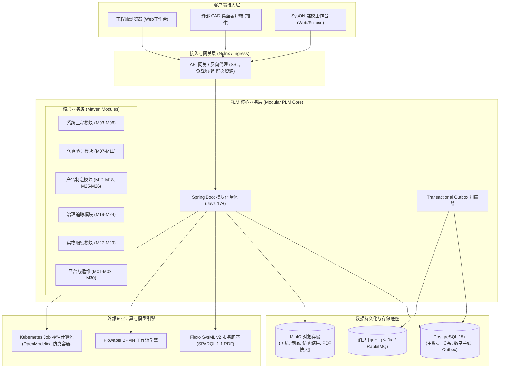
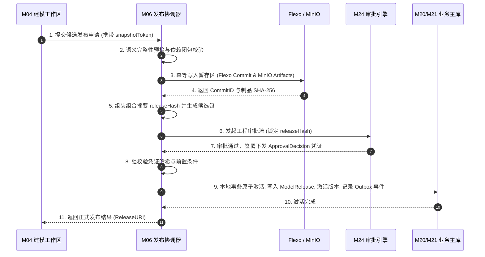
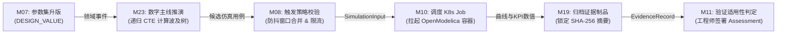

# CCDDesigner 2.0 系统总体架构设计方案

| 文档属性 | 内容 |
| :--- | :--- |
| **文档编号** | CCD-ARCH-SYS-2.0-001 |
| **文档版本** | V1.0 |
| **编制日期** | 2026年9月15日 |
| **上位依据** | 《CCDDesigner 2.0 产品开发说明书》（CCD-DEV-SPEC-2.0-001）<br>《CCDDesigner 2.0 产品功能架构与模块设计说明书》（CCD-ARCH-FUNC-2.0-001） |
| **相关决策** | ADR-0001~0008 (上位冻结决策)、ADR-0009 (模块化单体架构)、ADR-0010 (PostgreSQL数字主线)、ADR-0011 (K8s仿真调度) |

---

## 1. 总体架构设计原则与系统定位

### 1.1 系统定位：Model-Based PLM 双核心驱动
CCDDesigner 2.0 是面向高端复杂数控机床的下一代研发与生命周期管理平台。系统以 **SysML v2 系统模型** 与 **受控产品定义（BOM/配置）** 为双核心引擎，实现“需求-架构-参数-仿真-EBOM-MBOM-实机台账-售后运维”的全生命周期数字主线闭环。

```
┌────────────────────────────────────────────────────────────────────────┐
│                        CCDDesigner 2.0 双核心驱动模型                  │
└────────────────────────────────────────────────────────────────────────┘
          【系统模型核心 (MBSE)】               【受控产品定义核心 (PLM)】
          • SysML v2 语义快照                   • 150% 超级结构与配置规则
          • 逻辑/物理接口契约                   • 精确使用位置的 EBOM / MBOM
          • 参数 DAG 依赖网络                   • 序列号机床实物与时序履历
                    │                                    │
                    └───► 【跨域数字主线与生命周期治理】 ◄───┘
                          • 全链路可解释追溯 (TraceLinks)
                          • 变更影响面拓扑推演 (ImpactAnalysis)
                          • 阶段门与验证证据链 (Verification)
```

### 1.2 六大核心设计原则与系统约束
1. **全链路双向精确追溯**：从任何需求指标、SysML 模型元素、装配位置行或实物序列号，均可双向精确追溯其版本、基线、配置适用性及验证证据。
2. **治理与专业工具彻底分离**：外部工具（SysON、OpenSysML、OpenModelica、CAD）专注几何与多物理求解；CCDDesigner 承担全局身份、状态机、权限、配置解析与变更审批。
3. **发布不可变性（Immutability）**：已发布的模型 Commit、文档制品、BOM 基线绝对禁止原位篡改或物理删除，必须通过升版（Revision）或受控更正单（Correction）流转。
4. **参数角色严格受控**：参数保留角色标签（需求限值、设计值、模型输入、仿真输出、实测结果），禁止下游解算结果隐式覆盖上位设计值或需求阈值。
5. **实物配置与设计配置解耦**：设计基线（As-Designed）与制造实装（As-Built）、服役维保（As-Maintained）独立演化，现场换件不污染原始设计图纸。
6. **多业务路径隔离**：全新研发平台、订单配置（CTO）与按订单设计（ETO）各行其道，成熟资产可跨项目复用，但验证证据必须根据新目标上下文重新评估适用性。

---

## 2. 物理拓扑与部署架构

系统采用微前端接入 + 模块化单体内核 + 弹性外部组件的混合部署拓扑，兼顾工程事务强一致性与专业计算环境的物理隔离。



### 2.1 部署单元职责划分
1. **Web 应用工作台容器**：React + TypeScript 单页应用，提供聚合待办、30 模块功能视图、3D/2D 图纸轻量化预览与可视化数字主线图谱。
2. **PLM 核心服务（Modular Core）**：Spring Boot 模块化单体，承载本地 ACID 业务事务、状态机流转、PBAC 安全切面及业务 API。
3. **Flexo 语义模型底座**：独立进程部署，负责 SysML v2 语法解析、版本 Commit 存储与 SPARQL 1.1 RDF 四元组图查询（**严禁 Neo4j**）。
4. **弹性仿真调度 Worker 池**：基于 Kubernetes Job 动态拉起，运行锁定版本的 OpenModelica 镜像执行仿真解算，实现计算资源物理隔离与超时硬熔断。
5. **持久化与消息中间件**：
   - **PostgreSQL**：主数据库，承载业务实体、Master-Revision、BOM 装配树、数字主线图拓扑（递归 CTE 查询）及发件箱事件；
   - **MinIO**：S3 协议兼容的高性能对象存储，保存原生 CAD/CAE 文件、轻量化派生文件、仿真结果时序数据；
   - **Kafka / RabbitMQ**：解耦跨系统异步广播与消息消费。

---

## 3. 分层软件架构与跨模块协同设计

### 3.1 四层经典分层架构

```
┌─────────────────────────────────────────────────────────────┐
│                    1. 表现层 (Presentation)                 │
│  - RESTful Controllers (OpenAPI 3.0 / JSON)                 │
│  - WebSocket 端点 (实时任务进度、协作锁定广播)               │
│  - 安全上下文拦截器 (JWT/OAuth2, PBAC 切面鉴权)             │
└──────────────────────────────┬──────────────────────────────┘
                               │
┌──────────────────────────────▼──────────────────────────────┐
│                    2. 应用服务层 (Application)              │
│  - 跨领域业务用例编排 (Application Services)                │
│  - 两阶段模型发布协调器 (ModelReleaseCoordinator)           │
│  - 仿真调度生命周期管理器 (SimulationExecutionManager)       │
│  - 变更影响面推演服务 (ImpactAnalysisAppService)            │
│  - 声明式本地事务边界 (@Transactional)                     │
└──────────────────────────────┬──────────────────────────────┘
                               │
┌──────────────────────────────▼──────────────────────────────┐
│                    3. 领域模型层 (Domain)                   │
│  - 聚合根 (Aggregate Roots): Requirement, Part, Baseline 等 │
│  - 领域实体与值对象 (Entities & Value Objects)              │
│  - 通用状态机引擎 (LifecycleStateMachine)                   │
│  - 领域服务 (Domain Services): BOM 平衡校验、参数 DAG 求值  │
│  - 领域事件发布接口 (DomainEventPublisher)                  │
└──────────────────────────────┬──────────────────────────────┘
                               │
┌──────────────────────────────▼──────────────────────────────┐
│                    4. 基础设施支撑层 (Infrastructure)        │
│  - Spring Data JPA / MyBatis-Flex 仓储持久化实现             │
│  - 递归 CTE 数字主线图遍历器 (PostgreSQL Recursive Navigator)│
│  - Flexo SPARQL 客户端与 SysML v2 适配器                    │
│  - Kubernetes API 客户端 (仿真 Job 编排)                    │
│  - MinIO 对象存储适配器与分片哈希计算器                      │
│  - Transactional Outbox 发件箱表持久化与 CDC 投递            │
└─────────────────────────────────────────────────────────────┘
```

### 3.2 模块间通信与解耦准则
为防止模块化单体退化为混乱的“大泥球（Big Ball of Mud）”，系统执行以下依赖约束：
1. **强类型 API 调用**：跨模块调用必须依赖对方模块暴露的 `api/` 接口包（包含 DTO 与 Service Interface），严禁依赖对方的 `internal/` 或底层实体（Entity）。
2. **禁止跨模块直接读写底表**：各模块的 Repository 仅允许自身模块调用，严禁通过原生 SQL 跨 Schema 联合更新其他模块的数据表。
3. **领域事件异步解耦**：对于非强一致性链路（如指标超限预警、搜索索引同步、操作审计日志），通过本地 Spring ApplicationEvent 或发件箱广播异步处理。

---

## 4. 数据权威源划分与读写控制矩阵

| 数据领域与实体 | 权威主责模块 | 物理存储介质 | 读写与并发控制策略 |
| :--- | :--- | :--- | :--- |
| **需求正文、验收指标与阈值** | M03 需求模块 | PostgreSQL | 平台事务控制；外部模型仅可产生修改提案，不可直接覆盖 |
| **SysML 编辑态模型** | M04 建模工作区 | SysON仓库 / 临时工作区 | 严格绑定单编辑通道（图形/文本），乐观并发锁令牌控制 |
| **SysML 发布态语义模型** | M06 模型发布 | Flexo RDF 四元组 | 写入受控 Commit；发布后标记不可变；外部只读 SPARQL 消费 |
| **图纸、模型原件及轻量化文件** | M19 制品服务 | MinIO | 上传即计算 SHA-256 摘要，多版本追加，禁止原位写覆盖 |
| **零部件、装配 BOM、配置规则** | M14 / M16 | PostgreSQL | 本地 ACID 事务；按使用位置分配唯一 `line_id`，细粒度锁控 |
| **仿真输入包、日志与原始曲线** | M10 仿真调度 | MinIO + PostgreSQL | Run 达到终态（SUCCEEDED/FAILED）后全包冻结为证据 |
| **跨域数字主线关联 (TraceLink)** | M23 数字主线 | PostgreSQL | 统一存储带类型、版本与上下文的关系，禁止在业务表内冗余 |
| **设备序列号实机台账与换件履历** | M27 / M28 | PostgreSQL | 双时态记录（生效时间 `validTime` + 入库时间 `recordedAt`） |
| **工作台聚合检索与指标统计** | M01 检索服务 | 内存/读模型缓存 | 异步派生产物；仅供快速浏览，审批操作必须穿透查询权威数据库 |

---

## 5. 核心关键横向架构机制

### 5.1 模型受控发布的两阶段协同协议（2PC-like Coordination）
解决 SysML 模型在外部 Flexo 库、MinIO 制品库与 PLM 关系库之间的跨系统原子发布一致性：


- **异常故障补偿**：若步骤 3 成功但后续中断，暂存区 Commit 处于非激活隔离分支，对生产查询透明；若最终审批被驳回，系统异步回收临时暂存制品，彻底杜绝脏数据。

### 5.2 参数变更到仿真证据的自动闭环推演
参数发布驱动多物理场仿真验证与证据归档：



### 5.3 基于 PostgreSQL 递归 CTE 的数字主线拓扑引擎（M23）
- **核心数据结构**：采用 `trace_link_revisions` 边表，记录 `source_ref`、`target_ref`、`relation_type` 及 `context_json`。
- **复合索引加速**：
  - `idx_trace_source: (tenant_id, source_id, relation_type)`
  - `idx_trace_target: (tenant_id, target_id, relation_type)`
- **SQL 递归遍历与防死锁算法**：
  ```sql
  WITH RECURSIVE impact_graph AS (
      -- 初始锚点
      SELECT target_id, target_type, relation_type, 1 AS depth, 
             ARRAY[source_id] AS visited_path
      FROM trace_link_revisions
      WHERE tenant_id = :tenantId AND source_id = :startNodeId
      UNION ALL
      -- 递归步进 (防环路死锁与深度熔断)
      SELECT t.target_id, t.target_type, t.relation_type, g.depth + 1,
             array_append(g.visited_path, t.source_id)
      FROM trace_link_revisions t
      JOIN impact_graph g ON t.source_id = g.target_id
      WHERE g.depth < :maxDepth 
        AND NOT (t.target_id = ANY(g.visited_path))
  )
  SELECT * FROM impact_graph LIMIT :maxLimit;
  ```
- **截断告警控制**：若返回节点数达到 `maxLimit`（1000）或触发深度上限（5），响应体显式设置 `isTruncated = true` 并附带风险告警。

### 5.4 事务性发件箱模式（Transactional Outbox）
业务数据更新与消息投递保持本地事务原子性，杜绝分布式事务两阶段提交开销：
1. 领域事件在同一数据库事务中伴随业务实体一同写入 `sys_outbox_events` 表；
2. 后台异步守护线程（或 Debezium CDC）轮询抓取未投递事件，投递至 Kafka 并标记状态为 `PUBLISHED`；
3. 消费端通过带有 `(consumer_group, event_id)` 唯一索引的 `sys_inbox_events` 表实现强幂等消费。

### 5.5 属性化安全访问控制（PBAC）与四大职责分离（SoD）
系统在 Spring AOP 切面统一执行动态判定：
$$\text{AccessGranted} = f(\text{SubjectRole}, \text{ProjectMembership}, \text{SecurityLevel}, \text{ObjectState}, \text{Env})$$

**四大职责分离（SoD）代码级物理阻断**：
1. **防自批**：`creatorId == currentUserId` 时，强制禁止签署审批流通过动作；
2. **防假冒验证**：仿真计算成功（Run `SUCCEEDED`）仅代表数学解算完成，切面拦截将该状态自动写入需求验证（`PASS`）的操作；
3. **现场不可改设计**：制造和维保角色提交的维修换件仅允许写入事件履历，无权将已发布的设计 EBOM 迁出修改；
4. **管理员工程禁权**：系统管理员（`ROLE_ADMIN`）仅具备系统运维和租户配置权限，默认被切面剥离工程技术文档与签发流程的审批权。

---

## 6. 分阶段实施规划与模块设计路线图

系统 30 个功能模块按照紧密依赖关系划分为五个实施阶段（P0 ~ P4）：

```
┌────────────────────────────────────────────────────────────────────────┐
│                        五阶段分步演进路线图                             │
└────────────────────────────────────────────────────────────────────────┘

 [P0: 核心通路验证]
   ├── M04 MBSE 建模工作区 (SysON 绑定与快照)
   ├── M06 模型发布与兼容性管理 (Flexo 写入与 2PC 暂存)
   ├── M19 图文档与文件制品服务 (MinIO 分片与哈希)
   └── M30 平台管理与安全运维基础 (租户与凭证安全)
         │
         ▼
 [P1: 系统设计闭环]
   ├── M01/M02 统一工作台、项目与阶段门
   ├── M03 需求与技术规格
   ├── M07~M11 参数定义、Modelica 仿真调度与证据判定闭环
   ├── M16 零部件与 EBOM 基础能力
   └── M20~M24 生命周期引擎、基线冻结、数字主线图与 Flowable 工作流
         │
         ▼
 [P2: 产品工程与配置管理]
   ├── M12/M13 产品族平台、槽位与变体管理
   ├── M14 150% 超级结构与配置求解引擎
   ├── M15 订单产品定义与 CTO 转 ETO 差异派生
   ├── M17 CAD 装配协同与 CAE 前后处理打包
   ├── M18 电气原理、数控程序与固件受控包
   └── M05 架构分配与 M22 工程变更全面联动
         │
         ▼
 [P3: 制造交付与实物台账]
   ├── M25 制造工程与 MBOM 工艺路线转化 (BOP)
   ├── M26 工程下发包组装与 ERP/MES 逐项对账
   └── M27 机床序列号实物台账与 As-Built 实装配置
         │
         ▼
 [P4: 服役增强与数字孪生]
   ├── M28 售后维保、现场换件与 As-Maintained 时点回溯
   └── M29 虚实映射、IoT 运行切片与模型参数校准闭环
```

### 6.1 各阶段里程碑与详细设计输出要求

| 阶段 | 周期重点 | 阶段详细设计（Detailed Spec）交付清单 | 阶段准出条件 (Exit Criteria) |
| :--- | :--- | :--- | :--- |
| **P0** | **集成验证** | • D01 (基础物理表结构)<br>• D03 (SysON/Flexo 适配规格)<br>• D06 (MinIO 制品协议) | 完成“SysON 快照 $\rightarrow$ 校验 $\rightarrow$ Flexo 写入 $\rightarrow$ 读取”全流程打通，验证模型 Commit 不可变与候选隔离。 |
| **P1** | **设计闭环** | • D02 (生命周期与 PBAC 切面)<br>• D04 (参数 DAG 与 K8s OpenModelica 调度)<br>• D07 (数字主线递归查询)<br>• D09 (RESTful API & Outbox) | 跑通“需求指标 $\rightarrow$ 模型元素 $\rightarrow$ 参数集 $\rightarrow$ OpenModelica 仿真 $\rightarrow$ 验证判定 $\rightarrow$ 基线冻结”完整闭环（通过 AT-01 ~ AT-07）。 |
| **P2** | **产品工程** | • D05 (150% BOM DSL 与配置求解器)<br>• 模块详细设计 (M12~M18, M05, M22) | 150% BOM 规则冲突检测、CTO 实例解析、转 ETO 差异派生计划生成，CAD/EBOM 拓扑对齐。 |
| **P3** | **制造交付** | • D08 (EBOM/MBOM 平衡与回执协议)<br>• 模块详细设计 (M25~M27) | 跑通 MBOM 工艺拆解、MES 下发包与逐项回执（Receipt）、序列号设备 As-Built 台账建立。 |
| **P4** | **服役闭环** | • 模块详细设计 (M28, M29)<br>• 虚实映射与双时态时序查询规格 | 现场换件时序无冲突记录、历史时点（Point-in-Time）配置重建、IoT 切片驱动参数校准。 |

---

## 7. 总结与后续实施指引

本系统总体架构方案为 CCDDesigner 2.0 确立了技术底座、软件拓扑、数据流向以及横向治理机制。后续各个具体模块的详细设计应严格在本方案的约束与框架下推进：
1. **设计阶段遵循单上下文领域模型**：严格遵照 `docs/agents/domain.md`，涉及跨模块术语严格对齐，涉及架构重大变更及时沉淀 ADR；
2. **分阶段设计顺序**：优先启动 **P0/P1 系统工程与验证闭环域**（M03~M06、M07~M11、M20/M21/M23）的深度物理建模与接口协议规范，再依次递进至 P2、P3、P4。
